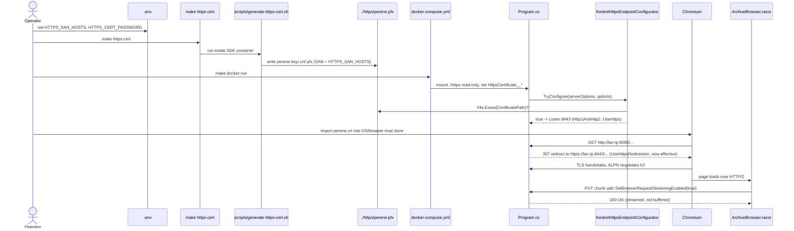

# Plan: Kestrel HTTPS + HTTP/2 for LAN Request Streaming

## Table of Contents

- [Summary](#summary)
- [Technical Approach](#technical-approach)
- [Component Breakdown](#component-breakdown)
- [Dependencies](#dependencies)
- [External / Vendor Documentation Evidence](#external--vendor-documentation-evidence)
- [Flow](#flow)
- [Risk Assessment](#risk-assessment)

## Summary

Add an opt-in, self-signed-certificate-backed HTTPS+HTTP/2 Kestrel endpoint to the existing Docker Compose deployment, gated purely on whether a PFX file is present at a configured path. When present, `app.UseHttpsRedirection()` (already called in `Program.cs` but currently a no-op) starts funneling every route to HTTPS, so `ArchiveBrowser.razor`'s existing `SetBrowserRequestStreamingEnabled(true)` call (from `Specs/20260914112308-resumable-archive-uploads/`) can actually negotiate HTTP/2 instead of hitting `net::ERR_ALPN_NEGOTIATION_FAILED` and falling back to buffered chunks. When absent, nothing about today's behavior changes.

## Technical Approach

This extends the existing `ArchiveRootOptions`/`ArchiveUploadOptions`-style Options pattern already used throughout `WebApp/WebApp/Configuration/` (bind + `.Validate(...)` + `.ValidateOnStart()` in `Program.cs`), and the existing convention of a narrowly scoped, independently testable class per concern (mirrors `ArchiveUploadService`, `CutNamingService`, etc.).

**New `KestrelHttpsOptions`** (`WebApp/WebApp/Configuration/KestrelHttpsOptions.cs`) holds `CertificatePath`, `CertificatePassword`, and `Port` (default `8443`), all optional — an unset `CertificatePath` is the explicit "not opted in" state and must validate successfully (mirrors how `ArchiveRootOptions` treats an unset path as "not configured yet" in several of its own validators). Static validators (`HasPositivePort`, `HasPasswordWhenPathConfigured`) follow the exact static-predicate style already used by `ArchiveUploadOptions.HasPositiveTtl` etc. A static `IsEnabled(KestrelHttpsOptions options)` — the only piece of "does this feature turn on" logic — checks `!string.IsNullOrWhiteSpace(options.CertificatePath) && File.Exists(options.CertificatePath)`. This single predicate is unit-testable without any hosting/TLS machinery and is the seam FR4's "zero impact when not opted in" and "testable without a browser" NFR are built on.

**New `KestrelHttpsEndpointConfigurator`** (`WebApp/WebApp/Services/KestrelHttpsEndpointConfigurator.cs`) is a small static class with one method: `TryConfigure(KestrelServerOptions serverOptions, KestrelHttpsOptions options)`. It calls `KestrelHttpsOptions.IsEnabled` first; if false, it returns `false` and touches nothing (today's behavior, unchanged). If true, it calls `serverOptions.Listen(System.Net.IPAddress.Any, options.Port, listenOptions => { listenOptions.UseHttps(options.CertificatePath, options.CertificatePassword); listenOptions.Protocols = HttpProtocols.Http1AndHttp2; })` — the exact pattern Microsoft Learn documents for a TLS+HTTP/2 endpoint with an explicit PFX (see Evidence below) — and returns `true`. Isolating this in one method (rather than inlining it into `Program.cs`'s `ConfigureKestrel` lambda) keeps the branch small enough to unit test by constructing a real `KestrelServerOptions` and asserting no exception is thrown for both the "no cert" and "valid temp cert" cases, and by booting a minimal real `WebApplication` (not the full app, not `WebApplicationFactory`'s `TestServer`) against an ephemeral port to prove an actual TLS+HTTP/2 handshake succeeds end-to-end — this is the one piece of this feature that benefits from a real Kestrel socket rather than the in-memory `TestServer` every other endpoint test in this repo already uses.

**`Program.cs`** adds one `AddOptions<KestrelHttpsOptions>()...ValidateOnStart()` block, in the same position as the other Options registrations, and one `builder.WebHost.ConfigureKestrel((context, serverOptions) => KestrelHttpsEndpointConfigurator.TryConfigure(serverOptions, context.Configuration.GetSection(KestrelHttpsOptions.SectionName).Get<KestrelHttpsOptions>() ?? new()))` call before `builder.Build()`. `app.UseHttpsRedirection()` already exists unconditionally at its current call site; per the explicit operator decision recorded in `Requirements.md`, it is left exactly as-is — it already does nothing when there is no HTTPS endpoint to redirect to (ASP.NET Core's default behavior when it cannot determine an HTTPS port is to log a warning and skip redirecting, which matches "no new failure modes" in FR4), and it starts working automatically the moment the HTTPS endpoint above is configured, with no additional code needed. This is why FR6 is described as "no code change beyond what FR4/FR5 already require" — `UseHttpsRedirection` was already unconditionally present; only the *endpoint it redirects to* is new.

**Certificate generation** happens outside the .NET app entirely, in a new `scripts/generate-https-cert.sh`, run via a new `make https-cert` Makefile target through the existing `docker compose run --rm --no-deps webapp` pattern already used by `dotnet-new` (so it uses the same container image/tooling, no new image). The script reads `HTTPS_SAN_HOSTS` and `HTTPS_CERT_PASSWORD` from the environment (populated from `.env` by Compose the same way `ALLOWED_NETWORK_HOSTS` already is), classifies each comma/semicolon-separated entry as an `IP:` or `DNS:` SAN entry with a small IPv4-shape check, and runs modern OpenSSL's single-command self-signed generation (`openssl req -x509 -newkey rsa:2048 -nodes -keyout ... -out ... -days 825 -subj "/CN=PereneArchive" -addext "subjectAltName=..."`, supported directly since OpenSSL 1.1.1 — no separate `.cnf` file needed) followed by `openssl pkcs12 -export` to bundle the PFX. Output lands in a new gitignored `./https/` directory at the repo root, bind-mounted read-only into the container by `docker-compose.yml`, mirroring the existing `${DASHBOARD_DOCKER_SOCKET}` read-only bind-mount pattern already in that file. `Dockerfile` adds `openssl` to the existing `apt-get install` line that already installs `ffmpeg`, so no second image layer/tool is introduced.

**Everything else is unaffected.** `ArchiveBrowser.razor`'s streaming/fallback logic from the resumable-uploads spec needs zero changes (FR10): it already treats "the first chunk's streaming attempt threw `HttpRequestException`" as the only signal to fall back, and a working HTTP/2 connection simply never produces that exception, so `_requestStreamingSupported` stays `true` (in fact it flips explicitly to `true` on the first successful chunk, per the fix already shipped for the resumable-uploads spec). This plan's Validation must prove that empirically rather than take it on faith, since it is the entire point of the feature.

## Component Breakdown

**Existing files to modify:**

- `WebApp/WebApp/Program.cs` — register/validate `KestrelHttpsOptions`; add the `ConfigureKestrel` call wired to `KestrelHttpsEndpointConfigurator.TryConfigure`. No change to `app.UseHttpsRedirection()`'s call site or the host-header allowlist middleware.
- `Dockerfile` — add `openssl` to the existing `apt-get install -y --no-install-recommends ffmpeg` line.
- `docker-compose.yml` — add a read-only bind mount of `./https` into the container; add `HTTPS_WEBAPP_PORT:-8443` to `ports`; pass `HttpsCertificate__Path`, `HttpsCertificate__Password`, `HttpsCertificate__Port` environment variables sourced from `.env`.
- `.env.example` — document `HTTPS_SAN_HOSTS`, `HTTPS_CERT_PASSWORD`, `HTTPS_WEBAPP_PORT` with placeholder/instructional values only (no real IP, per existing repo rule).
- `.gitignore` — add `/https/` (the generated cert/key/PFX directory).
- `.dockerignore` — no change needed (it already excludes everything not explicitly needed by the build context via the existing broad rules; the `./https` directory is only referenced by the Compose bind mount, not the Docker build context, so it does not need a build-context entry, but this must be verified during implementation).
- `Makefile` — add `https-cert` target (runs the new script via the existing `docker compose run --rm --no-deps webapp` pattern) and update `get-url`/`get-url-nas` to also print the HTTPS URL when `./https/perene.pfx` (or configured path) exists.
- `README.md` — new short "HTTPS / LAN request streaming (optional)" subsection with the `.env` variables, the `make https-cert` command, the resulting URL, and the manual client-trust step.

**New files to create:**

- `WebApp/WebApp/Configuration/KestrelHttpsOptions.cs` — options + static validators, matching the `ArchiveUploadOptions` style shown above.
- `WebApp/WebApp/Services/KestrelHttpsEndpointConfigurator.cs` — the single `TryConfigure` seam described above.
- `scripts/generate-https-cert.sh` — OpenSSL self-signed cert + PFX generation, SAN built from `HTTPS_SAN_HOSTS`.
- `WebApp.Tests/Configuration/KestrelHttpsOptionsTests.cs` — validator unit tests.
- `WebApp.Tests/Services/KestrelHttpsEndpointConfiguratorTests.cs` — the two-mode unit test plus the real-socket HTTP/2 integration test described below.

## Dependencies

- OpenSSL must be available in the SDK image (added to `Dockerfile`, same install pattern as `ffmpeg`).
- Docker Compose remains the only supported run/test workflow; `make https-cert` is a new Make target following the existing `run --rm --no-deps webapp` convention (matches `dotnet-new`), not a new tool outside Docker.
- Client devices that will actually exercise HTTP/2 streaming must import the generated certificate into their OS/browser trust store — a manual, documented, per-device operator action (Out of Scope for automation, per `Requirements.md`).

## External / Vendor Documentation Evidence

- [Configure endpoints for the ASP.NET Core Kestrel web server](https://learn.microsoft.com/aspnet/core/fundamentals/servers/kestrel/endpoints?view=aspnetcore-10.0#configure-http-protocols) — documents `serverOptions.Listen(IPAddress.Any, port, listenOptions => { listenOptions.UseHttps(pfxPath, password); listenOptions.Protocols = HttpProtocols.Http1AndHttp2; })` as the code-based way to add a TLS+HTTP/2 endpoint with an explicit certificate file — exactly the pattern `KestrelHttpsEndpointConfigurator.TryConfigure` implements. The same page documents that `HttpProtocols.Http1AndHttp2` requires TLS 1.2+ and ALPN negotiation, and that the default protocol value for an endpoint is already `Http1AndHttp2` — confirming HTTP/1.1 clients (or LAN devices that haven't trusted the cert and are hitting the endpoint directly rather than through the redirect) continue to be served correctly on the same endpoint.
- [Enforce HTTPS in ASP.NET Core](https://learn.microsoft.com/aspnet/core/security/enforcing-ssl?view=aspnetcore-10.0) — documents `UseHttpsRedirection` and that it requires a discoverable HTTPS port to redirect to; when none is configured it logs a warning and does not redirect, which is exactly why the existing unconditional call in `Program.cs` has been a safe no-op until now and needs no conditional guard added.
- `dotnet dev-certs https` (`dotnet-dev-certs` CLI reference) was evaluated and explicitly rejected per the operator's own decision recorded in `Requirements.md`: it only ever issues certificates trusted for `localhost`/loopback, never for an arbitrary LAN IP/hostname, so it cannot satisfy this spec's LAN-trust requirement. OpenSSL's `-addext "subjectAltName=..."` (supported directly on `openssl req` since OpenSSL 1.1.1, no separate config file required) is used instead.

## Flow

## Risk Assessment

| Risk | Evidence | Mitigation |
| --- | --- | --- |
| Certificate/password committed to Git | `.gitignore` already protects `*.pfx`/`*.key`/`*.pem`/`.env` generically, but the new `./https/` directory and its contents must be covered explicitly too. | Add `/https/` to `.gitignore` before the feature is used once; `Makefile`'s `https-cert` target only ever writes there, never elsewhere. |
| `UseHttpsRedirection` breaks existing HTTP-only deployments the moment this ships | The call is already unconditional in `Program.cs` today. | It only becomes effective when `KestrelHttpsEndpointConfigurator.TryConfigure` actually added an HTTPS endpoint (gated on `File.Exists`), so an operator who never runs `make https-cert` sees no behavior change — this is FR4's core guarantee and must be covered by a startup test with no cert configured. |
| Self-signed cert not trusted by LAN client devices | Documented Chromium behavior: an untrusted cert shows a hard warning, and per the operator's explicit decision (Requirements.md, User Stories) every route now redirects to HTTPS. | Document the manual per-device trust step prominently in `README.md` (FR8); this is an accepted, explicit trade-off, not a defect. |
| LAN IP changes (DHCP) invalidates the cert's SAN | Certificates bind SAN entries at generation time; `HTTPS_SAN_HOSTS` is a static `.env` value. | Documented as an Open Question / operator runbook item in `Requirements.md`; regeneration is a one-command `make https-cert` rerun. |
| Automated tests can't exercise real browser ALPN/HTTP2 negotiation | `WebApplicationFactory<Program>`'s default `TestServer` does not bind real sockets or negotiate TLS. | Cover the branching logic (`KestrelHttpsOptions.IsEnabled`, `TryConfigure`'s two modes) with fast unit tests, and add one real-socket integration test that boots a minimal `WebApplication` with a generated in-memory test certificate to empirically prove HTTP/2 negotiation over `UseHttps` + `Http1AndHttp2` — leaving only actual Chromium/DevTools verification to `Validation.md`'s manual steps. |
| `openssl` missing from the SDK image | Not currently installed per `Dockerfile` inspection. | Add it explicitly to the existing `apt-get install` line, verified by running `make https-cert` once during implementation. |
