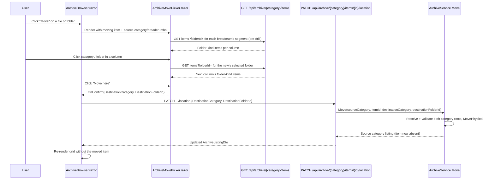

# Plan: Archive Move — Cross-Category Column Picker

## Table of Contents

- [Plan: Archive Move — Cross-Category Column Picker](#plan-archive-move--cross-category-column-picker)
  - [Summary](#summary)
  - [Technical Approach](#technical-approach)
  - [Component Breakdown](#component-breakdown)
  - [Dependencies](#dependencies)
  - [External / Vendor Documentation Evidence](#external--vendor-documentation-evidence)
  - [Flow](#flow)
  - [Risk Assessment](#risk-assessment)

## Summary

Replace `ArchiveBrowser.razor`'s single-level `<select>` move dialog with a new `ArchiveMovePicker.razor` component that renders a Bootstrap-only, multi-column drill-down folder browser (macOS Finder–style, per the user's HTML/CSS/JS reference, reimplemented with Razor/C# state instead of vanilla JS/DOM), and extend the move capability (`MoveArchiveItemRequest`, the `PATCH .../location` endpoint, `IArchiveService.Move`/`ArchiveService.Move`) to take an explicit destination category so an item can move into any move-eligible category, not just within its current one.

## Technical Approach

**Client side.** `ArchiveBrowser.razor` already owns all archive-mutation state and talks to `IArchiveService` exclusively through `HttpClient` against `/api/archive/{category}/...` (the existing pattern for Rename, CreateFolder, Upload, Delete). The move picker follows that same pattern: a new focused component, `ArchiveMovePicker.razor`, is responsible only for rendering columns and tracking which category/folder is selected in each; it never touches `HttpClient` for the archive item's own move — it reports the user's final selection back to `ArchiveBrowser` via an `EventCallback<(string Category, string? FolderId)>`, and `ArchiveBrowser.MoveAsync` keeps owning the actual `PATCH` call and `_operationPending`/`_error` handling, exactly like it already owns `RenameAsync`/`DeleteAsync`. This matches the existing separation in the file: dialogs are conditionally rendered partials in `ArchiveBrowser.razor`, and `@code` methods perform the HTTP call and refresh `_listing`.

Column data comes from the same `GET /api/archive/{category}/items?folderId=` endpoint the main browser already calls, filtered client-side to `Kind == ArchiveItemKind.Folder`; no new read endpoint is introduced; the picker is simply a second, folder-only view over data the server already exposes. The leftmost column's entries are the same eight `CanCreateFolder` categories `Sidebar.razor:69-78` already lists for navigation (Videos, Photos, Music, Documents, Books, Downloads, Shared, Family); this list is duplicated as a small static array in `ArchiveMovePicker.razor` rather than introducing a shared categories endpoint, consistent with how `Sidebar.razor` already hardcodes it — no architecture change, same duplication pattern the repo already accepts for category metadata.

Per FR5, `ArchiveMovePicker` is initialized with the moving item's current category key and its `ArchiveListingDto.Breadcrumbs`/`CurrentFolderId` (already available in `ArchiveBrowser._listing` at move time) and eagerly loads columns for each breadcrumb segment before rendering, so the dialog opens pre-drilled to the item's current folder. Per FR9, whenever the moving item itself is a folder, the picker excludes that item's id from every column it renders (a single `!= movingItem.Id` filter applied to each fetched folder list) — since a folder's only descendants live under itself, hiding it from every column also hides its entire subtree from being reachable by further clicks, which is a strictly UI-level convenience; the authoritative rejection still happens server-side in `ArchiveService.Move`.

**Server side.** `ArchiveCategory` (`WebApp/WebApp/Models/ArchiveCategory.cs`) already models each category as an independent root folder under one shared `ArchiveRootOptions.Path`, and `ArchiveService.GetCategoryRoot`/`ContainedPath` already resolve and validate paths per-category. `ArchiveService.Move` currently resolves both the item and the destination folder against the *same* `ArchiveCategory` (`categoryKey`). The fix is mechanical and localized: resolve the destination folder against a second, independently-validated `ArchiveCategory` (`destinationCategoryKey`), keep every existing invariant (`ContainedPath` per root, `EnsureNotCategoryRoot`, `IsSamePath`, `Exists`-conflict check, folder-into-itself/descendant check) exactly as-is, and let `MovePhysical`'s existing `Directory.Move`/`File.Move` calls run against the two independently-resolved physical paths — both are already guaranteed to sit on the same volume because they descend from one shared `ArchiveRootOptions.Path`, so no copy+delete fallback is needed. `Move`'s return value changes from `BuildListing(category, destinationFolder)` (today: shows the destination folder, only meaningful because it was always the same category the user was already viewing) to `BuildListing(category, GetParentEntry(category, item.PhysicalPath))` (the *source* category/folder listing with the item now gone), matching how `MoveToTrash` already returns `BuildListing(category, GetParentEntry(category, item.PhysicalPath))` for the same reason — the user stays on the source page after the mutation.

This keeps the file's existing SOLID shape: `IArchiveService` remains the one seam between the minimal-API endpoint layer and all physical path manipulation (`AGENTS.md`'s server/client boundary rule); `ArchiveEndpoints.Move` stays a thin adapter that only maps the request DTO onto the service call and DTO-projects the result, unchanged in structure.

## Component Breakdown

**Existing files to modify:**

- `WebApp/WebApp.Client/Components/ArchiveBrowser.razor` — remove the `<select>`-based move modal (lines ~524-551) and its `_moveDestinationId`/`_folderChoices`-driven disabled check (line 300); render `<ArchiveMovePicker>` when `_moving is not null`; update `StartMove`/`MoveAsync` to pass the picker's chosen `(DestinationCategory, DestinationFolderId)` into a `MoveArchiveItemRequest`; drop `_folderChoices` entirely (no longer needed once the picker fetches its own columns) and the three call sites that populate it (`ArchiveBrowser.razor:707,1289,1506`).
- `WebApp/WebApp.Client/Models/MoveArchiveItemRequest.cs` — add a required `DestinationCategory` field: `public sealed record MoveArchiveItemRequest(string DestinationCategory, string? DestinationFolderId);`.
- `WebApp/WebApp/Services/IArchiveService.cs` — change `Move`'s signature to `ArchiveListing Move(string categoryKey, string itemId, string destinationCategoryKey, string? destinationFolderId);`.
- `WebApp/WebApp/Services/ArchiveService.cs` — update `Move` (lines 174-198) to resolve `destinationCategoryKey` via `ResolveCategory`, resolve the destination folder against that category, and return the source category's listing after the move, per the Technical Approach above.
- `WebApp/WebApp/Endpoints/ArchiveEndpoints.cs` — update the `Move` handler (lines 289-307) to call `archive.Move(category, id, request.DestinationCategory, request.DestinationFolderId)`.
- `README.md` — add/update the row in `## Current Supported Features` describing cross-category move via the column picker, per `AGENTS.md`'s constraint that user-facing feature changes update that table.

**New files to create:**

- `WebApp/WebApp.Client/Components/ArchiveMovePicker.razor` — the Bootstrap column-picker component: `[Parameter]` inputs for the moving item, its source category key, its source breadcrumbs/current folder id, an `OperationPending` flag, and `EventCallback`s for cancel/confirm; internal `@code` state is a `List<Column>` (`CategoryKey`, `FolderId`, `DisplayName`, `Items`, `IsLoading`, `Error`) rendered as sibling `list-group`s inside a horizontally scrolling `d-flex overflow-auto` strip, with a "Move here" footer button enabled only once a column is selected.

## Dependencies

- No new runtime packages, JavaScript, or infrastructure. Uses the existing `HttpClient` DI registration, the existing `GET /api/archive/{category}/items` endpoint, and Bootstrap 5.3.8 (already the pinned CDN dependency per `AGENTS.md`'s Design System section).
- Requires the dev stack running via `make docker-run`/`make docker-run-bg` to manually verify the picker in a browser (Blazor WebAssembly, no native `dotnet run` workflow per `AGENTS.md`).

## External / Vendor Documentation Evidence

Not applicable. This change reuses Blazor component/`EventCallback` composition and minimal-API/DTO patterns already implemented and validated elsewhere in this codebase (e.g. the existing Rename/Create-folder modals and `MoveToTrash` endpoint) rather than introducing a new ASP.NET Core or Blazor WebAssembly API surface that would need fresh Microsoft Learn verification.

## Flow

## Risk Assessment

| Risk | Evidence | Mitigation |
| --- | --- | --- |
| Cross-category `Directory.Move`/`File.Move` could fail if a future deployment ever mounts categories on separate volumes | Today all categories are `Path.Combine(_rootPath, category.FolderName)` under one `ArchiveRootOptions.Path` (`ArchiveService.cs:818-822`), so this is not a current risk | Keep `MovePhysical` as-is; if categories are ever split across mounts, that already breaks `ArchiveRootOptions`'s single-root assumption and needs its own spec |
| Removing `_folderChoices` and the old `<select>` while another in-flight code path still reads it | `_folderChoices` is only read at `ArchiveBrowser.razor:300` (disabled check, being removed) and rendered at `:537` (old modal, being removed) | Grep for `_folderChoices` after the edit to confirm no remaining references before considering the change complete |
| Breaking the existing same-category move behavior while widening the API | `Move`'s only current callers are `ArchiveBrowser.MoveAsync` (updated in this spec) and none in `WebApp.Tests` today | Add unit tests (see `Validation.md`) covering same-category move (existing behavior) and cross-category move (new behavior) before considering this done |
| The response listing changes from "destination folder" to "source folder" (FR10) could surprise a caller expecting the old shape | Only one caller (`ArchiveBrowser.MoveAsync`) exists, and it already discards the response beyond `_listing = ...` for the page it's currently displaying (the source page) | `MoveAsync` is updated in this same change; no external/other consumer of `Move`'s return value exists in the codebase (confirmed by the earlier grep for `Move(` usages) |
