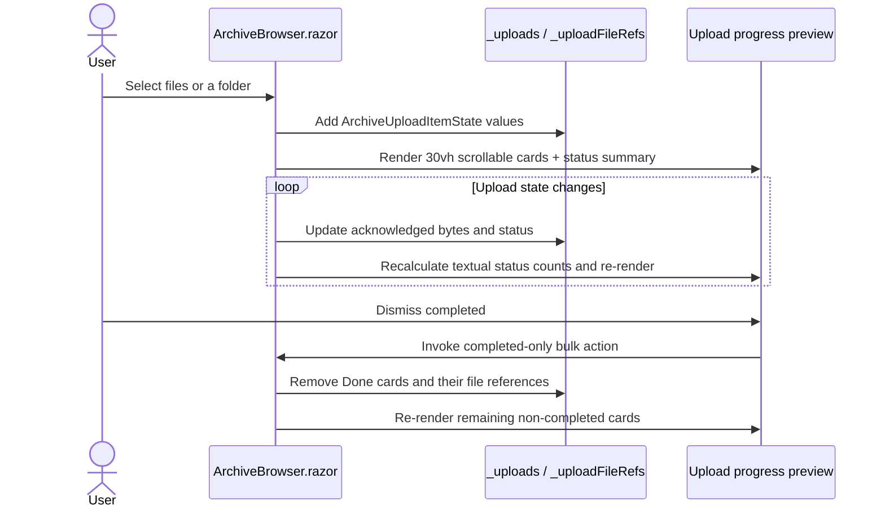

# Plan: Upload Progress Preview UI

## Table of Contents

- [Summary](#summary)
- [Technical Approach](#technical-approach)
- [Component Breakdown](#component-breakdown)
- [Dependencies](#dependencies)
- [External / Vendor Documentation Evidence](#external--vendor-documentation-evidence)
- [Flow](#flow)
- [Risk Assessment](#risk-assessment)

## Summary

Enhance the upload-status block in `ArchiveBrowser.razor` with a `30vh` bounded, scrollable preview panel, a Bootstrap header that summarizes batch status, and a bulk action that removes completed item state. The work extends the client-only upload UI already delivered by `Specs/20260914112308-resumable-archive-uploads`; it does not alter the resumable-upload protocol or server boundaries.

## Technical Approach

`ArchiveBrowser.razor` is the established owner of per-browser upload state: it creates and restores `ArchiveUploadItemState` values in `_uploads`, stores selected browser file references in `_uploadFileRefs`, and currently removes a single completed item inline with `_uploads.Remove(upload)`. Keep all presentation and behavior there rather than introducing an API or background service for a purely ephemeral client concern.

Extract the summary and removal mechanics into small private helpers in `ArchiveBrowser.razor`. A derived aggregate representation (for example, a local status-count helper/value) will count `_uploads` by `ArchiveUploadItemStatus`; the markup will use it to render “Uploaded {Done} of {Total}” plus textual counts for `Pending`, `Uploading`, `Completing`, `Interrupted`, and `Error`. This extends the existing `ArchiveUploadItemState`/`ArchiveUploadItemStatus` model in `WebApp/WebApp.Client/Models/ArchiveUploadItemState.cs` without changing its transport contract. `DismissCompletedUploads` will identify only `Done` states, remove each matching key from `_uploadFileRefs`, then remove those items from `_uploads`. The individual Dismiss control should route through the same focused cleanup helper so the dictionary invariant holds for both dismissal paths.

Replace the current bare `list-group list-group-flush border-top` wrapper with a semantic upload-progress section containing a flex-wrap Bootstrap header and a nested list-group scroll area. The header appears outside the scrolling element so the batch information and Dismiss completed action remain visible as the user reviews long lists. Bootstrap utilities own the card/header layout and responsive wrapping; `ArchiveBrowser.razor.css` receives a local selector that supplies `max-height: 30vh` and `overflow-y: auto` (and any needed overscroll containment), the nonstandard behavior Bootstrap does not express. Existing card markup, `aria-live="polite"`, progress-bar attributes, and action branches are otherwise preserved. The header uses explicit text rather than relying on badge color. The bulk control uses the standard `btn`, Bootstrap Icon, accessible name, and dimensions required by the repository design contract.

No vendor-specific API or new package is needed. The approach reuses the project’s existing Interactive WebAssembly component event/render cycle, Bootstrap 5.3.8 composition, and xUnit client-state test conventions. Server-owned upload sessions remain unchanged; removing a client card still has no effect on a completed archive file or a non-completed server session.

## Component Breakdown

**Existing files to modify:**

- `WebApp/WebApp.Client/Components/ArchiveBrowser.razor` — replace the unbounded upload list wrapper with the fixed-height progress-preview section; derive and render summary counts; add completed-only bulk dismissal and shared file-reference cleanup for individual dismissal.
- `WebApp/WebApp.Client/Components/ArchiveBrowser.razor.css` — add the narrowly scoped maximum-height/vertical-scroll rule for the cards region; retain the existing CSS-isolation and reduced-motion conventions.
- `WebApp.Tests/Client/ArchiveUploadStateTests.cs` — add client-state tests for aggregate status counting and completed-only dismissal/file-reference cleanup. If the aggregation logic cannot be tested cleanly as a private component helper, extract a focused browser-safe helper/model beside `ArchiveUploadItemState` and test it here.
- `README.md` — update the `Current Supported Features` Archive management row to state that archive uploads include a bounded batch progress preview with aggregate status and completed-only bulk dismissal, as required by `AGENTS.md` for user-facing feature changes.

**New files to create:**

- None required unless a focused browser-safe upload-preview state helper is needed to make the summary and dismissal behavior unit-testable.

## Dependencies

- Existing Blazor WebAssembly client rendering and `HttpClient` upload workflow; no new server endpoints or service registrations.
- Bootstrap 5.3.8 and Bootstrap Icons 1.13.1 already loaded by the application.
- Docker Compose is the sole supported validation environment: use `make docker-run` (or `make docker-run-bg`) for browser checks and `make test` for the isolated test stack.

## External / Vendor Documentation Evidence

Not applicable. The implementation introduces no new Microsoft/.NET, browser, or third-party API decision; it composes existing Razor state, Bootstrap classes, and project-tested upload behavior. The Microsoft Learn MCP tool was not available in this session for additional verification.

## Flow

## Risk Assessment

| Risk | Evidence | Mitigation |
| --- | --- | --- |
| Long cards could hide the bulk control | The current unbounded list starts directly below the toolbar and can grow through the page | Keep the header outside the `30vh` scrolling child so it stays visible while cards scroll |
| Bulk removal accidentally hides resumable/error work | `_uploads` contains `Pending`, `Uploading`, `Completing`, `Interrupted`, `Error`, and `Done` states in one collection | Filter exclusively on `ArchiveUploadItemStatus.Done`; unit-test mixed state collections |
| Dismissed cards retain browser `ElementReference`/file-index entries | `_uploadFileRefs` is keyed by every `_uploads` entry and current single-card dismissal only removes from the list | Use one shared removal helper that deletes dictionary entries before dropping states from `_uploads`; test both individual and bulk paths |
| Aggregate updates become too noisy for assistive technology | Each card already declares `aria-live="polite"` and upload acknowledgement updates often | Do not add an assertive/live batch header; retain textual summary for on-demand reading and per-card live scope |
| A CSS change conflicts with the Bootstrap-first design rule | The project permits isolated CSS only for presentation Bootstrap cannot express | Limit CSS to the `30vh` scroll geometry; use Bootstrap utilities for all ordinary header/card layout and spacing |
