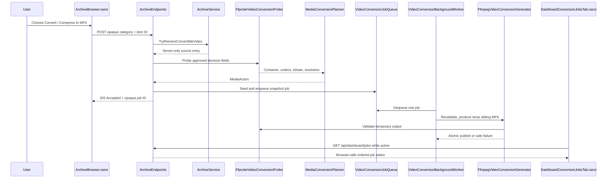

# Plan: Video Conversion and Compression Jobs

## Table of Contents

- [Summary](#summary)
- [Technical Approach](#technical-approach)
- [Component Breakdown](#component-breakdown)
- [Dependencies](#dependencies)
- [External / Vendor Documentation Evidence](#external--vendor-documentation-evidence)
- [Flow](#flow)
- [Risk Assessment](#risk-assessment)

## Summary

Add an individual archive-file conversion action and a Dashboard Jobs tab. The implementation extends the existing archive opaque-ID boundary and the composition feature's bounded queue, in-memory status store, `BackgroundService`, and FFmpeg `ProcessStartInfo.ArgumentList` patterns to publish a validated sibling MP4 without altering its source.

## Technical Approach

### Archive visibility and submission

`ArchiveService` already owns extension classification, containment, and opaque-ID resolution for archive listings. Extend it with a narrowly named conversion-source extension set, separate from the existing playable `VideoExtensions`, and expose a browser-safe `IsConvertibleVideo` flag in the existing archive item DTO path. This permits unsupported containers to remain generic archive files until a user selects their conversion action, while allowing current playable formats to be compressed too. Extend `UploadableExtensions` with the same concrete source extensions so files selected through the archive UI are not rejected before they can be converted; ffprobe, not the extension, remains the media validity authority.

Add `TryResolveConvertibleVideo` to `IArchiveService`/`ArchiveService`. It will resolve a category plus opaque item ID, require a file under that category root, reject Trash and unsupported extensions, and return the server-only `ArchiveItemEntry`. `ArchiveBrowser.razor` will add the action to the existing per-item Bootstrap dropdown, using its existing `_operationPending`, request-error, and refresh patterns. It will POST only the opaque category/id pair, show an accepted/queue-full/probe-validation result using its established alert semantics, and refresh its listing after a completed output appears through normal polling/refresh behavior.

### Probe and planning

Create a focused `IVideoConversionProbe`/`FfprobeVideoConversionProbe` rather than overloading `IVideoCompositionProbe`. It will invoke `ffprobe` with a fixed argument list and JSON output, requesting `format_name`, format/stream bit rate, codec names, and primary-video width/height. `VideoConversionProbeResult` keeps only the five approved first-release decision inputs. It will parse JSON independently, so malformed/missing video data remains a failed probe rather than reaching FFmpeg.

Create the pure `MediaConversionPlanner` and shared `MediaAction` enum. It owns container/codec compatibility rules and resolution-aware bitrate thresholds supplied by validated `VideoConversionOptions`; it returns a reason that is suitable for a browser-safe job row. The planner keeps policy out of endpoint and FFmpeg orchestration code. `Keep` becomes a terminal `Skipped` job status, avoiding a duplicate output. The implementation will choose explicit default values for compatible MP4/H.264/AAC-LC, an H.264 high-quality CRF, and threshold bands; each default must be named in options and unit tested rather than hidden in a generator.

### Queue, worker, output, and status

Mirror the composition abstractions with focused `VideoConversionJob`, `IVideoConversionJobQueue`/`VideoConversionJobQueue`, `IVideoConversionJobStatusStore`/`VideoConversionJobStatusStore`, `IVideoConversionGenerator`/`FfmpegVideoConversionGenerator`, and `VideoConversionBackgroundWorker`. Register the singleton queue/status/probe/generator plus hosted worker in `Program.cs`; validate a dedicated `VideoConversionOptions` section (positive queue capacity, positive free-space reserve, and valid compression-policy values).

The POST endpoint probes before it seeds/enqueues. It snapshots physical path, size, and UTC last-write time only into a server-side job, checks queue capacity before making state visible, and returns `Results.Accepted` with a browser-safe `VideoConversionJobDto`. The status store follows `CompositionJobStatusStore`: ordered, concurrent in-memory records with transitions Pending → Processing → Completed/Failed/Skipped. A job accepted but not queued must not appear as pending.

The worker rechecks containment and source identity, probes again if required, calculates an output path with `VideoConversionNamingService`, checks archive filesystem capacity, and writes a uniquely named temp MP4 beside the output. `FfmpegVideoConversionGenerator` selects a fixed argument builder per `MediaAction`: stream-copy remux; video-copy/audio-AAC; H.264 CRF compression retaining dimensions/frame rate; or H.264/AAC full transcoding. Argument values are separate `ArgumentList` entries, never a shell string. It uses a second probe to verify an MP4 with required streams, positive duration, compatible codecs, and a non-empty file, then atomically moves the temp file. `finally` cleanup removes incomplete temp files; the original never becomes a target. Its path-redaction helper follows `FfmpegCompositionGenerator` so diagnostics and logs remain safe.

Before publish, the generator maps global metadata/chapters and explicitly inspects embedded subtitle streams. It either maps MP4-compatible subtitles or returns a clear failed result before publishing; it does not silently drop them. This release records only its selected primary video/audio output in the job DTO; broader stream selection is deferred.

### Dashboard Jobs tab

Refactor `Dashboard.razor` into Bootstrap `nav-tabs`/`tab-content`: Overview retains every current card and refresh behavior; Jobs renders a new `DashboardConversionJobsTab.razor`. The tab queries a dedicated `GET /api/dashboard/jobs` mapping in `DashboardEndpoints.cs`, which translates internal status records to the client-owned `VideoConversionJobDto` model. It will use a responsive table/list design: queued/processing rows display a spinner and accessible live text; completed rows display action and saved bytes/percent plus a browser-safe archive output link or refresh cue; failed/skipped rows use an icon, text badge, and safe diagnostic. It starts a cancellation-aware polling loop only while active states exist, cancels it on dispose/tab exit, and participates in Dashboard's manual Refresh action.

The existing `DashboardArchiveDto`/`DashboardArchiveCard.razor` will gain only a queued-conversion count, preserving the archive card as aggregate health rather than duplicating job detail. Dashboard tabs and the new Jobs component use Bootstrap utilities before scoped CSS; any narrow responsive table/list rule stays in `DashboardConversionJobsTab.razor.css` and reuses global design tokens.

### Testing and operations

Use direct xUnit tests for JSON parsing, planner action selection, collision-safe naming, queue FIFO/saturation, status transitions, free-space decisions, redaction, source-change detection, argument isolation, output validation, and cleanup. Add `WebApplicationFactory` endpoint tests parallel to `CompositionEndpointsTests`: invalid opaque IDs/extensions and saturated queues fail correctly; accepted jobs appear in both the jobs endpoint and dashboard response; JSON never leaks temporary/archive physical paths. Add browser-safe client state-model tests where formatting/polling decisions are C# owned. Docker-only `make test` remains the complete automated validation command.

## Component Breakdown

**Existing files to modify:**

- `WebApp/WebApp/Services/ArchiveService.cs` — distinguish convertible source extensions, allow their uploads, and resolve an opaque individual conversion source.
- `WebApp/WebApp/Services/IArchiveService.cs` — expose the focused conversion-source resolver.
- `WebApp/WebApp/Models/ArchiveItemEntry.cs` and the archive browser-safe DTO mapping in `ArchiveService.cs` — carry a convertible-video flag without carrying a path.
- `WebApp/WebApp/Endpoints/ArchiveEndpoints.cs` — add the single-file conversion submission route and validation/result mapping.
- `WebApp/WebApp/Endpoints/DashboardEndpoints.cs` — expose conversion job status through a dashboard-specific, browser-safe endpoint.
- `WebApp/WebApp/Program.cs` — validate options and register the focused conversion services/worker.
- `WebApp/WebApp/Services/ArchiveMetricsService.cs`, `WebApp/WebApp/Services/IArchiveMetricsService.cs`, and `WebApp/WebApp.Client/Models/DashboardArchiveDto.cs` — include the aggregate queued-conversion count.
- `WebApp/WebApp.Client/Components/ArchiveBrowser.razor` — add the individual action, request feedback, and output refresh behavior using existing dropdown/error conventions.
- `WebApp/WebApp.Client/Pages/Dashboard.razor` and `WebApp/WebApp.Client/Pages/Dashboard.razor.css` — add accessible Overview/Jobs tab structure and refresh delegation.
- `WebApp/WebApp.Client/Components/Dashboard/DashboardArchiveCard.razor` — display the aggregate queued-conversion count.
- `README.md` — update Current Supported Features.

**New files to create:**

- `WebApp/WebApp/Configuration/VideoConversionOptions.cs` — validated capacity, free-space reserve, CRF, and resolution/bitrate policy defaults.
- `WebApp/WebApp/Models/VideoConversionJob.cs`, `VideoConversionJobStatus.cs`, `VideoConversionProbeResult.cs`, and conversion result records — server-only job/probe/generator contracts.
- `WebApp/WebApp/Services/IVideoConversionProbe.cs`, `FfprobeVideoConversionProbe.cs`, `MediaConversionPlanner.cs`, and `MediaAction.cs` — focused probe and pure policy decision.
- `WebApp/WebApp/Services/IVideoConversionJobQueue.cs`, `VideoConversionJobQueue.cs`, `IVideoConversionJobStatusStore.cs`, and `VideoConversionJobStatusStore.cs` — bounded queue and ordered in-memory state.
- `WebApp/WebApp/Services/IVideoConversionGenerator.cs`, `FfmpegVideoConversionGenerator.cs`, `VideoConversionNamingService.cs`, and `VideoConversionBackgroundWorker.cs` — controlled FFmpeg execution, atomic publish, and job orchestration.
- `WebApp/WebApp.Client/Models/VideoConversionJobDto.cs` and `VideoConversionJobState.cs` — browser-safe job contract/state.
- `WebApp/WebApp.Client/Components/Dashboard/DashboardConversionJobsTab.razor` and `.razor.css` — responsive dashboard job monitor.
- Focused `WebApp.Tests/Services/*VideoConversion*Tests.cs`, `WebApp.Tests/Endpoints/ArchiveEndpointsConversionTests.cs`, `WebApp.Tests/Endpoints/DashboardEndpointsTests.cs` updates, and client-model tests following the existing test folders.

## Dependencies

- Existing Dockerfile-provided `ffmpeg` and `ffprobe` executables.
- Read-write `/archive` mount configured by `ArchiveRoot__Path`; conversion outputs and temporary files remain under the source file's category tree.
- Existing `VideoLibraryService` containment helpers and archive opaque-ID resolution patterns.
- Existing Docker Compose test stack and `make test` command.

## External / Vendor Documentation Evidence

- [ASP.NET Core hosted services and queued background tasks](https://learn.microsoft.com/en-us/aspnet/core/fundamentals/host/hosted-services?view=aspnetcore-10.0) documents `BackgroundService`, cancellation at host shutdown, and bounded `Channel` queue patterns. This supports extending the app's existing single-reader composition-worker architecture instead of adding a new scheduler.
- [Results.Accepted API (.NET 10)](https://learn.microsoft.com/en-us/dotnet/api/microsoft.aspnetcore.http.results.accepted?view=aspnetcore-10.0) confirms `Results.Accepted` produces HTTP 202 and can provide the status-monitor URI, matching the existing composition submission semantics.
- [FFprobe documentation](https://ffmpeg.org/ffprobe.html) documents `-show_entries`, the `FORMAT` section, and JSON output. This supports the fixed, parsable probe contract rather than interpreting FFmpeg console text.

## Flow

## Risk Assessment

| Risk | Evidence | Mitigation |
| --- | --- | --- |
| Source loss or corruption | Archive root is writable and conversion writes near its source. | Never overwrite the source; use identity revalidation, temp output, post-probe validation, atomic publish, and cleanup. |
| Path disclosure | `ArchiveService` holds physical paths and current APIs intentionally expose opaque IDs only. | Keep paths internal to services/jobs, map only names and opaque output IDs/URLs, and redact diagnostics/logs. |
| CPU, disk, and queue pressure | FFmpeg transcoding is CPU-intensive; the existing app uses bounded sequential media queues. | One worker, validated bounded capacity, free-space reserve, no automatic retries, and dashboard state. |
| Incorrect/low-benefit compression | Compatibility and bitrate cannot be inferred from a filename. | Probe before queueing; pure, tested planner; named conservative CRF/threshold defaults; skip `Keep` jobs. |
| Stream/metadata loss | Source files may include subtitles, chapters, multiple audio streams, or HDR information. | Fail safely on unsupported embedded subtitle handling; map feasible metadata/chapters; defer broader stream/HDR policy explicitly. |
| Restart ambiguity | User selected in-memory status only. | Document no persistence/recovery; cancellation cleans temp files and does not publish an incomplete output. |
| Dashboard regression | Current dashboard is a compact three-by-three card grid. | Preserve all cards under Overview and limit Jobs polling to active jobs. |
