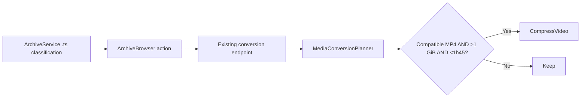

# Plan: Conversion TS Source and Size/Duration Policy

## Summary

Extend the existing archive conversion extension set with `.ts` and refine the pure conversion planner with explicit size/duration eligibility settings. This preserves the existing conversion queue and FFmpeg pipeline.

## Technical Approach

`ArchiveService.cs` owns conversion-source classification and `ArchiveBrowser.razor` already renders its action from the browser-safe `IsConvertibleVideo` flag, so adding `.ts` to `ConversionSourceExtensions` also updates upload validation and action eligibility without widening playable-video classification.

`VideoConversionOptions.cs` adds `LargeSourceBytes` (1 GiB), `ShortDurationMaximum` (one hour and 45 minutes), and `MinimumSavingsPercent` (15) defaults plus validation. `MediaConversionPlanner` in `VideoConversionServices.cs` receives probe duration and source size. Any compatible MP4 that is larger than the configured size and shorter than the configured duration attempts the existing high-quality H.264 CRF 22 compression regardless of bitrate; otherwise the existing `Keep` result applies. The generator validates the temporary MP4, atomically publishes a `CompressVideo` output only when it is at least 15% smaller, and otherwise deletes it and records a skipped job; Remux, ConvertAudio, and FullTranscode retain their existing publication behavior.

`ArchiveBrowser.razor` will set local modal state only after its existing conversion endpoint accepts a job. The modal links to `/?tab=jobs`; `Dashboard.razor` reads the query parameter to select the existing Jobs panel. `DashboardConversionJobsTab.razor` will use Bootstrap responsive grid cards with explicit source, action, state, size, and outcome fields, avoiding a constrained, scrollable table without adding a frontend dependency.

The conversion generator requests FFmpeg machine-readable progress on standard output and keeps error diagnostics on standard error. The current-session status store records queued/started timestamps, processed source duration, encode speed, and a finalizing state, all mapped into the existing browser-safe Jobs DTO. The Jobs component polls every two seconds while a job is active, displays a Bootstrap progress bar plus elapsed time and an approximate speed-based ETA, and reserves 100% for a terminal successful publish.

The implementation reuses the server-only `ArchiveItemEntry` source metadata, client `IsConvertibleVideo` DTO flow, and Docker-only test setup. No new packages, endpoints, services, or client components are needed.

## Component Breakdown

**Existing files to modify:**

- `WebApp/WebApp/Services/ArchiveService.cs` — add `.ts` to the conversion-source set only.
- `WebApp/WebApp/Configuration/VideoConversionOptions.cs` — add validated size/duration policy defaults.
- `WebApp/WebApp/Services/VideoConversionServices.cs` — apply the additional eligible-short-and-large rule while retaining bitrate as mandatory.
- `README.md` — add `.ts` to the conversion feature’s supported source list.
- `WebApp.Tests/Services/MediaConversionPlannerTests.cs` — add decision-boundary coverage.
- `WebApp.Tests/Services/ArchiveServiceTests.cs` — cover `.ts` convertible classification without playable classification.
- `WebApp/WebApp.Client/Components/ArchiveBrowser.razor` — show the accepted-job background-status modal and Jobs deep link.
- `WebApp/WebApp.Client/Pages/Dashboard.razor` — select Jobs from the `tab=jobs` query parameter and give the tab full panel width.
- `WebApp/WebApp.Client/Components/Dashboard/DashboardConversionJobsTab.razor` — render responsive Bootstrap job-summary cards.

**New files to create:**

- None required.

## Dependencies

- Existing Docker-provided `ffprobe`/`ffmpeg`; no new runtime dependency.

## External / Vendor Documentation Evidence

Not applicable. This changes repository-owned extension and planning policy without selecting a new vendor API or media-processing capability.

## Flow

## Risk Assessment

| Risk | Mitigation |
| --- | --- |
| Low-value compression | Require the existing bitrate decision as well as short-and-large eligibility. |
| `.ts` appears playable | Keep `.ts` out of `VideoExtensions`; only `ConversionSourceExtensions` changes. |
| Boundary regression | Unit-test exact size, duration, and bitrate thresholds. |
| Job progress is hard to find | Link the accepted-job modal directly to the Jobs tab. |
