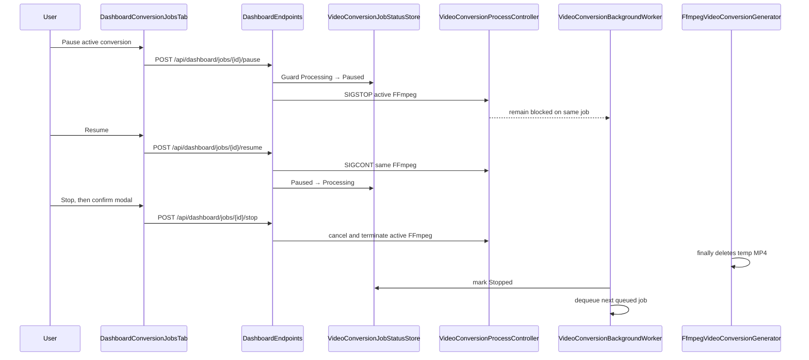

# Plan: Conversion Job Pause and Stop Controls

## Table of Contents

- [Summary](#summary)
- [Technical Approach](#technical-approach)
- [Component Breakdown](#component-breakdown)
- [Dependencies](#dependencies)
- [External / Vendor Documentation Evidence](#external--vendor-documentation-evidence)
- [Flow](#flow)
- [Risk Assessment](#risk-assessment)

## Summary

Extend the existing in-memory, sequential conversion worker with an explicit active-process controller and status transitions so a user can suspend/resume the same FFmpeg process or confirm its termination and cleanup from Dashboard Jobs.

## Technical Approach

### Status, ownership, and queue coordination

Extend the client-owned `VideoConversionJobState` and server-only `VideoConversionStatus` in `VideoConversionModels.cs` with `Paused` and `Stopped`. `VideoConversionJobStatusStore` in `VideoConversionServices.cs` remains the sole status-transition owner, but gains guarded pause/resume/stop request methods and records whether the active job is still eligible to publish. `HasActiveSource` and dashboard polling treat `Paused` as active; `Stopped` is terminal and retained in `_order` for the current session.

Introduce a focused `IVideoConversionProcessController`, owned by `VideoConversionBackgroundWorker`, which is registered as a singleton alongside the existing queue/status store. It associates exactly one job ID with the live `Process` and a per-job cancellation source. It accepts requests only for that active job and coordinates a completion signal so the worker does not read the next queued item while paused. This preserves `VideoConversionJobQueue`'s existing `SingleReader = true` FIFO behavior without attempting to dequeue/reenqueue a paused item.

The controller uses a narrow Linux POSIX signal implementation to suspend (`SIGSTOP`) and resume (`SIGCONT`) the FFmpeg process. The Docker-only runtime makes this explicit, isolated interop preferable to a shell command, and the abstraction allows unit tests to use a fake controller rather than send signals. Stop cancels the job-owned token and terminates the FFmpeg process through the controller; generator cleanup owns deletion of its uniquely named temporary file. The process registration/unregistration contract must handle a request racing process exit, stop, or publish without observing a stale process.

### Generator and worker lifecycle

Change `IVideoConversionGenerator.GenerateAsync` to receive the job-owned cancellation token and a process-registration callback/controller rather than create process state independently. `FfmpegVideoConversionGenerator` registers the started FFmpeg `Process` before awaiting progress or exit, observes cancellation, waits for process exit after a termination request, and always unregisters it. Its existing `finally` deletion remains the sole cleanup path for temp MP4s; a requested stop yields a distinct stopped result instead of the generic shutdown-failure diagnostic. It must check the guarded status/controller decision immediately before validation and immediately before `File.Move`, so a stop cannot publish a completed output after it is requested.

`VideoConversionBackgroundWorker` creates a linked cancellation token for each dequeued job, registers it with the controller, then awaits generation. A pause leaves this invocation pending and thus retains the worker slot. A stop completes only after generator cleanup; worker marks `Stopped`, calls `queue.Complete()`, and then can take the next queued job. Host shutdown continues to use its `BackgroundService` token and maps non-published interrupted work to the existing safe failure/cancellation behavior rather than falsely marking it user-stopped.

### API and Dashboard interaction

Extend `DashboardEndpoints.cs` with three POST handlers under the existing dashboard jobs route. Each asks the status store/controller to perform an atomic state transition and returns a browser-safe current DTO. Invalid/missing/terminal/non-current requests return a meaningful 404 or 409; no endpoint accepts a filesystem path or PID.

Update `DashboardConversionJobsTab.razor` to put a compact Bootstrap action group in the active card. Processing shows an icon-labelled Pause plus a destructive Stop; Paused shows Resume plus Stop. Button disable/busy state prevents duplicate requests. State text and the progress bar reflect Paused without animation, preserving the last reported progress and elapsed time. The component continues polling paused jobs so another tab/window can resume or stop them; it stops polling only after all jobs are terminal.

The Stop button opens a component-local Bootstrap modal following the existing modal markup/interoperability patterns. The modal names the browser-safe source filename and clearly warns: stop the current process, delete generated temporary files, retain the original. Focus is placed in the modal, Escape/Cancel produces no request, and Confirm invokes the endpoint, surfaces a safe error if it loses a state race, then refreshes the card.

### Testing and documentation

Add direct xUnit coverage for guarded status transitions, active-controller ownership, pause/resume/stop race behavior, generator cancellation cleanup, and no-publish-after-stop conditions. Extend `DashboardEndpointsTests` using the established `WebApplicationFactory` style for missing/invalid endpoint requests and browser-safe returned DTOs. Add client-state/component-adjacent tests where behavior is C# owned; manually validate the modal, keyboard focus, and actual FFmpeg Linux pause/resume in Docker. Update the README feature table as required by repository policy.

## Component Breakdown

**Existing files to modify:**

- `WebApp/WebApp.Client/Models/VideoConversionJobDto.cs` — add browser-safe paused/stopped states.
- `WebApp/WebApp/Models/VideoConversionModels.cs` — add stopped generation/status state only; keep process metadata server-only.
- `WebApp/WebApp/Services/VideoConversionServices.cs` — extend status store, generator/worker lifecycle, and process-control coordination while preserving queue and cleanup patterns.
- `WebApp/WebApp/Endpoints/DashboardEndpoints.cs` — map pause, resume, and stop routes plus conflict/not-found responses.
- `WebApp/WebApp/Program.cs` — register the focused process controller/signal abstraction.
- `WebApp/WebApp.Client/Components/Dashboard/DashboardConversionJobsTab.razor` — render controls, confirmation modal, polling/state feedback, and request handling.
- `WebApp.Tests/Services/FfmpegVideoConversionGeneratorTests.cs` and `WebApp.Tests/Services/FfmpegVideoConversionProgressTests.cs` — cover cancellation/cleanup and stale progress behavior.
- `WebApp.Tests/Endpoints/DashboardEndpointsTests.cs` — cover control endpoints and no sensitive output.
- `README.md` — update the Video conversion supported-feature description.

**New files to create:**

- `WebApp/WebApp/Services/VideoConversionProcessController.cs` — single-active-job process ownership, pause/resume/stop coordination, and a testable POSIX signal boundary.
- `WebApp.Tests/Services/VideoConversionProcessControllerTests.cs` — fake-backed unit tests for ownership, signals, and race-safe transitions.
- `WebApp.Tests/Services/VideoConversionJobStatusStoreTests.cs` — terminal/paused transition and publish-guard tests.

## Dependencies

- Existing Docker Linux runtime and Dockerfile-provided `ffmpeg`/`ffprobe`.
- Existing writeable archive mount, temporary sibling-output naming, and `make test` Docker Compose stack.
- No new package, browser API, external service, or persistent store.

## External / Vendor Documentation Evidence

- [ASP.NET Core hosted services and queued background tasks](https://learn.microsoft.com/aspnet/core/fundamentals/host/hosted-services?view=aspnetcore-10.0) documents `BackgroundService` cancellation and bounded queued-worker patterns. It supports keeping the existing worker responsive to host cancellation while a user-stop token is separately linked to the active conversion.
- [IHostApplicationLifetime and graceful shutdown](https://learn.microsoft.com/aspnet/core/fundamentals/host/generic-host?view=aspnetcore-10.0#framework-provided-services) documents application stopping tokens and graceful service shutdown. The implementation preserves this host lifecycle and does not equate a host shutdown with a user-confirmed stop.

## Flow

## Risk Assessment

| Risk | Evidence | Mitigation |
| --- | --- | --- |
| Pause is not portable to every OS | Runtime is Docker-only Linux, while .NET does not expose SIGSTOP/SIGCONT as a cross-platform `Process` API. | Isolate POSIX signaling behind a server-only abstraction and test it with fakes; document Linux runtime dependency. |
| Stop races publication | Generator currently validates then atomically moves its temp MP4. | Guard before validation/move; status/controller state is authoritative and stopped work always follows temp cleanup. |
| A paused job unintentionally allows concurrent conversion | Current queue is single-reader and worker waits for each generation call. | Do not dequeue/requeue paused work; hold the existing worker invocation until resume/stop. |
| User mistakes stop for source deletion | Conversion is non-destructive but current UI has no warning. | Confirmation modal states exact temp-file cleanup and source preservation before the only destructive action. |
