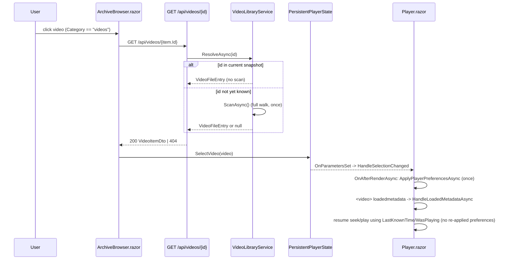

# Plan: Video Player Startup Delay

## Table of Contents

- [Plan: Video Player Startup Delay](#plan-video-player-startup-delay)
  - [Summary](#summary)
  - [Technical Approach](#technical-approach)
  - [Component Breakdown](#component-breakdown)
  - [Dependencies](#dependencies)
  - [External / Vendor Documentation Evidence](#external--vendor-documentation-evidence)
  - [Flow](#flow)
  - [Risk Assessment](#risk-assessment)

## Summary

Add a single-item `GET /api/videos/{id}` endpoint backed by a snapshot-first, scan-on-miss resolution in `VideoLibraryService`, and have `ArchiveBrowser.SelectVideoAsync` call it instead of the blocking `POST /api/videos/scan`; separately, split `Player.razor`'s preference-application from its resume-on-loadedmetadata logic so each runs exactly once per selection.

## Technical Approach

**Server side (`WebApp/WebApp/`).** `VideoLibraryService` (`WebApp/WebApp/Services/VideoLibraryService.cs`) already exposes `TryResolve(id, out entry)` against an atomically-swapped in-memory `SnapshotState`, and `ScanAsync` already does the full recursive `Discover()` walk plus thumbnail/hover-preview reconciliation. This plan adds one new method, `ResolveAsync(id, cancellationToken)`, that:

1. Calls `TryResolve` against the current snapshot; if found, returns it immediately (no I/O beyond the dictionary lookup).
2. If not found, calls the existing `ScanAsync` once (same method the current `POST /api/videos/scan` endpoint uses) and retries `TryResolve` against the freshly published snapshot.
3. Returns the entry or `null`.

This keeps `VideoLibraryService` the single owner of "how a video ID gets resolved," matching the existing pattern where `TryResolve` is already the shared resolution primitive used by `StreamAsync`, `GetThumbnail`, `GetPreview`, and `GetSubtitle` in `VideoEndpoints.cs`. No endpoint duplicates scanning/filesystem logic.

`VideoEndpoints.MapVideoEndpoints` (`WebApp/WebApp/Endpoints/VideoEndpoints.cs`) adds `MapGet("/api/videos/{id}", GetVideoById)`, mirroring the existing per-ID sub-resource endpoints (`{id}/thumbnail`, `{id}/preview`, `{id}/subtitle`, `{id}/stream`) already mapped there. `GetVideoById` calls `library.ResolveAsync(id, cancellationToken)`, returns `Results.NotFound()` on a miss, and otherwise builds the response via the existing private `BuildDto(entry, thumbnailCoordinator, hoverPreviewCoordinator, subtitleCoordinator, metadataCoordinator, cancellationToken)` — the exact same DTO-construction helper `ScanAsync` and `GetCurrentSnapshot` already use, so thumbnail/hover-preview/subtitle/metadata state stays consistent across all three endpoints with zero duplicated logic.

**Client side (`WebApp/WebApp.Client/`).** `ArchiveBrowser.SelectVideoAsync` (`WebApp/WebApp.Client/Components/ArchiveBrowser.razor`) replaces:

```csharp
using var response = await Http.PostAsync("api/videos/scan", content: null);
...
var videos = await response.Content.ReadFromJsonAsync<List<VideoItemDto>>() ?? [];
var video = videos.FirstOrDefault(video => video.Id == item.Id);
```

with a direct single-item fetch:

```csharp
using var response = await Http.GetAsync($"api/videos/{Uri.EscapeDataString(item.Id)}");
...
var video = await response.Content.ReadFromJsonAsync<VideoItemDto>();
```

preserving the existing `_error` messages for a non-success status (`"The video could not be prepared for playback."`) and a missing item (`"The selected file is not available to the video player yet."`, now driven by a 404 instead of an absent list entry), and the existing `HttpRequestException` handling. `GET /api/videos` (collection) and `POST /api/videos/scan` remain untouched and keep serving any other current/future callers that need a full rescan or full listing.

This follows this repo's existing REST shape: a collection endpoint (`GET /api/videos`) for listing, a mutating explicit-rescan endpoint (`POST /api/videos/scan`), and now a single-resource read endpoint (`GET /api/videos/{id}`) — the same three-way shape already used implicitly for cuts/compositions collection+stream, extended with the missing single-item read that this feature needs. `VideoLibraryService` keeps sole responsibility for filesystem/scan/resolution logic (server owns filesystem/path/config logic per `AGENTS.md` Coding Conventions); `VideoEndpoints` stays a thin HTTP adapter.

**Player preference/resume decoupling (`WebApp/WebApp.Client/Components/Player.razor`).** Today `ApplyPlayerPreferencesAsync` is called from two places:

- `OnAfterRenderAsync`'s pending-media-initialization branch (right after the new keyed `<video>`/`<audio>` element mounts for the new `Selected.Id`), and
- `HandleLoadedMetadataAsync` (fired by the browser's native `loadedmetadata` event), which also does the resume-seek/resume-play logic using `_pendingResumeTime`/`_pendingResumePlaying`.

The fix removes the call to `ApplyPlayerPreferencesAsync` from `HandleLoadedMetadataAsync`, leaving preference application solely in `OnAfterRenderAsync`'s pending-init branch (it already runs once per selection, guarded by `_pendingMediaInitialization`). `HandleLoadedMetadataAsync` keeps its own responsibility — reset `_playbackError`, then resume-seek/resume-play via `ExecuteMediaCommandAsync("seekVideo", ...)` / `ExecuteMediaCommandAsync("playVideo")` and a final `SynchronizeMediaStateAsync()` — without re-running the preference-setting interop calls. Volume/mute/playback-rate/loop/subtitle-enabled are DOM element properties the browser accepts regardless of `readyState`, so setting them before `loadedmetadata` fires (as `OnAfterRenderAsync` already does) is safe and matches existing behavior for the initial application; only the resume-time seek genuinely needs to wait for metadata (a `<video>` element cannot seek to a valid time before its duration/seekable range is known), so that dependency is preserved exactly as-is. This is a pure move/removal (no new method, no new interop call), keeping the change minimal and matching the user's ask to decouple the two responsibilities while keeping the resume feature intact.

## Component Breakdown

**Existing files to modify:**

- `WebApp/WebApp/Services/IVideoLibraryService.cs` — add `Task<VideoFileEntry?> ResolveAsync(string id, CancellationToken cancellationToken = default);` to the interface.
- `WebApp/WebApp/Services/VideoLibraryService.cs` — implement `ResolveAsync`: `TryResolve` first, `ScanAsync` + retry `TryResolve` on miss.
- `WebApp/WebApp/Endpoints/VideoEndpoints.cs` — add `MapGet("/api/videos/{id}", GetVideoById)` and the `GetVideoById` handler, reusing `BuildDto`.
- `WebApp/WebApp.Client/Components/ArchiveBrowser.razor` — change `SelectVideoAsync` to call `GET api/videos/{id}` instead of `POST api/videos/scan` + client-side search.
- `WebApp/WebApp.Client/Components/Player.razor` — remove the `ApplyPlayerPreferencesAsync` call from `HandleLoadedMetadataAsync`; keep it only in `OnAfterRenderAsync`'s pending-init branch; keep resume-seek/resume-play logic in `HandleLoadedMetadataAsync` unchanged otherwise.
- `WebApp.Tests/Endpoints/VideoEndpointsTests.cs` (or the closest existing endpoint test file for videos, if present under `WebApp.Tests/Endpoints/`) — add coverage for the new endpoint (see `Validation.md`).
- `WebApp.Tests/Services/VideoLibraryServiceTests.cs` (or closest existing service test file, if present under `WebApp.Tests/Services/`) — add coverage for `ResolveAsync`'s scan-on-miss behavior.

**New files to create:**

- None required — the new endpoint and service method extend existing files/interfaces rather than introducing new components.

## Dependencies

- No new runtime package, external service, or infrastructure. Reuses the existing `IVideoLibraryService`, `ThumbnailCoordinator`, `HoverPreviewCoordinator`, `SubtitleCoordinator`, and `VideoMetadataCoordinator` already injected into `VideoEndpoints`.
- Requires the same Docker Compose stack (`make docker-run` / `make test`) as every other change in this repo per `AGENTS.md` Execution Environment — no native `dotnet run`/`dotnet test` workflow is introduced.

## External / Vendor Documentation Evidence

Not applicable. This change reuses the already-established minimal-API patterns (`MapGet`, `Results.NotFound()`/`Results.Ok()`, per-ID resolution via a service `TryResolve`-style call) already present and previously verified in this codebase's other endpoints (e.g. `GET /api/videos/{id}/thumbnail|preview|subtitle`, `GET /api/videos/{id}/stream`); it introduces no new ASP.NET Core, Blazor WebAssembly, or other Microsoft-stack API surface that requires fresh verification against Microsoft Learn.

## Flow



## Risk Assessment

| Risk | Evidence | Mitigation |
| --- | --- | --- |
| Cold-start snapshot is empty, so the very first `GET /api/videos/{id}` after a container restart would 404 without a fallback | `VideoLibraryService._snapshot` starts as `EmptySnapshot`; nothing else currently populates it before this feature's click flow ran `POST /api/videos/scan` | `ResolveAsync`'s scan-on-miss fallback (FR2) performs one full scan transparently on the first miss, then resolves normally; behavior-equivalent to today's always-scan approach only on the first click, not every click |
| A file added to the library after the last scan is clicked before any rescan happens | Same scan-on-miss fallback as above — an unknown ID triggers exactly one scan | Covered by the same FR2 fallback; no separate polling/background trigger needed |
| `Player.razor` preference application removed from `HandleLoadedMetadataAsync` could regress if any preference genuinely needs the element to have loaded metadata first | `setVolume`/`setMuted`/`setPlaybackRate`/`setLoop`/`setSubtitlesEnabled` are plain DOM property/track-mode writes in `WebApp.Client/wwwroot/js/videoEditor.js`, not seek operations | Verify manually per `Validation.md`: confirm volume/mute/rate/loop/subtitle state is correct immediately on selection and after metadata loads, for both video and music (audio) elements |
| Removing the client-side full-list search changes the exact `_error` trigger condition from "not present in scan result" to "404 from single-item endpoint" | `ArchiveBrowser.razor` `SelectVideoAsync` currently distinguishes non-success scan response vs. missing item in list | Preserve both distinct `_error` messages, mapped to HTTP status instead of list membership, so user-facing behavior is unchanged |
