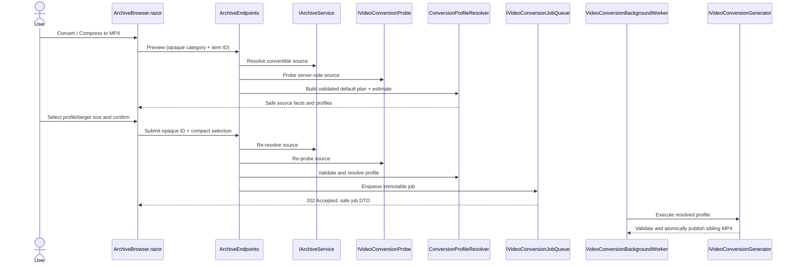

# Plan: Conversion Planning and Configurable Profiles

## Table of Contents

- [Summary](#summary)
- [Technical Approach](#technical-approach)
- [Component Breakdown](#component-breakdown)
- [Dependencies](#dependencies)
- [External / Vendor Documentation Evidence](#external--vendor-documentation-evidence)
- [Flow](#flow)
- [Risk Assessment](#risk-assessment)

## Summary

Replace the immediate archive conversion submission with a server-backed plan dialog and a validated per-job conversion profile. The work decomposes `VideoConversionServices.cs` into focused services while preserving the established archive resolver, bounded queue, status store, FFmpeg process-controller, and background-worker architecture.

## Technical Approach

### Preview and confirmation contract

Replace the single immediate `POST /api/archive/{category}/items/{id}/conversion` interaction in `ArchiveBrowser.razor` with two distinct operations: a preview request and a confirmed submission. The preview resolves the opaque item through the existing `IArchiveService`, uses a focused FFprobe adapter, and returns a client-owned preview DTO containing only browser-safe media facts and a generated profile catalog. It never creates status, a temporary file, or a queued job.

`ArchiveBrowser.razor` will reuse its Bootstrap modal/error/request-state patterns for a responsive plan modal. The user selects a named mode/preset or target size; the component calls the preview recalculation endpoint (or submits a compact selection to the server and receives the recalculated plan) so the server remains authoritative. It renders source facts, output facts, approximate size/savings, limitations, Cancel, and a single primary **Start conversion** action. The existing accepted modal remains the post-confirmation feedback path. Inputs are disabled while preview/recalculation/submission is pending and every modal field has a label and accessible validation feedback.

### Profile and estimate domain

Replace the current `MediaAction`-first policy with immutable domain records such as a source capability/result, user conversion selection, resolved conversion profile, and estimate. A `ConversionProfileCatalog` owns the approved UI choices and source-aware defaults: source dimensions at or below 720p select original dimensions; larger input receives an explicit recommended profile while original, 720p, and 480p options remain available without upscaling.

A pure `ConversionEstimateCalculator` derives output bytes from duration and total output bitrate, reserving a documented MP4-overhead margin. A target-size selection reverses that calculation to derive a bounded video bitrate after audio and overhead allocation. A pure `ConversionProfileResolver` validates the selected mode/resolution/preset/target size against the source probe and converts it into the exact server-only profile. These services make estimates reproducible in xUnit without FFmpeg. Quality presets map to named server configuration values rather than exposing CRF or arbitrary codec options to the browser.

The first implementation supports a consistent profile UI for all extensions in `ArchiveService.ConversionSourceExtensions`, including `.ts`; the probe result, not the extension, determines compatibility and executable strategy. “Make compatible / preserve quality” retains a copy/remux strategy only when the actual streams and selected subtitle policy permit it. Compression modes resolve to a controlled H.264/AAC encode. The subtitle limitation is a visible plan warning and follows the final policy decision recorded in Requirements.

### Focused conversion execution services

Split the tightly packed `WebApp/WebApp/Services/VideoConversionServices.cs` by responsibility, following the existing focused interfaces used by thumbnail, cut, and composition services:

- FFprobe process invocation/parsing stays behind `IVideoConversionProbe`.
- Catalog/defaults, resolution policy, estimate math, and selection validation are pure services with no filesystem/process dependencies.
- A strategy/argument builder translates only a resolved server profile into `ProcessStartInfo.ArgumentList` values. It owns `scale`/aspect preservation/non-upscale and the documented deinterlace filter; it never sees raw browser options.
- A generator owns source identity recheck, free-space preflight, temp output, FFmpeg invocation, second probe validation, atomic sibling publication, safe diagnostics, and cleanup.
- Queue, status store, POSIX pause/stop controller, and `VideoConversionBackgroundWorker` retain their single ownership roles. A job stores its immutable resolved profile and status exposes a browser-safe profile summary.

Use `VideoConversionOptions` only for operational bounds and approved catalog defaults (queue capacity, reserve, target-size min/max, output bitrate min/max, supported output heights, named profiles, audio rate, overhead reserve). Validate all options at startup. Do not use options as an unstructured way to pass an FFmpeg command.

### APIs, status, and compatibility

`ArchiveEndpoints.cs` owns only opaque-ID resolution, endpoint status mapping, and calls to the planning/submission contracts. It must re-probe/re-resolve when confirmation arrives, ensuring a source changed between preview and confirmation is rejected rather than encoded under stale facts. The confirmed-submit endpoint validates the selection independently and only seeds a status record after capacity acceptance semantics are preserved.

The existing dashboard endpoint and `VideoConversionJobDto` gain the safe profile summary/estimate fields needed to explain what is executing; `DashboardConversionJobsTab.razor` displays them without revealing command/path internals. Existing active-job controls and polling states remain unchanged.

### Testing and documentation

Follow `MediaConversionPlannerTests`, `FfmpegVideoConversionGeneratorTests`, status-store tests, and `ArchiveEndpointsTests` conventions. Add pure tests for resolution defaults, valid/invalid selection boundaries, target-size-to-bitrate math, estimated bytes, no-upscale behavior, strategy selection, and FFmpeg argument lists. Add endpoint tests for opaque-ID-only preview/submission, no job on preview/cancel, stale-source and malformed-selection rejection, queue-full behavior, and JSON path secrecy. Exercise the full flow only through `make test` and manual Docker validation. Update the README feature table as required by `AGENTS.md`.

## Component Breakdown

**Existing files to modify:**

- `WebApp/WebApp.Client/Components/ArchiveBrowser.razor` — replace immediate conversion with accessible preview/configuration and confirmation modal state.
- `WebApp/WebApp.Client/Components/Dashboard/DashboardConversionJobsTab.razor` — show the selected profile/resolution and estimate beside existing job controls/progress.
- `WebApp/WebApp.Client/Models/ArchiveItemDto.cs` — reuse the existing opaque conversion flag; add only preview-related browser-safe types in the client project.
- `WebApp/WebApp.Client/Models/VideoConversionJobDto.cs` — add browser-safe profile summary fields.
- `WebApp/WebApp/Endpoints/ArchiveEndpoints.cs` — add preview/recalculation/confirmed-submit endpoint handling and remove immediate auto-plan behavior.
- `WebApp/WebApp/Endpoints/DashboardEndpoints.cs` — map enriched safe status data.
- `WebApp/WebApp/Services/VideoConversionServices.cs` — retire/split its mixed responsibilities without changing archive containment, process-control, or atomic-publication guarantees.
- `WebApp/WebApp/Configuration/VideoConversionOptions.cs` — replace hidden action thresholds with validated catalog/default/bound configuration.
- `WebApp/WebApp/Program.cs` — register the focused planning and execution services.
- `README.md` — amend the Current Supported Features row.

**New files to create:**

- `WebApp/WebApp/Models/VideoConversionProfile.cs` and related server-only planning records — immutable source, selection, resolved-profile, estimate, and strategy contracts.
- `WebApp/WebApp/Services/ConversionProfileCatalog.cs` — source-aware approved controls and defaults.
- `WebApp/WebApp/Services/ConversionEstimateCalculator.cs` — pure estimate and target-size bitrate calculation.
- `WebApp/WebApp/Services/ConversionProfileResolver.cs` — pure selection validation and resolved-profile construction.
- `WebApp/WebApp/Services/VideoConversionArgumentBuilder.cs` — controlled FFmpeg argument construction from a resolved profile.
- Focused replacements for probe, queue/status, naming, generator, and worker interfaces/classes currently colocated in `VideoConversionServices.cs`, retaining their existing names where that minimizes API churn.
- `WebApp/WebApp.Client/Models/VideoConversionPlanDto.cs` and selection/profile DTOs — browser-safe planning contract.
- Focused `WebApp.Tests/Services/*Conversion*Tests.cs` and endpoint tests following the current `WebApp.Tests` layout.

## Dependencies

- Dockerfile-provided `ffmpeg` and `ffprobe`.
- The read-write archive root supplied by `ArchiveRootOptions`; original source and sibling output remain inside the resolved archive category.
- Existing `IArchiveService`, bounded `VideoConversionJobQueue`, `VideoConversionJobStatusStore`, `VideoConversionProcessController`, and `VideoConversionBackgroundWorker` patterns.
- Docker Compose test environment and `make test`.

## External / Vendor Documentation Evidence

- Verified implementation evidence: [Minimal API route handlers](https://learn.microsoft.com/aspnet/core/fundamentals/minimal-apis/route-handlers?view=aspnetcore-10.0) supports separate asynchronous endpoint handlers with DI-bound parameters; [hosted services](https://learn.microsoft.com/aspnet/core/fundamentals/host/hosted-services?view=aspnetcore-10.0) documents the existing queued `BackgroundService` model. The implementation preserves the singleton queue and worker ownership model.
- Verified implementation evidence: the [official FFmpeg documentation](https://ffmpeg.org/ffmpeg.html) documents explicit `-map` stream selection, `-c copy` stream-copy, output bitrate controls, and the `yadif` plus `scale` filtering sequence. The fixed server-side argument builder maps only the primary video and optional audio stream, transcodes to H.264/AAC with `yuv420p`, applies `yadif` then an aspect-preserving/non-upscaling scale, and never accepts a browser FFmpeg argument.

## Flow

## Risk Assessment

| Risk | Evidence | Mitigation |
| --- | --- | --- |
| Estimate is interpreted as a guarantee | Output size varies for quality-driven encodes and MP4 overhead exists. | Use target-size/band math for deterministic estimates, label every estimate, reserve overhead, and show actual output size in Jobs. |
| Browser selection becomes an FFmpeg injection path | The current implementation safely uses `ArgumentList`; new controls add input. | Send enum/numeric selections only; server allowlists, bounds-checks, and constructs every argument. |
| Stale preview encodes a changed/moved source | A user can wait between preview and confirmation. | Re-resolve, re-probe, and compare captured identity at submission and execution. |
| Decomposing services changes pause/stop or publish behavior | `VideoConversionServices.cs` currently owns process lifecycle, cleanup, and status interactions together. | Preserve contracts first; add focused regression tests for stop, cleanup, status transitions, and atomic publish. |
| Loss/unsupported handling of DVB subtitles surprises users | The source example contains DVB subtitle streams and MP4/browser support is constrained. | Make limitation visible before confirmation and settle an explicit safe policy before implementation. |
