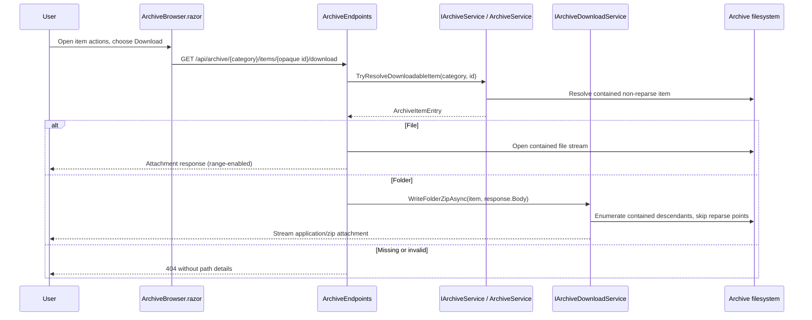

# Plan: Archive File and Folder Downloads

## Table of Contents

- [Summary](#summary)
- [Technical Approach](#technical-approach)
- [Component Breakdown](#component-breakdown)
- [Dependencies](#dependencies)
- [External / Vendor Documentation Evidence](#external--vendor-documentation-evidence)
- [Flow](#flow)
- [Risk Assessment](#risk-assessment)

## Summary

Add a per-item Download action to the shared `ArchiveBrowser.razor` menu, backed by one opaque-ID download route. The route returns a range-enabled attachment for a file or writes a request-scoped ZIP stream for a folder, reusing `ArchiveService`'s category containment and reparse-point protections.

## Technical Approach

### Target resolution and response ownership

Extend the existing focused `IArchiveService` boundary with a general-purpose, non-mutating `TryResolveDownloadableItem(categoryKey, itemId, out ArchiveItemEntry?)` method. `ArchiveService` will implement it by reusing its private `ResolveCategory` and `ResolveItem` path, which computes and checks opaque IDs while ignoring reparse points and applying `ContainedPath`. Unlike type-specific resolvers such as `TryResolveVideo`, it accepts both `ArchiveItemKind.File` and `ArchiveItemKind.Folder`; the category root is not an action-card item and therefore cannot be selected through this endpoint.

`ArchiveEndpoints.MapArchiveEndpoints` will register `GET /api/archive/{category}/items/{id}/download`. Its handler will call only that `IArchiveService` method. For a file it will open the same async, `FileShare.ReadWrite | FileShare.Delete` stream shape used by `StreamVideo` and `StreamAudio`, then return `Results.File` with the detected generic binary content type, the item's safe `Name` as `fileDownloadName`, `LastWriteTimeUtc`, and `enableRangeProcessing: true`. A named file result makes the framework emit the attachment `Content-Disposition` header while preserving its range support.

For a folder the endpoint will delegate ZIP emission to a new `IArchiveDownloadService`/`ArchiveDownloadService`, keeping HTTP response setup in the endpoint and recursive filesystem/ZIP work testable. The endpoint sets `Content-Type: application/zip` and an attachment disposition with `<folder name>.zip`, then the service writes a `ZipArchive` in create mode directly to `HttpResponse.Body` with `leaveOpen: true`. It must not buffer the folder in memory or create a ZIP file on disk.

### Safe ZIP traversal

`ArchiveDownloadService` receives the resolved `ArchiveItemEntry` rather than a browser path. It recursively enumerates only that folder. For every directory and file it checks attributes, skips `FileAttributes.ReparsePoint`, canonicalizes the candidate, and confirms it remains inside the resolved folder (and therefore category). ZIP entry names are calculated relative to the selected folder's parent so that extracting `Invoices.zip` yields `Invoices/...`; separators are normalized to `/`. It creates explicit directory entries, including one for an empty selected folder, so an empty folder survives extraction. Each readable file is opened read-only with the same share mode and copied asynchronously to its ZIP entry. Expected filesystem races (deletion, IO, access failure) skip that descendant rather than disclose paths or corrupt the whole request; request cancellation propagates normally.

The existing `ArchiveService` already avoids reparse points during listing and opaque-ID resolution. The ZIP service repeats the check during recursive enumeration because a directory can change after it was resolved. No generic browser-visible physical path, archive listing DTO change, static-file route, or extra permission model is introduced.

### Client behavior and UI conventions

In `ArchiveBrowser.razor`, add a visible-text `<a>` action before Rename/Move in the existing `.archive-actions-panel` list group. Its `href` uses `Uri.EscapeDataString(Category)` and `Uri.EscapeDataString(item.Id)` to target the new endpoint. It uses `bi-download`, the same Bootstrap `list-group-item-action d-flex align-items-center` classes as the neighboring actions, an accessible name that includes `item.Name`, and does not use the HTML `download` attribute because the server is authoritative for the attachment filename. This works for both files and folders and intentionally remains available in Trash. It neither mutates the listing nor needs `_operationPending`; normal browser navigation/download handling gives the user immediate download behavior.

The action is added only to the shared component, so all pages composed through `ArchiveContentHost.razor` gain it automatically. No scoped CSS is required because the menu's existing Bootstrap layout and custom panel behavior already support one additional row.

### Testing and documentation

Extend `ArchiveEndpointsTests.cs` with `WebApplicationFactory` integration coverage. Inspect file response bytes, `Content-Type`, `Content-Disposition`, and a range request. For folder responses, read the returned bytes using `System.IO.Compression.ZipArchive` and assert exact normalized entry names/content, including an empty nested directory. Assert all error response payloads omit the test root. Add direct `ArchiveDownloadService` tests if its traversal helper is independently injectable; otherwise endpoint tests cover response behavior while `ArchiveServiceTests.cs` covers generic resolution/category containment. Update the existing source-markup test to assert the Download action and endpoint URL are represented in the shared browser.

Use `make test` only, consistent with the Docker Compose-only execution policy. Update the Archive management row in `README.md` in the same implementation change, as required by `AGENTS.md`.

## Component Breakdown

**Existing files to modify:**

- `WebApp/WebApp.Client/Components/ArchiveBrowser.razor` — add the Download action/link and approved Bootstrap icon to each item action panel.
- `WebApp/WebApp/Services/IArchiveService.cs` — expose the opaque-ID, category-scoped downloadable-item resolver.
- `WebApp/WebApp/Services/ArchiveService.cs` — implement the resolver by extending its established category/item containment and reparse-point resolution pattern.
- `WebApp/WebApp/Endpoints/ArchiveEndpoints.cs` — map and implement the file-or-folder download route; preserve the existing 404/no-path-leak behavior.
- `WebApp/WebApp/Program.cs` — register the new focused ZIP/download service through dependency injection.
- `WebApp.Tests/Endpoints/ArchiveEndpointsTests.cs` — add file, folder ZIP, Trash, range, error, and privacy integration tests; update the existing source-markup assertion.
- `WebApp.Tests/Services/ArchiveServiceTests.cs` — add direct resolver coverage if the interface implementation exposes behavior not fully covered by endpoints.
- `README.md` — update the Archive management capability row.

**New files to create:**

- `WebApp/WebApp/Services/IArchiveDownloadService.cs` — narrow abstraction for asynchronously writing a resolved folder as a ZIP to an output stream.
- `WebApp/WebApp/Services/ArchiveDownloadService.cs` — contained, reparse-point-safe recursive ZIP traversal and stream writer.
- `WebApp.Tests/Services/ArchiveDownloadServiceTests.cs` — direct tests for ZIP hierarchy, empty folders, and skipping reparse points/unreadable descendants where the platform permits a deterministic fixture.

## Dependencies

- The existing writable/readable archive root configured by `ArchiveRootOptions`; downloads add no new mount, option, cache, queue, or persistence.
- `System.IO.Compression.ZipArchive`, available from the .NET shared framework; no new NuGet package is required.
- The existing `IArchiveService` registration and ASP.NET Core minimal-API response pipeline.
- Docker Compose test workflow: `make test`.

## External / Vendor Documentation Evidence

- [Create responses in Minimal API applications](https://learn.microsoft.com/en-us/aspnet/core/fundamentals/minimal-apis/responses?view=aspnetcore-10.0) confirms that Minimal API file results handle content type, a provided download file name (`Content-Disposition`), conditional headers, and optional range processing. This supports using `Results.File` for individual-file attachment downloads rather than hand-writing file response headers.
- [Results.File Method](https://learn.microsoft.com/en-us/dotnet/api/microsoft.aspnetcore.http.results.file?view=aspnetcore-10.0) documents the stream/path overloads used here: `fileDownloadName` supplies the download filename, `lastModified` supports conditional requests, and `enableRangeProcessing` enables ranges; the framework disposes a supplied stream after the response completes.
- [ZipArchive.CreateEntry Method](https://learn.microsoft.com/en-us/dotnet/api/system.io.compression.ziparchive.createentry?view=net-10.0) confirms that ZIP entry names express relative directory hierarchy and that an entry can be created at a specified path. This informs explicit directory entries and normalized relative names for folder downloads.
- [ZipFileExtensions.CreateEntryFromFile Method](https://learn.microsoft.com/en-us/dotnet/api/system.io.compression.zipfileextensions.createentryfromfile?view=net-10.0) confirms .NET's built-in ZIP facilities compress filesystem files into named archive entries. The implementation will use `ZipArchiveEntry.Open` plus asynchronous copying instead, so it can stream to the response and retain cancellation/error control.

## Flow

## Risk Assessment

| Risk | Evidence | Mitigation |
| --- | --- | --- |
| A crafted request could read an arbitrary server path. | The archive is intentionally opaque-ID scoped; `ArchiveService` already uses `ContainedPath`, `ResolveItem`, and skips reparse points. | Resolve only with a category + opaque ID via `IArchiveService`; never accept a filename/path parameter or expose one in errors. Re-check containment and reparse points while traversing folders. |
| A folder ZIP could persist sensitive copies or exhaust a cache volume. | The repo explicitly separates read-only source data and cache/output volumes; this feature has no output-store authority. | Write directly to `HttpResponse.Body`; add no temp ZIP, cache key, queue, worker, or volume. |
| An archive folder changes during download. | Existing archive mutations and uploads can change files while the client is connected. | Use read-sharing file handles; skip descendants that vanish/become unreadable during traversal, and propagate client cancellation without exposing diagnostic paths. |
| ZIP entries could lose hierarchy or omit empty folders. | `ZipArchive` entry names are the archive-relative hierarchy. | Normalize `/` entry names relative to the selected folder's parent and emit explicit directory entries; assert them by opening ZIP test output. |
| Browser previews a media/PDF file rather than saving it. | Existing media routes intentionally serve inline stream/content types. | Use a distinct download endpoint and pass `fileDownloadName` so ASP.NET Core emits attachment disposition; do not repurpose player/preview routes. |
| The action becomes inconsistent across archive pages or inaccessible. | All archive pages reuse `ArchiveBrowser`; the action panel is already a Bootstrap list-group control surface. | Add one text-labeled, Bootstrap-icon action in the shared component and test its source markup; it is visible for both normal categories and Trash. |
