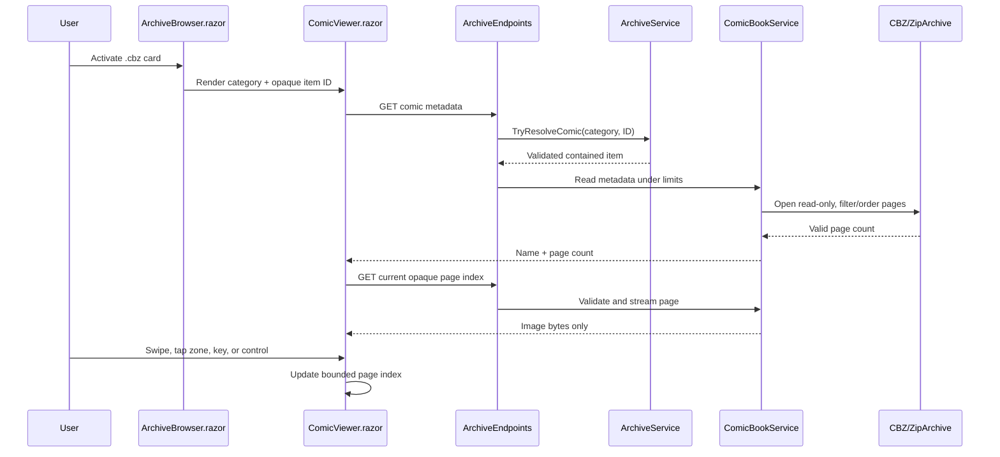

# Plan: CBZ Comic Viewer

## Table of Contents

- [Summary](#summary)
- [Technical Approach](#technical-approach)
- [Component Breakdown](#component-breakdown)
- [Dependencies](#dependencies)
- [External / Vendor Documentation Evidence](#external--vendor-documentation-evidence)
- [Flow](#flow)
- [Risk Assessment](#risk-assessment)

## Summary

Extend the existing Archive Browser classification and opaque endpoint pattern with a read-only CBZ service, then present its server-validated pages in a new full-viewport `ComicViewer.razor`. The design reuses `ImageCarouselViewer.razor`'s Fill-tab shell and `EpubReader.razor`/`ebookReader.js` input conventions while keeping ZIP parsing and policy enforcement server-owned.

## Technical Approach

### Server archive and comic boundary

`WebApp/WebApp/Services/ArchiveService.cs` already owns category resolution, containment checks, extension classification, upload allowlisting, and opaque IDs. Add `.cbz` to a focused comic extension set and the uploadable-extension composition; add `IsComic` to `ArchiveItemEntry` and `ArchiveItemDto`. Add `TryResolveComic` to `IArchiveService`/`ArchiveService`, mirroring `TryResolveImage`: resolve the category-scoped opaque ID, require a file classified as a comic, and return failure rather than paths for invalid/cross-category access.

Introduce a focused server abstraction, for example `IComicBookService`/`ComicBookService` under `WebApp/WebApp/Services/`, rather than adding ZIP parsing to `ArchiveEndpoints`. It receives the validated `ArchiveItemEntry` from `IArchiveService`, opens the CBZ with `ZipArchive` in read-only mode, filters out directory entries, admits only the existing browser-raster extensions (`.jpg`, `.jpeg`, `.png`, `.gif`, `.webp`, `.avif`, `.bmp`, `.ico`), and sorts them with `StringComparer.Ordinal` by entry filename. Its metadata result deliberately contains page count only, not entry names. Its page operation validates the supplied index and streams the selected entry directly to the response with content type chosen server-side.

Add options such as `ComicReaderOptions` to make entry-count, per-entry decompressed size, and aggregate decompressed size limits explicit and testable at startup. `ComicBookService` must validate all declared entry sizes with checked accumulation before producing metadata or streaming an entry. No extraction or cache is permitted; an endpoint response owns and disposes its ZIP/file streams after the response completes. This follows the archive's existing contained-path and opaque-ID model and avoids introducing a new filesystem surface.

`WebApp/WebApp/Endpoints/ArchiveEndpoints.cs` maps compact routes for comic metadata and a single page. The metadata response uses a new browser-safe client model such as `ComicBookDto` (`Name`, `PageCount`); the page route accepts a numeric index and returns `NotFound` or a generic safe problem response for failure. The endpoint must neither serialize physical paths nor ZIP entry names. Existing `ImageContentTypes` is reused for page MIME types.

### Archive Browser and viewer UI

`WebApp/WebApp.Client/Components/ArchiveBrowser.razor` adds an `IsComic` card treatment and activation branch. It opens a locally rendered `<ComicViewer Category="..." ItemId="..." OnExit="..." />`, analogous to its existing image-viewer state. It does not select `PersistentPlayerState`, preserving video/music footer behavior. The card uses a Bootstrap icon and normal archive overlay metadata; a thumbnail pipeline is intentionally absent.

`ComicViewer.razor` is a self-contained fullscreen component with scoped CSS limited to page-fit geometry and nonstandard control visibility. On initialization it requests comic metadata, shows loading/error/empty states, and renders only the current image URL once it has a valid page. It maintains `_currentPageIndex` and a per-open-session fit mode enum (`Height` default, `Width`). The image uses `object-fit: contain` plus fit-mode-specific max dimensions so height mode occupies available viewer height and width mode occupies available viewer width without distortion.

The top/hover-revealed Bootstrap toolbar exposes Back/Exit, Previous, Next, fit-height, and fit-width actions. It shows the truncated comic name and “Page N of M” with `role="status"`/`aria-live="polite"`. Buttons are disabled at boundaries, have icon labels/titles, and preserve a usable compact layout on small screens. It reuses `FillTabState` and `videoEditor.js` `enterFillTab`/`exitFillTab` lifecycle already used by `ImageCarouselViewer.razor`, including Escape handling and `IAsyncDisposable` cleanup.

Add narrowly scoped page navigation exports to `WebApp/WebApp.Client/wwwroot/js/ebookReader.js` only if their semantics can be generalized without impacting EPUB selection behavior; otherwise create `comicViewer.js` in the same static-assets folder. The module follows the EPUB reader's listener lifecycle: register a `DotNetObjectReference` after first render; unregister on disposal; ignore interactive targets; suppress key repeats; use a short movement/time threshold to classify taps; map left/right tap zones to previous/next; and recognize one horizontal swipe only when movement passes a threshold with horizontal dominance. The C# component owns the actual navigation, boundary decisions, and state updates.

### Testability and responsibilities

`ComicBookService` is independently testable with temporary CBZ fixture files created via `System.IO.Compression`. Tests can inject configured limits and verify filtering, ordinal order, limits, bad archives, and content-type results without Blazor. Endpoint integration tests continue the `WebApplicationFactory` pattern in `ArchiveEndpointsTests.cs`, checking opaque responses and byte content. A small client state model may be extracted only if it makes fit/page boundary behavior independently testable; otherwise existing client component tests cover observable helper/state behavior. No new runtime package is necessary because `System.IO.Compression` is in the .NET runtime.

## Component Breakdown

**Existing files to modify:**

- `WebApp/WebApp/Models/ArchiveItemEntry.cs` — add `IsComic` classification state.
- `WebApp/WebApp.Client/Models/ArchiveItemDto.cs` — add browser-safe comic classification and, if appropriate, metadata URL fields.
- `WebApp/WebApp/Services/IArchiveService.cs` — add the validated comic resolver.
- `WebApp/WebApp/Services/ArchiveService.cs` — recognize `.cbz`, include it in upload validation, and implement comic resolution using existing containment/opaque-ID rules.
- `WebApp/WebApp/Endpoints/ArchiveEndpoints.cs` — map and implement opaque comic metadata/page endpoints; populate comic DTO state.
- `WebApp/WebApp/Program.cs` — bind/validate and register focused comic-reader options/service following existing options/service registration patterns.
- `WebApp/WebApp.Client/Components/ArchiveBrowser.razor` and `.razor.css` — render Comic cards and open/close the viewer without footer-player state.
- `WebApp/WebApp.Client/wwwroot/js/ebookReader.js` — reuse only if a carefully isolated generic page-navigation export avoids altering EPUB behavior; otherwise leave unchanged.
- `README.md` — add `.cbz` read-only comic viewing to Current Supported Features.

**New files to create:**

- `WebApp/WebApp/Configuration/ComicReaderOptions.cs` — validated CBZ safety limits.
- `WebApp/WebApp/Services/IComicBookService.cs` and `ComicBookService.cs` — ZIP-entry policy, metadata, and direct page-stream access.
- `WebApp/WebApp.Client/Models/ComicBookDto.cs` — metadata response type with no ZIP entry/path fields.
- `WebApp/WebApp.Client/Components/ComicViewer.razor` and `.razor.css` — fullscreen, responsive read-only viewer.
- `WebApp/WebApp.Client/wwwroot/js/comicViewer.js` — lifecycle-managed tap/swipe/keyboard input if existing EPUB script cannot safely host a generic export.
- `WebApp.Tests/Services/ComicBookServiceTests.cs` — ZIP policy, ordering, and page stream tests.
- `WebApp.Tests/Endpoints/ArchiveEndpointsComicTests.cs` (or focused additions to `ArchiveEndpointsTests.cs`) — opaque endpoint and error-boundary coverage.

## Dependencies

- .NET `System.IO.Compression.ZipArchive`, already available to the host runtime; no package or external media processor.
- Existing Bootstrap 5.3.8, Bootstrap Icons 1.13.1, `FillTabState`, `videoEditor.js`, and Docker Compose-only Makefile workflow.
- The archive root must remain writable for `.cbz` uploads under existing category permissions; viewing itself is read-only.

## External / Vendor Documentation Evidence

- [Best practices for ZIP and TAR archives — .NET](https://learn.microsoft.com/en-us/dotnet/standard/io/zip-tar-best-practices) says applications handling untrusted archives should enforce per-entry size, aggregate decompressed-size, and entry-count limits. This directly informs `ComicReaderOptions` and the mandatory pre-stream validation policy.
- [ASP.NET Core Blazor JavaScript interoperability](https://learn.microsoft.com/en-us/aspnet/core/blazor/javascript-interoperability/?view=aspnetcore-6.0) documents dynamic module import with `IJSObjectReference` and component disposal. The plan keeps pointer/keyboard listeners in a module with explicit registration and cleanup, matching the current client convention.
- [Call .NET methods from JavaScript functions in ASP.NET Core Blazor](https://learn.microsoft.com/en-us/aspnet/core/blazor/call-dotnet-from-javascript) documents passing a `DotNetObjectReference` to browser event handlers. The viewer uses that established callback route while retaining page state and navigation policy in C#.

## Flow

## Risk Assessment

| Risk | Evidence | Mitigation |
| --- | --- | --- |
| ZIP bomb or excessive memory/CPU use | CBZ files are ZIP archives and may contain many or highly compressed entries. | Enforce configured entry, per-entry, and aggregate decompressed-size limits before metadata/page streaming; never extract. |
| Archive path or entry-name disclosure | CBZ internals and physical paths are server-only data under repository constraints. | Resolve opaque IDs through `IArchiveService`; expose only name, count, index routes, and image bytes. |
| Touch gesture conflicts with controls | The EPUB reader already distinguishes taps from movement and excludes interactive targets. | Reuse those semantics with listener cleanup; C# makes one bounded navigation decision per JS callback. |
| Regressing existing archive item activation | `ArchiveBrowser.razor` coordinates video, music, images, books, text, and PDF flows. | Add an isolated `IsComic` branch that does not alter existing branches or player state; cover regression cases in endpoint/client tests. |
| Large source pages load slowly | This release streams original image entry bytes and has no derivative cache. | Use one current-page request, visible loading/error state, and defer thumbnails/preloading to a future spec. |
