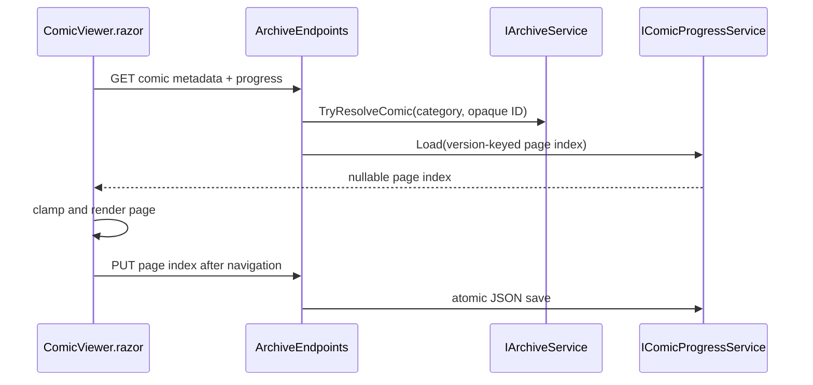

# Plan: CBZ Reading Progress

## Summary

Extend the existing EPUB JSON progress architecture for comics: a focused service owns persistence, archive endpoints validate opaque IDs, and `ComicViewer.razor` restores/saves page indexes.

## Technical Approach

Create `IComicProgressService`/`ComicProgressService` beside `IEpubProgressService`/`EpubProgressService`. It will use a separate `pereneArchiveComicProgress.json` file under the existing archive `Books/Notes` location, SHA-256 private keys based on category/item/version metadata, `SemaphoreSlim` serialization, and atomic temp-file moves. This avoids coupling comic data into EPUB records while following the same tested ownership and recovery pattern.

`ArchiveEndpoints.cs` will map GET/PUT comic progress routes beside the comic metadata/page routes. Each handler first calls `IArchiveService.TryResolveComic`, validates a non-negative index, and passes only server-side item metadata to the progress service.

`ComicViewer.razor` will load metadata and progress, clamp the restored index to `PageCount - 1`, and use a single page-navigation method that both changes bounded state and fires a best-effort PUT. Existing input callbacks keep ownership of interaction policy in C#.

## Component Breakdown

**Existing files to modify:**

- `WebApp/WebApp/Program.cs` — register comic progress service.
- `WebApp/WebApp/Endpoints/ArchiveEndpoints.cs` — add validated opaque comic progress routes.
- `WebApp/WebApp.Client/Components/ComicViewer.razor` — restore and automatically save page position.
- `README.md` — add comic reading-position support to the feature table.

**New files to create:**

- `WebApp/WebApp.Client/Models/ComicProgressDto.cs` — browser-safe page-index contract.
- `WebApp/WebApp/Services/IComicProgressService.cs` — focused persistence abstraction.
- `WebApp/WebApp/Services/ComicProgressService.cs` — atomic JSON implementation.
- `WebApp.Tests/Services/ComicProgressServiceTests.cs` — JSON/key/recovery tests.
- `WebApp.Tests/Endpoints/ArchiveEndpointsComicProgressTests.cs` — opaque route integration tests.

## Dependencies

- Existing writable archive root and `Books/Notes` convention.
- .NET `System.Text.Json` and cryptography APIs already used by EPUB progress.
- Docker Compose `make test` workflow.

## External / Vendor Documentation Evidence

Microsoft Learn MCP was not available in this session; verification of .NET JSON async I/O guidance is pending. The design follows the repository’s already-implemented EPUB progress implementation.

## Flow

## Risk Assessment

| Risk | Mitigation |
| --- | --- |
| Changed CBZ restores an invalid old page | Version-key by size/timestamp and clamp index to current count. |
| Corrupt JSON blocks reading | Treat it as empty progress and continue at page one. |
| Path/entry disclosure | Persist private hash keys only; endpoints accept opaque IDs only. |
| Frequent navigation writes | Serialize small atomic writes; saving remains best-effort. |
