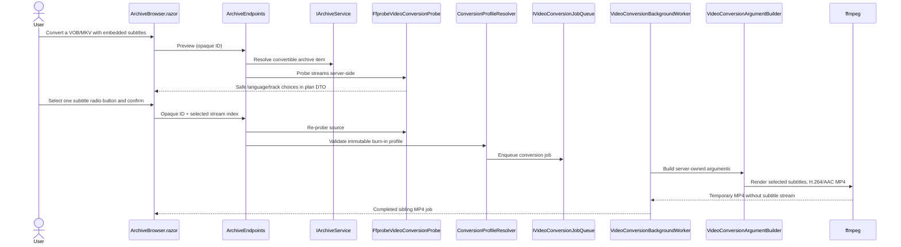

# Plan: VOB Conversion and Embedded Subtitle Burn-in

## Table of Contents

- [Summary](#summary)
- [Technical Approach](#technical-approach)
- [Component Breakdown](#component-breakdown)
- [Dependencies](#dependencies)
- [External / Vendor Documentation Evidence](#external--vendor-documentation-evidence)
- [Flow](#flow)
- [Risk Assessment](#risk-assessment)

## Summary

Extend the existing Archive conversion planner and single-worker FFmpeg pipeline to accept `.vob` and to burn one user-selected embedded subtitle stream into a sibling MP4. The implementation follows the current opaque-ID Archive resolver, server-only FFprobe probe, immutable conversion-profile, fixed `ArgumentList`, queue/status, and atomic-publication patterns rather than creating a new media workflow.

## Technical Approach

### Archive eligibility and safe probe contract

Add `.vob` to `ArchiveService.ConversionSourceExtensions`. Because it remains absent from `VideoExtensions`, Archive listings can offer the existing **Convert / Compress to MP4** action while neither `Player.razor` nor the Video Library attempt browser playback. Its presence in `ConversionSourceExtensions` also makes upload validation consistently accept `.VOB` case-insensitively.

Extend `VideoConversionProbeResult` beyond its current `HasSubtitles` Boolean with an ordered server-derived embedded-subtitle record collection. `FfprobeVideoConversionProbe` will request each stream's index, codec/type, and `tags.language`, parse only subtitle streams, and normalize a display-safe language/unknown-track label. It remains a process boundary: the browser sees only DTO records, never source paths or arbitrary metadata.

### Planning and accessible selection

Add an optional `SelectedSubtitleStreamIndex` to the client-owned `VideoConversionSelectionDto`, a browser-safe `VideoConversionSubtitleOptionDto`, and a subtitle-options property on `VideoConversionPlanDto`. `ArchiveEndpoints.PreviewConversionAsync` continues resolving the opaque category/item ID and freshly probing before it builds the plan. It returns all subtitle choices only when present.

`ArchiveBrowser.razor` extends the existing Bootstrap plan modal with a `fieldset`/`legend` labelled "Burn embedded subtitles" and one `btn-check` plus associated `btn btn-outline-secondary` label per option. The client maintains the selected stream index in the compact selection DTO, recalculates the server plan on change, disables submission until one item is selected, and uses an alert/live validation message for missing or rejected choices. No subtitle control renders for a source that has none. The modal explicitly distinguishes irreversible burn-in from the application's external SRT/WebVTT playback captions.

### Server-authoritative profile and execution

Replace the unconditional embedded-subtitle rejection in `ConversionProfileResolver.TryResolve` with selection validation. When a probe reports subtitle streams, it requires a submitted index that belongs to that freshly probed collection. The resolver creates an immutable server-only profile carrying the selected ordinal, stable safe label, and the fact that the execution must encode rather than remux; it rejects a compatible/remux profile if a subtitle must be burned. For subtitle-free inputs, the existing selection/defaulting path remains unchanged.

`VideoConversionArgumentBuilder` derives all FFmpeg arguments from that resolved profile. It maps only `0:v:0` and `0:a?`; its filter chain uses the selected stream index through FFmpeg's documented `subtitles` filter `si` option, then applies the established `yadif` and aspect-preserving/no-upscale scale. The input path is escaped by a small, focused filter-value encoder rather than interpolating client text; all arguments continue to be individual `ProcessStartInfo.ArgumentList` items. The output remains H.264/AAC, `yuv420p`, and `+faststart`, with no subtitle stream mapped into MP4. The selected language is visible only as a safe status/profile summary if existing job UI has a suitable field; do not add raw codec/path output.

The generator retains identity revalidation, free-space checks, stop/pause controls, temp cleanup, output probe, atomic move, and duplicate detection. Its final probe must confirm valid H.264/AAC MP4 and no output subtitle stream. Failure to render/decode a track—or FFmpeg lacking the `subtitles` filter/libass capability—returns a generic, redacted job diagnostic and never publishes the temporary file.

### Testing and documentation

Follow the existing direct xUnit service tests (`ArchiveServiceTests`, `FfmpegVideoConversionGeneratorTests`) and endpoint tests (`ArchiveEndpointsTests`). Add pure probe parsing and resolver tests for available languages, unknown-language fallbacks, missing/tampered indexes, subtitle-forced transcode, and subtitle-free compatibility. Add argument-list tests that verify the exact mapped stream/filter behavior, ensure a hostile path cannot become a separate command argument, and verify no `-map 0:s` output mapping. Endpoint tests cover VOB visibility/upload acceptance, opaque-ID-only preview/submission, safe JSON with no paths, required selection, stale/tampered selection rejection, and queue behavior. Update the README table required by `AGENTS.md`.

## Component Breakdown

**Existing files to modify:**

- `WebApp/WebApp/Services/ArchiveService.cs` — add `.vob` to conversion-source/upload eligibility only.
- `WebApp/WebApp/Models/VideoConversionModels.cs` — represent immutable per-stream subtitle probe data and the selected server-side subtitle profile/job data.
- `WebApp/WebApp/Services/VideoConversionServices.cs` — request/parse stream index, codec, and language with FFprobe; retain redacted execution behavior and validate output has no subtitle stream.
- `WebApp/WebApp/Services/ConversionProfileResolver.cs` — validate selection from a fresh probe and force a subtitle-burn conversion profile instead of rejecting all embedded subtitles.
- `WebApp/WebApp/Services/VideoConversionArgumentBuilder.cs` — construct the fixed selected-stream burn-in filter and retain controlled map/encode options.
- `WebApp/WebApp/Endpoints/ArchiveEndpoints.cs` — map safe subtitle choices into preview DTOs and receive only the compact submitted stream index.
- `WebApp/WebApp.Client/Models/VideoConversionPlanDto.cs` — add safe subtitle option and selected-index DTO contract fields.
- `WebApp/WebApp.Client/Components/ArchiveBrowser.razor` — render/manage the accessible required Bootstrap subtitle radio group in the existing conversion plan modal.
- `WebApp.Tests/Services/ArchiveServiceTests.cs` — cover VOB conversion/upload classification.
- `WebApp.Tests/Services/FfmpegVideoConversionGeneratorTests.cs` — cover burn-in argument/output validation behavior.
- `WebApp.Tests/Endpoints/ArchiveEndpointsTests.cs` — cover safe preview/submission selection contracts.
- `README.md` — amend the conversion feature row.

**New files to create:**

- `WebApp.Tests/Services/FfprobeVideoConversionProbeTests.cs` — focused JSON parsing tests for safe embedded subtitle options if existing conversion probe tests are not the appropriate home.
- `WebApp.Tests/Services/VideoConversionArgumentBuilderTests.cs` — isolated fixed-argument/filter escaping tests.

## Dependencies

- Dockerfile-provided `ffmpeg` and `ffprobe`; the built FFmpeg must include the documented `subtitles` filter/libass capability.
- Existing read-write `ArchiveRootOptions` archive root, `IArchiveService`, `IVideoConversionProbe`, conversion queue/status store/controller/worker, and current temporary sibling-output publication flow.
- Docker Compose test environment and `make test`.

## External / Vendor Documentation Evidence

- [FFprobe documentation](https://ffmpeg.org/ffprobe.html) documents `-show_entries` selection, stream information, and `stream_tags` output. The probe will request only stream fields needed to classify subtitle streams and their language metadata, then emit a reduced browser-safe DTO.
- [FFmpeg subtitles filter documentation](https://ffmpeg.org/ffmpeg-filters.html#subtitles) documents that the `subtitles` filter draws a subtitle stream over input video, requires libass, and supports `stream_index`/`si` to select a stream. The argument builder therefore uses a server-validated stream index to burn one track and fails safely when that capability is unavailable rather than advertising switchable browser captions.
- [ASP.NET Core `TypedResults.File` documentation](https://learn.microsoft.com/dotnet/api/microsoft.aspnetcore.http.typedresults.file?view=aspnetcore-10.0) confirms the existing stream file-result API supports range processing when enabled. This feature intentionally does not add a VOB stream endpoint or alter direct-playback/range behavior; converted MP4s continue using the current archive path.

## Flow

## Risk Assessment

## Closed-caption extension

`FfprobeVideoConversionProbe` scans a bounded initial video-frame sample for FFmpeg’s `ATSC A53 Part 4 Closed Captions` side data, returning only a Boolean capability. `ArchiveBrowser.razor` renders a Bootstrap checkbox when that capability is present. The conversion worker extracts the default decoded caption service with `movie=...[out+subcc]` into a temporary SRT and passes that server-owned file through the existing `subtitles` filter. The extraction file is never exposed and is deleted in the generator's cleanup path.

| Risk | Evidence | Mitigation |
| --- | --- | --- |
| DVD subtitles are bitmap streams, not browser WebVTT text | Existing external subtitle pipeline handles only `.srt`; FFmpeg documents rendering rather than browser caption output. | Burn exactly one selected stream into pixels; explicitly state it cannot be toggled. |
| FFmpeg build lacks libass/subtitles support | FFmpeg documents the filter's libass build requirement. | Check failure through the normal process result, redact diagnostics, clean temp output, and document Docker-image validation. |
| A browser selection is tampered or source changes after preview | Preview and submission are separate, and selection is client input. | Re-resolve/re-probe on submit; validate only the current stream-index allowlist and store immutable resolved data. |
| Filter syntax/path escaping permits broken or unsafe FFmpeg invocation | A burn-in filter needs a filename value, while paths can contain special characters. | Use an internal filter-value encoder and `ArgumentList`; never accept client filter strings or command fragments. |
| Burn-in prevents remux/copy and increases conversion cost | Rendering subtitles necessarily filters video. | Force the selected-subtitle path to controlled H.264/AAC transcode while retaining one bounded worker, estimates, progress, and free-space checks. |
