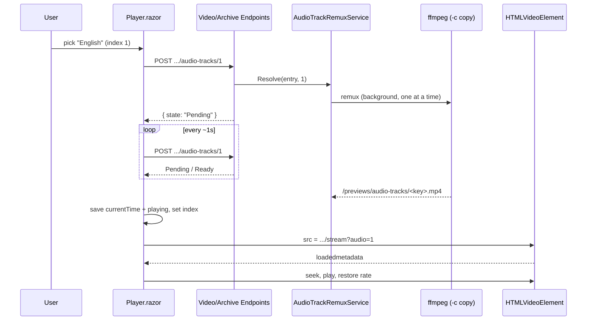

# Plan: Video Player Multi Audio Track Selection

## Table of Contents

- [Summary](#summary)
- [Technical Approach](#technical-approach)
- [Component Breakdown](#component-breakdown)
- [Dependencies](#dependencies)
- [External / Vendor Documentation Evidence](#external--vendor-documentation-evidence)
- [Flow](#flow)
- [Risk Assessment](#risk-assessment)

## Summary

The ffprobe audio-track probe and `AudioTrackDto` metadata (rev 1) stay. Track switching moves server-side: a new `AudioTrackRemuxService` stream-copies the selected audio stream into a cached MP4 under `/previews/audio-tracks`, following the thumbnail/subtitle cache pattern, and `Player.razor` swaps the `<video>` source while restoring position through its existing resume path.

## Technical Approach

**Metadata (unchanged from rev 1, extended to Archive):** `IVideoAudioTrackProbe`/`FfprobeAudioTrackProbe` runs inside `VideoMetadataCoordinator.ProbeAsync`. `VideoEndpoints.BuildDto` and now also `ArchiveEndpoints.ToDtoAsync` map probe results through `VideoEndpoints.BuildAudioTracks`. `ArchiveItemDto` gets a trailing optional `AudioTracks`; `PersistentPlayerState.SelectArchiveVideo` forwards it.

**Remux pipeline (extends the preview-cache pattern):**
- `AudioTrackCache` (mirrors `SubtitleCache`): SHA-256 key of version marker, relative path, size, last-write ticks and track index; contained `<key>.mp4` under `<ThumbnailCache path>/audio-tracks`.
- `IAudioTrackRemuxer`/`FfmpegAudioTrackRemuxer` (mirrors `FfmpegSubtitleGenerator`): revalidates source, `ffmpeg -nostdin -hide_banner -loglevel error -i <src> -map 0:v -map 0:a:N -c copy -movflags +faststart -y <tmp>`, bounded stderr, cancellation kill, atomic publish, redacted diagnostics.
- `AudioTrackRemuxService` (singleton, small and independently testable via a fake remuxer): `Resolve(entry, index)` returns `Ready` (cache file exists), `Pending` (job in flight), `Failed` (remembered failure) or starts a job. Jobs run on the thread pool behind a `SemaphoreSlim(1)` so only one remux runs at a time; a `ConcurrentDictionary<string, Task>` de-duplicates by key. This deliberately replaces the queue/worker trio used by thumbnails: jobs are user-initiated, single-track and short-lived, so a `Channel` + `BackgroundService` adds no value.
- Endpoints (`VideoEndpoints` and `ArchiveEndpoints`): `POST .../{id}/audio-tracks/{index}` ensures the job and returns `{ state }`; `GET .../{id}/stream?audio=N` serves the cached file with range processing, `409` if not ready, `404` on invalid IDs or an index outside `1..count-1` (count from `VideoMetadataCoordinator`). Index 0/absent keeps current behaviour.

**Client:** `Player.razor` `SelectAudioTrackAsync(index)`: index 0 or a cached track swaps immediately; otherwise it sets a busy flag, polls the POST endpoint (1 s) until Ready/Failed, then sets `_pendingResumeTime = _player.CurrentTime`, `_pendingResumePlaying = _player.IsPlaying`, updates `MediaPlayerState.SelectedAudioTrackIndex`, and re-renders with `VideoSource` = `.../stream?audio=N`. `HandleLoadedMetadataAsync` already seeks/plays from the pending values; it additionally reapplies playback rate (a new `load()` resets it). Polling is cancelled on item change/dispose. `MediaPlayerControls.razor` swaps the speaker icon for `bi-translate`, adds an `IsAudioTrackBusy` parameter (spinner, `aria-busy`, disabled), and drops the browser-support gating and tooltip.

**Cleanup:** `getAudioTracks`/`setAudioTrack` and their debug logs in `videoEditor.js`, `DetectAudioTrackSupportAsync` and `IsAudioTrackSelectable`/`SetAudioTrackSelectable` are removed.

## Component Breakdown

**Existing files to modify:**

- `WebApp/WebApp/Program.cs` — register cache, remuxer and service.
- `WebApp/WebApp/Endpoints/VideoEndpoints.cs` and `ArchiveEndpoints.cs` — audio-track POST endpoint, `stream?audio=N`, Archive DTO mapping.
- `WebApp/WebApp.Client/Models/ArchiveItemDto.cs` — trailing `AudioTracks`.
- `WebApp/WebApp.Client/Services/PersistentPlayerState.cs` — forward `AudioTracks` in `SelectArchiveVideo`.
- `WebApp/WebApp.Client/Models/MediaPlayerState.cs` — remove `IsAudioTrackSelectable`.
- `WebApp/WebApp.Client/Components/Player.razor` — swap flow, polling, cleanup.
- `WebApp/WebApp.Client/Components/MediaPlayerControls.razor` — icon, busy state.
- `WebApp/WebApp.Client/wwwroot/js/videoEditor.js` — remove audioTracks functions.
- `README.md`, `AGENTS.md` — docs.
- Tests: `MediaPlayerStateTests`, `VideoEndpointsAudioTrackTests`.

**New files to create:**

- `WebApp/WebApp/Services/AudioTrackCache.cs`
- `WebApp/WebApp/Services/IAudioTrackRemuxer.cs`, `FfmpegAudioTrackRemuxer.cs`
- `WebApp/WebApp/Services/AudioTrackRemuxService.cs`
- `WebApp/WebApp.Client/Models/AudioTrackPrepareResponse.cs`
- `WebApp/WebApp.Tests/Services/AudioTrackRemuxServiceTests.cs`, `FfmpegAudioTrackRemuxerTests.cs` (argument builder)

## Dependencies

- Already-installed `ffmpeg`/`ffprobe`; the existing writable `/previews` volume (must have free space of roughly one video copy per prepared track).
- No new packages, background services or JS libraries.

## External / Vendor Documentation Evidence

- Not applicable (no Microsoft/Azure-documented decision). Runtime evidence: on Chrome 152/Vivaldi `video.audioTracks` is `undefined`, logged by the rev 1 diagnostics, which motivated this revision.

## Flow

## Risk Assessment

| Risk | Evidence | Mitigation |
| --- | --- | --- |
| Each prepared track is roughly the size of the source | Stream copy keeps full video | Accepted per requirements (no eviction); documented for operators |
| First switch takes as long as a full-file stream copy | Remux reads/writes the entire file | Busy state in the UI, playback continues on the current track meanwhile |
| Non-MP4-family sources (e.g. `.webm`) may fail to copy into MP4 | `ContentTypes` includes `.webm` | Failure is remembered and surfaced through the existing player error; out of scope to transcode |
| Source changes while a job runs | Cache key includes size and mtime | Remuxer revalidates the source before starting; key changes invalidate old files |
| Duplicate/concurrent jobs or runaway polling | Client polls each second | Job de-duplication by key, `SemaphoreSlim(1)`, polling cancelled on item change/dispose |
| Wide `VideoMetadata` change | Several call sites build it positionally | Already optional trailing parameter (rev 1) |
