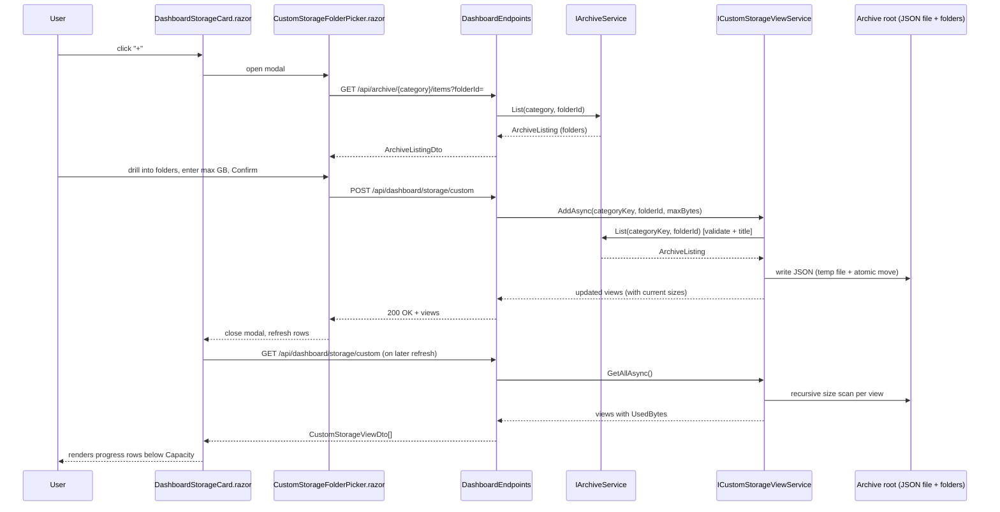

# Plan: Dashboard Custom Storage Views

## Table of Contents

- [Plan: Dashboard Custom Storage Views](#plan-dashboard-custom-storage-views)
  - [Summary](#summary)
  - [Technical Approach](#technical-approach)
  - [Component Breakdown](#component-breakdown)
  - [Dependencies](#dependencies)
  - [External / Vendor Documentation Evidence](#external--vendor-documentation-evidence)
  - [Flow](#flow)
  - [Risk Assessment](#risk-assessment)

## Summary

Add a "+" button to the Storage card that opens a Bootstrap modal reusing the archive category/folder column-picker pattern; on confirm, a new `ICustomStorageViewService` persists the chosen folder + user max-size as a JSON record under the archive root (same pattern as `EpubProgressService`) and the Storage card renders one extra Capacity-styled progress row per saved view, computed by recursively summing file sizes the same way `ArchiveMetricsService` already does.

## Technical Approach

This follows the existing Dashboard card pattern exactly: each card (`DashboardStorageCard`, `DashboardArchiveCard`, etc.) is a self-contained Razor component with its own `RefreshAsync()`, wired into `Dashboard.razor`'s `RefreshAllAsync()`. No new card is introduced — the Storage card itself grows a repeatable row.

**Server side — new focused service, following `IStorageUsageService`/`IArchiveMetricsService`/`IEpubProgressService` single-responsibility precedent:**

- `ICustomStorageViewService` / `CustomStorageViewService` owns:
  - Loading/saving the persisted list of custom storage views (JSON file under `ArchiveRootOptions.Path`, e.g. `Dashboard/pereneArchiveCustomStorageViews.json`, written with the temp-file-then-atomic-move + `SemaphoreSlim` single-writer pattern already used by `EpubProgressService.WriteAllUnlockedAsync` (`WebApp/WebApp/Services/EpubProgressService.cs:84-97`)).
  - Add/Remove/UpdateMaxSize operations against that persisted list.
  - Computing each view's current size on demand via recursive `Directory.EnumerateFiles(path, "*", new EnumerationOptions { RecurseSubdirectories = true, AttributesToSkip = FileAttributes.ReparsePoint, IgnoreInaccessible = true })`, matching `ArchiveMetricsService.CountFiles()` (`WebApp/WebApp/Services/ArchiveMetricsService.cs`) for symlink-skipping and non-fatal `IOException`/`UnauthorizedAccessException` handling.
  - Resolving a persisted record's `(categoryKey, folderId)` back to a physical path **by delegating to the existing `IArchiveService.List(categoryKey, folderId)`** rather than duplicating path-resolution/containment logic — `List` already validates the category, resolves the opaque folder id within that category's root (throwing `ArchiveNotFoundException`/`ArchiveValidationException` on failure, which the service catches to mark the view unavailable per FR10), and returns `ArchiveListing.CurrentFolderId`/breadcrumb name to use as the display title. The "whole archive" option resolves directly via `ArchiveRootOptions.Path` instead of calling `List`.
  - Never returning a physical path in its result DTOs — only the persisted opaque `(categoryKey, folderId)`, a display title, current size, max size, and availability flag.

- A physical-path record is never stored either: the persisted JSON record stores `categoryKey` + `folderId` (the same opaque id `ArchiveService.ComputeItemId` already produces) or a `IsWholeArchive` flag, not a path — resolution happens fresh on every read via `IArchiveService`, so a later rename/move is naturally reflected (or naturally fails safely into "unavailable" per FR10) without the persisted record going stale in a way that leaks a path.

- New endpoints in `WebApp/WebApp/Endpoints/DashboardEndpoints.cs` (extending the existing `MapDashboardEndpoints`, consistent with how storage/archive/jobs endpoints are already grouped there):
  - `GET /api/dashboard/storage/custom` — list all persisted views with current sizes (used by `DashboardStorageCard.RefreshAsync()`).
  - `POST /api/dashboard/storage/custom` — body `{ CategoryKey, FolderId, IsWholeArchive, MaxSizeBytes }`; validates via `IArchiveService.List` (folder must resolve and be a folder), persists, returns the updated list.
  - `DELETE /api/dashboard/storage/custom/{viewId}` — removes a persisted view by its own generated id (a GUID minted at add time, not derived from the folder path), returns the updated list.
  - `PATCH /api/dashboard/storage/custom/{viewId}` — body `{ MaxSizeBytes }`; updates only the max size of an existing view, returns the updated list.

**Client side — reusing the existing archive listing/column-picker conventions:**

- New `WebApp.Client/Models/CustomStorageViewDto.cs` (`Id`, `Title`, `IsAvailable`, `UsedBytes`, `MaxBytes`).
- New `WebApp.Client/Models/AddCustomStorageViewRequest.cs` / `UpdateCustomStorageViewMaxSizeRequest.cs`.
- `DashboardStorageCard.razor` gains:
  - The "+" icon button next to the "Capacity" label (Bootstrap `btn btn-sm btn-icon`-style pattern already used elsewhere for icon-only controls, e.g. the dashboard refresh FAB in `Dashboard.razor`), opening a new child component.
  - A `foreach` over `_customViews` rendering one row per view, structurally identical to the existing Capacity block (`DashboardStorageCard.razor:20-29`) but driven by the DTO instead of `_metrics`, plus a remove icon button and an edit-in-place control (a small inline number input + confirm, shown on click) for `MaxBytes`.
- New `WebApp.Client/Components/Dashboard/CustomStorageFolderPicker.razor` — a Bootstrap modal containing the same column-picker structure introduced by the archive Move dialog (`Specs/20260914154043-archive-move-column-picker/Plan.md`): a horizontally scrollable `d-flex overflow-auto` row of `list-group` columns, leftmost column = `ArchiveCategory.Defaults` (plus a "Whole Archive" entry), each subsequent column populated by calling `GET /api/archive/{category}/items?folderId=` and filtering to `Kind == Folder`, driven entirely by C# component state (no JS interop), consistent with the Move picker's non-functional constraint. The modal's footer has the max-size-in-GB numeric input and Confirm/Cancel, calling the new `POST /api/dashboard/storage/custom` endpoint on confirm.
- This keeps all framing/state logic in C#, all filesystem/path logic server-side, and reuses Bootstrap-only presentation, per `AGENTS.md`'s client/server and design-system conventions.

## Component Breakdown

**Existing files to modify:**

- `WebApp/WebApp/Endpoints/DashboardEndpoints.cs` — add the four `/api/dashboard/storage/custom*` routes and their handlers.
- `WebApp/WebApp/Program.cs` — register `ICustomStorageViewService`/`CustomStorageViewService` in DI (same lifetime/pattern as `IEpubProgressService`).
- `WebApp/WebApp.Client/Components/Dashboard/DashboardStorageCard.razor` — add the "+" button, the per-view progress rows, remove/edit controls, and `_customViews` state loaded in `RefreshAsync()`.

**New files to create:**

- `WebApp/WebApp/Services/ICustomStorageViewService.cs` / `CustomStorageViewService.cs` — persistence + size computation + resolution, as described above.
- `WebApp/WebApp.Client/Models/CustomStorageViewDto.cs` — browser-safe view record (`Id`, `Title`, `IsAvailable`, `UsedBytes`, `MaxBytes`).
- `WebApp/WebApp.Client/Models/AddCustomStorageViewRequest.cs` — `{ CategoryKey, FolderId, IsWholeArchive, MaxSizeBytes }`.
- `WebApp/WebApp.Client/Models/UpdateCustomStorageViewMaxSizeRequest.cs` — `{ MaxSizeBytes }`.
- `WebApp/WebApp.Client/Components/Dashboard/CustomStorageFolderPicker.razor` — the add-view modal (category/folder column picker + max-size input).
- `WebApp.Tests/Services/CustomStorageViewServiceTests.cs` — persistence round-trip, size computation, unavailable-folder handling.
- `WebApp.Tests/Endpoints/DashboardEndpointsTests.cs` (extended, not new) — covers the new `/api/dashboard/storage/custom*` routes, following its existing `WebApplicationFactory` conventions.

## Dependencies

- `ArchiveRootOptions.Path` must remain a writable bind mount (`docker-compose.yml` already mounts it `read_only: false`), since the new JSON persistence file is written under it, same as `EpubProgressService`'s notes file.
- `IArchiveService.List` must stay available for server-side folder resolution/validation; no change to its existing contract is required.
- No new NuGet packages, JavaScript libraries, or background services are introduced — size computation runs synchronously within the existing request pipeline, matching `ArchiveMetricsService`'s approach and avoiding a new queue/worker pattern for what the requirements scope as an on-refresh computation.

## External / Vendor Documentation Evidence

Not applicable — this feature is standard ASP.NET Core minimal API endpoints, `System.Text.Json` file persistence, and Blazor WebAssembly component composition, all following patterns already established and previously verified elsewhere in this codebase (`EpubProgressService`, `ArchiveMetricsService`, `DashboardEndpoints`, the archive Move column picker). No new vendor-specific API surface is introduced that requires fresh Microsoft Learn verification.

## Flow

## Risk Assessment

| Risk | Evidence | Mitigation |
| --- | --- | --- |
| Recursive size scans on every dashboard refresh could be slow for very large folders (e.g. the whole archive, or a large Videos category), delaying the Storage card and the "Refresh" button's `Task.WhenAll` in `Dashboard.razor`. | `ArchiveMetricsService.CountFiles()` already performs a similar full recursive scan per dashboard refresh with no caching, so this is a precedented tradeoff, not a new one. | Keep the custom-storage GET independent of the other card refreshes (already true, since each card owns its own `RefreshAsync`), so a slow scan only delays the Storage card, not the whole dashboard. Document the "no hard limit but expect slower refresh with many/large views" tradeoff (see Open Questions in Requirements.md). |
| Concurrent add/remove/edit calls could corrupt the persisted JSON file. | `EpubProgressService` already solves this with a `SemaphoreSlim(1,1)` single-writer lock plus temp-file-then-atomic-move; reusing the identical pattern carries the same proven guarantee. | `CustomStorageViewService` reuses that exact lock + atomic-write approach. |
| A persisted view's folder disappears (deleted/moved/renamed) between saves. | `IArchiveService.List` already throws `ArchiveNotFoundException`/`ArchiveValidationException` for unresolvable folder ids (`ArchiveService.ResolveFolder`), a behavior already exercised elsewhere (e.g. Move). | `CustomStorageViewService` catches those exceptions per view and returns `IsAvailable = false` for that one record instead of failing the whole `GET`. |
| Adding the "+" button/modal without following the design-system's icon-button accessibility rules (40×40 target, accessible name, tooltip, visible focus). | `AGENTS.md` Design System section explicitly requires this for icon-only controls. | Model the new button directly on the existing Storage card's precedent for icon-only controls (the Dashboard refresh FAB in `Dashboard.razor`), which already satisfies these rules. |
