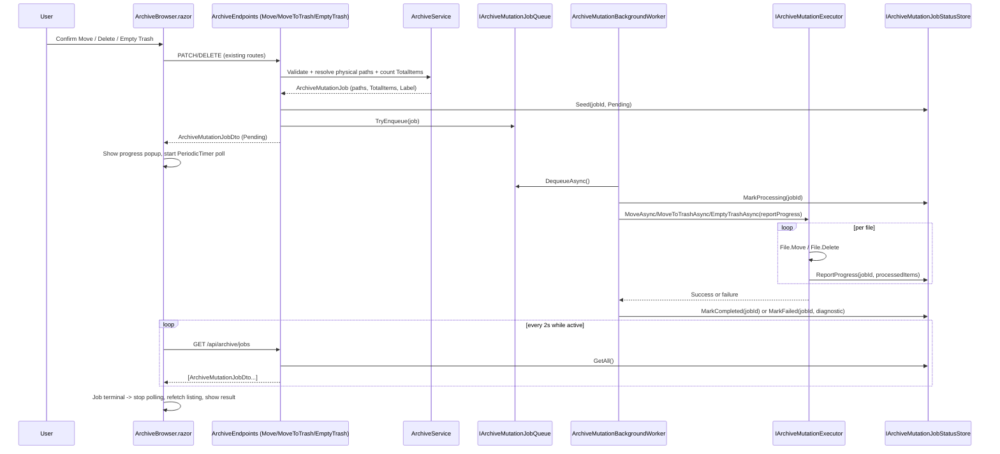

# Plan: Archive Move & Delete Progress

## Table of Contents

- [Plan: Archive Move & Delete Progress](#plan-archive-move--delete-progress)
  - [Summary](#summary)
  - [Technical Approach](#technical-approach)
  - [Component Breakdown](#component-breakdown)
  - [Dependencies](#dependencies)
  - [External / Vendor Documentation Evidence](#external--vendor-documentation-evidence)
  - [Flow](#flow)
  - [Risk Assessment](#risk-assessment)

## Summary

Move, soft-delete-to-trash, and permanent trash-emptying become background jobs that report file-count progress through a new in-memory job status store, following the same queue/worker/status-store shape already used by the video-composition pipeline; `ArchiveBrowser.razor` enqueues the job, then polls it and renders a Bootstrap progress popup instead of blocking on the raw HTTP call.

## Technical Approach

**Server side — new job pipeline, modeled on the Composition pipeline.** `ArchiveService.Move`/`MoveToTrash`/`EmptyTrash` (`WebApp/WebApp/Services/ArchiveService.cs:180-249`) currently do all validation *and* all filesystem I/O inline. This plan splits that: the existing validation logic (category/item/folder resolution, conflict/self-move checks in `Move`/`MoveToTrash`, the trash-only guard in `EmptyTrash`) stays exactly where it is and stays synchronous — it's cheap and must still fail fast with the existing `ArchiveConflictException`/`ArchiveForbiddenException`/`ArchiveValidationException` types. What moves out is only the actual `MovePhysical`/`Directory.Delete`/`File.Delete` work.

A new `IArchiveMutationJobQueue`/`ArchiveMutationJobQueue` (bounded `Channel<ArchiveMutationJob>`, one job at a time, `TryEnqueue`/`DequeueAsync`/`ActiveCount`) is added directly parallel to `ICompositionJobQueue`/`CompositionJobQueue.cs`. A new `IArchiveMutationJobStatusStore`/`ArchiveMutationJobStatusStore` (`ConcurrentDictionary<string, ArchiveMutationJobStatus>` + ordering queue, `Seed`/`MarkProcessing`/`ReportProgress`/`MarkCompleted`/`MarkFailed`/`GetAll`) is added directly parallel to `ICompositionJobStatusStore`/`CompositionJobStatusStore.cs`, with one addition beyond the Composition shape: a `ReportProgress(jobId, processedItems)` method, since this job type needs incremental counts rather than a single terminal transition. A new `ArchiveMutationBackgroundWorker : BackgroundService` drains the queue one job at a time, exactly like `CompositionBackgroundWorker`, and delegates the actual file I/O to a new `IArchiveMutationExecutor`/`ArchiveMutationExecutor`, the direct analogue of `ICompositionGenerator`/`FfmpegCompositionGenerator` — the one place that talks to the filesystem, so it stays independently testable with a fake.

`IArchiveMutationExecutor` exposes one method per job kind (`MoveAsync`, `MoveToTrashAsync`, `EmptyTrashAsync`), each taking the already-resolved physical source/destination paths (resolved before enqueue, inside `ArchiveService`, so the executor never re-derives opaque ids) and an `Action<int> reportProgress` callback, matching the existing `reportProgress` callback style already used by `VideoConversionBackgroundWorker`'s generator call. Internally:
- `EmptyTrashAsync` replaces the current single `Directory.Delete(path, recursive: true)` per top-level entry with a manual recursive walk (`Directory.EnumerateFileSystemEntries`, deepest-first) that calls `File.Delete`/`Directory.Delete(recursive: false)` per leaf and invokes `reportProgress` after each file, using the same `IOException`/`UnauthorizedAccessException` catch-and-wrap-as-`ArchiveConflictException`-equivalent-failure behavior EmptyTrash already has.
- `MoveAsync`/`MoveToTrashAsync` replace the single `Directory.Move`/`File.Move` call for folders with a manual walk that creates the mirrored destination directory structure, moves each file with `File.Move`, invokes `reportProgress` after each file, then removes the now-empty source subtree with `Directory.Delete(recursive: false)` bottom-up. Single files keep using one `File.Move` call (report `0/1` → `1/1`).

`ArchiveService` gains a small addition: `Move`/`MoveToTrash`/`EmptyTrash` keep their existing signatures for validation but now return an enqueued job descriptor (physical source/destination + a pre-computed `TotalItems` via a recursive `Directory.EnumerateFiles(..., EnumerationOptions { RecurseSubdirectories = true })` count, matching `ArchiveMetricsService.CountFiles()`'s existing counting pattern) instead of performing the move/delete themselves. `ArchiveEndpoints.Move`/`MoveToTrash`/`EmptyTrash` (`WebApp/WebApp/Endpoints/ArchiveEndpoints.cs:331-385`) call this, seed the job in the status store, enqueue it on `IArchiveMutationJobQueue`, and return a small `ArchiveMutationJobDto { JobId, Kind, State, TotalItems, ProcessedItems, Label }` instead of the full `ArchiveListingDto`. A new `GET /api/archive/jobs` endpoint (mirroring `GET /api/dashboard/jobs`, `WebApp/WebApp/Endpoints/DashboardEndpoints.cs:23`) returns `IArchiveMutationJobStatusStore.GetAll()` for client polling; it's added to the existing `MapArchiveEndpoints` group.

**Client side — enqueue-and-poll, modeled on `DashboardConversionJobsTab.razor`.** `ArchiveBrowser.razor`'s `MoveAsync`, `DeleteAsync`, and `EmptyTrashAsync` (`WebApp/WebApp.Client/Components/ArchiveBrowser.razor:1635-1653`) change from `SendMutationAsync(...)` (which awaits the whole operation) to a new `EnqueueMutationAsync(...)` that posts/patches/deletes as today but expects an `ArchiveMutationJobDto` back, stores it in a new `_activeJob` field, and starts a `PeriodicTimer`-based poll loop against `GET /api/archive/jobs/{jobId}` (2-second interval, same cadence and cancellation-token-on-dispose pattern as `DashboardConversionJobsTab.PollAsync`). A small new progress-popup markup block (Bootstrap `modal`/`progress`/`progress-bar`, following the same striped/animated classes and `role="progressbar"`/`aria-valuenow` attributes already used in `DashboardConversionJobsTab.razor`) renders `_activeJob`'s label, state, and `ProcessedItems`/`TotalItems` as both a fraction and a percent bar. On `Completed`/`Failed`, polling stops and the component re-fetches the listing via the same `GET /api/archive/{category}/items` call `SendMutationAsync` already issues on success, so the grid updates without a page reload.

This reuses the existing single-responsibility service layering (queue / status-store / background-worker / executor, each independently fakeable) and the existing minimal-API grouping and polling conventions instead of introducing a new architecture. No new runtime package, frontend library, or infrastructure is needed — everything is built from `System.Threading.Channels` (already a dependency via the Composition/Cut/Thumbnail queues) and the client's existing `PeriodicTimer`/`HttpClient` usage.

## Component Breakdown

**Existing files to modify:**

- `WebApp/WebApp/Services/ArchiveService.cs` — `Move`, `MoveToTrash`, `EmptyTrash` keep their validation logic but stop calling `MovePhysical`/`Directory.Delete`/`File.Delete` directly; instead they resolve physical source/destination paths, compute `TotalItems`, and return a job descriptor for the endpoint to enqueue. `MovePhysical` is removed from `ArchiveService` (its logic moves into `ArchiveMutationExecutor`) or kept only for any other synchronous caller if one exists after inspection.
- `WebApp/WebApp/Services/IArchiveService.cs` — update `Move`/`MoveToTrash`/`EmptyTrash` signatures to return the new job-descriptor type instead of `ArchiveListing`.
- `WebApp/WebApp/Endpoints/ArchiveEndpoints.cs` — `Move`, `MoveToTrash`, `EmptyTrash` handlers enqueue via `IArchiveMutationJobQueue`/seed `IArchiveMutationJobStatusStore` and return `ArchiveMutationJobDto` instead of `ArchiveListingDto`; add `MapGet("/api/archive/jobs", GetJobs)` to `MapArchiveEndpoints`.
- `WebApp/WebApp/Program.cs` — register `IArchiveMutationJobQueue`/`ArchiveMutationJobQueue`, `IArchiveMutationJobStatusStore`/`ArchiveMutationJobStatusStore`, `IArchiveMutationExecutor`/`ArchiveMutationExecutor`, and `ArchiveMutationBackgroundWorker` as a hosted service, following the existing Composition service registrations.
- `WebApp/WebApp/Services/ArchiveMetricsService.cs` — inject the new `IArchiveMutationJobQueue` and add its `ActiveCount` to `DashboardArchiveDto` alongside the existing `thumbnailJobQueue`/`cutJobQueue`/`compositionJobQueue` counts, matching the existing pattern for every other job queue already surfaced there.
- `WebApp.Client/Models/DashboardArchiveDto.cs` (or wherever that record is currently defined) — add the new active-mutation-job count field consistent with the others already present.
- `WebApp/WebApp.Client/Components/ArchiveBrowser.razor` — `MoveAsync`/`DeleteAsync`/`EmptyTrashAsync` switch from `SendMutationAsync` to the new enqueue-and-poll flow; add `_activeJob` field, `PeriodicTimer` polling (mirroring `DashboardConversionJobsTab.PollAsync`), and the progress-popup markup block plus its dismiss handler; implement `IAsyncDisposable`-style cleanup of the polling `CancellationTokenSource` if the component doesn't already dispose one.
- `README.md` — add/adjust the relevant row in `## Current Supported Features` to reflect progress reporting for large move/delete operations, per `AGENTS.md`'s standing instruction to keep that table current with every spec that changes user-facing behavior.

**New files to create:**

- `WebApp/WebApp/Services/IArchiveMutationJobQueue.cs` / `ArchiveMutationJobQueue.cs` — bounded-channel job queue, parallel to `ICompositionJobQueue`/`CompositionJobQueue.cs`.
- `WebApp/WebApp/Services/IArchiveMutationJobStatusStore.cs` / `ArchiveMutationJobStatusStore.cs` — in-memory job status store with `ReportProgress`, parallel to `ICompositionJobStatusStore`/`CompositionJobStatusStore.cs`.
- `WebApp/WebApp/Services/IArchiveMutationExecutor.cs` / `ArchiveMutationExecutor.cs` — the file-I/O implementation (`MoveAsync`/`MoveToTrashAsync`/`EmptyTrashAsync`) that performs the actual walk-and-move/walk-and-delete with progress callbacks.
- `WebApp/WebApp/Services/ArchiveMutationBackgroundWorker.cs` — `BackgroundService` draining `IArchiveMutationJobQueue` one job at a time, parallel to `CompositionBackgroundWorker.cs`.
- `WebApp/WebApp/Models/ArchiveMutationJob.cs` — internal job record (job id, kind, resolved physical source/destination paths, label) queued between the endpoint and the worker; stays server-only (never serialized to the browser).
- `WebApp.Client/Models/ArchiveMutationJobDto.cs` — browser-facing DTO (`JobId`, `Kind`, `State`, `Label`, `TotalItems`, `ProcessedItems`, `Diagnostic`), the only shape sent over `GET /api/archive/jobs` and returned by the enqueue endpoints.
- `WebApp.Tests/Services/ArchiveMutationExecutorTests.cs` (or similar, matching existing test file naming under `WebApp.Tests/Services/`) — unit tests for the walk-and-move/walk-and-delete logic against a temp directory.
- `WebApp.Tests/Endpoints/ArchiveMutationJobEndpointsTests.cs` — `WebApplicationFactory`-based tests for the new enqueue/poll endpoint shapes, matching the existing endpoint test conventions under `WebApp.Tests/Endpoints/`.

## Dependencies

- No new runtime packages: `System.Threading.Channels` is already used by `CompositionJobQueue`/`CutJobQueue`/`ThumbnailJobQueue`.
- Requires the same read-write access to the archive root (`ArchiveRootOptions.Path`) already granted to `ArchiveService`; no new bind mount or configuration option.
- Depends on `Make docker-run`/`make test`'s existing Docker Compose workflow for build/run/test — no new execution environment.

## External / Vendor Documentation Evidence

Not applicable. This feature is an internal background-job/queue restructuring using patterns (`System.Threading.Channels`, `BackgroundService`, `ConcurrentDictionary`-backed status stores) already adopted and verified elsewhere in this codebase (Composition/Cut/Thumbnail pipelines); no new vendor-documented API surface is introduced. `Directory.Move`/`Directory.Delete`/`File.Move`/`File.Delete` are the same BCL APIs `ArchiveService` already uses today.

## Flow

## Risk Assessment

| Risk | Evidence | Mitigation |
| --- | --- | --- |
| Manual file-by-file move/delete is slower per-item than a single opaque `Directory.Move`/`Directory.Delete(recursive:true)` call, since it now does one syscall per file plus a progress-store write. | `ArchiveService.MovePhysical`/`EmptyTrash` currently make a single bulk call per top-level entry (`ArchiveService.cs:944-951, 232-249`). | Batch `ReportProgress` calls (e.g. every N files or every ~200ms) instead of after every single file, and accept the small per-file overhead as the direct tradeoff for visible progress — this is the same tradeoff the existing Composition/Conversion pipelines already accept for progress reporting. |
| Cross-filesystem `Directory.Move`/`File.Move` can throw `IOException` (`EXDEV`) instead of transparently falling back to copy+delete, which the current single-call implementation already relies on implicitly. | `MovePhysical` (`ArchiveService.cs:944-951`) calls `Directory.Move`/`File.Move` with no explicit cross-device fallback. | The manual per-file walk in `ArchiveMutationExecutor` already performs an explicit copy-then-delete per file rather than relying on `Directory.Move`'s internal rename, so this actually removes the existing cross-device risk rather than adding one; document this behavior change explicitly in code comments/tests. |
| A move/delete job that fails partway leaves a partially-moved/partially-deleted tree, which is already true today but is now more visible since progress makes "how far did it get" observable. | FR13 in `Requirements.md` explicitly accepts no-rollback, matching today's implicit behavior. | Surface the partial state honestly in the failure diagnostic and re-fetch the listing on failure so the UI shows the true partial result rather than hiding it. |
| Adding a new job queue/worker/status-store increases the number of background services registered in `Program.cs`, and a bug in the new worker could silently stop draining the queue, wedging all future moves/deletes. | Mirrors the existing Composition/Cut/Thumbnail worker registration pattern, which has the same class of risk today. | Follow the exact same `BackgroundService` lifecycle and exception-handling (`try`/`finally` marking terminal status) already used by `CompositionBackgroundWorker`, and cover it with a unit test that asserts the queue keeps draining after one job fails. |
