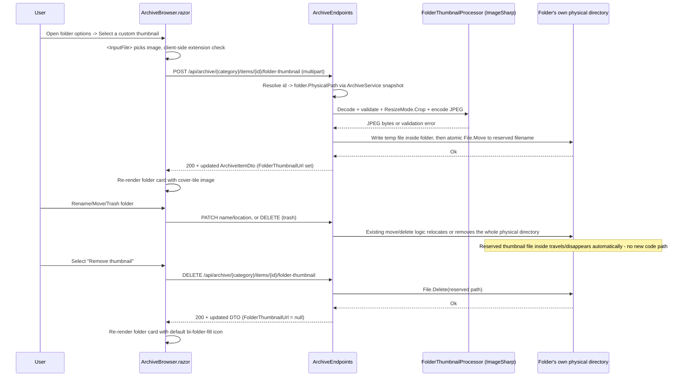

# Plan: Archive Folder Custom Thumbnails

## Table of Contents

- [Plan: Archive Folder Custom Thumbnails](#plan-archive-folder-custom-thumbnails)
  - [Summary](#summary)
  - [Technical Approach](#technical-approach)
  - [Component Breakdown](#component-breakdown)
  - [Dependencies](#dependencies)
  - [External / Vendor Documentation Evidence](#external--vendor-documentation-evidence)
  - [Flow](#flow)
  - [Risk Assessment](#risk-assessment)

## Summary

Store an uploaded folder thumbnail as a single reserved-name JPEG file written directly inside the target folder's own physical directory (not in a separate cache store), so it travels with the folder for free on rename/move/trash. Add a small `IFolderThumbnailStore` service, an `IFolderThumbnailProcessor` (ImageSharp crop-to-fill + JPEG encode), a single-shot `IFormFile` upload endpoint, and client changes so `ArchiveBrowser.razor` shows the image (or the existing folder icon) and exposes "Select a custom thumbnail" / "Remove thumbnail" from the existing per-item options panel.

## Technical Approach

This is deliberately simpler than a cache/metadata-store design, because the codebase already has a working precedent for "an image file that lives physically inside a folder and decorates that folder": `ArchiveService.FindAlbumCover` (`ArchiveService.cs:808-857`) scans a music folder's own files for the first image and attaches it as the folder's album cover, entirely by re-checking the filesystem on each listing — no separate index, no rename/move propagation code, because the image is just another file that already moves with the folder. Folder thumbnails follow the same idea, but with one important difference: the file must be a single reserved name the app controls (not "the first image alphabetically"), and it must be **excluded** from the folder's own browsable listing rather than shown as an ordinary child item.

1. **Reserved-file storage, not a cache/metadata store.** A new server-only constant, `FolderThumbnailFileName = ".pereneFolderThumbnail.jpg"`, is checked for directly inside `folder.PhysicalPath` wherever a folder's thumbnail state is needed. There is no JSON index and no separate `/previews` cache subfolder — the single source of truth is "does this file exist inside this folder." This eliminates the folder-ID-instability problem entirely: the file is never keyed by the folder's opaque ID or relative path, only by "which physical directory is this folder right now," so `ArchiveService.Rename`, `ArchiveMutationExecutor.MoveAsync`/`BatchMoveAsync`/`MoveToTrashAsync`/`EmptyTrashAsync` need **zero new code** — they already move/delete the whole physical directory, and the reserved file inside it comes along automatically. This must still be covered by an integration test (FR10) to confirm no code path enumerates and selectively copies folder contents in a way that would drop it.
2. **Listing exclusion.** `ArchiveService.BuildListing` (`ArchiveService.cs:537-614`) and any other folder-content enumeration (the recursive scans at `ArchiveService.cs:657`, `:729`, `:1000`, and the trash/size-calculation paths) skip any entry whose filename equals the reserved constant, the same way they already skip reparse points (`(attributes & FileAttributes.ReparsePoint) != 0` checks at `:560`, `:662`, `:686`, `:766`, `:823`). This keeps the file fully invisible as a regular archive item while still letting the OS move/copy/delete it as part of its parent folder.
3. **Image processing — crop-to-fill, not pad.** `IFolderThumbnailProcessor` (ImageSharp) decodes the upload, validates it is a real raster image, and resizes with `ResizeMode.Crop` (centered) to a fixed target size, 640×360, defined as a named constant (matching the existing video-thumbnail convention, not a configurable option) — this fills the entire target box and crops any excess rather than letterboxing, matching the "fit the image to the space, cutting if necessary" requirement and the same visual effect the UI already gets from `object-fit-cover` on the cover-tile ``. Output is always re-encoded to JPEG regardless of the source format, so the reserved filename's `.jpg` extension is always accurate.
4. **Upload endpoint — synchronous, no queue.** Mirrors the audio-track remux precedent (`Specs/20260921154725-video-multi-audio-track-selection/Plan.md`): a single small image, fast to resize, user-initiated and short-lived, so it is handled synchronously inside the minimal-API handler. The upload is capped at a fixed constant, 10 MB (not a configurable option), checked before any decode work is attempted. A `ConcurrentDictionary<string, SemaphoreSlim>` keyed by the folder's resolved physical path prevents two concurrent uploads for the same folder from writing over each other; the actual write is temp-file-inside-the-folder-then-atomic-`File.Move` to the reserved filename, matching `ThumbnailCache`'s atomic-publish pattern.
5. **DTO/client wiring.** `ArchiveItemDto` gains `string? FolderThumbnailUrl`. `ArchiveEndpoints.ToDto`/`ToDtoAsync` (`ArchiveEndpoints.cs:1289`, `:1345`) set it, only for folder items, by checking `File.Exists` on the reserved path inside `item`'s physical folder and building the opaque `.../folder-thumbnail` URL when present. `ArchiveBrowser.razor` inserts a new conditional branch before the generic folder-icon `else` (currently `:483-490`), reusing the existing `archive-cover-tile ratio ratio-1x1` + `object-fit-cover` `` markup already proven for the image-item case (`:403-424`), keeping the folder-name `` (`:494`) exactly as-is below the tile. The options panel (`:320-376`) gains "Select a custom thumbnail" (hidden `<InputFile accept=".png,.jpg,.jpeg,.gif,.webp,.avif,.bmp,.ico">`, following the `StartXFromActions(item)` → `CloseActions()` handler convention already used for Rename/Move/Download) and, only when `item.FolderThumbnailUrl is not null`, "Remove thumbnail" (calls the new `DELETE` endpoint).

## Component Breakdown

**Existing files to modify:**

- `WebApp/WebApp/Services/ArchiveService.cs` — add the reserved-filename constant; exclude it from `BuildListing` and every other folder-content enumeration listed above; add a helper (e.g. `TryGetFolderThumbnailPath(ArchiveItemEntry folder)`) used by the endpoints below.
- `WebApp/WebApp/Endpoints/ArchiveEndpoints.cs` — add `POST /api/archive/{category}/items/{id}/folder-thumbnail` (multipart upload), `DELETE /api/archive/{category}/items/{id}/folder-thumbnail` (remove), and `GET /api/archive/{category}/items/{id}/folder-thumbnail` (serve bytes); populate `FolderThumbnailUrl` in `ToDto`/`ToDtoAsync`.
- `WebApp/WebApp/Program.cs` — register `IFolderThumbnailProcessor`/`FolderThumbnailProcessor` as a singleton.
- `WebApp.Client/Models/ArchiveItemDto.cs` — add `string? FolderThumbnailUrl = null`.
- `WebApp/WebApp.Client/Components/ArchiveBrowser.razor` — folder cover-tile rendering branch, options-panel buttons, `<InputFile>` wiring, upload/remove handlers, inline validation-error display.
- `README.md` — add/adjust a row in `## Current Supported Features` for folder custom thumbnails.

**New files to create:**

- `WebApp/WebApp/Services/IFolderThumbnailProcessor.cs` / `FolderThumbnailProcessor.cs` — thin ImageSharp wrapper: decode, validate is a real raster image, `ResizeMode.Crop` to the configured fixed size, encode to JPEG bytes. Kept separate from the endpoint/`ArchiveService` so it can be unit-tested with real small fixture images without touching the filesystem beyond in-memory streams.
- `WebApp.Client/Models/FolderThumbnailUploadResult.cs` (or reuse an existing generic error-response DTO if one exists) — client-facing validation error shape for FR3.

## Dependencies

- `SixLabors.ImageSharp` (already referenced in `WebApp/WebApp/WebApp.csproj` at 3.1.12) — no new package.
- No new bind mount, Compose volume, cache directory, or background worker — the feature only ever writes inside folders that already exist under the existing read-write archive category roots.

## External / Vendor Documentation Evidence

- Minimal-API single-file upload via `IFormFile` is documented ASP.NET Core guidance (Microsoft Learn: "Upload files in ASP.NET Core", `aspnet/core/mvc/models/file-uploads`). **Verified** via `microsoft_docs_search` before implementation: (a) since ASP.NET Core 8.0, minimal-API endpoints binding `IFormFile`/`IFormFileCollection` require antiforgery validation unless explicitly opted out, so `POST /api/archive/{category}/items/{id}/folder-thumbnail` calls `.DisableAntiforgery()`, matching the existing chunked-upload `AppendUploadChunkAsync` endpoint's `.DisableAntiforgery()` at `ArchiveEndpoints.cs:49`; (b) Kestrel's default `MaxRequestBodySize` (~28.6 MB, unchanged by this feature) already bounds the request above the feature's 10 MB constant, and `IHttpMaxRequestBodySizeFeature` is the documented mechanism to adjust that limit per-request — this feature keeps the default Kestrel ceiling and enforces the 10 MB cap as an explicit application-level check on `IFormFile.Length` before any decode work, matching the documented "Size validation" guidance.
- `SixLabors.ImageSharp` is a third-party (not Microsoft) library already adopted by this repo elsewhere; its `ResizeMode.Crop` resize/decode API usage does not require Microsoft Learn verification.

## Flow

## Risk Assessment

| Risk | Evidence | Mitigation |
| --- | --- | --- |
| Reserved filename accidentally matches a real user file already inside a folder, or a folder-enumeration code path forgets to exclude it and it leaks into a listing | Multiple enumeration sites exist in `ArchiveService.cs` (`:548`, `:657`, `:729`, `:817`, `:1000`) | Use a distinctive dot-prefixed reserved name unlikely to collide; add the exclusion check as a single shared helper called from every enumeration site (not duplicated ad hoc), and cover with a listing test that asserts the file never appears as a child item |
| First `IFormFile`/multipart upload endpoint in a codebase whose only prior upload path is a custom chunked scheme; risk of missing size-limit enforcement at the Kestrel/middleware layer | `grep -rn "IFormFile"` returns no existing usage; existing chunked uploads enforce size via `ArchiveUploadService` application logic | Verify current ASP.NET Core `IFormFile` + request-size-limit guidance via Microsoft Learn MCP before implementation; enforce both a Kestrel-level cap and an application-level check |
| Concurrent uploads/removals for the same folder racing to write/delete the same reserved file | No existing precedent for concurrent writes to a single file inside an archive folder | Per-folder-path `SemaphoreSlim` dedup plus temp-file-then-atomic-move publish, mirroring `ThumbnailCache`'s existing atomic-publish pattern |
| Writing into a folder assumed to be read-write; if a future category root is mounted read-only, uploads would fail | Today's archive category roots are all read-write (uploads/moves/`ComicProgressService` already write into them) | Surface a clear 4xx (not a 500) if the write fails due to filesystem permissions, and document this as a hard requirement of the feature (archive roots must remain writable) rather than silently degrading |
| A folder move/trash implementation elsewhere selectively copies known extensions instead of the whole directory, which would silently drop the reserved thumbnail file | Not currently the case (`ArchiveMutationExecutor` moves whole items), but worth confirming rather than assuming (per FR10) | Add the integration test in `Validation.md` that uploads a thumbnail, then renames/moves/trashes the folder, and asserts the thumbnail is still resolvable afterward |
