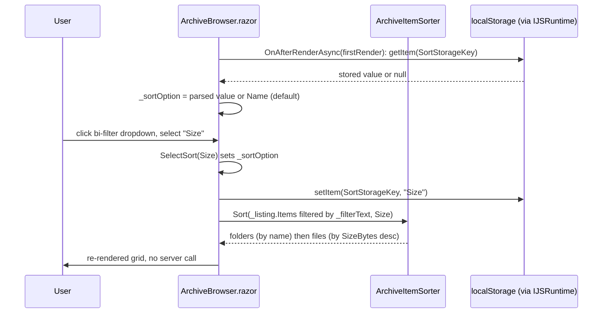

# Plan: Archive Browser Sort Filter

## Table of Contents

- [Archive Browser Sort Filter](#plan-archive-browser-sort-filter)
  - [Summary](#summary)
  - [Technical Approach](#technical-approach)
  - [Component Breakdown](#component-breakdown)
  - [Dependencies](#dependencies)
  - [External / Vendor Documentation Evidence](#external--vendor-documentation-evidence)
  - [Flow](#flow)
  - [Risk Assessment](#risk-assessment)

## Summary

Add a `bi-filter` icon dropdown next to the existing name filter in `ArchiveBrowser.razor` that lets the user pick Name (A-Z)/Name (Z-A)/Size/Date, backed by a new pure `ArchiveItemSorter` helper in `WebApp.Client/Models` and a `localStorage`-persisted `ArchiveSortOption` enum, composed with the existing `_filteredItems` name-filter pipeline.

## Technical Approach

**Sorting logic ownership.** Today `_filteredItems` (`ArchiveBrowser.razor:843-846`) is a computed property that only filters `_listing.Items` by name. This plan keeps that property as the single source of truth for "what's currently visible" but adds a sort pass after the filter pass, delegated to a new static, pure class `ArchiveItemSorter` in `WebApp/WebApp.Client/Models/ArchiveItemSorter.cs`. This follows the same convention as `WebApp/WebApp.Client/Models/VideoFrameState.cs` and `FillTabState.cs` — small, dependency-free classes that own one piece of view logic and are unit-tested directly, instead of embedding LINQ chains and folder-grouping conditionals inline in the `.razor` file where they can't be tested without a rendered component. `ArchiveItemSorter.Sort(IEnumerable<ArchiveItemDto> items, ArchiveSortOption option)` returns a new ordered list: it always partitions folders before files (`OrderBy(i => i.Kind == ArchiveItemKind.File)`, matching the existing server convention at `WebApp/WebApp/Services/ArchiveService.cs:638`), sorts folders by name within their group, and sorts files within their group by the requested key (`Name` ascending / `SizeBytes` descending treating `null` as `0` / `LastWriteTimeUtc` descending).

**New enum.** `ArchiveSortOption` (`Name`, `NameDescending`, `Size`, `Date`) lives in `WebApp/WebApp.Client/Models/ArchiveSortOption.cs`, following the existing pattern of small standalone enums in that folder (e.g. `ArchiveItemKind.cs`, `ArchiveMutationJobState.cs`).

**Component wiring.** `ArchiveBrowser.razor` gets a new private field `_sortOption` (defaulting to `ArchiveSortOption.Name`) and changes `_filteredItems` to pipe its existing filtered result through `ArchiveItemSorter.Sort(..., _sortOption)`. The dropdown itself reuses the exact Bootstrap markup pattern already present for the "Create" `+` button (`ArchiveBrowser.razor:58-103`): a `div.dropdown` containing a `button` with `data-bs-toggle="dropdown"` and a `ul.dropdown-menu` of three `button.dropdown-item` entries, one per `ArchiveSortOption` (labeled "Name (A-Z)", "Name (Z-A)", "Size", "Date"). The active option gets `aria-pressed="true"`/a checkmark icon (e.g. `bi-check2`) for FR3, following the same `active`/pressed-state convention used elsewhere in the design system (`AGENTS.md` "Design System" section: icon-only controls need a programmatic toggle state). Selecting an item calls `SelectSort(ArchiveSortOption option)`, which sets `_sortOption`, calls `StateHasChanged()` implicitly via the event handler, and fires-and-forgets a persistence call — it does not call `LoadAsync`, so no server round-trip happens (FR10).

**Persistence.** `OnAfterRenderAsync(firstRender)` (`ArchiveBrowser.razor:877-905`) already does best-effort JS interop with try/catch fallbacks for two independent modules; this plan adds a third best-effort block there that reads the stored sort option via `JS.InvokeAsync<string?>("localStorage.getItem", SortStorageKey)`, parses it with `Enum.TryParse`, and assigns `_sortOption` if valid (falling back silently to `Name` otherwise, matching `theme.js`'s `readStoredTheme` fallback pattern). `SelectSort` writes back with `JS.InvokeAsync<object>("localStorage.setItem", SortStorageKey, option.ToString())` inside a try/catch, mirroring `theme.js`'s `setTheme` try/catch around `localStorage.setItem`. No new `.js` file is added — direct `IJSRuntime` calls to the browser's built-in `localStorage.getItem`/`setItem` are used, since Blazor's JS interop can invoke global JS functions/objects by dotted path without a custom module, keeping new JavaScript at zero for this feature per the "Custom JavaScript is kept minimal" convention in `AGENTS.md`.

**Design system compliance.** The new dropdown button reuses the same `btn btn-secondary rounded-circle` 44×44 icon-button styling already used for Upload/Upload-folder in the same header (`ArchiveBrowser.razor:104-119`), with `aria-label="Sort"` and a Bootstrap tooltip attribute (`data-bs-toggle="tooltip"` companion, or `title` at minimum, consistent with existing icon-only buttons in this file) — no new CSS is required since Bootstrap's `dropdown-menu`/`dropdown-item`/`btn-secondary` utilities fully express this pattern, matching the "no custom CSS when Bootstrap utilities suffice" rule.

## Component Breakdown

**Existing files to modify:**

- `WebApp/WebApp.Client/Components/ArchiveBrowser.razor` — add the `bi-filter` dropdown markup in the `card-header` next to `FolderSearchBar` (around lines 49-55), add `_sortOption` field, `SelectSort` handler, `SortStorageKey` constant, update `_filteredItems` to sort via `ArchiveItemSorter`, and add the best-effort `localStorage` read in `OnAfterRenderAsync`.

**New files to create:**

- `WebApp/WebApp.Client/Models/ArchiveSortOption.cs` — `public enum ArchiveSortOption { Name, NameDescending, Size, Date }`.
- `WebApp/WebApp.Client/Models/ArchiveItemSorter.cs` — pure static `Sort(IEnumerable<ArchiveItemDto>, ArchiveSortOption)` returning `IReadOnlyList<ArchiveItemDto>`, implementing the folder-first-then-key ordering described above.
- `WebApp.Tests/Client/ArchiveItemSorterTests.cs` — xUnit tests for the new sorter, following the existing `WebApp.Tests/Client/VideoFrameStateTests.cs` / `ArchiveUploadStateTests.cs` style (construct `ArchiveItemDto` fixtures directly, assert output ordering).

## Dependencies

- No new runtime packages, JS libraries, or server endpoints. Relies on the browser's built-in `localStorage` (already relied upon by `theme.js`) and the already-shipped `ArchiveItemDto.SizeBytes`/`LastWriteTimeUtc`/`Kind` fields.

## External / Vendor Documentation Evidence

Not applicable — this feature is pure Blazor component/state logic plus standard Bootstrap dropdown markup already established elsewhere in this file; it introduces no new ASP.NET Core, Blazor render-mode, or Bootstrap component pattern beyond what `ArchiveBrowser.razor:58-103` already uses. `IJSRuntime.InvokeAsync` calling a global JS function by name (`localStorage.getItem`/`setItem`) is the same interop mechanism already exercised throughout this codebase (e.g. `JS.InvokeAsync<IJSObjectReference>("import", ...)` in `ArchiveBrowser.razor:886`), so no additional Microsoft Learn verification is needed for this decision.

## Flow

## Risk Assessment

| Risk | Evidence | Mitigation |
| --- | --- | --- |
| `localStorage` unavailable (private browsing, blocked storage) breaks first render | `theme.js` already handles this with try/catch around both `getItem`/`setItem` | Wrap the new `IJSRuntime` calls in try/catch in `ArchiveBrowser.razor`, exactly like the existing `_bootstrapModule`/`_uploadInteropModule` best-effort blocks in `OnAfterRenderAsync` (`ArchiveBrowser.razor:884-904`); default to `ArchiveSortOption.Name` on any failure. |
| Sorting logic duplicated/diverges from server folder-first convention | Server orders folders first via `item.Kind == ArchiveItemKind.File` at `ArchiveService.cs:638` | `ArchiveItemSorter` reuses the identical `Kind == ArchiveItemKind.File` boolean-partition idiom, verified by a dedicated unit test asserting folders never trail files regardless of chosen option. |
| Re-sorting on every render recomputes `_filteredItems` from scratch (LINQ over the full list) on each keystroke/selection | `_filteredItems` is already a computed property recalculated per access today (`ArchiveBrowser.razor:843-846`) | No behavior change in cost profile — folder listings in this app are local-disk directory listings, already bounded by what a NAS folder realistically holds; no pagination exists today for name-filtering either, so this introduces no new performance class. |
