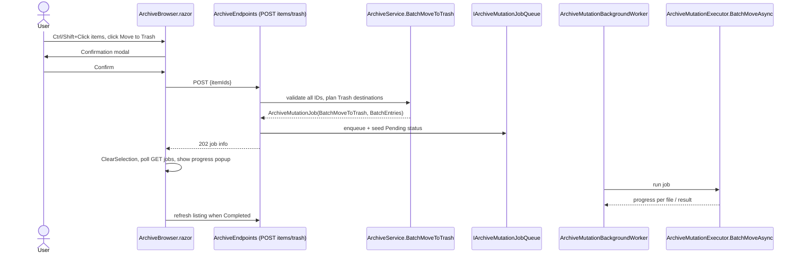

# Plan: Archive Multi-Select Move to Trash

## Table of Contents

- [Plan: Archive Multi-Select Move to Trash](#plan-archive-multi-select-move-to-trash)
  - [Summary](#summary)
  - [Technical Approach](#technical-approach)
  - [Component Breakdown](#component-breakdown)
  - [Dependencies](#dependencies)
  - [External / Vendor Documentation Evidence](#external--vendor-documentation-evidence)
  - [Flow](#flow)
  - [Risk Assessment](#risk-assessment)

## Summary

Add a batch "Move to Trash" action to the existing multi-select toolbar by extending the `BatchMove` pattern from `Specs/20260922132005-archive-multi-select-move/`: validate all items in `ArchiveService`, enqueue one `ArchiveMutationJob` with `BatchEntries`, and reuse the executor's file-by-file batch path and the shared progress popup.

## Technical Approach

- **Service (validation/planning):** `ArchiveService.BatchMoveToTrash` mirrors `BatchMove` (`ArchiveService.cs:193`) and `MoveToTrash` (`:251`): forbid the `trash` category, resolve each ID with `ResolveItem`, call `EnsureNotCategoryRoot`, compute `GetUniqueTrashPath(trashRoot, item.Name)` and create an `ArchiveMutationBatchEntry` with `CountFiles` for folders. All validation completes before the job is returned, so the request is all-or-nothing up front.
- **Unique destinations:** selected items come from a single folder listing so their names are distinct; `GetUniqueTrashPath` already checks the filesystem, and the plan additionally tracks destinations chosen in the current batch so two entries can never pick the same fallback path.
- **Executor:** reuse `ArchiveMutationExecutor.BatchMoveAsync` unchanged for filesystem work. Its failure diagnostic currently reads "The batch move stopped…"; make the wording kind-aware via `job.Kind` (or a small helper) so a trash batch says "The batch move to Trash stopped after moving X of Y item(s)…No rollback was performed." The worker's switch (`ArchiveMutationBackgroundWorker.cs:35-40`) routes `BatchMoveToTrash` to `BatchMoveAsync`, so `IArchiveMutationExecutor` gains no new method.
- **Endpoint:** `POST /api/archive/{category}/items/trash` in `ArchiveEndpoints.MapArchiveEndpoints` next to `BatchMove` (`:58`), using the existing `EnqueueMutation` helper so error mapping and job status seeding are shared. A `POST` (with body) is used instead of `DELETE` with a body, matching the request-body style of `BatchMove`.
- **Client:** `ArchiveBrowser.razor` adds the toolbar button, a `_confirmingBatchTrash` flag, a confirmation modal cloned from the Empty Trash modal pattern, `StartBatchTrash`/`BatchTrashAsync` methods (`BatchTrashAsync` uses `EnqueueMutationAsync` and then `ClearSelection`/`CancelDialogs`, exactly like `BatchMoveAsync`), and a `BatchMoveToTrash` arm in `JobActionLabel`. `CancelDialogs`/`StartMove`/`StartBatchMove` reset the new flag so dialogs stay mutually exclusive.
- **Models:** `ArchiveMutationKind.BatchMoveToTrash` (client models, enum appended so existing values keep their numbering) and `BatchMoveToTrashArchiveItemsRequest` in `WebApp.Client/Models/`, following `BatchMoveArchiveItemsRequest`.
- **Design-system compliance:** Bootstrap `btn-outline-danger`, `bi-trash3`, and modal markup only; Move remains the gold `btn-primary` principal action, the destructive action is de-emphasized outline and confirmed by a modal. No custom CSS/JS.
- **Testability:** validation is covered by `ArchiveServiceTests` on real temp directories; executor behavior by `ArchiveMutationExecutorTests`; the endpoint by `ArchiveEndpointsTests` via `WebApplicationFactory`.

## Component Breakdown

**Existing files to modify:**

- `WebApp/WebApp.Client/Models/ArchiveMutationKind.cs` — add `BatchMoveToTrash`.
- `WebApp/WebApp/Services/IArchiveService.cs` — declare `BatchMoveToTrash(string categoryKey, IReadOnlyList<string> itemIds)`.
- `WebApp/WebApp/Services/ArchiveService.cs` — implement it (after `MoveToTrash`).
- `WebApp/WebApp/Services/ArchiveMutationBackgroundWorker.cs` — route `BatchMoveToTrash` to `BatchMoveAsync`.
- `WebApp/WebApp/Services/ArchiveMutationExecutor.cs` — kind-aware failure message in `BatchMoveAsync`.
- `WebApp/WebApp/Models/ArchiveMutationJob.cs` — update the doc comment to list the new kind.
- `WebApp/WebApp/Endpoints/ArchiveEndpoints.cs` — map and implement `POST /api/archive/{category}/items/trash`.
- `WebApp/WebApp.Client/Components/ArchiveBrowser.razor` — toolbar button, confirm modal, handlers, job label.
- `WebApp.Tests/Services/ArchiveServiceTests.cs`, `WebApp.Tests/Services/ArchiveMutationExecutorTests.cs`, `WebApp.Tests/Endpoints/ArchiveEndpointsTests.cs` — new tests.
- `README.md` — update the `Archive management` row.
- `AGENTS.md` — only if the `/init-agent` follow-up judges the architecture summary changed.

**New files to create:**

- `WebApp/WebApp.Client/Models/BatchMoveToTrashArchiveItemsRequest.cs` — request DTO.

## Dependencies

- Existing Trash category mount and the archive mutation queue/status store (`IArchiveMutationJobQueue`, `IArchiveMutationJobStatusStore`); no new configuration or environment variables.

## External / Vendor Documentation Evidence

Not applicable: the design reuses established in-repo patterns (minimal API endpoint, Blazor component state, Bootstrap modal). No new vendor-specific API or behavior is introduced.

## Flow

## Risk Assessment

| Risk | Evidence | Mitigation |
| --- | --- | --- |
| Accidental bulk trashing | Toolbar sits next to Move; single Delete has no confirm | Confirmation modal (FR4) and outline-danger styling; items remain recoverable in Trash. |
| Destination name collisions inside one batch | `GetUniqueTrashPath` only checks the filesystem, and nothing exists yet for earlier batch entries | Track chosen destinations per batch and retry until unique (FR7); covered by a unit test. |
| Partial failure leaves a mixed state | `BatchMoveAsync` has no rollback | Up-front validation of every item; explicit diagnostic (FR10), same policy as batch Move. |
| Trash-category misuse | `MoveToTrash` already forbids Trash items | Server enforces `ArchiveForbiddenException` (FR6) in addition to the hidden button (FR2). |
| Enum renumbering breaking clients | `ArchiveMutationKind` is shared client/server | Append the new value at the end. |
