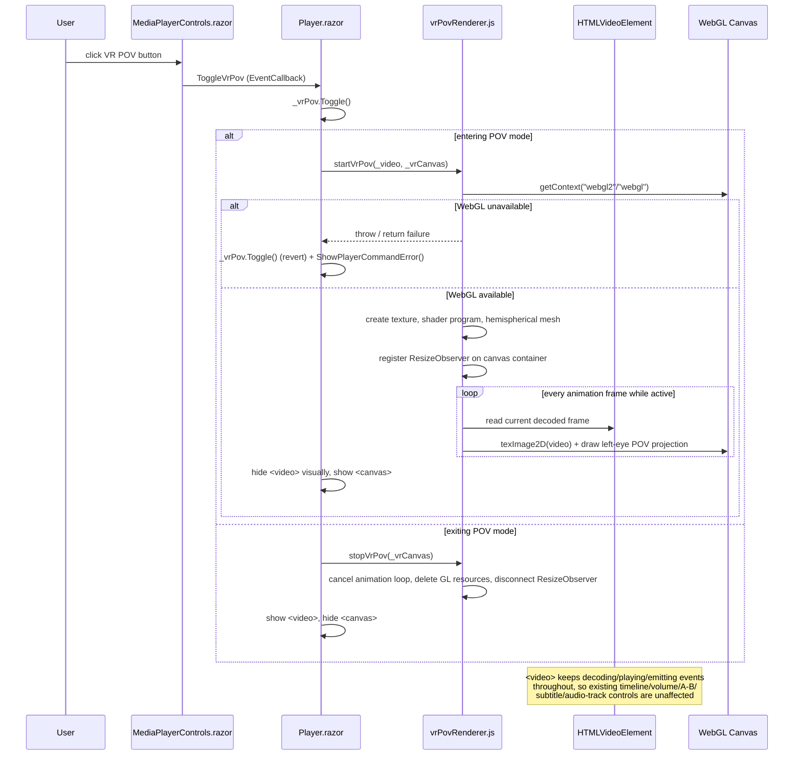

# Plan: VR POV Player Mode

## Table of Contents

- [Plan: VR POV Player Mode](#plan-vr-pov-player-mode)
  - [Summary](#summary)
  - [Technical Approach](#technical-approach)
  - [Component Breakdown](#component-breakdown)
  - [Dependencies](#dependencies)
  - [External / Vendor Documentation Evidence](#external--vendor-documentation-evidence)
  - [Flow](#flow)
  - [Risk Assessment](#risk-assessment)

## Summary

Add a manual VR POV toggle to `Player.razor`/`MediaPlayerControls.razor` that, when enabled, hands the existing `<video>` element to a new raw-WebGL JS module which renders the left half of each decoded frame onto a fixed-forward-camera 180-degree curved surface in a `<canvas>`, following the same "Blazor owns state, JS module owns the browser-native rendering loop" split already used for `videoEditor.js`.

## Technical Approach

**Architecture pattern being extended**: this repo already separates concerns exactly along the lines the feature needs. `WebApp.Client` owns Razor components/state (`VideoFrameState`, `FillTabState`, `MediaPlayerState`), and thin, focused JS modules (`videoEditor.js`, `theme.js`, `bootstrapInterop.js`) own browser-native operations Blazor can't do itself (pointer capture, element geometry, Bootstrap tooltip/fullscreen lifecycle) without owning application rules (`AGENTS.md` → Coding Conventions). VR POV rendering is squarely "browser-native operation Blazor can't do itself" (WebGL is not exposed to C# without JS), so it gets its own new JS module, `wwwroot/js/vrPovRenderer.js`, imported and invoked exactly the way `Player.razor.OnAfterRenderAsync` already imports `videoEditor.js` (`await JS.InvokeAsync<IJSObjectReference>("import", "./js/vrPovRenderer.js")`) and calls it via `IJSObjectReference.InvokeVoidAsync`/`InvokeAsync`, the same `_module` pattern already used for `measureAndCapture`, `setVolume`, `enterFillTab`, etc.

**Why a new module instead of extending `videoEditor.js`**: `videoEditor.js` currently owns pointer/drag/fullscreen/fill-tab DOM lifecycle for the flat video, none of which overlaps with WebGL context/shader/texture/animation-loop management. Keeping VR POV in its own module keeps each file focused on one browser-native concern (`AGENTS.client` conventions: "Custom JavaScript is kept minimal and isolated to what Blazor can't do natively... no framing, playback, or application state belongs in JS") and makes the render loop's lifecycle (start/stop/resize/dispose) easy to reason about and to fully tear down independently of the rest of the player.

**State ownership**: a new small C# state holder, `VrPovState` (in `WebApp.Client/Models/` next to `FillTabState`/`MediaPlayerState`, following the same "tiny state class with `Select`/`Enter`/`Exit`-style methods" pattern already used by `FillTabState`), tracks only `IsActive` and resets to `false` whenever `Player.razor.HandleSelectionChanged` runs (mirroring how `_saturation.Select(...)`/`_fillTab.Select(...)` already reset per-selection UI state). `Player.razor` owns *when* POV is entered/exited (button click, selection change, disposal) and *which* elements (`_video`, a new `_vrCanvas` `ElementReference`) are handed to JS; the JS module owns *how* the WebGL scene is built, textured, and animated. No per-frame pixel data or matrix math crosses the interop boundary — only element references and simple start/stop/resize commands, which keeps interop overhead constant regardless of frame rate (matching the "Blazor should initialize the renderer once and send occasional commands... JavaScript should perform the continuous rendering loop" principle from the feature's design notes, and Microsoft's own interop-cost guidance below).

**Testability**: `VrPovState` is a plain C# class with no browser dependency, unit-testable the same way `WebApp.Tests/Client` already tests `FillTabState`/`MediaPlayerState`. `Player.razor`'s button-visibility and toggle-wiring logic (`HasMultipleAudioTracks`, `HasSubtitles`, etc. are already tested indirectly via `WebApplicationFactory`/component rendering conventions in `WebApp.Tests`) gets the same treatment for the new `ShowVrPovButton`-style computed property. The WebGL rendering loop itself has no unit-test coverage in this repo (no headless-GPU test infra exists or is being added) and is validated manually per `Validation.md`, consistent with how Fill-tab/fullscreen browser behavior is already validated manually rather than in xUnit.

**No new runtime dependency**: per explicit decision, the renderer uses raw WebGL (`canvas.getContext("webgl2")`, falling back to `"webgl"`) rather than Three.js, so no new `<script>`/CDN entry is added to `WebApp/WebApp/Components/App.razor` and the design-system CDN allowlist is unaffected. The implementation is scoped to exactly what FR5/FR6 need: one texture, one shader program, one static hemispherical mesh, one fixed view/projection matrix pair (no per-frame camera movement, since orientation control is explicitly out of scope) — this keeps the "raw WebGL" cost bounded to a small, single-purpose renderer rather than a general 3D engine.

**Per-video resolution (FR12)**: because library videos vary in resolution, `startVrPov` does not hardcode a source width/height. It reads `video.videoWidth`/`video.videoHeight` after `Player.razor` has already observed `loadedmetadata` (the existing `HandleLoadedMetadataAsync` handler is the natural point where dimensions are guaranteed available — `startVrPov` is only invoked once that has fired, or it reads the values lazily on the first animation frame and rebuilds the texture-coordinate/aspect uniforms if they differ from the previous frame). The left-eye crop stays a fixed 50% of width (FR5) regardless of resolution — only the aspect ratio fed into the mesh/projection math is runtime-derived, so a 3840×2160 side-by-side source and a 1920×1080 one both render with correct (non-stretched) left-eye framing. If the `<video>` element's source changes while POV is still marked active (e.g. a fast selection change before `HandleSelectionChanged` has torn POV down), `vrPovRenderer.js` re-reads dimensions before the next draw call rather than trusting cached values from `startVrPov`'s initial call.

**Always-off on selection change (FR13)**: `VrPovState.Select(selectionId)` unconditionally sets `IsActive = false` whenever the selection id changes (no "was POV active for this id before" memory), exactly mirroring `_saturation.Select(...)`/`_fillTab.Select(...)` in `Player.razor.HandleSelectionChanged`. This was confirmed as the wanted behavior rather than left as an open question, so no settings/local-storage persistence is implemented for this state.

**Video/canvas layering in `Player.razor`**: the existing non-music branch (`Player.razor:57-92`) keeps its `<video>` element unchanged in every attribute except a new conditional class that visually hides it (`opacity-0` or `visually-hidden`-equivalent that doesn't stop playback/decoding — plain CSS `opacity: 0` inside the existing `position-absolute top-0 start-0 w-100 h-100` box, not `display: none`, so the video keeps decoding and firing events) while `VrPovState.IsActive` is true. A sibling `<canvas class="position-absolute top-0 start-0 w-100 h-100" @ref="_vrCanvas">` is added in the same `VideoViewportCssClass` container, shown only while `VrPovState.IsActive` is true. This reuses the existing viewport sizing/aspect-ratio CSS (`VideoViewportCssClass`, `VideoViewportStyle`) instead of introducing new layout rules, satisfying FR7 (footer/playlist/Fill-tab/fullscreen all already resize this same container today).

**Button placement**: `MediaPlayerControls.razor` gets one new `[Parameter] public bool IsVrPovActive { get; set; }` and `[Parameter] public EventCallback ToggleVrPov { get; set; }`, plus a `[Parameter] public bool ShowVrPovButton { get; set; }` computed in `Player.razor` as `!PlayerState.IsMusic` (matching FR1). The button markup is inserted next to the existing Fullscreen button (`MediaPlayerControls.razor:303-311`), reusing `ActionCssClass`/`ToggleCssClass`/`BooleanValue` helpers already defined in that file — no new CSS classes, `data-bs-toggle="tooltip"` on the same pattern as every other icon button there, satisfying the design-system icon-button contract (accessible name, 40×40 target via the shared `.btn` sizing already applied to sibling buttons, tooltip, `aria-pressed`).

## Component Breakdown

**Existing files to modify:**

- `WebApp/WebApp.Client/Components/Player.razor` — add `_vrCanvas` `ElementReference`; add `VrPovState _vrPov = new()`; add the `<canvas>` element and video-hide class in the non-music video branch; add `ToggleVrPovAsync`/`ShowVrPovButton` and wire `VrPovState.Select(...)` reset into `HandleSelectionChanged`; call `startVrPov`/`stopVrPov`/`resizeVrPov` from the new module (imported alongside `videoEditor.js` in `OnAfterRenderAsync`); extend `DisposeAsync` to stop POV rendering; surface WebGL failures through the existing `_playerError`/`ShowPlayerCommandError` path; pass the new parameters into `PlayerControls`.
- `WebApp/WebApp.Client/Components/MediaPlayerControls.razor` — add `IsVrPovActive`/`ToggleVrPov`/`ShowVrPovButton` parameters and the VR POV `<button>` (icon `bi-badge-vr`) beside the Fullscreen/Fill-tab buttons in the toolbar `btn-group`.
- `WebApp/WebApp.Client/wwwroot/js/videoEditor.js` — unchanged (no VR-specific logic added here; kept isolated per the module-boundary decision above). Listed only to record that it was reviewed and intentionally not touched.
- `WebApp.Tests/Client/` — extend with tests for the new `VrPovState` class and for `Player.razor`'s VR-button visibility/toggle wiring, following the existing test file naming/organization for `FillTabState`/`MediaPlayerState` equivalents.

**New files to create:**

- `WebApp/WebApp.Client/wwwroot/js/vrPovRenderer.js` — exports `startVrPov(video, canvas)`, `stopVrPov(canvas)`, and an internal `ResizeObserver`-driven resize handler registered inside `startVrPov`; owns WebGL context creation, video-texture upload per animation frame, the static hemispherical mesh/shader program for the left-eye 180° projection (aspect/UV uniforms derived from `video.videoWidth`/`video.videoHeight` read at runtime per FR12, not hardcoded), and full resource teardown in `stopVrPov`.
- `WebApp/WebApp.Client/Models/VrPovState.cs` — tiny state class (`IsActive`, `Select(string? selectionId)` resetting `IsActive = false` on selection change, `Toggle()`), following the shape of `FillTabState`.
- `WebApp.Tests/Client/VrPovStateTests.cs` — unit tests for the new state class (default off, toggling, reset-on-selection-change).

## Dependencies

- No new NuGet package, npm/CDN script, or Docker image change. `ffmpeg`/`ffprobe` are not touched — this feature does not read or write `/previews`, `/videos-cuts`, or `/videos-composition`.
- Relies on the browser's WebGL (`webgl2`/`webgl`) and `HTMLVideoElement`-as-texture support, both baseline browser APIs already assumed available given the project's existing use of native `<video>`, range requests, and Bootstrap 5.3.8's own baseline browser support.
- Relies on the existing `/api/videos/{id}/stream` and Archive Browser `.../stream` endpoints being reachable exactly as today; no endpoint contract changes.

## External / Vendor Documentation Evidence

- **Blazor JS interop pattern** — Microsoft Learn, "JavaScript `[JSImport]`/`[JSExport]` interop with ASP.NET Core Blazor" (https://learn.microsoft.com/aspnet/core/blazor/javascript-interoperability/import-export-interop?view=aspnetcore-10.0) states: *"Blazor provides its own JS interop mechanism based on the `IJSRuntime` interface... and remains the recommended approach for JS interop in Blazor."* This confirms the repo's existing `IJSRuntime`/`IJSObjectReference` module-import pattern (already used for `videoEditor.js`) is still Microsoft's recommended mechanism for Blazor WebAssembly client-side components, and that the alternative `[JSImport]`/`[JSExport]` WASM-only API is an optional alternative, not a required replacement — so this plan intentionally keeps the existing `IJSRuntime` pattern rather than introducing the newer attribute-based interop, for consistency with every other JS module in this codebase.
- **JS module loading/location** — the same Microsoft Learn "JavaScript `[JSImport]`/`[JSExport]` interop" article and its companion "JavaScript location in ASP.NET Core Blazor apps" page confirm that a collocated/`wwwroot`-served ES module loaded via dynamic `import` (the mechanism `Player.razor` already uses for `videoEditor.js`) is a supported, documented pattern for isolating JS interop code — no change to that loading mechanism is needed for `vrPovRenderer.js`.
- **WebGL video-as-texture mechanism** — this is a browser/WebGL-standard mechanism (`texImage2D` accepting an `HTMLVideoElement` source, per the WHATWG/W3C WebGL and HTML specifications implemented identically by all evergreen browsers), not a Microsoft-documented API; it is not covered by Microsoft Learn and Microsoft Learn is not the authoritative source for it. No Microsoft Learn citation applies here; the mechanism is verified against the browser's native WebGL API surface itself (`WebGLRenderingContext.texImage2D`), which this plan treats as a stable, already-relied-upon browser capability (the codebase already assumes modern-browser HTML5 `<video>`/`<canvas>`/range-request support).

## Flow

## Risk Assessment

| Risk | Evidence | Mitigation |
| --- | --- | --- |
| WebGL context loss or unsupported browser leaves the user with a blank canvas and no visible video | `Player.razor` has an existing `_playbackError`/`ShowPlaybackError` pattern for `<video>` `onerror`, but no equivalent existed for WebGL before this feature | FR9: `startVrPov` reports failure explicitly; `Player.razor` reverts `_vrPov.IsActive` and shows the existing player-error alert instead of leaving the canvas active |
| Leaked `requestAnimationFrame` loop or GPU resources after selection change/navigation, degrading performance over a session | `Player.razor.DisposeAsync` already has to explicitly clean up `videoEditor.js` state (`exitFillTab`, `unregisterVideoFullscreenChange`) because Blazor component disposal doesn't automatically tear down JS-side loops/listeners | FR8: `stopVrPov` is called from the POV-exit path, from `HandleSelectionChanged` (via `VrPovState.Select` forcing `IsActive = false`, mirrored by a JS stop call), and from `DisposeAsync`, following the exact pattern already used for Fill-tab cleanup |
| Canvas renders at the wrong size/aspect when the player switches between footer, playlist, Fill-tab, and fullscreen modes mid-POV | `VideoViewportCssClass`/`VideoViewportStyle` already change per mode (`Player.razor:281-289`) and the `<video>` relies on CSS (`object-fit-cover`) rather than JS resize logic to adapt, which a `<canvas>`'s backing pixel buffer does not do automatically | FR7: `vrPovRenderer.js` uses a `ResizeObserver` on the canvas's container to update `canvas.width`/`canvas.height` (backing store) and the WebGL viewport whenever the container's rendered size changes, independent of which presentation mode caused the resize |
| Reviewer/user expectation mismatch if "VR format" ends up meaning something narrower than "every video" | User explicitly rejected auto-classification during discovery ("none all videos should appear the mode the user will decide to enable or note") | FR1/FR11 state the button is universal (all non-music video items, both Video Library and Archive Browser) with no format gate, matching the answer verbatim; documented here so a future spec revisit has the rationale on record |
| POV image looks stretched/warped on any video whose resolution differs from whatever the mesh/texture math assumed | The library holds videos of mixed resolutions (confirmed by the user); a hardcoded aspect ratio would misframe every source that doesn't match it | FR12: `startVrPov` derives aspect/UV uniforms from the actual `video.videoWidth`/`video.videoHeight` at runtime instead of a fixed constant, so each video is framed correctly regardless of its native resolution |
