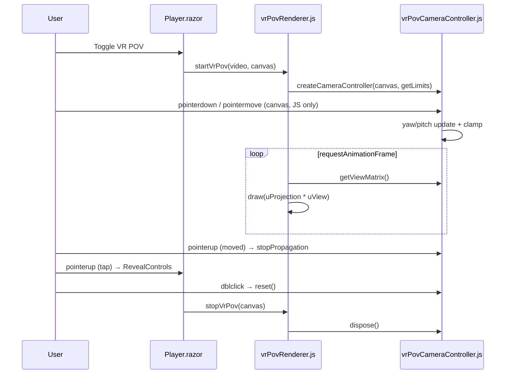

# Plan: VR POV Camera Drag

## Table of Contents

- [Plan: VR POV Camera Drag](#plan-vr-pov-camera-drag)
  - [Summary](#summary)
  - [Technical Approach](#technical-approach)
  - [Component Breakdown](#component-breakdown)
  - [Dependencies](#dependencies)
  - [External / Vendor Documentation Evidence](#external--vendor-documentation-evidence)
  - [Flow](#flow)
  - [Risk Assessment](#risk-assessment)

## Summary

Add a JS-only camera controller (yaw/pitch from Pointer Events) that plugs into the existing raw-WebGL renderer through a small view-source abstraction, following the existing isolated-JS-module pattern (`videoEditor.js`, `vrPovRenderer.js`) and leaving the C#-driven flat-mode drag untouched.

## Technical Approach

**Responsibilities (SOLID)**

- `vrPovCameraController.js` (new) — single responsibility: orientation. Exports `createCameraController(canvas, { getLimits, sensitivity })` returning `{ getViewMatrix(), reset(), setSensitivity(v), dispose() }`. Internally it splits pure functions (`clampOrientation(yaw, pitch, limits)`, `computeLimits(hFov, vFov)`, `buildViewMatrix(yaw, pitch, out)`) from the DOM listeners, so the math is testable later.
- `vrPovRenderer.js` (modify) — single responsibility: drawing. It depends on a *view source* contract (`getViewMatrix(): Float32Array`), not on the concrete controller. `startVrPov(video, canvas, viewSource?)` defaults to creating the controller with a `getLimits` closure over the session's current FOVs, but any object satisfying the contract can be injected (open/closed: e.g. a future gyroscope source). Each frame: `uView = viewSource.getViewMatrix()`; projection stays as today; a new `uView` uniform is multiplied in the vertex shader (`uProjection * uView * vec4(aPosition, 1.0)`). Mesh/UV/texture untouched.
- `Player.razor` (modify, minimal) — mode selection only. It already calls `startVrPov`/`stopVrPov`; the controller is created/disposed inside those calls, so Blazor gets no new event handlers. The canvas drops nothing; `@onpointerup="RevealControls"` stays for taps.
- Flat drag — `VideoFrameState`, `Player.razor` `<video>` handlers and `videoEditor.js` are not edited. Separation is structural: different element (canvas vs `<video>`), different owner (JS vs C#), no shared state, no shared imports.

**Camera math**

- `yaw += dx * s`, `pitch -= dy * s`, `s = 0.002` rad/px. Dragging up looks up.
- Limits (all content is 180°): `maxYaw = 90° - hFov/2`, `maxPitch = min(60°, 90° - vFov/2)`. `hFov` is the constant `HORIZONTAL_FOV_DEGREES` (100°) and `vFov` comes from the renderer's existing `verticalFov(...)` (clamped 60–110°). Because the canvas aspect can change, `getLimits` is queried on each update and after resize, and yaw/pitch are re-clamped.
- View matrix = inverse of camera rotation `Ry(yaw)·Rx(pitch)` (YXZ order: yaw about vertical axis, pitch about the camera's horizontal axis), written into a reused `Float32Array(16)`.
- Note: the user's Three.js snippet (`camera.rotation.order = "YXZ"`) maps to this view matrix; Three.js is not added because the renderer is raw WebGL and AGENTS.md forbids new frontend frameworks without justification.

**Zoom (FR14–FR18)**

- Controller state gains `zoom` (default 1, range 1–3) and `getZoom()`. The view-source contract becomes `{ getViewMatrix(), getZoom?(), dispose?() }`.
- Renderer `draw` reads `viewSource.getZoom?.() ?? 1` each frame; when it changes it marks the projection dirty, recomputes `effectiveVFov = 2·atan(tan(baseVFov/2)/zoom)` and updates `session.fov` (so limits use the effective FOV) before calling `getViewMatrix()`, which re-clamps.
- `wheel` (registered `{ passive: false }`) → `zoom *= exp(-deltaY*0.001)`, clamped, `preventDefault()`. Line/page delta modes are normalized (×16 / ×100).
- Pinch: the controller keeps a `Map<pointerId, {x,y}>`. On the second `pointerdown` it cancels the single-pointer drag, records `startDistance`/`startZoom`; on `pointermove` with two pointers it sets `zoom = startZoom * distance / startDistance`. When either pointer ends, pinch ends; the remaining pointer is ignored until released. Pointer-up stopPropagation applies to any sequence that moved or pinched.
- `reset()` also resets zoom.

**Saturation (FR19)**: saturation is a CSS filter on `<video>` only, so it had no effect while the canvas was shown. `Player.razor` extracts `SaturationFilter` and applies it to both `VideoStyle` and the canvas `style`. CSS `filter` works on a WebGL canvas and is GPU-composited; state stays in `SaturationState` (C#), keeping JS free of application rules.

**Pointer handling (in the controller, on the canvas)**

- `pointerdown`: record `pointerId`, `setPointerCapture`, start point, `moved=false`.
- `pointermove` (matching id only): update `moved` once travel ≥ 6 px (same value as `Player.DragThreshold`); update yaw/pitch using `movementX/Y`.
- `pointerup`/`pointercancel`/`lostpointercapture`: release capture, clear drag. If `moved`, the `pointerup` listener is registered in the capture phase and calls `stopPropagation()` so Blazor's delegated `@onpointerup="RevealControls"` is not triggered; taps pass through unchanged.
- `dblclick`: `reset()`.
- Canvas gets `touch-action: none` (Bootstrap utility `touch-action-none` does not exist, so set it as an inline style/`Player.razor.css` rule for the canvas, which is a justified non-Bootstrap exception, alongside the existing canvas rules) so touch drags don't scroll.
- Because Blazor never handles move events, no per-move interop crosses the boundary (Learn: avoid excessively fine-grained interop calls).

**Lifecycle**: controller created after successful GL setup in `startVrPov`; `dispose()` invoked from `teardown(session)` (covers stop, error path, disconnected canvas, selection change and `DisposeAsync`, all of which already call `stopVrPov`). New exports `resetVrPovView(canvas)` and `setVrPovSensitivity(canvas, value)` look up the session by canvas like `resizeVrPov`.

**Guidance reuse**: existing JS-module + `IJSObjectReference` pattern; existing `sessions` WeakMap; existing error/cleanup conventions. No new package, endpoint, service or FFmpeg use.

## Component Breakdown

**Existing files to modify:**

- `WebApp/WebApp.Client/wwwroot/js/vrPovRenderer.js` — `uView` uniform, view-source injection, limit provider, teardown disposes controller, `resetVrPovView`/`setVrPovSensitivity` exports.
- `WebApp/WebApp.Client/Components/Player.razor` — no new handlers; shared `SaturationFilter` style applied to the VR canvas and `VideoStyle` (FR19).
- `WebApp/WebApp.Client/Components/Player.razor.css` — `touch-action: none` rule for the VR canvas.
- `README.md` — update the VR POV row in `## Current Supported Features`.
- `AGENTS.md` — mention the camera controller in the Interactive UI/JS description (via `init-agent` after implementation).

**New files to create:**

- `WebApp/WebApp.Client/wwwroot/js/vrPovCameraController.js` — camera controller (see above).

## Dependencies

- Existing `vrPovRenderer.js` WebGL session; Pointer Events support in the browser. No env vars, services or infrastructure.

## External / Vendor Documentation Evidence

- [Call JavaScript functions from .NET methods in ASP.NET Core Blazor](https://learn.microsoft.com/aspnet/core/blazor/javascript-interoperability/call-javascript-from-dotnet?view=aspnetcore-10.0#javascript-isolation-in-javascript-modules) — JS isolation via ES modules and `IJSObjectReference` (already used here); dispose module references.
- [Blazor JS interop performance best practices](https://learn.microsoft.com/aspnet/core/blazor/performance/javascript-interoperability?view=aspnetcore-10.0) — avoid excessively fine-grained interop calls, which supports keeping pointermove entirely in JS.
- MDN Pointer Events / `setPointerCapture` and `touch-action` — non-Microsoft, referenced by the user; not verified through the Learn MCP.

## Flow

## Risk Assessment

| Risk | Evidence | Mitigation |
| --- | --- | --- |
| Blazor `@onpointerup` still fires after a drag | Canvas has `@onpointerup="RevealControls"` in `Player.razor` | Capture-phase `stopPropagation` on moved sequences; manual validation FR8 |
| Limits wrong when canvas aspect changes (fullscreen/Fill-tab) | `verticalFov` and projection recomputed on resize in `vrPovRenderer.js` | `getLimits` queried live and re-clamp on resize |
| Flat drag regressed | Shared `Player.razor` | No edits to flat handlers; manual + existing `VideoFrameStateTests` |
| Touch scroll/gesture hijack | Default `touch-action` | `touch-action: none` on canvas; validate on touch device |
| Leaked listeners after teardown | Multiple teardown paths in renderer | Single `dispose()` called from `teardown` |
| Wheel/pinch feel or browser page-zoom conflict | Ctrl+wheel and trackpad pinch arrive as `wheel` with `ctrlKey` | `preventDefault()` on all wheel events over the canvas; tune constants |
| Pitch/yaw feel | Values from brief, untested on real videos | Constants isolated; `setSensitivity` available |
