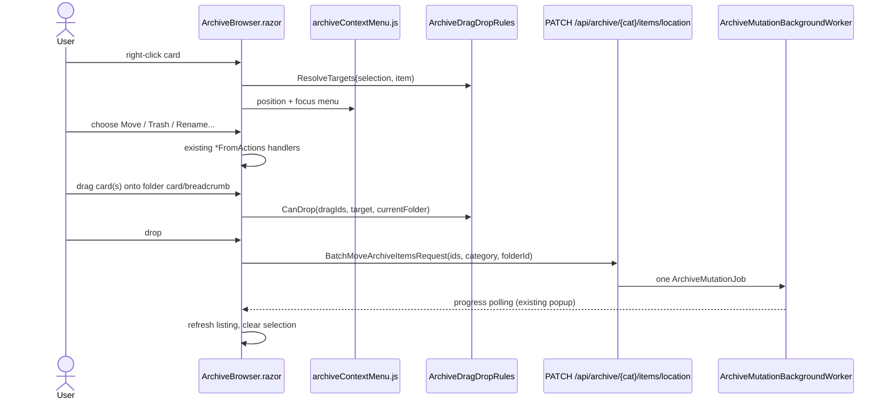

# Plan: Archive Context Menu and Drag-and-Drop Move

## Table of Contents

- [Plan: Archive Context Menu and Drag-and-Drop Move](#plan-archive-context-menu-and-drag-and-drop-move)
  - [Summary](#summary)
  - [Technical Approach](#technical-approach)
  - [Component Breakdown](#component-breakdown)
  - [Dependencies](#dependencies)
  - [External / Vendor Documentation Evidence](#external--vendor-documentation-evidence)
  - [Flow](#flow)
  - [Risk Assessment](#risk-assessment)

## Summary

A client-only change to `ArchiveBrowser.razor`: a right-click menu that reuses the actions-panel handlers and the selection model, plus drag-and-drop onto folder cards/breadcrumbs that calls the already-implemented batch-move endpoint. It extends the Interactive WebAssembly component pattern, `_selectedForMoveIds` selection model, and `EnqueueMutationAsync` job flow from `Specs/20260922132005-archive-multi-select-move/` and `Specs/20260922122650-archive-move-delete-progress/`.

## Technical Approach

**Ownership.** `ArchiveBrowser.razor` already owns selection, actions-panel handlers, `EnqueueMutationAsync`, and job polling; it stays the owner. Pure decision logic moves into a small testable client model, `ArchiveDragDropRules` (`WebApp.Client/Models/`), following how `ArchiveItemSorter` and `ArchiveUploadPreviewState` keep rules out of Razor:

- `ResolveTargets(items, selectedIds, contextItemId)` returns the item set a right-click/drag acts on (whole selection if the item is selected, otherwise just that item).
- `CanDrop(draggedIds, targetFolderId, currentFolderId)` is false when the target is among the dragged IDs or is the current folder.

**Context menu (FR1–FR7).** A `contextmenu` handler on the card root with `@oncontextmenu:preventDefault` records `_contextMenu` (state: item ID, X, Y) and applies FR2's selection rule. The menu is a Bootstrap `dropdown-menu show position-fixed` list rendered once at the grid level (not per card) with `role="menu"`; its item markup mirrors the panel's conditions and calls the same `*FromActions` handlers, which gain a shared `CloseActions()` extension that also clears `_contextMenu`. Positioning and clamping use runtime inline `left/top` (allowed runtime-value inline style); a tiny JS module `wwwroot/js/archiveContextMenu.js` measures the rendered menu, clamps it into the viewport, focuses the first item, and registers a one-shot outside-pointerdown/scroll/Escape listener that calls back a `[JSInvokable] CloseContextMenu`. This follows the existing `bootstrapInterop.js`/`archiveUploadInterop.js` pattern (module imported via `IJSRuntime`, disposed in `DisposeAsync`).

**Drag and drop (FR8–FR14).** Cards get `draggable`, `@ondragstart`, `@ondragend`; folder cards and eligible breadcrumb buttons get `@ondragover:preventDefault`, `@ondragenter`, `@ondragleave`, `@ondrop`. The dragged ID set lives in C# state (`_dragIds`), so no path or ID needs to travel through `dataTransfer`. Blazor cannot call `dataTransfer.setData`/`effectAllowed` from C#, and Firefox will not start a drag without `setData`, so `archiveContextMenu.js` (or a sibling `archiveDragDrop.js`) installs one delegated `dragstart` listener on the grid container that sets a neutral `text/plain` marker and `effectAllowed = 'move'`. On drop, `ArchiveBrowser` calls the existing `BatchMoveAsync`-style enqueue with `ArchiveDragDropRules` results; a shared private method `MoveItemsAsync(ids, destinationCategory, destinationFolderId)` is extracted from `BatchMoveAsync` so the picker path and drop path share it. Server validation (`ArchiveService.BatchMove`) is unchanged and remains authoritative; conflicts surface through `EnqueueMutationAsync`'s existing error handling.

**Design system.** Menu uses `dropdown-menu`/`dropdown-item`/`dropdown-header` and Bootstrap Icons (`bi-pencil`, `bi-folder-symlink`, `bi-trash`, ...) matching the panel. Drop-target and dragging states use Bootstrap utilities where possible (`border-primary`, `bg-primary-subtle`, `opacity-50`); anything else (e.g., `pointer-events` on child content during drag so `dragleave` does not flicker) goes in `ArchiveBrowser.razor.css`, reusing existing tokens and honoring `prefers-reduced-motion`. Empty/loading/error: the menu is never shown while the listing is loading or empty (no cards); errors reuse the existing job/alert region.

**Why no new server work.** `PATCH /api/archive/{category}/items/location` already takes an ID list, validates atomically, and enqueues one job. Dropping one or many items is exactly that call.

## Component Breakdown

**Existing files to modify:**

- `WebApp/WebApp.Client/Components/ArchiveBrowser.razor` — card `oncontextmenu`/drag attributes, context-menu markup and state, breadcrumb drop targets, `MoveItemsAsync` extraction, `_dragIds`/`_dropTargetId` state, module import/dispose.
- `WebApp/WebApp.Client/Components/ArchiveBrowser.razor.css` — drop-target highlight, dragging state, `pointer-events` guard, reduced-motion handling.
- `AGENTS.md` and `README.md` (`## Current Supported Features` table) — document right-click menu and drag-and-drop move when implemented.

**New files to create:**

- `WebApp/WebApp.Client/Models/ArchiveDragDropRules.cs` — pure target-resolution and drop-validity rules.
- `WebApp/WebApp.Client/wwwroot/js/archiveContextMenu.js` — viewport clamp, focus, outside-dismiss, delegated `dragstart` `dataTransfer` setup.
- `WebApp.Tests/Client/ArchiveDragDropRulesTests.cs` — xUnit tests for the rules.

## Dependencies

- Existing batch-move endpoint and job pipeline (no change); running app via `make docker-run`, tests via `make test`.
- Bootstrap 5.3.8 / Bootstrap Icons 1.13.1 (already pinned); no new packages.

## External / Vendor Documentation Evidence

Retrieved via Microsoft Learn MCP:

- [ASP.NET Core Blazor event handling](https://learn.microsoft.com/aspnet/core/blazor/components/event-handling?view=aspnetcore-10.0) — `@on{EVENT}:preventDefault` (including expression form) is the supported way to suppress the native context menu and to enable drops via `dragover`; `DragEventArgs` is a built-in event argument type. It also states drag-and-drop in Blazor is implemented with JS interop plus the HTML Drag and Drop API, which is why `dataTransfer` setup lives in a small JS module while state stays in C#.
- [Blazor stop event propagation](https://learn.microsoft.com/aspnet/core/blazor/components/event-handling?view=aspnetcore-10.0#stop-event-propagation) — `stopPropagation` affects only the Blazor scope; existing action-panel buttons keep `@onclick:stopPropagation`, and the menu relies on JS for DOM-level outside-click dismissal.

No conflict with repo constraints (no new framework, Docker-only workflow, opaque IDs).

## Flow

## Risk Assessment

| Risk | Evidence | Mitigation |
| --- | --- | --- |
| Firefox refuses to start a drag without `dataTransfer.setData` | Blazor cannot set `dataTransfer` from C# (Learn: use JS interop for drag and drop) | Delegated JS `dragstart` listener sets a neutral marker and `effectAllowed`. |
| `dragleave` flicker from child elements of the card | Cards contain overlays/images/buttons | `pointer-events: none` on card children while a drag is active (scoped CSS); counter-free enter/leave logic. |
| Accidentally suppressing right-click on inputs or elsewhere | FR15; folder-name/rename inputs are in modals | `preventDefault` bound only to item cards; menu never opens over modals. |
| Drop starts a destructive-feeling move with no confirmation | Product decision: move immediately | Existing progress popup, no-rollback semantics documented; server rejects conflicts/self-descendant moves atomically. |
| Stale menu/drag state after listing reload or navigation | `LoadAsync` clears selection today | Clear `_contextMenu`, `_dragIds`, `_dropTargetId` in the same places selection is cleared. |
| Large folders slow to render with more handlers | Grid may hold hundreds of cards | Blazor handlers only, delegated JS listener, no per-card JS registration. |
| Inaccessible for keyboard/touch | Right-click and drag are pointer-only | Existing actions button, toolbar and Move picker remain; menu itself has keyboard navigation once open. |
