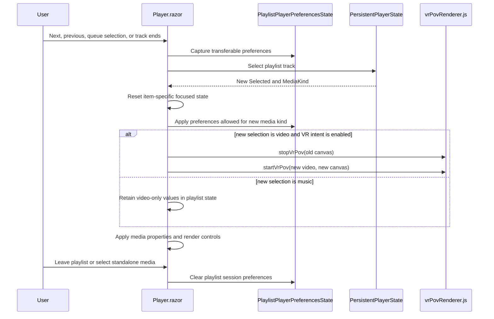

# Plan: Playlist Player Preferences

## Table of Contents

- [Plan: Playlist Player Preferences](#plan-playlist-player-preferences)
  - [Summary](#summary)
  - [Technical Approach](#technical-approach)
  - [Component Breakdown](#component-breakdown)
  - [Dependencies](#dependencies)
  - [External / Vendor Documentation Evidence](#external--vendor-documentation-evidence)
  - [Flow](#flow)
  - [Risk Assessment](#risk-assessment)

## Summary

Add an in-memory, playlist-scoped preference state for the client player. `Player.razor` will use it only during a stable `PersistentPlayerState` playlist session, preserving transferable controls across queue selections while maintaining the existing per-source renderer teardown/start lifecycle and item-specific resets.

## Technical Approach

### State ownership and lifecycle

`PersistentPlayerState` already owns playlist identity, queue membership, selection changes, and route lifecycle through `EnterPlaylistView`, `ExitPlaylistView`, `SelectPlaylistItem`, `SelectPreviousTrack`, `SelectNextTrack`, standalone `Select*` methods, and `Clear`. Extend this client-side pattern with a narrow playlist-preferences state object associated with the currently active playlist context rather than adding persistence or an API.

The new state captures only transferable choices: VR enabled intent, saturation value, volume, mute state, playback rate, subtitle preference, and Fill-tab active intent. It exposes explicit operations to begin/retain/reset a playlist context and to apply the applicable subset to a newly selected video or audio item. `Player.razor` remains responsible for reading/writing the existing focused models and for deciding when a media element is ready for JS commands.

On a normal standalone selection or the first item in a newly entered playlist, current defaults apply. On next/previous, queue click, or end-driven selection in the same active playlist, `Player.razor` saves the outgoing transferable state before selection handling, initializes its focused models for the new source, restores applicable shared values, and schedules media initialization. VR's retained value is an intent, not a reusable WebGL session: the old canvas session is stopped, then `startVrPov(video, canvas)` runs after the keyed replacement video/canvas exists. Existing renderer failure handling clears the active intent and presents the existing WebGL error, so state never claims a failed renderer is active.

Mixed media handling follows `PersistentPlayerState.MediaKind`. Music receives volume, mute, rate, and Fill-tab only. Video-only values remain in the playlist-preference object while music plays; they are reapplied to a later video. The current `MediaPlayerState.Select`, `SaturationState.Select`, `VrPovState.Select`, `VideoFrameState.Select`, and `FillTabState.Select` reset semantics remain the baseline for nontransferable values. Loop modes, A/B state, audio track, time/progress, crop, camera direction/zoom, and errors are deliberately not copied.

The implementation extends the app's existing client-owned state + Razor lifecycle architecture; it does not create a server service. The new object is small and directly unit-testable. It can be injected/scoped alongside `PersistentPlayerState` if the existing service registration supports that ownership, or held by the persistent player service if this keeps playlist lifecycle and reset decisions together; the final placement must avoid coupling the state model to DOM/JS interop.

### UI, accessibility, and responsive behavior

No control layout or new CSS is required. Existing `MediaPlayerControls.razor` inputs/buttons continue to expose their present accessible labels and toggle states; their values must redraw from restored state before a user interacts. Fill-tab keeps its existing viewport and Escape lifecycle, including cleanup when leaving the playlist. The VR canvas remains video-only and retains its existing accessible label and control-reveal interaction.

### Documentation and execution

Update the supported-features Playlists row in `README.md` during implementation, as required by `AGENTS.md`. Run the repository's Docker-only test command, `make test`; do not introduce a host `dotnet test` workflow.

## Component Breakdown

**Existing files to modify:**

- `WebApp/WebApp.Client/Components/Player.razor` — distinguish same-playlist transitions from standalone/new-playlist selections; capture/restore transferable state, schedule VR renderer restart, and keep item-specific state resets.
- `WebApp/WebApp.Client/Services/PersistentPlayerState.cs` — expose or coordinate the active playlist context lifecycle needed to preserve preferences only for the same playlist and clear them on exit/replacement/standalone selection.
- `WebApp/WebApp.Client/Models/VrPovState.cs` — support restoring playlist-held VR intent without weakening its per-video camera reset semantics, if required by the selected state-object boundary.
- `WebApp/WebApp.Client/Models/SaturationState.cs` — support restoring a valid playlist-held saturation value after new-item selection without changing its standalone defaults.
- `WebApp/WebApp.Client/Models/MediaPlayerState.cs` — preserve clear separation between transferable volume/mute/rate/subtitle preference and per-item loop, markers, audio track, duration, and time.
- `WebApp.Tests/Client/PersistentPlayerStateTests.cs` — cover playlist identity/lifecycle decisions that enable retention versus clearing.
- `WebApp.Tests/Client/VrPovStateTests.cs` — update/add coverage for playlist-restored intent while preserving ordinary new-selection reset behavior.
- `WebApp.Tests/Client/SaturationStateTests.cs` — cover restoration and ordinary reset boundaries.
- `WebApp.Tests/Client/MediaPlayerStateTests.cs` — cover transferable versus per-item control classifications.
- `README.md` — update the Playlists supported-features row.

**New files to create:**

- `WebApp/WebApp.Client/Models/PlaylistPlayerPreferencesState.cs` — focused, browser-only playlist-session model for transferable preferences and their reset/apply rules.
- `WebApp.Tests/Client/PlaylistPlayerPreferencesStateTests.cs` — xUnit unit tests for capture, video/audio application, same-playlist retention, and reset lifecycle.

## Dependencies

- Existing client DI registration and `PersistentPlayerState` lifetime.
- Existing isolated JS modules `WebApp/WebApp.Client/wwwroot/js/videoEditor.js` and `WebApp/WebApp.Client/wwwroot/js/vrPovRenderer.js`; no changes to their public renderer contract are expected.
- WebGL-capable browser only when a user enables VR POV, as today.
- Docker Compose test environment through `make test`.

## External / Vendor Documentation Evidence

- Verification pending: the session does not expose the repository-required Microsoft Learn MCP tools. The implementation should verify current official Blazor guidance for component lifecycle and JavaScript isolation before making a vendor-specific lifecycle/API decision. The established project pattern is ES-module import through `IJSObjectReference` in `Player.razor`.

## Flow

## Risk Assessment

| Risk | Evidence | Mitigation |
| --- | --- | --- |
| VR state remains active without a renderer after keyed media replacement | `Player.razor` currently calls `_vrPov.Select(Selected?.Id)`, which stops VR on every selection | Treat preference as intent; stop old session before restart; clear intent and show the existing error on startup failure. |
| Settings accidentally leak to standalone playback or a different playlist | `PersistentPlayerState` supports queue preservation while navigating away and fresh playlist entry | Key preferences to active playlist identity and explicitly clear them in exit, clear, standalone-select, and different-playlist paths; unit test each boundary. |
| Video-only settings are applied to music or lost after music | Playlists can mix video and music (`PersistentPlayerState.EnterPlaylistView`) | Use `MediaKind`-specific application rules and keep video-only values stored but unapplied during music. |
| Per-video loop or timestamp controls become invalid on a new source | `MediaPlayerState.Select` currently resets duration, markers, loops, and audio track | Keep those fields outside playlist preferences and assert resets in unit tests. |
| Fill-tab or renderer cleanup leaves stale browser state | `Player.razor` performs cleanup in `OnAfterRenderAsync` and `DisposeAsync` | Reuse existing pending cleanup/start flags; manual test transitions in normal, Fill-tab, fullscreen, and navigation paths. |
