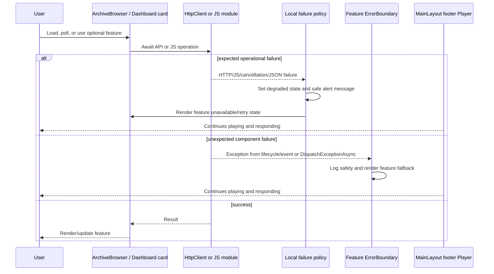

# Plan: Error Isolation, Async, and JavaScript Resilience

## Table of Contents

- [Summary](#summary)
- [Technical Approach](#technical-approach)
- [Component Breakdown](#component-breakdown)
- [Dependencies](#dependencies)
- [External / Vendor Documentation Evidence](#external--vendor-documentation-evidence)
- [Flow](#flow)
- [Risk Assessment](#risk-assessment)

## Summary

Add narrowly scoped Blazor error boundaries and consistent expected-failure handling to the existing interactive WebAssembly UI and detached server/client media work. The design preserves the `MainLayout` footer-player separation: routed content may fail independently of the player, while the player itself has its own bounded failure experience.

## Technical Approach

### Fault-domain placement

`WebApp/WebApp.Client/Layout/MainLayout.razor` already renders `@Body` in `<main>` and conditionally renders `<Player>` afterward. Wrap these two siblings separately: one boundary contains routed-page content and another contains the footer `Player`. Do not wrap the outer layout, sidebar, routed content, and player in a single boundary. The route boundary must recover only on a route transition; the player boundary must recover only through an explicit player retry/reset action, never during render.

Place boundaries where removing the enclosed UI remains meaningful:

```text
MainLayout
├─ Sidebar (StorageMeter uses local unavailable state)
├─ @Body route boundary
│  ├─ Dashboard
│  │  ├─ each Dashboard*Card boundary
│  │  └─ DashboardConversionJobsTab boundary
│  ├─ ArchiveContentHost
│  │  ├─ ArchiveBrowser boundary
│  │  │  ├─ ImageCarouselViewer boundary
│  │  │  └─ ComicViewer boundary
│  │  ├─ TextDocumentEditor boundary
│  │  └─ PdfDocumentViewer boundary
│  ├─ Books → EpubReader boundary
│  └─ VideoCut / VideoComposition / ImageCutter feature boundaries
└─ footer Player boundary
   └─ MediaPlayerControls uses parent Player boundary
```

Use the standard `ErrorBoundary` component initially; a focused reusable boundary component may be introduced only if it centralizes the established logging and Bootstrap fallback contract without obscuring ownership. It must accept explicit feature name, recovery callback, and content rather than infer errors from exception text.

### User-facing recovery alerts

Existing components already use Bootstrap `alert`, `alert-danger`, `alert-warning`, `role="alert"`, Bootstrap Icons, and design tokens. Extend this pattern. Each fallback states: the affected feature, what is still available, a safe next action, and whether retry is appropriate. For example: “Video previews are temporarily unavailable. Generation is busy; wait a moment and try again.” It must not state server exception text or claim a concrete cause that cannot be classified.

Use `alert-warning` for a temporary/queued or retryable availability condition, `alert-danger` for a feature that cannot be used in the current state, and Bootstrap Icons at `currentColor`. Use normal text plus icon/heading so meaning is not solely color. Avoid Bootstrap alert JavaScript dismissal for boundary fallbacks; a Blazor retry must reset component state and invoke `ErrorBoundary.Recover` deliberately.

### HTTP/JSON and lifecycle policy

Keep request ownership in the current components. `GetFromJsonAsync` is a convenience API that treats unsuccessful responses as failures; it also has cancellation and JSON-deserialization failure paths. At a feature boundary, distinguish:

1. Caller-owned cancellation during disposal/replacement: stop quietly, without an alert or warning log.
2. Expected transport/status/timeout/invalid-payload failure: set the component’s existing degraded state and show a contextual alert; log a safe warning.
3. Unexpected state/programming failure: log error and dispatch the exception to the appropriate boundary.

Apply this policy first to `ArchiveBrowser.LoadAsync`, `PollJobAsync`, `PollMediaAsync`; `VideoCut`/`VideoComposition` polling; `Player` cut/audio-track operations; `PlaylistView`; readers/editors/viewers; image cutter; storage/move pickers; and all Dashboard refresh methods. Retain explicit `IsSuccessStatusCode` branches already used by POST/PATCH/DELETE calls and make `ReadFromJsonAsync` handling equally deliberate.

### JS interop and disposal policy

Each JS operation in a lifecycle method, event handler, delayed task, or disposal path must guard module availability and catch expected `JSException`, cancellation, and disconnected/disposed conditions. The fallback must match the capability: failed tooltip setup leaves controls usable; failed archive drag/context-menu setup leaves normal archive actions usable; failed fullscreen/VR/measurement leaves normal playback usable; failed editor/reader/viewer integration leaves a bounded viewer fallback or usable close action.

Prioritize currently unguarded player calls in `OnAfterRenderAsync`, `StartDragAsync`, `SynchronizeMediaStateAsync`, and cleanup paths. Preserve existing VR-specific failure handling while making core player commands robust. Do not move framing, playback, or app state into JavaScript.

### Detached tasks and server jobs

For client polling/delay work, retain the current cancellation-token ownership but ensure every `_ = SomeAsync(...)` invocation has a task body that handles expected exceptions and dispatches unexpected exceptions using `ComponentBase.DispatchExceptionAsync`. This applies to `ArchiveBrowser`, `VideoCut`, `VideoComposition`, `DashboardConversionJobsTab`, `Player`, `ImageCarouselViewer`, `ComicViewer`, `EpubReader`, `TextDocumentEditor`, `VideoLibrary`, `MainLayout`, and `ArchiveContentHost` callbacks as applicable. Cancellation catches must be filtered to the known caller token.

The server background workers already model isolated jobs. Review every worker execution loop to ensure per-job failure remains caught, logged with safe identifiers, and recorded as failed where status exists. Fix `AudioTrackRemuxService`’s `Task.Run` registration so the detached task is observed, removes itself from `_active`, and cannot leave an unobserved faulted task. Do not surface server exception details through APIs.

### Tests, documentation, and execution

Follow `WebApp.Tests` xUnit conventions. Add focused policy/state tests where a helper makes classification deterministic; preserve endpoint tests for response-level behavior. Browser-rendered boundaries and JS module failures require Docker/browser manual verification because the repository has no component/JS interop test harness. Update the README feature table. Run only `make test` for automated validation.

## Component Breakdown

**Existing files to modify:**

- `WebApp/WebApp.Client/Layout/MainLayout.razor` — separate routed-content and footer-player boundaries; safely observe state-change callback; recover the page boundary on navigation.
- `WebApp/WebApp.Client/Routes.razor` — provide the route-change ownership needed for safe page-boundary recovery if it is cleaner than layout parameter observation.
- `WebApp/WebApp.Client/Components/Player.razor` — classify API/JS/media failures, protect lifecycle/event/disposal paths, observe delayed-control work, and keep playback fallback scoped to the player.
- `WebApp/WebApp.Client/Components/ArchiveContentHost.razor` and `ArchiveBrowser.razor` — establish archive/viewer domains; make listing, mutation/upload, polling, JS watchers, and callbacks resilient.
- `WebApp/WebApp.Client/Components/ImageCarouselViewer.razor`, `ComicViewer.razor`, `EpubReader.razor`, `TextDocumentEditor.razor`, `PdfDocumentViewer.razor`, `MediaPlayerControls.razor`, `ThemeToggle.razor`, `VideoLibrary.razor`, and `StorageMeter.razor` — locally handle expected interop/API/delayed-task/disposal failures and rely on the correct parent boundary for unexpected ones.
- `WebApp/WebApp.Client/Pages/PlaylistView.razor`, `Pages/UtilitiesPages/VideoCut.razor`, `VideoComposition.razor`, and `ImageCutter.razor` — contain expected loading, action, poll, and cancellation failures locally; add page/feature boundary integration.
- `WebApp/WebApp.Client/Pages/Dashboard.razor` and `Components/Dashboard/*.razor` — isolate cards/jobs and ensure one refresh failure does not fault `Task.WhenAll` or sibling cards.
- `WebApp/WebApp/Services/AudioTrackRemuxService.cs` — observe and clean up detached remux tasks.
- `WebApp/WebApp/Services/*BackgroundWorker*.cs` — verify/add safe per-job exception continuation and logging without paths.
- `WebApp.Tests/Client/*.cs`, `WebApp.Tests/Services/AudioTrackRemuxServiceTests.cs`, and relevant endpoint tests — add error-policy, state, and job-observation coverage using existing xUnit patterns.
- `README.md` — update the Current Supported Features table.

**New files to create:**

- `WebApp/WebApp.Client/Components/FeatureErrorBoundary.razor` (only if needed) — a narrowly focused wrapper around `ErrorBoundary` that owns safe logging and the Bootstrap feature-alert/retry presentation; otherwise use standard boundaries inline.
- `WebApp.Tests/Client/FeatureErrorBoundaryTests.cs` or a focused pure-policy test file (only if a testable helper is introduced) — validates feature-message classification and safe retry semantics without depending on a browser renderer.

## Dependencies

- Existing global Interactive WebAssembly routing from `WebApp/WebApp/Components/App.razor` and `WebApp.Client/Routes.razor`.
- Existing Bootstrap 5.3.8, Bootstrap Icons 1.13.1, global design tokens, and existing JS ES modules.
- Existing `ILogger<T>`, scoped client `HttpClient`, `IJSRuntime`, server background queues, and Docker Compose test stack.
- No new package, environment variable, service endpoint, database, mount, or media-processing dependency.

## External / Vendor Documentation Evidence

- [Blazor error handling (.NET 10)](https://learn.microsoft.com/aspnet/core/blazor/fundamentals/handle-errors?view=aspnetcore-10.0) — error boundaries render fallback content for exceptions from wrapped components; Microsoft recommends narrow scopes, recovery after a user gesture/navigation, local lifecycle/event handling for operational failures, and no technical error details in production UI. It also documents JS interop failure/cancellation paths.
- [Blazor synchronization context (.NET 10)](https://learn.microsoft.com/aspnet/core/blazor/components/synchronization-context?view=aspnetcore-10.0#handle-caught-exceptions-outside-of-a-razor-components-lifecycle) — a component can use `DispatchExceptionAsync` to route unexpected failures from detached work through normal Blazor error handling and its boundary.
- [HttpClient error handling (.NET)](https://learn.microsoft.com/dotnet/fundamentals/networking/http/httpclient#use-http-error-handling) — convenience request methods enforce successful HTTP responses; code must distinguish `HttpRequestException` from cancellation/timeout and handle expected failures explicitly.
- [Bootstrap 5.3 alerts](https://getbootstrap.com/docs/5.3/components/alerts/) — alerts support contextual variants, icons, headings/additional content, and `role="alert"`; visible wording must communicate meaning beyond color. The project will use Blazor-owned retry state instead of Bootstrap JS dismissal for error-boundary fallback.

## Flow



## Risk Assessment

| Risk | Evidence | Mitigation |
| --- | --- | --- |
| A broad layout boundary also removes the footer player | `MainLayout.razor` renders `@Body` and `Player` as sibling regions | Use separate sibling boundaries; do not wrap the entire shell. |
| Boundary remains faulted after navigation or retries forever | Blazor warns against recovery from rendering | Recover only after a route transition or user retry that resets faulting state. |
| Catching all exceptions hides defects | `ComicViewer.razor` has a broad catch; several detached tasks omit handling | Classify only expected conditions locally; log and dispatch unexpected exceptions. |
| Polling produces unobserved exceptions after disposal | `ArchiveBrowser`, utilities, dashboard, and player use `_ = Task` patterns | Use token-aware catches and `DispatchExceptionAsync` for unexpected failures. |
| Error UI discloses private media-path or implementation data | Repo prohibits filesystem paths reaching browser/logs | Use fixed feature/action messages and structured logs with opaque IDs only. |
| A feature retry overloads NAS or queues | Thumbnail/preview/cut/composition work is asynchronous and bounded | Reuse existing polling/queue state, stop on known failure, and expose “wait and try again” rather than automatic tight retries. |
| JS cleanup causes a second fault during navigation | Multiple components dispose module references asynchronously | Guard module state, expected disconnected/disposed errors, and prevent cleanup errors from escaping disposal. |
