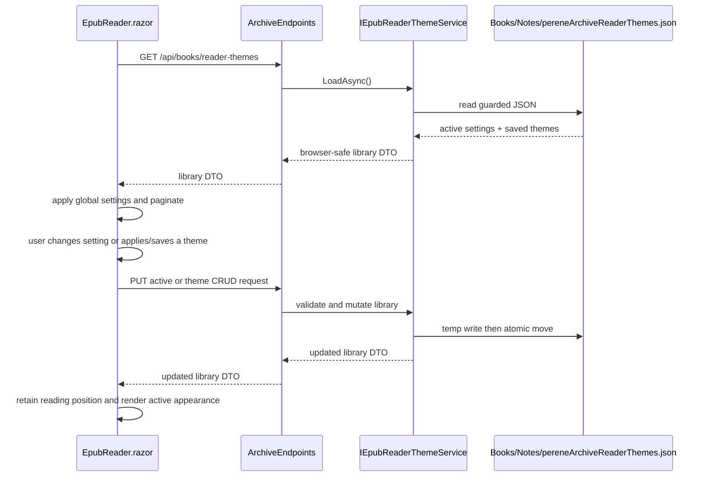

# Plan: EPUB Reader Themes

## Table of Contents

- [Summary](#summary)
- [Technical Approach](#technical-approach)
- [Component Breakdown](#component-breakdown)
- [Dependencies](#dependencies)
- [External / Vendor Documentation Evidence](#external--vendor-documentation-evidence)
- [Flow](#flow)
- [Risk Assessment](#risk-assessment)

## Summary

Add a globally scoped, server-persisted EPUB reader appearance plus a named-theme CRUD library. The work extends the `EpubProgressService` archive JSON pattern and the existing `EpubReader.razor` Bootstrap dropdown instead of introducing browser storage or a new persistence system.

## Technical Approach

### Data and ownership

Create browser-safe models in `WebApp/WebApp.Client/Models/`:

- `BookReaderThemeSettingsDto` with the five fields: supported font-family key, supported pixel size, supported line-height value/key, optional foreground color, and optional background color. `null` colors mean inherit `var(--bs-body-color)` / `var(--bs-body-bg)` from the application theme.
- `BookReaderThemeDto` with an opaque generated theme ID, display name, and settings.
- `BookReaderThemeLibraryDto` with the active settings, optional selected saved-theme ID, and saved themes; focused create/update/rename request records can be added only where endpoint binding benefits from them.

The default value is constructed in one server-owned validation/defaults definition: `Montserrat`, `18px`, Normal (`1.75`) line spacing, and null/inherited colors. This preserves the current light/dark-aware reader appearance. The client mirrors only the supported-option lists needed to render controls; it treats server data as untrusted and falls back to its matching default if a response cannot be used.

Add `IEpubReaderThemeService` and `EpubReaderThemeService` in `WebApp/WebApp/Services/`. It follows `IEpubProgressService`/`EpubProgressService` exactly where appropriate: `IOptions<ArchiveRootOptions>`, a singleton `SemaphoreSlim`, defensive JSON reads, and temporary file publication. It owns `Books/Notes/pereneArchiveReaderThemes.json`, not a path supplied by the browser. Its document stores global active settings, nullable selected-theme ID, and saved theme records; it contains neither archive paths nor book IDs. It validates fixed font/size/spacing allowlists, normalized `#RRGGBB` color values (or null inheritance), generated opaque theme IDs, and trimmed case-insensitive unique names (1–60 characters). All library mutations read, validate, write atomically, and return the resulting safe library snapshot.

### API and server boundary

Register the service as a singleton beside `IEpubProgressService` in `WebApp/WebApp/Program.cs`. Extend `WebApp/WebApp/Endpoints/ArchiveEndpoints.cs` with a small global EPUB-reader-theme endpoint group, separate from opaque item routes because the preference is intentionally global rather than tied to a book:

- `GET /api/books/reader-themes` — library snapshot.
- `PUT /api/books/reader-themes/active` — replace active settings and clear selected saved-theme association when settings differ.
- `POST /api/books/reader-themes` — create a named theme from validated settings and make it the selected active theme.
- `PUT /api/books/reader-themes/{themeId}` — update a named theme's values and/or name, then make it active.
- `DELETE /api/books/reader-themes/{themeId}` — delete that record without changing the active settings.

Handlers depend only on `IEpubReaderThemeService`, return `400` for validation errors, `404` for unknown theme IDs, and a non-path-bearing `500` problem for I/O errors. No archive resolution is needed, since this is a global local-installation preference and does not touch a source file. This preserves the repository's opaque-ID and no-path-to-browser boundary.

### Reader UI and interaction

Modify `WebApp/WebApp.Client/Components/EpubReader.razor` to load the library once when the reader instance starts, before `LoadBookAsync` completes its first render. Apply the loaded active settings to the component's existing `_fontFamily`, `_fontSizeIndex`, and `_lineHeightIndex`, add nullable custom foreground/background state, and include safe custom CSS variables/values in `ContentStyle` and the reader/page frame as appropriate. Setting typography or either color invokes the existing pagination reflow routine; color-only changes must not reset chapter or reading progress.

Extend the existing `epub-reader-aa-panel` with:

- Native color inputs plus text labels for foreground and background color, and a Default button that restores the inherited default values.
- A named-theme selector/list that communicates whether the current values are Default, Custom, or a selected saved theme.
- An explicit save-as-new form with a labeled name field; selected-theme actions for Update, Rename, and Delete. Confirmation for delete uses the existing project's Bootstrap/Blazor interaction convention; the final implementation will use an accessible inline confirmation or existing modal pattern found in the relevant component area.
- Disabled/busy states and `role="status"` / `aria-live` feedback while a mutation is in flight or fails.

The existing margins controls stay unchanged and outside the saved settings contract. On each successful local control adjustment, update the active setting through the API on a best-effort, serialized client path; coalesce rapid interactions so stale responses cannot overwrite newer values. User-initiated create/update/rename/delete awaits a response and refreshes the library snapshot. Failure keeps visible values and reading functionality intact.

Use Bootstrap form controls and existing scoped CSS only for color-swatch layout or reader-surface variables Bootstrap cannot express. Maintain the current small-screen `epub-reader-aa-panel` rule, touch target size, labels, focus treatment, and keyboard usability. Update the Books row in `README.md`'s `Current Supported Features` table to mention globally persisted EPUB reader themes.

### Testability

Service behavior is isolated behind `IEpubReaderThemeService` and file I/O is encapsulated in `EpubReaderThemeService`, allowing temporary-directory xUnit tests modeled on `EpubProgressServiceTests`. Minimal API tests extend `ArchiveEndpointsTests` to assert safe success and reject malformed/unsupported settings; no browser test needs to inspect the JSON file. Client state extraction is optional: if the `EpubReader` mutation/reconciliation logic becomes hard to test in component markup, introduce a small browser-safe state helper under `WebApp.Client` and follow its existing direct C# test convention.

## Component Breakdown

**Existing files to modify:**

- `WebApp/WebApp.Client/Components/EpubReader.razor` — load/apply global settings, render color and named-theme controls, persist active changes, and keep pagination behavior.
- `WebApp/WebApp.Client/Components/EpubReader.razor.css` — narrowly scoped color-input/theme-manager presentation only if Bootstrap utilities cannot express it.
- `WebApp/WebApp.Client/Models/` — host the new browser-safe theme DTOs alongside `BookDto` and `BookProgressDto`.
- `WebApp/WebApp/Services/EpubProgressService.cs` — reference pattern only; do not combine unrelated progress and theme responsibilities.
- `WebApp/WebApp/Program.cs` — register `IEpubReaderThemeService`.
- `WebApp/WebApp/Endpoints/ArchiveEndpoints.cs` — map and implement the global reader-theme endpoints with validation/error handling.
- `WebApp.Tests/Endpoints/ArchiveEndpointsTests.cs` — cover theme endpoint happy paths and invalid/missing IDs.
- `README.md` — update the Books capability row.

**New files to create:**

- `WebApp/WebApp.Client/Models/BookReaderThemeSettingsDto.cs` — safe appearance settings contract.
- `WebApp/WebApp.Client/Models/BookReaderThemeDto.cs` — named theme contract.
- `WebApp/WebApp.Client/Models/BookReaderThemeLibraryDto.cs` — global library/active-state contract and request records if needed.
- `WebApp/WebApp/Services/IEpubReaderThemeService.cs` — focused persistence and CRUD abstraction.
- `WebApp/WebApp/Services/EpubReaderThemeService.cs` — validated, atomic JSON implementation.
- `WebApp.Tests/Services/EpubReaderThemeServiceTests.cs` — persistence, validation, malformed-file, and atomic-write tests.

## Dependencies

- Existing writable archive root and `Books/Notes` directory, configured through `ArchiveRootOptions`.
- Existing ASP.NET Core minimal APIs, Blazor WebAssembly `HttpClient`, Bootstrap 5.3.8, Bootstrap Icons 1.13.1, and `System.Text.Json`.
- Docker Compose execution through the repository `Makefile`; no new runtime package, service, database, or environment variable.

## External / Vendor Documentation Evidence

The implementation follows [Microsoft Learn's minimal-API parameter binding guidance](https://learn.microsoft.com/en-us/aspnet/core/fundamentals/minimal-apis/parameter-binding?view=aspnetcore-10.0): complex request records bind from JSON request bodies and registered services bind through dependency injection; malformed JSON body binding produces 400 before the handler. [Blazor lifecycle guidance](https://learn.microsoft.com/en-us/aspnet/core/blazor/components/lifecycle) supports loading component state that depends on parameters in `OnParametersSetAsync`; the reader therefore loads the global settings before its book request for a new item.

## Flow

## Risk Assessment

| Risk | Evidence | Mitigation |
| --- | --- | --- |
| A malformed preference file makes the reader unavailable. | `EpubProgressService` already treats malformed JSON as absent. | Reuse defensive reads and return Default/empty state; never fail book loading for preference I/O. |
| Concurrent UI changes overwrite a newer value. | Font-size controls can be clicked rapidly and each needs server persistence. | Serialize/coalesce active-setting saves in the client and return full snapshots after every successful mutation. |
| Custom values inject CSS or break contrast. | The reader currently interpolates only fixed font/size/spacing values into `ContentStyle`. | Server/client allowlists and normalized `#RRGGBB` values only; default inherits tested Bootstrap colors. |
| A theme refactor changes reading location. | Typography changes already call `RequestPaginationReflow()`. | Apply the same reflow path and preserve current word/page intent; keep theme changes separate from `SaveProgressAsync`. |
| Global JSON preference routes accidentally expose archive data. | Project constraints prohibit browser-visible physical/root-relative paths. | No request accepts path data; DTOs contain only IDs, names, and visual values; test response bodies for this boundary. |
