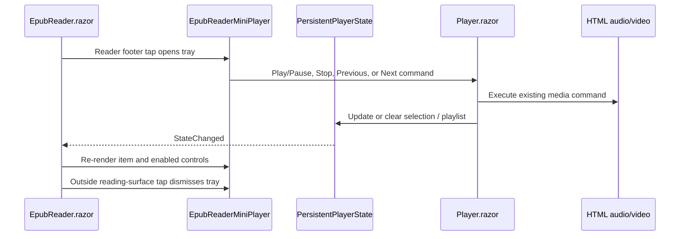

# Plan: Ebook Reader Mini Player

## Table of Contents

- [Summary](#summary)
- [Technical Approach](#technical-approach)
- [Component Breakdown](#component-breakdown)
- [Dependencies](#dependencies)
- [External--Vendor-Documentation-Evidence](#external--vendor-documentation-evidence)
- [Flow](#flow)
- [Risk Assessment](#risk-assessment)

## Summary

Add a reader-local controller surface over `EpubReader.razor` that delegates to the existing single persistent `Player.razor` media element. It extends the client-owned `PersistentPlayerState` and existing player command pattern, while leaving all server, archive, and opaque-ID boundaries unchanged.

## Technical Approach

`MainLayout.razor` currently renders the footer `Player` only for a selected, non-playlist-route item. `EpubReader.razor` itself is a fixed full-screen surface at a higher z-index, which hides that footer. The implementation should inject the scoped `PersistentPlayerState` into `EpubReader` and render a compact reader-only drawer when `HasSelection` is true.

The drawer should not duplicate `<audio>` or `<video>`. `Player.razor` remains the sole owner of the media element, `MediaPlayerState`, and its JS commands. Extract or introduce a narrowly focused client command/coordination boundary shared by `Player.razor` and the reader drawer so Play/Pause, Stop, Previous, and Next operate the existing element and state. Preserve `Player.razor`'s Stop sequence: pause media, leave Fill-tab when applicable, and call `PersistentPlayerState.Clear()`.

`EpubReader.razor` owns only whether its tray is expanded and routes footer/outside interactions. Its existing `ebookReader.js` module is the appropriate home for any necessary DOM-level outside-interaction registration because it already owns reader tap navigation and cleanup. It must exclude toolbar, text-selection menu, progress-footer, and mini-player elements from dismissal. A .NET callback should update UI state; disposal must unregister the listener alongside the existing page-navigation, tap, selection, and resize observers.

Use Bootstrap `btn-group` and buttons with Bootstrap Icons `skip-backward-fill`, `stop-fill`, `play-fill`/`pause-fill`, and `skip-forward-fill`. The central Play/Pause control uses `btn-primary`; companion controls use design-system-aligned outline/secondary styling. Scoped `EpubReader.razor.css` supplies only nonstandard drawer geometry, its anchored bottom-to-top transition, and layering. It must use existing Bootstrap/theme variables such as `--bs-body-bg`, `--bs-tertiary-bg`, `--bs-border-color`, and `--bs-primary`, not hard-coded dark/light colors. The global reduced-motion rule already minimizes transition duration; local rules must not defeat it.

The existing `PersistentPlayerState` owns playlist availability and selection (`CanSelectPreviousTrack`, `CanSelectNextTrack`, `SelectPreviousTrack`, and `SelectNextTrack`). Its state-change event continues to cause the shell player to rerender. Add only testable state/notification support if the drawer needs a reliable playback-state projection; do not move DOM/media ownership into state or create a second player abstraction that conflicts with `Player.razor`.

## Component Breakdown

**Existing files to modify:**

- `WebApp/WebApp.Client/Components/EpubReader.razor` — inject persistent player state; render the reader footer toggle and conditional mini-player tray; coordinate dismissal, commands, accessibility, and disposal.
- `WebApp/WebApp.Client/Components/EpubReader.razor.css` — add reader-specific anchored drawer, responsive compact layout, z-index, and motion rules using existing tokens.
- `WebApp/WebApp.Client/wwwroot/js/ebookReader.js` — extend the existing reader module with contained outside-interaction registration/unregistration only if Blazor cannot safely handle it.
- `WebApp/WebApp.Client/Components/Player.razor` — expose/refactor the minimum existing command path needed for the reader tray to control its one owned media element and preserve its Stop semantics.
- `WebApp/WebApp.Client/Services/PersistentPlayerState.cs` — only if necessary, add small client-owned notifications/projections that let the drawer rerender accurately after playback, selection, or clearing.
- `WebApp.Tests/Client/PersistentPlayerStateTests.cs` — cover any added state command/notification rules and playlist boundary behavior used by the tray.
- `WebApp.Tests/Client/EpubReaderPaginationInteropTests.cs` — extend the source-wiring pattern or add a focused sibling test for mini-player/outside-interaction lifecycle references.
- `README.md` — update the Current Supported Features table for the user-facing ebook reader capability when the feature is implemented.

**New files to create:**

- `WebApp/WebApp.Client/Components/EpubReaderMiniPlayer.razor` — recommended focused presentational/control component, if separation keeps `EpubReader.razor` from absorbing player-command complexity.
- `WebApp/WebApp.Client/Components/EpubReaderMiniPlayer.razor.css` — only if the component is introduced and CSS isolation needs to remain colocated; otherwise retain styles in `EpubReader.razor.css`.

## Dependencies

- The existing scoped `PersistentPlayerState`, `Player.razor`, `MediaPlayerState`, and `ebookReader.js` module.
- Bootstrap 5.3.8 and Bootstrap Icons 1.13.1 already loaded by the application.
- A browser with HTML audio/video playback; no new backend or infrastructure dependency.

## External / Vendor Documentation Evidence

Microsoft Learn MCP tooling was not available in this session, so verification of Blazor event/JS-interop guidance is pending. This plan deliberately follows the repository's established `EpubReader.razor` + `ebookReader.js` JS module lifecycle and Bootstrap-first design contract rather than introducing a new vendor-dependent mechanism.

## Flow

## Risk Assessment

| Risk | Evidence | Mitigation |
| --- | --- | --- |
| Two media elements could play or show conflicting state | `Player.razor` already owns the hidden `<audio>`/`<video>` and playback state. | Reuse that one element; the reader tray renders controls only. |
| Reader tap navigation or selection is accidentally dismissed | `ebookReader.js` already registers tap navigation and a selection observer. | Explicitly exclude tray/footer/toolbar/selection-menu targets and unregister on reader disposal. |
| Stop diverges from the normal player | `Player.razor` Stop also pauses, exits Fill-tab, clears state, and may navigate from a playlist route. | Share/refactor the existing command path instead of reproducing a partial stop sequence. |
| Drawer contrast or motion conflicts with themes/accessibility | The reader has separate light/dark surface tokens and the guide prohibits bespoke palette drift. | Use Bootstrap/design tokens, semantic buttons, visible focus, labelled controls, and reduced-motion behavior. |
