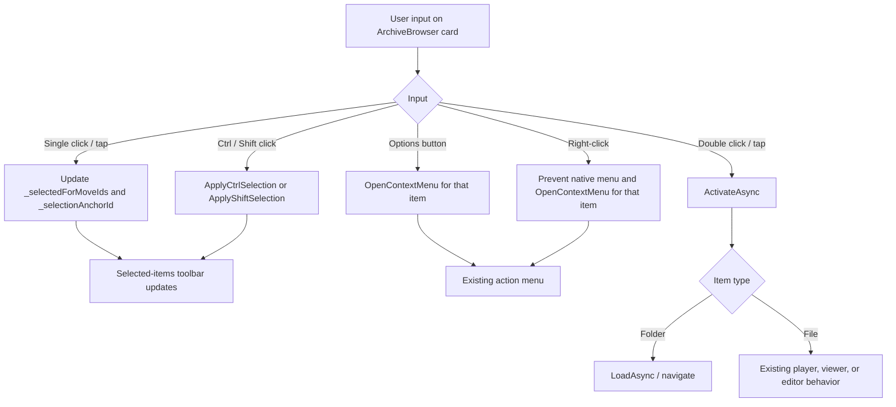

# Plan: Google Drive-Style Archive Card Interactions

## Table of Contents

- [Summary](#summary)
- [Technical Approach](#technical-approach)
- [Component Breakdown](#component-breakdown)
- [Dependencies](#dependencies)
- [External / Vendor Documentation Evidence](#external--vendor-documentation-evidence)
- [Flow](#flow)
- [Risk Assessment](#risk-assessment)

## Summary

Refactor the event handling owned by `ArchiveBrowser.razor` so card selection, card activation, and per-card options are separate input paths. This extends the existing `_selectedForMoveIds`, `_selectionAnchorId`, `_contextMenu`, and `ActivateAsync` responsibilities without changing archive services or APIs.

## Technical Approach

**Component ownership.** `ArchiveBrowser.razor` remains the single owner of selection, activation, context-menu state, and its existing outside-click watcher. Replace the current `HandleCardClick` behavior, which activates a card after non-modifier clicks, with explicit single-selection handling:

- a primary card click/tap selects an unselected item as the sole selection and records the anchor;
- a primary click/tap on a selected item removes it, allowing a sole selection to toggle off;
- Ctrl and Shift maintain the current `ApplyCtrlSelection` / `ApplyShiftSelection` paths;
- selection must not call `ActivateAsync`.

Keep activation in a dedicated double-activation handler on the card button. It calls the existing `ActivateAsync` after guarding against a modifier gesture or a disabled/pending operation. Use Blazor's supported click event directives, including propagation control where necessary, rather than adding application state to JavaScript. Verify the resulting double-click/tap behavior against actual supported browser input; if Blazor's click/double-click ordering creates a brief selection before activation, that is acceptable because activation navigates/opens immediately, but it must not result in a second unintended toggle after the open action.

**Options isolation.** The options control already sits in a wrapper with `@onclick:stopPropagation`. Preserve it and add any needed click/double-click/context-menu propagation directives directly to the options wrapper/button so its event never reaches the selectable card button. `OpenContextMenu(item, args)` must receive the clicked item but must not call a selection routine; this also preserves the confirmed rule that a right-clicked selected or unselected card only opens that card's menu. The rendered menu's current `@onclick:stopPropagation`, keyboard focus and outside-dismiss lifecycle remain unchanged.

**Empty-space dismissal.** Locate the grid-level handler or the existing `addOutsideClickListener` callback before changing it. Ensure an actual blank-grid click still invokes `HandleOutsideClickAsync`, but event containment means card clicks, options-button clicks, context-menu clicks, selection-toolbar clicks, and modal controls cannot clear/change selection as a side effect. Existing overlays continue to block outside clearing through `HasOpenOverlay`.

**Accessibility and presentation.** Retain the `<button>` card surface and options-button accessible names. Reconcile `aria-pressed`, selected badge, and card border with `_selectedForMoveIds` rather than the media-player-only `IsSelected(item)` state where needed, so selection is perceivable for every archive item. Reuse Bootstrap utilities and the existing scoped CSS; introduce CSS only if the selected indicator needs a narrow nonstandard adjustment. No layout redesign or new dependency is needed.

**Testability.** Extract only a small pure selection decision helper if the click/double-click rules cannot be covered clearly through existing component-level source assertions; avoid a new abstraction if handling remains simple and private. Extend the existing source-markup regression pattern in `ArchiveEndpointsTests` for directives/handlers, and add focused xUnit tests under `WebApp.Tests/Client/` for any extracted pure state rule. Manual browser checks cover real mouse and touch event ordering, which the current xUnit suite cannot simulate.

## Component Breakdown

**Existing files to modify:**

- `WebApp/WebApp.Client/Components/ArchiveBrowser.razor` — separate primary selection from double activation; prevent the options button/menu and right-click paths from reaching selection; preserve selection clearing and accessibility state.
- `WebApp/WebApp.Client/Components/ArchiveBrowser.razor.css` — only if required to keep the selected-card cue accessible after selection state is made uniform for all item types.
- `WebApp.Tests/Endpoints/ArchiveEndpointsTests.cs` — extend the existing `Archive_browser_markup_uses_unified_dropdown_cards_and_keeps_video_grid_specialized` source-level regression coverage for the required card event wiring.
- `README.md` — update the `## Current Supported Features` row that describes the Archive Browser interaction, as required for a user-facing feature change.

**New files to create:**

- None expected. If a pure selection helper is justified during implementation, create its matching `WebApp.Tests/Client/*Tests.cs` test file in the same change.

## Dependencies

- Existing Blazor WebAssembly host/client split and `ArchiveBrowser.razor` event flow.
- Bootstrap 5.3.8 and Bootstrap Icons 1.13.1 already loaded by the application.
- Docker Compose test workflow: `make test`; manual application verification: `make docker-run`.
- No external services, package additions, configuration, or endpoint changes.

## External / Vendor Documentation Evidence

Verified on September 29, 2026 against [ASP.NET Core Blazor event handling](https://learn.microsoft.com/aspnet/core/blazor/components/event-handling?view=aspnetcore-10.0): .NET 10 supports delegate event handlers in `@on{DOM EVENT}` Razor markup, `@on{DOM EVENT}:preventDefault`, and `@on{DOM EVENT}:stopPropagation`. The implementation uses those supported directives for separate single-click, double-click, and context-menu paths. The documentation notes that `stopPropagation` is scoped to Blazor; the component's existing DOM outside-click watcher independently checks `root.contains(event.target)`, so legitimate interactions inside the Archive Browser remain contained there as well.

## Flow

## Risk Assessment

| Risk | Evidence | Mitigation |
| --- | --- | --- |
| A double-click generates preceding click events and may select before opening | Browser click event ordering; current handler couples single click to activation | Keep selection and activation handlers explicit; manually test desktop double-click and mobile double-tap, including a previously selected card. |
| Nested options button bubbles into the card interaction | The bug report identifies this exact overlap; the card has a selectable nested button | Stop propagation at the options control and assert that options wiring remains separate from card selection. |
| New selection state is unclear for non-media items | `IsSelected(item)` currently includes player-state logic for video/music | Render a consistent selection cue from `_selectedForMoveIds`; preserve player indication separately if it has distinct meaning. |
| Outside-click listener clears selection during legitimate controls | `HandleOutsideClickAsync` is JS-triggered and clears selection when no overlay is open | Confirm DOM containment and propagation behavior for toolbar, menu, cards, and options button in manual testing. |
| Touch double-tap differs by browser | Double-tap gesture handling varies on mobile browsers | Validate on a touch browser; retain semantic buttons and no-JS server/API behavior as a safe fallback. |
