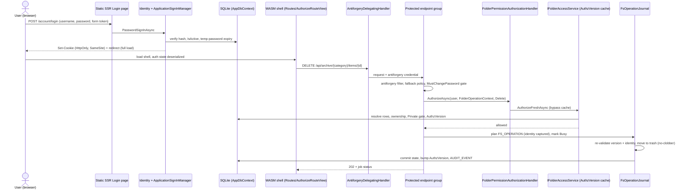

# Plan: SQLite User Accounts and Folder ACL

## Table of Contents

- [Summary](#summary)
- [Technical Approach](#technical-approach)
- [Component Breakdown](#component-breakdown)
- [Dependencies](#dependencies)
- [External / Vendor Documentation Evidence](#external--vendor-documentation-evidence)
- [Flow](#flow)
- [Risk Assessment](#risk-assessment)

## Summary

Add an EF Core SQLite database (`AppDbContext`, Identity + app tables) on a dedicated `appdata` volume, cookie-authenticated ASP.NET Core Identity with static-SSR account pages inside the existing global Interactive WebAssembly shell, a single resource-based authorization handler for folder ACLs, and per-user/durable replacements for the JSON stores, following the repo's existing pattern of validated `*Options`, interface-fronted singleton/scoped services, minimal-API endpoint groups in `WebApp/WebApp/Endpoints/`, browser-safe DTOs in `WebApp.Client/Models/`, and xUnit + `WebApplicationFactory` tests. Design authority is [`sqlite-migration-user-access-erd.md`](sqlite-migration-user-access-erd.md) (v7, amended by this spec); this plan maps it onto real files and orders the work as dependency-ordered workstreams P1–P5. The implementing agent is authorized to complete every workstream without a phase-approval or spike-wait stop.

## P0 Validation Baseline (2026-09-30)

The disposable P0 implementation was removed after manual verification; it was never production functionality. The user has confirmed that P0 works. Its results are the settled implementation baseline for P1–P5; the production implementation must retain the corresponding automated coverage, but P0 creates no remaining implementation or approval gate.

| Check | Result | Evidence |
| --- | --- | --- |
| Static SSR account route and conditional render mode | Passed | A server-project route marked `ExcludeFromInteractiveRouting` rendered directly and after refresh, including with browser JavaScript disabled. A server-only account layout was required; rendering the interactive client layout failed because it depended on client-only player state. |
| Static SSR form antiforgery | Passed | The initial form-token wiring and static form-model binding errors were detected and corrected during the spike; sign-in completed only with the framework-provided `EditForm` token. |
| Static SSR Identity cookie → protected API | Passed | A static sign-in issued a cookie; a same-origin `GET` to a protected probe API identified the signed-in user. Signing out caused the protected API to redirect to the spike login page. |
| WASM antiforgery token acquisition and protected POST | Passed | A WebAssembly `DelegatingHandler` fetched a token from an authenticated endpoint and attached it to a protected POST, which returned 200. The same POST without the header returned 400. |
| Stale-token refresh exactly once; streamed/multipart no retry | Passed | User-confirmed P0 validation; production coverage is required by FR1/FR13. |
| Two-tab logout and expired-cookie behavior | Passed | User-confirmed P0 validation; production coverage is required by FR1/FR11. |
| Auth-state serialization/deserialization and `AuthorizeRouteView` after login/logout/reset | Passed | User-confirmed P0 validation; production coverage is required by FR1/FR15. |
| Custom `SignInManager` password, TOTP, and recovery-code paths | Passed | User-confirmed P0 validation; production coverage is required by FR1/FR8. |
| SQLite foreign-key enforcement and atomic `AuthzVersion` bump | Passed | User-confirmed P0 validation; production coverage is required by FR1/FR3/FR21. |

**P0 status: complete.** Implement P1–P5 as one continuous, dependency-ordered scope. Record production test results as part of the normal validation suite.

## Technical Approach

**Pattern extended.** Layered services behind interfaces registered in `WebApp/WebApp/Program.cs`; minimal API groups per area (`MapVideoEndpoints`, `MapCutEndpoints`, `MapCompositionEndpoints`, `MapArchiveEndpoints`, `MapStorageEndpoints`, `MapDashboardEndpoints`); validated options classes in `WebApp/WebApp/Configuration/`; client-owned shell/routing in `WebApp.Client`. Nothing here replaces the opaque-ID, snapshot, or FFmpeg designs.

**Ownership of responsibilities.**

| Concern | Owner |
| --- | --- |
| DB location/validation | `Configuration/DatabaseOptions.cs` |
| Schema, migrations, FK pragma, partial indexes | `Data/AppDbContext.cs`, `Data/Migrations/`, entity configurations in `Data/Configurations/` |
| Accounts | `Identity/ApplicationUser.cs`, `ApplicationSignInManager.cs`, `AccountLifecycleService` (create/reset/deactivate/delete/last-admin guard), `AdminCli` |
| Authorization decision | `Authorization/FolderPermissionAuthorizationHandler.cs` (pure algorithm in `FolderPermissionResolver`, fed by `IFolderTreeReader`) |
| Caching/freshness | `Authorization/FolderAccessService.cs` (`IFolderAccessService`), `AuthzVersionStore` |
| Delegation rules | `Authorization/PermissionWriteService.cs` (+ pure `DelegationRules`) |
| CSRF | `Security/AntiforgeryEndpointFilter.cs`, client `AntiforgeryDelegatingHandler` |
| Media identity | `Data/MediaItemRepository.cs`, `Services/MediaIdentityClassifier.cs`, `MediaReconciliationService.cs` |
| Per-user data | `Services/Sqlite*Service.cs` implementing the existing `IEpub*`/`IComic*`/`IArchiveFavorites`/`ICustomStorageView` interfaces |
| Jobs / counters | `Services/SqliteJobStore.cs` behind the three existing status-store interfaces; `NamingCounterService` |
| Filesystem journal | `Services/FsOperationJournal.cs`, `FsIdentity.cs`, `FsRecoveryService.cs` (one recovery class per op type) |
| Audit | `AuditWriter` |

**Keeping existing interfaces.** `IEpubNoteService`, `IEpubHighlightService`, `IEpubProgressService`, `IComicProgressService`, `IEpubReaderThemeService`, `IArchiveFavoritesService`, `ICustomStorageViewService`, and the three `*JobStatusStore` interfaces are kept so endpoints and components change minimally; signatures gain the current user (resolved from `IHttpContextAccessor`/`ClaimsPrincipal` in endpoints, never from client input). The JSON implementations are deleted after import (FR37), not left behind a flag.

**Identity shape.** `AddIdentityCore<ApplicationUser>().AddRoles<IdentityRole>().AddEntityFrameworkStores<AppDbContext>().AddSignInManager<ApplicationSignInManager>().AddDefaultTokenProviders()` plus `AddAuthentication(IdentityConstants.ApplicationScheme).AddIdentityCookies()`, rather than `AddDefaultIdentity`, because no default UI or email sender is wanted. `DbContext` is the normal scoped context (Identity requires it; factory contexts are used only in hosted workers). The repo's singleton services that need the DB take `IDbContextFactory<AppDbContext>` or create scopes; Identity pages use scoped `AppDbContext`.

**Render mode / routing.** `App.razor` replaces the hardcoded `InteractiveWebAssemblyRenderMode(prerender: false)` on `<HeadOutlet>` and `<Routes>` with a `PageRenderMode` that is null when `HttpContext.AcceptsInteractiveRouting()` is false. Account pages in `WebApp/WebApp/Components/Account/` carry `[ExcludeFromInteractiveRouting]` (the legitimate exception `AGENTS.md` anticipates). `WebApp.Client/Routes.razor` switches `RouteView` to `AuthorizeRouteView` and the server-side router is given the client assembly via the existing `AddAdditionalAssemblies`; links into static pages use `forceLoad`. The spike (P0) confirms how the WASM router hands off to static pages; Learn notes the client auth state is **fixed for the WebAssembly app's lifetime**, so sign-in/out always causes a full page navigation.

**Authorization.** Fallback policy `RequireAuthenticatedUser` + a `MustChangePasswordRequirement`. Content endpoints call `IAuthorizationService.AuthorizeAsync(user, FolderOperationContext, FolderOperations.X)` (imperative, resource-based). An `IFolderAccessService` adds the version-stamped readable-folder set for list/search and `AuthorizeFreshAsync` for sensitive operations. An endpoint filter `RequireFolderPermission(op, resolver)` keeps endpoint bodies free of hand-written checks; a coverage test asserts every `/api` endpoint declares either a folder permission, `Admin`, or an explicit "self-scoped" marker.

**Opaque IDs vs `FolderId`/`MediaItemId`.** Browser-facing IDs stay as they are today (snapshot-scoped opaque IDs from `ArchiveService`/`VideoLibraryService`). Each snapshot entry is mapped server-side to a `MediaItemId`/`FolderId` via the repository at resolve time (`TryResolveItem` → entry → folder/media row). No DB id or path is sent to the browser.

**SQLite specifics** (from Learn): `Microsoft.Data.Sqlite` enables FKs by default with `SQLitePCLRaw.bundle_e_sqlite3`; a test still asserts `PRAGMA foreign_keys` per connection. Use `DateTime` (UTC) rather than `DateTimeOffset`; no DB-generated concurrency tokens, so `ConcurrencyStamp` is an application-generated GUID column marked `IsConcurrencyToken()`. Migrations that alter columns/FKs use EF's table rebuild, reviewed by hand; migration locking (`__EFMigrationsLock`) can be abandoned by a killed process, so migrations run only at web-host startup and clearing a stuck lock is a separate, confirmed operator command (`make db-unlock-migration`), never part of admin recovery (FR58). Only one app instance writes the file; WAL mode (`PRAGMA journal_mode=WAL`) and `busy_timeout` are set on connect.

**Frontend (design-guide conformance).** All pages are Bootstrap-first; scoped CSS only where Bootstrap cannot express it (e.g., the permission-matrix cell states may need `.razor.css` for filled/outlined provenance cues only if utilities/`btn-check` cannot).

| View | Path | Rendering | Key components / states |
| --- | --- | --- | --- |
| Login | `/account/login` | static SSR | Bootstrap card + form (design guide "Forms — states"), gold `btn-primary` "Sign in"; `alert alert-danger` with `role="alert"` for invalid/deactivated/expired-temp-password; lockout message |
| 2FA / recovery | `/account/login-2fa`, `/account/login-recovery` | static SSR | single-field forms, autofocus, `inputmode="numeric"` |
| Change password | `/account/change-password` | static SSR | also the forced-change page; current + new + confirm; expiry notice |
| Manage 2FA | `/account/manage/two-factor` | static SSR | QR inline SVG + shared key, enable/disable/reset, recovery-code list with copy button and a "shown once" `alert-warning` |
| Shell user menu | `MainLayout`/`Sidebar` | interactive | Bootstrap dropdown (guide "Dropdowns"), `bi-person-circle` icon, tooltip on icon-only trigger |
| Users | `/admin/users` | interactive | responsive table → cards on narrow screens, badges (Active/Deactivated/Admin/Must change), icon-only row actions with tooltips and 40×40 targets, Bootstrap modals for reset/delete (shown-once temp password with copy), empty and loading states |
| User access | `/admin/users/{id}/access` | interactive | folder tree rows with five `btn-check` cells, provenance badges, inert/suspended tags, Private toggle with impact modal, owner-vs-deny dialog with three buttons |
| Review queue | `/admin/folders/review` | interactive | tabs: folders / media / interrupted operations; evidence list, relink/accept/reattach/keep-archived actions with effect preview |

Accessibility: visible focus, programmatic toggle state for icon toggles, live regions for save/conflict results (`role="status"`/`alert`), no color-only provenance (text label + icon), reduced-motion respected, dark and light tokens verified at WCAG AA. Empty/loading/error states are specified per page above and validated manually.

**Review amendments (resolving the spec review).**

1. **Rollback and backups (FR53, FR57).** `make db-backup` runs a CLI mode that uses `SqliteConnection.BackupDatabase` (online, consistent, blocks writers only while it runs) into `/appdata/backups/<utc-timestamp>/`, copies the Data Protection key directory next to it, then verifies the copy (opens, `PRAGMA integrity_check`, migration version). An offline alternative (stop the container, copy database + `-wal`/`-shm` together) is documented; copying live files is explicitly unsupported. A verified backup is required before applying production migrations, but it does not block source implementation. The rollback section separates *deployment rollback* (restore a verified backup and accept that notes, progress, and account changes made after it are lost — the docs list exactly what) from *emergency rollback to an unauthenticated build*, which is never automatic or flagged and is an explicit operator decision because it re-exposes the archive. The P5 journal and `FsRecoveryService` are never disabled while any `FS_OPERATION` row is non-terminal; a rollback of P5 first requires all rows resolved (Committed/Aborted/NeedsReview-resolved) or restoring a backup **together with** a filesystem check.
2. **Durable jobs (FR39, FR59).** Endpoints still accept snapshot IDs from the browser. `JobEnqueueService` resolves them immediately through the repository into `(MediaItemId, FolderId, captured identity: size, mtime, ContentFingerprint, ContentRevision)` and stores that in `JOB.PayloadJson`. Workers (`CutBackgroundWorker`, `CompositionBackgroundWorker`, `VideoConversionBackgroundWorker`, `ArchiveMutationBackgroundWorker`, audio-track remux) resolve the stable identity to a current path server-side at execution, verify `Status = Active` and identity match, then `AuthorizeFreshAsync` for `JOB.UserId`. Anything else fails generically. On startup, non-terminal jobs are failed as interrupted unless the existing worker already supports safe resume and passes the same rechecks.
3. **Antiforgery on forms (FR1, FR13).** Two independent protections: the Blazor form token (`UseAntiforgery`, `<AntiforgeryToken />`/`EditForm`) for static-SSR account and admin forms, and the route-group filter for APIs. The P0 spike and `AntiforgeryCoverageTests` cover both; `AntiforgeryDelegatingHandler` retries once only when the request content is replayable (buffered JSON/form), never for streamed or multipart uploads (the `ArchiveUploadService` resumable chunks already retry at the application level with idempotent chunk offsets).
4. **Ordinary-user activation invariant (FR56).** `AccountLifecycleService` refuses to create, activate, or sign in a non-Admin until the completed application's `IFolderAccessEnforcement` and seeded folder model are registered. This runtime invariant is implemented alongside P2, not a reason to defer P2 or any later work.
5. **Expired temporary password (FR54).** `/admin/users` shows an "expired" badge derived from `MustChangePassword && TemporaryPasswordExpiresAt < now`; the reset action is always enabled. The sign-in page shows the specific expiry message only after the password verified; all pre-verification failures share one generic message.
6. **Data Protection (FR55).** `AddDataProtection().SetApplicationName("PereneArchive").PersistKeysToFileSystem(new DirectoryInfo(DataProtection:KeyPath))`, default `/appdata/keys`, created with operator-only permissions. Learn warns that an explicit location disables default at-rest key encryption; this specification deliberately relies on the operator-only volume, backups, and no-log/no-repo handling, without introducing a second encryption mechanism.
7. **Cross-volume moves (FR60).** `FsVolumeProbe` compares `st_dev` (or a mount-point check) of source and destination; `FsOperationJournal` dispatches to `SameVolumeMoveExecutor` (rename, ERD protocol) or `CrossVolumeMoveExecutor` (stage-copy on the destination volume, verify, no-clobber publish, commit, source to that volume's trash). `FsRecoveryService` gains a `CrossVolumeMoveRecovery` table: partial/unverified staging → delete staging by recorded identity and abort with the source untouched; verified staging without destination publish → complete publish or abort; destination published and DB committed → trash the source; source already trashed → roll forward; any identity mismatch → `NeedsReview`. `FS_OPERATION.OpType` gains `CrossVolumeMove` and `DiskStepsDone` counts its steps. Trash is per volume, so the source-side trash lives on the source volume.
8. **CLI vs server vs migrations (FR58).** Only the web host migrates, at startup, via `Database.MigrateAsync` (not in a transaction). CLI commands open the database read-write but never migrate and exit non-zero if the schema version differs from the compiled model. They may run beside the web container (WAL + `busy_timeout`); account changes bump the security stamp and `AuthzVersion` in one transaction. `make db-unlock-migration` is the only way to clear `__EFMigrationsLock`; it prints what it found, requires `CONFIRM=yes`, and first checks that the web container is stopped and no other process holds the database (`BEGIN IMMEDIATE` succeeds); `admin-recover` never touches the lock.

**Why new packages are necessary.** EF Core SQLite and Identity EF stores are the documented way to persist Identity on SQLite; a QR library is required because TOTP enrollment needs a QR and the repo has no generator (Learn's Blazor guidance uses `Net.Codecrete.QrCodeGenerator`, rendered server-side as SVG so no frontend library is added). No frontend framework or JS library is added; antiforgery/auth JS, if any, stays in the existing focused `theme.js`/`bootstrapInterop.js` style.

## Component Breakdown

**Existing files to modify:**

- `WebApp/WebApp/WebApp.csproj` — add the four packages (via `make dotnet`).
- `WebApp/WebApp/Program.cs` — register options, `AppDbContext`, Identity, cookie/security-stamp options, fallback policy, `UseAuthentication`/`UseAuthorization` **before** `UseAntiforgery`, route-group filters, CLI short-circuit, migration-at-startup, new hosted workers; keep host allowlist and HTTPS behavior.
- `WebApp/WebApp/Components/App.razor` — conditional render mode; anti-flash theme script stays first.
- `WebApp/WebApp.Client/Routes.razor`, `Program.cs`, `Layout/MainLayout.razor`, `Layout/Sidebar.razor` — `AuthorizeRouteView`, cascading auth state, deserialization, user menu, Admin nav, `AntiforgeryDelegatingHandler` on the shared `HttpClient`.
- `WebApp/WebApp/Endpoints/{Video,Cut,Composition,Storage,Archive,Dashboard}Endpoints.cs` — move into protected route groups; per-endpoint folder permission filters; 404/403 semantics; current-user scoping for notes/highlights/progress/favorites/themes/views.
- `WebApp/WebApp/Services/ArchiveService.cs`, `VideoLibraryService.cs`, `VideoCutService.cs`, `VideoCompositionService.cs` — expose folder/media mapping, readable-set filtering of listings and search, folder-stub logic, journaled mutation paths.
- `WebApp/WebApp/Services/ArchiveMutationExecutor.cs`, `ArchiveUploadService.cs`, `ArchiveMutationBackgroundWorker.cs`, `CutBackgroundWorker.cs`, `CompositionBackgroundWorker.cs`, `VideoConversionBackgroundWorker.cs` — route disk changes through the journal, carry `JobId`/user, re-authorize at execution.
- `WebApp/WebApp/Services/{Epub*,ComicProgress,ArchiveFavorites,CustomStorageView}Service.cs` — replaced by SQLite-backed implementations (files deleted after import, FR37).
- `WebApp/WebApp/Services/{Composition,ArchiveMutation,VideoConversion}JobStatusStore*.cs`, `{Cut,Composition,ImageCrop}NamingService.cs`, `VideoConversionServices.cs` (naming) — backed by `JOB` / `NamingCounters`.
- `docker-compose.yml` — `appdata` named volume at `/appdata`, `Database__Path`, optional `Identity__*` cookie settings; `docker-compose.test.yml` — disposable `Database__Path` volume.
- `Makefile` — `admin-create`, `admin-recover`, `db-backup`, `db-unlock-migration` (confirmation required), help text; `Dockerfile` — `dotnet-ef` tool install; `.env.example` — no secrets, optional session settings only.
- `WebApp/WebApp/wwwroot/app.css` — only token/variable mappings if a gap is found; `README.md` (Current Supported Features) and `AGENTS.md` — at implementation time.
- `WebApp.Tests/WebApp.Tests.csproj` — only if a test-only package is needed.

**New files to create:**

- `WebApp/WebApp/Configuration/DatabaseOptions.cs`, `AuthOptions.cs` (cookie lifetime, temp-password expiry/grace, lockout).
- `WebApp/WebApp/Data/AppDbContext.cs`, `Data/Entities/*.cs` (Folder, FolderPermission, AccessPolicy, MediaItem, BookNote, BookHighlight, ReadingProgress, ComicProgress, Favorite, ReaderTheme, CustomStorageView, Job, AuditEvent, FsOperation, NamingCounter), `Data/Configurations/*.cs`, `Data/Migrations/*`, `Data/MediaItemRepository.cs`, `Data/FolderRepository.cs`.
- `WebApp/WebApp/Identity/{ApplicationUser,ApplicationSignInManager,AccountLifecycleService,AdminCli,LastAdminGuard}.cs`.
- `WebApp/WebApp/Components/Account/**` (static SSR pages + `IdentityRedirectManager`-style helper) and `Endpoints/AccountEndpoints.cs`, `AdminUserEndpoints.cs`, `AdminAccessEndpoints.cs`, `AdminReviewEndpoints.cs`, `AntiforgeryEndpoints.cs` (if mechanism B).
- `WebApp/WebApp/Authorization/{FolderOperations,FolderOperationContext,FolderPermissionResolver,FolderPermissionAuthorizationHandler,FolderAccessService,PermissionWriteService,DelegationRules,AuthzVersionStore,MustChangePasswordRequirement}.cs`.
- `WebApp/WebApp/Security/AntiforgeryEndpointFilter.cs`.
- `WebApp/WebApp/Services/{MediaIdentityClassifier,MediaFingerprint,MediaReconciliationService,FolderReconciliationService,FsIdentity,FsVolumeProbe,FsOperationJournal,SameVolumeMoveExecutor,CrossVolumeMoveExecutor,FsRecoveryService,LegacyDataImporter,NamingCounterService,SqliteJobStore,JobEnqueueService,AuditWriter,DatabaseBackupService}.cs` and `Sqlite*` per-user service implementations.
- `WebApp/WebApp/Security/DataProtectionConfiguration.cs`, `Authorization/IFolderAccessEnforcement.cs` (P1 gate marker, registered by P2).
- `WebApp/WebApp.Client/Components/Admin/**`, `WebApp.Client/Pages/Admin/{Users,UserAccess,ReviewQueue}.razor` (+ scoped CSS only if needed), `Services/AntiforgeryDelegatingHandler.cs`, `Models/` DTOs (`UserSummaryDto`, `FolderAccessRowDto`, `PermissionCellDto`, etc., no paths).
- Tests under `WebApp.Tests/{Data,Identity,Authorization,Endpoints,Services,Client}/` mirroring the above.

## Dependencies

- Docker Compose runtime; a writable `appdata` named volume at `/appdata`; existing `/archive`, `/previews` mounts.
- NuGet (added only through `make dotnet ARGS=...`): `Microsoft.EntityFrameworkCore.Sqlite`, `Microsoft.EntityFrameworkCore.Design`, `Microsoft.AspNetCore.Identity.EntityFrameworkCore`, `Net.Codecrete.QrCodeGenerator`; tool `dotnet-ef` inside the image. Versions confirmed against NuGet for `net10.0` at implementation time.
- Internet access during image build/restore (NuGet) as today; CDN dependencies unchanged.
- Host: operator runs `make admin-create` once before first use; `.env` unchanged except optional values.
- Requires that `make docker-reset` is understood to delete the `appdata` volume (and therefore all accounts, the database, and the Data Protection keys); docs must say so. Backup guidance: use `make db-backup` (online `BackupDatabase`) or stop the app and copy the database files together; never copy live files. Backups include `/appdata/keys`.
- `appdata` holds `perene.db`, `keys/`, and `backups/`; `DataProtection__KeyPath` (default `/appdata/keys`) and `Database__BackupPath` are validated options.

## External / Vendor Documentation Evidence

Retrieved through the Microsoft Learn MCP during this spec pass; the ERD cites additional Learn pages that must be **re-verified at implementation time** per `AGENTS.md`.

- Blazor auth in Web Apps — <https://learn.microsoft.com/aspnet/core/blazor/security/?view=aspnetcore-10.0#server-side-blazor-authentication>: with Interactive WebAssembly the server handles all auth and Identity components render statically; the server calls `AddAuthenticationStateSerialization`, the client `AddAuthenticationStateDeserialization`, and state flows through `PersistentComponentState`. `IdentityRevalidatingAuthenticationStateProvider` is Interactive Server only; Blazor Identity expects a non-factory `DbContext`. → Static SSR account pages, scoped `DbContext` for Identity, no revalidating provider; session invalidation relies on the cookie security-stamp validator.
- Fixed client auth state — <https://learn.microsoft.com/aspnet/core/blazor/security/blazor-web-app-with-entra?view=aspnetcore-10.0>: "The authentication state is fixed for the lifetime of the WebAssembly application." → login/logout are full-page navigations; the antiforgery handler drops cached tokens on auth change.
- WASM authorization is bypassable — <https://learn.microsoft.com/aspnet/core/blazor/security/webassembly/?view=aspnetcore-10.0#authorization>: always authorize on the server in API endpoints. → The enforcement matrix is server-side; Blazor hiding is cosmetic.
- Cookie vs token — same page, "Authentication library": Blazor WASM's built-in design prefers tokens; cookie auth is the documented alternative (`#cookie-based-authentication` in the antiforgery article) and requires CSRF defenses. → Cookie auth chosen for same-origin LAN hosting, with explicit antiforgery (FR13).
- TOTP QR codes — <https://learn.microsoft.com/aspnet/core/blazor/security/qrcodes-for-authenticator-apps?view=aspnetcore-10.0>: use a QR library (`Net.Codecrete.QrCodeGenerator`), render an SVG path, change the `GenerateQrCodeUri` issuer to a meaningful site name (≤ 30 chars), keep the shared key secret, mind TOTP clock skew. → Enrollment page design and package choice; issuer "PereneArchive".
- SQLite provider — <https://learn.microsoft.com/ef/core/providers/sqlite/limitations>: limited migration operations (table rebuild), no `DateTimeOffset` ordering/comparison, no DB-generated concurrency tokens, `__EFMigrationsLock` can be abandoned. → Use UTC `DateTime`, app-side `ConcurrencyStamp`, reviewed rebuild migrations, lock-clearing recovery step.
- Applying migrations — <https://learn.microsoft.com/ef/core/managing-schemas/migrations/applying#migration-locking>: EF 9+ `Migrate` takes a lock, can't run in an explicit transaction, and throws on pending model changes. → Run `MigrateAsync` once at startup outside a transaction; add a CI-style `dotnet ef migrations has-pending-model-changes` check to validation.
- SQLite FK default — <https://learn.microsoft.com/ef/core/what-is-new/ef-core-3.x/breaking-changes#low-impact-changes>: FK enforcement is on by default with `SQLitePCLRaw.bundle_e_sqlite3`; otherwise `Foreign Keys=True`. → Set it explicitly in the connection string and assert in a test.
- Data Protection — <https://learn.microsoft.com/aspnet/core/security/data-protection/configuration/overview?view=aspnetcore-10.0#persisting-keys-when-hosting-in-a-docker-container>: in Docker, keys must live on a persistent volume; without persisted keys, cookies and CSRF tokens become invalid on restart (<https://learn.microsoft.com/aspnet/core/host-and-deploy/iis/advanced?view=aspnetcore-10.0>); key-storage page (<https://learn.microsoft.com/aspnet/core/security/data-protection/implementation/key-storage-providers?view=aspnetcore-10.0>) warns that an explicit persistence location disables default encryption at rest and that the key ring needs restricted permissions. → FR55, key directory on `appdata`, included in backups, protected by the operator-only volume.
- SQLite online backup — <https://learn.microsoft.com/dotnet/standard/data/sqlite/backup>: `SqliteConnection.BackupDatabase` backs up a running database but blocks other writers while it runs. → `make db-backup` uses it (brief write pause acceptable at household scale); live file copying is not a supported procedure. `VACUUM INTO` (SQLite feature, not Learn-documented here) is the documented-by-SQLite alternative; verify before adopting.
- Carried from the ERD (verify again when implementing): resource-based authorization (`IAuthorizationService` imperative checks, `OperationAuthorizationRequirement`); fallback authorization policy; antiforgery (`UseAntiforgery` after auth/authz; middleware validates POST/PUT/PATCH only and does not cover JSON/DELETE automatically; the automatic `Sec-Fetch-Site` protection is .NET 11 only); `SignInManager.CanSignInAsync`; `UserManager.GeneratePasswordResetTokenAsync`/`ResetPasswordAsync`/`ResetAuthenticatorKeyAsync`/`GenerateNewTwoFactorRecoveryCodesAsync`; `SecurityStampValidatorOptions.ValidationInterval`; EF cascade-delete behaviors; SQLite partial indexes (`HasFilter`).
- **Repo constraints vs Learn:** Learn's Blazor Identity template assumes per-page interactivity and a separate SPA token model; this repo keeps global Interactive WebAssembly, a client-owned `Routes.razor`, same-origin cookie auth, Docker-only workflow, and its host-header allowlist. Where they differ, the repo's constraints win and the P0 spike proves the adaptation.

## Flow

## Risk Assessment

| Risk | Evidence | Mitigation |
| --- | --- | --- |
| Identity template does not fit global WASM shape; static pages unreachable or NotFound from client router | `App.razor` hardcodes the render mode; `Routes.razor` has one `AppAssembly` and `RouteView` (ERD findings 1–3) | P0 spike gate with pass/fail checklist; forced full-page navigation for account links |
| Antiforgery token cannot be delivered/refreshed in the WASM client | `AntiforgeryStateProvider` documented for server-rendered components; client auth state fixed for app lifetime | Three candidates (A/B/C) spiked across login/logout/expiry/two-tab; handler retries once; coverage test; user sign-off if C |
| Auth-everywhere breaks 88 existing endpoint registrations and 60+ existing test classes using `WebApplicationFactory` | `grep` of `Map*` in `Endpoints/` = 88; `WebApp.Tests/Endpoints/*` | Shared test auth handler/fixture that signs in a test Admin or user; fallback policy is default so regressions are loud; migrate test classes phase by phase |
| Big-bang scope (full ERD) raises regression and review risk | 52 FRs across six phases | Gated phases each with a green `make test` and manual check before the next; each phase leaves the app shippable |
| SQLite file corruption/loss with `make docker-reset` or single-volume failure | `docker-compose.yml` uses named volumes; reset deletes volumes | Document; dedicated `appdata` volume distinct from caches; verified online backup (`make db-backup`) before each phase; WAL + single writer |
| Live-file copy produces an inconsistent backup | WAL/`-shm` change while the app writes | Only online `BackupDatabase` or stopped-app copy are supported; restore test in validation |
| Lost Data Protection keys invalidate cookies/tokens after restore or rebuild | Keys default to in-container storage | Persist to `/appdata/keys`, back up with the DB, restart test |
| Migration lock left behind after a kill | Learn: `__EFMigrationsLock` abandoned locks block migrations | Separate `make db-unlock-migration` with confirmation and liveness check; never automatic, never in `admin-recover`; test kill-during-migrate |
| CLI and web host use the DB at the same time | CLI shares the file with a running container | CLI never migrates, checks schema version, WAL + busy timeout, security-stamp/`AuthzVersion` bump in one transaction; concurrency regression test |
| Rollback re-exposes the archive or loses newer data | Earlier rollback text reverted to unauthenticated build / older backup | Emergency rollback is an explicit operator decision; deployment rollback documents what a restore discards; P5 journal never disabled with unresolved rows |
| Persisted job references a vanished snapshot or changed file | Snapshot IDs are per-scan | Jobs store stable identities, recheck identity + fresh authorization at execution (FR59) |
| Static SSR forms lack CSRF coverage | Endpoint-only coverage test misses forms | Form-token tests for every account/admin form; P0 negative case on both paths |
| Non-admin accounts active before ACL exists | P1 ships before P2 | Enforced gate G1: Admin-only sign-in until `IFolderAccessEnforcement` is registered |
| Cross-disk move mistaken for completed rename | NAS folders may sit on different filesystems | `CrossVolumeMove` protocol (stage, verify, publish, commit, then trash source) and its own recovery table; crash-at-each-step tests |
| Write contention between workers and requests on one SQLite file | Many `BackgroundService` workers + Kestrel | WAL, `busy_timeout`, short transactions, per-folder reconciliation serialization, retry on `SQLITE_BUSY` |
| Permission-resolution bugs leak content | Complex rules (Private gate, enforced, ownership, locks) | Pure `FolderPermissionResolver` with table-driven tests for every ERD worked-example step; fail closed; 404 for unreadable |
| Stale authorization cache | Cache keyed by `AuthzVersion` | Bump in same transaction as every trigger; fresh check for sensitive ops; test each trigger |
| Legacy import maps old hash keys wrongly | Keys hash `category:itemId:size:mtime`; itemIds are snapshot-scoped | Importer recomputes keys against current snapshot, skips unmatched with a report, idempotent, never deletes sources, runs once under Admin |
| Filesystem journal/recovery mistakes destroy data | NAS shared with other processes | No-clobber primitives, trash instead of unlink, identity checks, `NeedsReview` on any doubt, crash-injection tests |
| Inode read not available on NAS mount | Mount capability varies | `FsFileId` nullable; fallback rules (FR52) |
| Path leakage via new admin/review UI or audit | Privacy constraint in `AGENTS.md` | DTOs carry names/ids only; review UI shows relative display names, never `RelativePath`; tests scan serialized responses for the archive root |
| New UI drifts from the design system | Mandatory design guide | Bootstrap-only composition checklist in Validation; manual dark/light/mobile pass |
| Editing `AGENTS.md` constraint "no auth layer" inconsistent after merge | Existing doc states it | Definition of Done includes `init-agent` update and README table row |
