# SQLite Migration: User & Folder-Access Entity Relationship Diagram (v7)

Companion to [`sqlite-migration-candidates.md`](sqlite-migration-candidates.md). That
inventory lists the JSON/file-based bookkeeping already in the app; this document
folds in a new **application-level user/admin scope** — distinct from the host-OS
`perenearchive` group in
[`Specs/20260917115522-root-runtime-and-archive-group-access/`](../20260917115522-root-runtime-and-archive-group-access/Requirements.md),
which only controls host filesystem write access for operators, not in-app accounts.

This is an analysis/design artifact and the **baseline** for the spec in this folder
([Requirements.md](Requirements.md), [Plan.md](Plan.md), [Validation.md](Validation.md)).
Nothing here is implemented. Where the spec differs from this document (Shared default
Read-only, optional TOTP, gated phases, FR53–FR60 review amendments), the spec wins.

**v7 changes** (resolving the v6 review; details in
[Review notes](#review-notes-and-microsoft-learn-evidence)). v6 had the right mechanisms;
v7 fixes the edge cases where they interacted badly:

1. **Private is a gate, not only an inheritance boundary** (D7, revised): a user needs
   Read on *every* `Private` ancestor to reach anything below it, including through an
   explicit grant on a descendant. The v6 hole (explicit descendant grant beating a
   closed Private parent) is closed, and D8's separate Private clause folds into this
   one rule.
2. **Delegated-permission protection is tracked per flag** (D11): `FOLDER_PERMISSION`
   gains `AdminLockedMask` (one bit per flag) and a concurrency token. `GrantedByUserId`
   is documented as "last writer", not as an authority signal.
3. **Journal recovery verifies object identity, never just existence** (D12): `FS_OPERATION`
   records the identity of the subject (and of any staging/trash object) at plan time.
   Separate recovery tables for Move/Rename, Delete, Replace, and Create. A stranger's file
   at the old path no longer blocks or corrupts recovery.
4. **Media replacement is classified** (D13): confirmed update / identity-changing
   replacement / uncertain. Only a confirmed update keeps `MediaItemId` live; the other two
   preserve the old annotations but never present them against the new content.
5. **Antiforgery token delivery is provisional** (D14): the `DelegatingHandler` +
   `AntiforgeryStateProvider` mechanism is downgraded from "the design" to "leading
   candidate", with two alternatives and an expanded spike covering static SSR pages,
   initial WebAssembly startup, login, logout, and session expiry.
6. **Media path uniqueness applies to Active items only** (D15): the old
   `UNIQUE (FolderId, RelativePath)` made "keep the old row, create a new one at the same
   path" impossible. It is now a partial unique index `WHERE Status = 'Active'`, with
   ordered free-then-insert transitions and a transition table.

**v6 changes** (previous revision, resolving the v5 review):

1. **Private is an inheritance boundary** (D7): grants on ancestors *above* a `Private`
   folder no longer pass through it. Fixes the "Read on Books survives Private MyLab" leak.
2. **Ownership has limits** (D8): ownership no longer beats an *enforced* deny
   (`FOLDER_PERMISSION.IsEnforced`) or a `Private` boundary the owner was not granted into.
   Ordinary ancestor denies still lose to ownership.
3. **Folder operations name both folders** (D9): rename/move/delete of a folder check the
   folder *and* its parent directory, with a narrow owner-of-entry clause.
4. **Durable filesystem-operation journal** (`FS_OPERATION`, D10): SQLite cannot make
   disk changes transactional, so every move/rename/delete is journaled and reconciled.
5. **Reconciliation needs corroboration**: inode reuse and fingerprint collisions can no
   longer silently carry permissions to the wrong folder; weak evidence → Admin review.
6. **Cache invalidation by `AuthzVersion`** covering deactivation, role, move, and policy
   changes, plus fresh (uncached) authorization at execution time for sensitive operations.
7. **CSRF protection for every unsafe endpoint**, including JSON and DELETE, which
   ASP.NET Core's antiforgery middleware does *not* cover automatically.
8. **Temporary-password expiry is enforced in a custom `SignInManager`**, with a defined
   no-lockout path.
9. **Blazor spike is now a gated checklist**, not an open question.

**v5 changes** (previous revision, resolving the v4 review):

1. **Access model decided first**: default-access policy, inheritance, and ownership
   precedence are now fixed in [Decisions](#decisions-that-drive-everything-else),
   because every later rule depends on them.
2. **Private folders are first-class** (`FOLDER.AccessMode`) — nothing is exposed to the
   whole family by accident.
3. **One operation matrix** covers Create/Read/Write/Delete/Move/Rename/Replace/Manage
   with an explicit dependency rule (no permission works without Read).
4. **`CanManage` defaults to Deny**, is Admin-granted only, and cannot escalate.
5. **Server-side enforcement matrix** for every endpoint class and background job.
6. **Identity flows corrected**: token-based admin reset, forced password change,
   offline admin recovery, and a documented mismatch between this app's render-mode
   setup and the Blazor Identity template.
7. **Filesystem drift** (folders and media renamed/moved/deleted on the NAS) and
   **deleted-user ownership** now have concrete rules instead of open questions.
8. Two v4 example bugs fixed (see [worked example](#worked-example)).

Earlier revisions (v1–v4) are summarized in the review notes at the bottom.

## Scope of the idea

- One **Admin** account (created through the offline CLI, never a default credential)
  can create additional accounts — no self-registration, and no email is ever
  collected. "Admin" is an ASP.NET Core Identity **role**: full access everywhere,
  manages permissions, resets other users' passwords. It carries no other meaning.
  At least one active Admin must always exist (last-admin protection).
- Every user can have their **own** notes, highlights, favorites, and reading/viewing
  progress on the **same** book/media item — today's JSON files key only by `bookKey`,
  so all readers currently share one set. That's the core gap this design closes.
- Access is expressed per **(user, folder)** with four content operations —
  **Read / Write / Create / Delete** — plus **Manage**. Nothing in the schema treats
  one folder or restriction differently from another.
- Folders are either **Shared** (everyone gets the configurable default policy) or
  **Private** (nobody gets anything without an explicit grant or ownership).
- Whenever a user creates a folder through the app, they become its **Owner**, which
  grants them Read/Write/Create/Delete on that exact folder (never Manage).
- Permissions **inherit down the tree**; the more specific rule always wins.

## Decisions that drive everything else

These were flagged first in review because the rest of the authorization system is a
consequence of them. Each is a recommendation; change here before writing the spec.

| # | Decision | Choice | Why |
|---|---|---|---|
| D1 | Default access | Per-folder `AccessMode`: `Shared` (uses global `ACCESS_POLICY`), `Private` (all Deny), or `Inherit`. Roots are seeded `Shared` or `Private` by the admin; the seed default is `Shared` with Read+Create allowed, Write+Delete denied. | Removes the v4 "everyone gets Read/Create everywhere" hard-coding. A private folder is one switch, not one deny row per user. |
| D2 | Inheritance | Per flag, nearest explicit rule up the chain wins. **A deny on a parent is inherited by every descendant** until a descendant row explicitly allows it again. | Same rule for allow and deny; no special cases. |
| D3 | Ownership precedence | On the exact owned folder: enforced deny on any ancestor > explicit row on that folder > ownership > explicit rows on ancestors (up to the Private boundary, D7) > policy default. So an **ordinary** ancestor deny does not override ownership of a child folder, but an **enforced** one does (D8). | "More specific wins" for ordinary rules; a deliberate subtree-wide restriction is a different, explicit kind of rule. The admin UI must say so (see [Owner vs. ancestor deny](#owner-vs-ancestor-deny-communicated-in-the-ui)). |
| D4 | Read gates everything | If effective Read is Deny, Write/Create/Delete/Manage are Deny too. | Removes "Create without Read" and other unusable combinations. A blind drop-box folder is out of scope for v1. |
| D5 | Manage | Default Deny everywhere, never implied by ownership, grantable only by Admin, and can never grant more than the grantor holds. | Prevents delegation from becoming privilege escalation. |
| D6 | Failure mode | Anything ambiguous fails closed: 404 for unreadable resources, 403 for readable-but-forbidden operations, `Private` + review queue for unmatched folders found on disk or interrupted filesystem operations. | A wrong "deny" is an inconvenience; a wrong "allow" is a leak. |
| D7 | `Private` is both an inheritance boundary **and an access gate** (revised in v7) | (a) *Boundary:* resolution walks ancestors only up to and including the nearest `Private` folder; rows above it do not apply, and with no matching row the result is Deny. (b) *Gate:* for target F, the user must resolve `Read = Allow` on **every strict ancestor of F with `AccessMode = Private`**, or all operations on F are Deny — whatever explicit rows or ownership say about F. Admin is the only exception. | v6 implemented (a) for grants but (b) only for ownership, so an explicit Read on `MyLab/Drafts` beat a closed `MyLab`. One rule now: making a folder Private closes its whole subtree to everyone not granted Read on it. Deliberate deep links are made by granting Read on the Private folder too (the admin UI offers it). |
| D8 | Ownership is bounded by enforced restrictions | Ownership of folder F is honored only if no **enforced** deny (`IsEnforced = true`, Admin-only) sits on F or an ancestor. An ordinary (non-enforced) ancestor deny still loses to ownership. The Private-ancestor condition that v6 stated here is now the D7 gate and applies to everything, not only owners. | Distinguishes "I edited a parent" from "I deliberately closed this subtree". |
| D9 | Folder operations check the folder and its parent | See [Folder operations](#folder-operations-folder-and-parent). A parent-side requirement is satisfied for owners of the specific folder ("owner-of-entry"), never for its siblings. | Renaming/moving/deleting a folder edits its parent's directory listing; filesystem semantics must not decide the answer. |
| D10 | Filesystem changes are journaled | Every app-initiated move/rename/delete/replace/create writes a durable `FS_OPERATION` row before touching disk and is reconciled after crashes. | SQLite cannot roll back a `rename(2)`. See [Filesystem operation journal](#filesystem-operation-journal). |
| D11 | Delegated-permission protection is per flag | `FOLDER_PERMISSION.AdminLockedMask` has one bit per flag (Read/Write/Create/Delete). A flag written by Admin is locked by default (Admin may untick "managers may adjust" per flag); managers can change only unlocked flags on a row and can never write a value that loosens a locked ancestor rule for the same user and flag. `Manage` and `IsEnforced` are always Admin-only. Row updates use a concurrency token. | `GrantedByUserId` is only the last writer of *any* flag on the row; it cannot say who owns each flag. Without per-flag protection an Admin's Read could sit beside a manager's Write on one row with no way to tell which is protected. |
| D12 | Recovery decisions rest on object identity, not path existence | Every journal row records the identity (`FsFileId`, size, mtime, and content/child fingerprint) of the subject at plan time. Reconciliation may roll forward or back **only** when the object found at the relevant path matches the recorded identity; any mismatch or missing evidence → `NeedsReview`. | Another NAS process can create a file at the old path, or replace one at the new path. Existence says nothing about *which* object is there. |
| D13 | A media replacement is not automatically the same item | A same-path change with different size/mtime is classified **confirmed update** (same content identity: keep `MediaItemId`), **identity-changing replacement** (different identity: new `MediaItemId`, old one `Superseded`), or **uncertain** (new `MediaItemId`, old one `NeedsReview`). Annotations on superseded/uncertain items are preserved but never shown against the new content. | Notes and highlights on one book must not attach to a different book dropped at the same path. |
| D15 | Path uniqueness applies to Active media items only | `MEDIA_ITEM` has a **partial unique index** `(FolderId, RelativePath) WHERE Status = 'Active'`. `Missing`, `NeedsReview`, and `Superseded` rows keep their last-known path for review but do not occupy it. Every status transition follows the ordering rules in [Media identity](#media-identity-after-filesystem-changes). | A replacement keeps the old row and creates a new one at the *same* path; a full unique constraint would make that impossible. A separate history table was rejected: the old row must keep its `MediaItemId` so annotations stay attached and reattach is a repoint, not a copy. |
| D14 | Antiforgery token delivery is decided by the spike | The server-side rule is fixed (every unsafe endpoint validates a token or an equivalent, via a route-group filter). *How the WebAssembly client obtains and refreshes the token* is provisional until the spike proves it across static SSR, startup, login, logout, and session expiry. | The document assumed `AntiforgeryStateProvider` is usable directly from the WebAssembly client; that has not been demonstrated in this app's global-WASM shape. |

## Design principles carried over from the migration-candidates inventory

- Replace the fragile `SHA-256(category:itemId:size:lastWriteTimeUtc.Ticks)` key used by
  `EpubHighlightService`, `EpubNoteService`, `EpubProgressService`, and
  `ComicProgressService` with a stable `MediaItems.MediaItemId` primary key. A database
  ID alone doesn't survive a path change, so identity is maintained by the
  [reconciliation rules](#media-identity-after-filesystem-changes) below.
- Every per-item table that's currently a single shared JSON blob gains a `UserId`
  foreign key and a `UNIQUE (UserId, MediaItemId, ...)` constraint, turning "one record
  per book" into "one record per (user, book)".
- `CustomStorageViews` and `ReaderThemes` stay admin-or-per-user configurable.
- Filesystem paths remain server-only; `Folders.RelativePath` is never sent to the
  browser — the existing opaque-ID pattern continues to mediate between a
  `FolderId`/`MediaItemId` and any physical path. Authorization is evaluated per
  request, never baked into an opaque ID.

## Entity Relationship Diagram

```mermaid
erDiagram
    APP_USER ||--o{ APP_USER : "creates (CreatedByUserId)"
    APP_USER ||--o{ USER_ROLE : "has"
    IDENTITY_ROLE ||--o{ USER_ROLE : "assigned via"
    APP_USER ||--o{ FOLDER_PERMISSION : "granted to"
    APP_USER ||--o{ FOLDER_PERMISSION : "granted by (GrantedByUserId)"
    APP_USER ||--o{ FOLDER : "owns (OwnerUserId)"
    FOLDER ||--o{ FOLDER_PERMISSION : "permission list for"
    FOLDER ||--o{ FOLDER : "parent of (ParentFolderId)"
    FOLDER ||--o{ MEDIA_ITEM : "contains"

    APP_USER ||--o{ BOOK_NOTE : writes
    APP_USER ||--o{ BOOK_HIGHLIGHT : writes
    APP_USER ||--o{ READING_PROGRESS : tracks
    APP_USER ||--o{ COMIC_PROGRESS : tracks
    APP_USER ||--o{ FAVORITE : marks
    APP_USER ||--o{ READER_THEME : owns
    APP_USER ||--o{ CUSTOM_STORAGE_VIEW : owns
    APP_USER ||--o{ JOB : initiated
    APP_USER ||--o{ AUDIT_EVENT : "acted (ActorUserId)"
    APP_USER ||--o{ FS_OPERATION : "requested"
    FOLDER ||--o{ FS_OPERATION : "affects"

    MEDIA_ITEM ||--o{ BOOK_NOTE : "annotated by"
    MEDIA_ITEM ||--o{ BOOK_HIGHLIGHT : "highlighted in"
    MEDIA_ITEM ||--o{ READING_PROGRESS : "progress on"
    MEDIA_ITEM ||--o{ COMIC_PROGRESS : "progress on"
    MEDIA_ITEM ||--o{ FAVORITE : "favorited as"
    MEDIA_ITEM ||--o| MEDIA_ITEM : "superseded by (SupersededByMediaItemId)"

    APP_USER {
        string Id PK "Identity: AspNetUsers.Id"
        string UserName "Identity-managed; the only login identifier"
        string Email "Identity-managed column, left null/unused"
        string PasswordHash "Identity-managed, never touched by app code"
        bool TwoFactorEnabled "Identity-managed; drives the TOTP prompt"
        string DisplayName
        string CreatedByUserId FK "nullable, self-ref, SetNull on delete"
        datetime CreatedAt
        bool IsActive "false = deactivated, cannot sign in, data kept"
        bool MustChangePassword "true after admin-issued temporary password"
        datetime TemporaryPasswordExpiresAt "nullable; enforced by ApplicationSignInManager + forced-change requirement"
    }

    IDENTITY_ROLE {
        string Id PK "Identity: AspNetRoles.Id"
        string Name "e.g. Admin"
    }

    USER_ROLE {
        string UserId FK
        string RoleId FK
    }

    ACCESS_POLICY {
        int PolicyId PK "singleton row"
        bool SharedDefaultRead "seed: true"
        bool SharedDefaultCreate "seed: true"
        bool SharedDefaultWrite "seed: false"
        bool SharedDefaultDelete "seed: false"
        long AuthzVersion "monotonic; bumped in the same transaction as ANY authorization-relevant change"
        datetime UpdatedAt
        string UpdatedByUserId FK
    }

    FOLDER {
        int FolderId PK "stable identity; never reused"
        int ParentFolderId FK "nullable, self-ref; null = root"
        string OwnerUserId FK "nullable; Restrict on delete (must reassign first)"
        string Name
        string RelativePath "server-only, never sent to browser"
        string AccessMode "Inherit|Shared|Private; roots must not be Inherit"
        string Status "Active|Missing|NeedsReview|Busy (a journaled operation is in flight)"
        datetime MissingSince "nullable"
        string FsFileId "nullable server-only st_dev:st_ino; a hint, never proof on its own"
        string ChildFingerprint "nullable server-only hash of immediate child names"
        int ChildCountAtFingerprint "fingerprints of folders with fewer than 3 children are never used for matching"
    }

    FOLDER_PERMISSION {
        int FolderPermissionId PK
        int FolderId FK "Cascade on folder delete"
        string UserId FK "Cascade on user delete"
        bool CanRead "nullable tri-state: null = no rule here, true = Allow, false = Deny"
        bool CanWrite "rename + edit existing content in the folder"
        bool CanCreate "upload new files, create subfolders, receive moved items"
        bool CanDelete "delete files/folders, and the source side of moves"
        bool CanManage "grant/revoke on this folder and below; default null = Deny"
        bool IsEnforced "Admin-only. A Deny flag on an enforced row binds the whole subtree, beating ownership and descendant rows (D8)"
        int AdminLockedMask "bits 1=Read 2=Write 4=Create 8=Delete; a set bit means only Admin may change that flag on this row (D11). CanManage and IsEnforced are always Admin-only and need no bit"
        string ConcurrencyStamp "optimistic concurrency token; a stale manager write is rejected and re-read, so it cannot overwrite an Admin change made in between"
        string GrantedByUserId FK "LAST WRITER of any flag on the row. Informational and audit only; never used to decide who may change a flag (that is AdminLockedMask). Must be Admin or hold CanManage covering this folder; SetNull on delete"
        datetime CreatedAt
        datetime UpdatedAt
        UNIQUE FolderId_UserId "one permission row per user per folder"
    }

    MEDIA_ITEM {
        int MediaItemId PK "stable identity; never reused"
        int FolderId FK
        string Category "book|comic|movie|music|photo"
        string RelativePath "server-only"
        long Size
        datetime LastWriteTimeUtc
        string ContentFingerprint "server-only size + partial-content hash for move detection"
        string IdentityKey "nullable server-only; category-specific identity of the WORK, not the bytes (EPUB: OPF identifier + normalized title/creator hash; CBZ: page count + first/last entry name+CRC from the zip central directory). Null where not computable (D13)"
        int ContentRevision "starts at 1; bumped on a confirmed update (same IdentityKey, changed bytes)"
        int SupersededByMediaItemId FK "nullable; set when Status = Superseded"
        string Status "Active|Missing|NeedsReview|Superseded. Only Active items present user data; NeedsReview and Superseded keep it hidden (D13)"
        datetime MissingSince "nullable"
        UNIQUE_PARTIAL FolderId_RelativePath "WHERE Status = Active only (D15); historical rows are exempt"
    }

    BOOK_NOTE {
        int NoteId PK
        string UserId FK
        int MediaItemId FK
        string Content
        datetime CreatedAt
        datetime UpdatedAt
    }

    BOOK_HIGHLIGHT {
        int HighlightId PK
        string UserId FK
        int MediaItemId FK
        string ChapterId
        string SelectedText
        string ColorTag
        int ContentRevision "revision of the item the highlight was made against; older than the item's current revision = needs re-anchoring, not shown inline"
        datetime CreatedAt
    }

    READING_PROGRESS {
        int ProgressId PK
        string UserId FK
        int MediaItemId FK
        string ChapterId
        int WordOffset
        float ScrollFraction
        int ContentRevision "revision the offsets refer to; a lower value is clamped/reset on open"
        datetime UpdatedAt
        UNIQUE UserId_MediaItemId
    }

    COMIC_PROGRESS {
        int ProgressId PK
        string UserId FK
        int MediaItemId FK
        int PageIndex
        datetime UpdatedAt
        UNIQUE UserId_MediaItemId
    }

    FAVORITE {
        int FavoriteId PK
        string UserId FK
        int MediaItemId FK
        datetime CreatedAt
        UNIQUE UserId_MediaItemId
    }

    READER_THEME {
        int ThemeId PK
        string UserId FK "nullable = admin-defined shared preset"
        string Name
        string FontFamily
        int FontSize
        float LineHeight
        string ColorScheme
        bool IsCustomPreset
    }

    CUSTOM_STORAGE_VIEW {
        int ViewId PK
        string UserId FK "nullable = admin/global view"
        string Name
        string FilterConfigJson
    }

    JOB {
        int JobId PK
        string UserId FK "who started it; nullable for system jobs; SetNull on user delete"
        string JobType "Composition|ArchiveMutation|VideoConversion|Cut"
        string Status "Pending|Processing|Completed|Failed"
        string PayloadJson "opaque-ID based, no paths"
        datetime CreatedAt
        datetime UpdatedAt
    }

    AUDIT_EVENT {
        int AuditEventId PK
        string ActorUserId FK "nullable for CLI actions; SetNull on user delete"
        string TargetUserId "nullable, plain text so the record outlives the user"
        string EventType "PermissionChanged|PasswordReset|TotpReset|UserCreated|UserDeactivated|UserDeleted|OwnerReassigned|AdminRecoveryCli|FolderRelinked|FsOperationRecovered|MediaReplacementClassified|MediaReattached|CsrfRejected"
        string DetailJson "no secrets, no physical paths"
        datetime CreatedAt
    }

    FS_OPERATION {
        int OperationId PK
        string UserId FK "requester; nullable for system; SetNull on user delete"
        int JobId FK "nullable"
        string OpType "Move|Rename|Delete|Replace|Create"
        string State "Planned|DiskApplied|Committed|Aborted|NeedsReview"
        int SubjectFolderId FK "folder or item's folder; Restrict"
        int SubjectMediaItemId "nullable"
        string SubjectKind "File|Folder"
        string SourceRelPath "server-only, never logged or sent"
        string DestRelPath "nullable server-only"
        string StagingRelPath "nullable server-only; Replace/Create: where the new content is staged (same volume) before the final no-clobber rename"
        string TrashRelPath "nullable server-only; Delete: where the subject was moved. Replace: where the OLD content was moved"
        string SubjectIdentity "server-only, captured BEFORE any disk change: FsFileId + size + mtime + content fingerprint (files) or FsFileId + ChildFingerprint/count (folders). Basis of every recovery decision (D12)"
        string DestOccupantIdentity "nullable server-only; what was at DestRelPath at plan time (Replace); null means the destination was verified empty"
        string StagingIdentity "nullable server-only; identity of the staged new content (size + full or chunked hash)"
        int DiskStepsDone "0..n; Replace has two disk steps (old to trash, staging to destination)"
        long AuthzVersionAtPlan "authorization version the decision was made under"
        datetime CreatedAt
        datetime UpdatedAt
    }
```

`APP_USER`, `IDENTITY_ROLE`, and `USER_ROLE` map directly onto ASP.NET Core Identity's
own `AspNetUsers` / `AspNetRoles` / `AspNetUserRoles` tables (plus `AspNetUserTokens`
for the TOTP shared key and recovery codes) when
`AddDefaultIdentity<ApplicationUser>().AddRoles<IdentityRole>()
.AddEntityFrameworkStores<AppDbContext>()` is registered. They're drawn out only to
show how the app's own tables hang off Identity's `UserId`. The extra columns
(`IsActive`, `MustChangePassword`, ...) live on the `ApplicationUser` subclass.

## Effective-permission model

### Operation matrix

Every operation the app exposes maps to exactly one row. "Folder" means the folder that
directly contains the item, or the folder itself for folder operations.

| Operation | Required permissions |
|---|---|
| Browse/list a folder, see its items | `Read` on the folder |
| Stream, download, thumbnail, hover preview, subtitle, cover, image, audio-track remux, search result | `Read` on the item's folder |
| Upload a new file / create a subfolder / write a job output | `Create` on the target folder |
| Rename a file | `Write` on its folder (the file's parent directory is what changes) |
| Edit an existing file's content in place (e.g. re-crop saved over the original) | `Write` on its folder |
| **Replace** a file (upload over an existing name) | `Write` **and** `Delete` on its folder — replacing destroys the old content |
| Delete a file | `Delete` on its folder |
| **Move** a file | `Delete` on the source folder **and** `Create` on the destination folder (`Read` on both is implied by the Read gate) |
| Rename / delete / move a **folder** | See [Folder operations](#folder-operations-folder-and-parent) — checks the folder *and* its parent |
| Copy a file/folder | `Read` on source, `Create` on destination |
| Manage permissions | `Manage` on the folder, subject to [delegation limits](#manage-delegation) |

Consequences of the matrix, stated once so no endpoint invents its own rule:

- **Write without Delete** is meaningful: the user can rename and edit but cannot
  destroy content (no delete, no replace, no move-out).
- **Create without Write/Delete**: the user can add files but cannot alter or remove
  anything, including what they just added — unless they own the folder they created.
- **Create without Read is not a valid state** (D4): Read gates every other operation.
- **Move is two checks, then a journaled operation**: both sides are authorized before
  any file is touched; the disk change is then recorded and applied per the
  [journal protocol](#filesystem-operation-journal), because a database transaction
  cannot roll back a filesystem rename.

### Folder operations: folder and parent

Renaming, moving, or deleting a folder T changes T itself **and** the directory listing of
its parent P (and, for moves, of the destination D). The v5 matrix checked only T. v6
requires both sides explicitly. Let *parent-side* mean the check on P.

| Operation | On T (the folder) | Parent-side (on P) | Other |
|---|---|---|---|
| Create subfolder in P | — | `Create` on P | New folder is owned by the creator |
| Rename T | `Write` on T | `Write` on P | Root folders: Admin only |
| Delete T | `Delete` on T **and every descendant folder** (files inside are covered by the descendant checks) | `Delete` on P | 403 reveals nothing about unreadable descendants |
| Move T → D | `Delete` on T's subtree (recursive) | `Delete` on P (source parent) | `Create` on D; D must not be inside T; if the move changes T's effective boundary (T's subtree contains a `Private` folder or enforced row, or source and destination lie under different `Private` boundaries) it additionally needs `Manage` on T and D, or Admin, because the move changes which inherited rules apply |

**Owner-of-entry clause (D9).** If the user *owns T* and their ownership is honored under
D8, the parent-side requirement for **T only** is treated as satisfied, so someone who
created a folder under the default policy (Write/Delete denied) can still rename or
delete their own folder. It never covers siblings, never covers `Create` on D, and never
survives an enforced deny or a Private boundary (D8). The Read gate still applies to P.

Everything is evaluated by the same handler with a `FolderOperationContext(T, P, D?)`
resource, so no endpoint composes these checks by hand.

### Effective-permission resolution algorithm

For a given `(User, Folder F, Operation Op)`. Let **Boundary(F)** be the nearest
ancestor-or-self of F whose `AccessMode = Private` (none if there is no such folder).

1. **Admin role** → allowed. The only fixed rule. (Also requires `IsActive` and
   `MustChangePassword = false`, enforced before authorization runs; the role is read
   from the database-backed authorization cache, not trusted from cookie claims.)
2. **Enforced deny (D8)**: if any row on F or **any** ancestor — including above the
   Private boundary — has `IsEnforced = true` and a `false` value for this flag, the
   result is **Deny**. Enforced denies are Admin-only and cannot be overridden by
   descendant rows or ownership.
3. **Private gate (D7b)**: for **every strict ancestor A of F with `AccessMode =
   Private`**, evaluate `Read` on A with this same algorithm (A's own Private ancestors
   gate it in turn). If any resolves to Deny, the result for F is **Deny for every
   operation**. This runs *before* explicit rows and ownership, so neither an explicit
   grant on F or a descendant of A, nor ownership of F, can reach past a closed Private
   ancestor. (Cost: one cached Read lookup per Private ancestor, normally zero to two.)
4. **Resolve the flag for `Op`** by taking the first non-null result, in this order:
   1. **Explicit `FOLDER_PERMISSION` row on `F` itself** (tri-state: Allow/Deny).
   2. **Ownership of `F`** (`F.OwnerUserId == User`): `Read`, `Write`, `Create`, `Delete`
      → Allow. `Manage` is never granted by ownership. (Enforced denies were already
      applied in step 2 and the Private gate in step 3, so no extra clause is needed.)
   3. **Explicit rows on ancestors, up to and including Boundary(F) (D7a)**: walk
      `ParentFolderId` toward the root; the nearest ancestor with a non-null value for
      this flag wins, Allow or Deny. **Stop at Boundary(F): rows above it are ignored.**
   4. **Access mode default**: if Boundary(F) exists → **Deny**. Otherwise walk up from
      `F` to the nearest folder whose `AccessMode` is not `Inherit`; `Shared` → the
      `ACCESS_POLICY` value for `Op` (`Manage` always Deny).
5. **Read gate (D4)**: if `Read` resolved to Deny for `(User, F)`, every other
   operation is Deny regardless of step 4.
6. **Compound operations** (replace, move, recursive delete, copy, folder ops with a
   parent side) evaluate every constituent check; all must pass.

Each flag is resolved independently, so a subfolder row that sets only `CanRead = true`
leaves `Write`/`Create`/`Delete` to keep inheriting **within the boundary**.

**Private is now one rule, not two.** Boundary (step 4.3/4.4) decides *which rows count*;
the gate (step 3) decides *whether the user may be below the folder at all*. Consequence
for the v6 gap: Mia has an explicit `CanRead = true` on `Books/MyLab/Drafts`, `MyLab` is
`Private`, and she has no Read on `MyLab`. Step 3 evaluates Read on `MyLab` → Deny, so
`Drafts` is Deny for her. The row on `Drafts` is kept but **inert** until she is also
granted Read on `MyLab` (the admin UI marks it "inert — blocked by Private `MyLab`" and
offers "Grant Read on `MyLab` too").

**Trade-off, stated plainly:** granting Read on `MyLab` inherits to everything inside it
(step 4.3), so it opens the whole Private folder, not just the path to `Drafts`. To give
Mia only `Drafts`, an Admin grants Read on `MyLab` and writes an explicit `CanRead = false`
on the siblings she must not see (the UI lists them), or restructures so the shared part
is not under a Private folder. A narrower "traverse only" permission would avoid this but
is deliberately not added (see [Open questions](#open-questions-for-a-future-spec)); v7
picks the strict, easy-to-reason-about gate over a bypass.

**Consequence for the v5 leak (unchanged):** John has `CanRead = true` on `Books`.
`Books/MyLab` becomes `Private`, so Boundary(MyLab) = MyLab. Step 4.3 walks only MyLab's
own rows; John's `Books` row is above the boundary and ignored; step 4.4 gives Deny. John
loses MyLab until someone writes a row on MyLab (or below) for him.

### Owner vs. ancestor deny (communicated in the UI)

v6 distinguishes two kinds of "no" so the admin can say which one they mean:

| Kind | How it is created | Effect on a user's owned descendants |
|---|---|---|
| **Ordinary deny** | Unchecking/denying a flag on a folder (`IsEnforced = false`) | Owned descendants **keep** access (ownership is more specific than the ancestor rule, D3). Deliberate: a parent-level edit must not silently strip rights over content someone created. |
| **Enforced deny** | Admin ticks **"Enforce on the whole subtree"** on a deny | Beats ownership and descendant rows (algorithm step 2). Nothing below it can re-grant. |
| **Private boundary + gate** | Setting `AccessMode = Private` | Nobody below it — owner, explicit-grant holder, anyone — gets in without Read on the Private folder (D7b). Ancestor grants above it stop at the boundary (D7a). |

The admin UI must make the difference explicit:

- On `/admin/users/{id}/access`, an owned folder is tagged **"Owner — access comes from
  ownership"** and shows which ordinary ancestor rule it is bypassing, or **"Owner —
  ownership suspended by enforced deny on `<folder>`"** (D8) or **"blocked by Private
  `<folder>` — grant Read there"** (D7b). Explicit rows blocked by D7b get the same
  "inert" tag.
- When an admin denies Read/Write/Create/Delete for a user and that user owns
  descendants that would keep access, the confirmation dialog lists them and offers
  three buttons: **"Enforce on the whole subtree"** (recommended, sets `IsEnforced`),
  **"Also deny on these N folders"** (explicit rows on each), or **"Keep owner access"**.
- Switching a folder to `Private` lists (a) users losing access through defaults and
  (b) users whose owned descendants **and explicit descendant grants** will become inert
  because they are not granted Read on the Private folder, with a one-click "Grant Read to
  these N users".
- To fully revoke an owned folder without a subtree rule, write an explicit row on that
  exact folder or reassign its owner ([deleted/changed ownership](#deleted-user-ownership)).

### Manage delegation

`CanManage` lets a non-admin edit permissions, so it is tightly bounded:

- Default is **Deny** everywhere; ownership never implies it; **only Admin can grant
  `CanManage`** itself.
- A manager can only grant or revoke flags **they effectively hold** on that folder
  (no granting Write if they don't have Write), only within the subtree where they hold
  Manage, and never on their own row.
- A manager cannot change Admin accounts and cannot alter `AccessMode` above the folder
  they manage. `IsEnforced` rows, `CanManage`, and any change of `AccessMode` to or from
  `Private` are **Admin-only**.
- `GrantedByUserId` records the last writer; every change also writes an `AUDIT_EVENT`.
- `FolderPermissionAuthorizationHandler` re-validates the grantor's rights when a
  grant is *applied*, so a manager who lost Manage cannot replay an old request.

**Per-flag protection (D11).** v6 said an Admin-written permission is "marked and
read-only to managers", but one row holds several flags and `GrantedByUserId` names only
the last writer, so an Admin's `Read` and a manager's later `Write` on the same row were
indistinguishable. Protection is therefore stored **per flag**, not per row:

1. `AdminLockedMask` has bit 1 = Read, 2 = Write, 4 = Create, 8 = Delete. A set bit means
   only Admin may change that flag's value on that row (including resetting it to
   inherited).
2. **Every flag an Admin writes is locked by default.** The Admin cell editor has a
   per-flag "Managers may adjust this" checkbox that clears the bit; delegating a folder
   to a manager therefore never *requires* Admin to relinquish anything unintentionally.
3. **A manager writes only unlocked flags.** A write touching a locked flag is rejected
   with a 403 that names no other user's data. A manager may set unlocked flags on the
   same row an Admin created, leaving Admin's locked flags intact — the mixed row is
   valid and the UI shows each cell's lock.
4. **A manager can neither delete a row with a locked bit nor null its locked flags.**
   Deleting a row is allowed only when `AdminLockedMask = 0`, `IsEnforced = false`, and
   `CanManage` is null; otherwise the manager's "Reset" clears only unlocked flags.
5. **No loosening a locked ancestor rule.** A manager's write of `(user U, folder G,
   flag x) = Allow` is rejected if the nearest row for `(U, x)` at or above G with a
   value **and** the flag's lock bit set holds `Deny` (locked ancestors are those Admin
   deliberately closed; unlocked ancestor denies a manager may override, like any manager
   edit). The same test applies when a manager sets a flag to `NULL` and the inherited
   value would loosen.
6. **Optimistic concurrency.** `ConcurrencyStamp` is checked on every write; a manager's
   stale save can't overwrite an Admin change made after they loaded the row. The write
   is reloaded, re-validated against rules 3–5 and retried once, else returned as a
   conflict.
7. **The lock bits are set by the server**, computed from the caller's role at write
   time. Callers cannot submit them, and a manager-issued write can never set a bit.
8. Tests: manager change to a locked flag is rejected; manager change to an unlocked
   flag on the same row succeeds without touching the locked bits; concurrent Admin and
   manager edits of different flags both survive or conflict deterministically; a manager
   cannot re-allow under a locked ancestor deny.

## Admin UI implied by this model

A **Folder Access** admin page, user-first:

1. **Users list** (`/admin/users`) — display name, username, created date, created-by,
   count of custom rules, active/deactivated, and per-row actions: Reset password,
   Reset TOTP, Deactivate, Delete. "+ New User" collects username only, then shows a
   generated temporary password once (see [Password reset](#admin-driven-password-reset-token-based)).
2. **Select a user** → `/admin/users/{id}/access` — every folder the admin can see, each
   row showing **Read / Write / Create / Delete / Manage** checkboxes plus a mode badge
   (`Shared`/`Private`).
   - Each cell shows **where its value comes from**: *default*, *owner*, *inherited
     from `<ancestor>`*, or *explicit*. Explicit cells use a distinct filled state, and
     inherited/default cells are outlined, so the four sources are never ambiguous.
   - Manage cells are unchecked by default and visually marked as the escalation flag.
3. **Clicking a checkbox** writes/updates one explicit `FOLDER_PERMISSION` row for
   `(user, folder, flag)`. A "Reset to inherited" control on a cell sets it back to
   `NULL`.
4. A folder-level toggle switches `AccessMode` (`Shared`/`Private`/`Inherit`); switching
   to `Private` shows how many users currently have access through defaults and will
   lose it.
5. A **Review queue** (`/admin/folders/review`) lists folders in `Missing`/`NeedsReview`
   state from filesystem reconciliation.
6. This is presentation only — every value goes through the same table and the same
   authorization handler the API enforces, so the UI can never grant something the
   backend wouldn't honor.

## Enforcement: resource-based authorization on every path

Hiding content in Blazor is a UX nicety, not a security boundary — and in
Interactive WebAssembly it is bypassable by design (Learn: *"authorization checks can be
bypassed because all client-side code can be modified by users... Always perform
authorization checks on the server within any API endpoints"*). Per
[Resource-based authorization in ASP.NET Core](https://learn.microsoft.com/aspnet/core/security/authorization/resource-based),
declarative `[Authorize]` runs before the resource is loaded, so per-folder decisions
use **imperative** `IAuthorizationService.AuthorizeAsync(user, resource, requirement)`.

Building blocks:

- `FolderOperations` as `OperationAuthorizationRequirement` instances (`Read`, `Write`,
  `Create`, `Delete`, `Manage`) — the documented
  [operational-requirements](https://learn.microsoft.com/aspnet/core/security/authorization/resource-based#operational-requirements)
  pattern.
- One `FolderPermissionAuthorizationHandler : AuthorizationHandler<
  OperationAuthorizationRequirement, Folder>` implementing the algorithm above, so the
  Blazor tree, every endpoint, and every worker call the same code.
- A **fallback authorization policy** that requires an authenticated user
  ([Require global user authentication](https://learn.microsoft.com/aspnet/core/security/authorization/policies#require-global-user-authentication)),
  so a newly added endpoint is denied by default until someone deliberately opens it.
- A small `IFolderAccessService` that wraps the handler and adds a cached per-user
  **readable-folder set** for list/search queries. See
  [Authorization cache and freshness](#authorization-cache-and-freshness).

### Endpoint and job enforcement matrix

| Surface | Check | Notes |
|---|---|---|
| Folder tree / archive listings | `Read` per folder; unreadable folders omitted, except **pass-through stubs** | A folder with Read denied but a readable descendant appears as a greyed, non-openable breadcrumb node — name only, no counts/thumbnails/items — so a user granted only `Books/Comics` can navigate to it. **Only when no `Private` folder sits between them (D7b):** a descendant behind a closed Private ancestor is unreadable, so there is no stub. |
| `GET .../stream`, `/download`, `/audio`, `/image`, `/cover` (incl. `?audio=N`, range requests) | `Read` on the item's folder | Checked on every request, including each range request; opaque ID resolution alone is never authorization. |
| `GET .../thumbnail`, `/preview`, `/subtitle` | `Read` on the item's folder | The `/previews` cache is keyed by content and shared across users, so it is **never** a static root; the endpoint authorizes, then serves the cache file. |
| Search | Filter by the readable-folder set **inside the query**, before counting/paging | Counts, facets, "did you mean", and snippets must not reveal unreadable items. |
| Upload, create folder | `Create` on target folder | New folder records `OwnerUserId` and inherits `AccessMode` from its parent (user may choose `Private`). |
| Rename / edit in place | `Write` (folders: folder + parent, see [Folder operations](#folder-operations-folder-and-parent)) | Fresh check, journaled |
| Replace | `Write` + `Delete` | Fresh check, journaled |
| Delete | `Delete` (recursive for folders, plus parent-side) | Fresh check, journaled |
| Move / copy | See operation matrix; both sides before any I/O | Fresh check, journaled (move) |
| Any non-safe request | Antiforgery token validated by the route-group filter | See [CSRF protection](#csrf-protection-for-cookie-authentication) |
| Notes, highlights, progress, favorites | Row belongs to the caller **and** `Read` on the item's folder | If a user later loses Read, their rows are kept but inaccessible; they reappear if access returns. Admin has no UI for reading other users' notes. |
| Cut / composition / conversion / audio-track jobs | **At enqueue:** `Read` on every source + `Create` on the output folder. **At execution:** re-check with the stored `JOB.UserId`. | Permissions can change while a job waits; a job that fails re-authorization is marked `Failed` with a generic reason. Output roots `/videos-cuts` and `/videos-composition` are seeded as folders so the same `Create` rule applies. |
| Thumbnail / hover-preview / subtitle generation | Runs as a **system principal** with `UserId = NULL` | Produces cache files only; serving them is always endpoint-authorized. |
| Blazor components | Same handler via the API | UI hiding is cosmetic only. |
| Admin endpoints | `Admin` role, or `Manage` within scope | Separate policy from content endpoints. |

### Authorization cache and freshness

The readable-folder set (and per-user resolved flags) is cached for list/search
performance, but the cache is **never** the authority for a state change.

- **Version stamp.** `ACCESS_POLICY.AuthzVersion` is a monotonic counter incremented **in
  the same transaction** as any change that can alter a decision: any
  `FOLDER_PERMISSION` write; `FOLDER.AccessMode`, `OwnerUserId`, `ParentFolderId`,
  `Status`; `ACCESS_POLICY` defaults; a user's roles (Admin granted/removed);
  `IsActive`, `MustChangePassword`; user deletion; and completion of a journaled
  move/rename. Each cache entry stores the version it was computed under, and a lookup
  whose stored version is older than the current one recomputes. At household scale one
  integer read per request is cheaper than any targeted-invalidation scheme and cannot
  miss a trigger.
- **Roles and account state are not read from the cookie.** The cookie carries claims
  from sign-in time, refreshed only at the security-stamp interval. The handler resolves
  `Admin` and `IsActive` from the version-checked cache, so deactivation or demotion
  takes effect on the next request rather than at the next stamp validation. Deactivation
  and role changes also update the security stamp so the cookie itself dies soon after.
- **Fresh checks for sensitive operations.** Delete, move, rename, replace, permission
  changes, admin actions, and job execution call
  `IFolderAccessService.AuthorizeFreshAsync`, which bypasses the cache, evaluates against
  the database inside the operation's own transaction, and records the `AuthzVersion` it
  saw. The [journal protocol](#filesystem-operation-journal) re-checks that the version is
  unchanged (or re-evaluates) immediately before touching the disk.
- **Range requests and streams** use the cached, version-validated check on every
  request; a stream already in flight is allowed to finish (a documented, bounded
  exception), but no new range request is served after the version changes against it.

### CSRF protection for cookie authentication

Cookie authentication means the browser attaches credentials to cross-site requests
automatically, so every state-changing request needs a CSRF defense. What Learn says the
built-in middleware covers matters here
([Antiforgery in ASP.NET Core](https://learn.microsoft.com/aspnet/core/security/anti-request-forgery?view=aspnetcore-10.0)):

- `UseAntiforgery()` is required for Blazor and Minimal APIs, and must run **after**
  authentication and authorization.
- Minimal APIs that **bind form data** (uploads, static-SSR account forms) are validated
  automatically once the middleware runs; the middleware validates only **POST, PUT and
  PATCH**. **DELETE is not validated automatically**, and endpoints that **bind JSON** are
  not opted in by the middleware. Most of this app's endpoints are JSON, so relying on the
  default would leave permission changes, moves, deletes, and password resets exposed.
- The framework's newer automatic `Sec-Fetch-Site`/`Origin` protection is a .NET 11
  feature; this app targets .NET 10, so it is not available and must not be assumed.

Rules for the implementation spec:

1. **Static SSR account pages** (login, 2FA, change password, enable authenticator) use
   Blazor forms, which emit and validate the token by default; none opts out with
   `RequireAntiforgeryToken(false)`.
2. **Every non-safe endpoint (POST/PUT/PATCH/DELETE) lives in a route group with an
   endpoint filter that calls `IAntiforgery.ValidateRequestAsync(HttpContext)`**,
   regardless of body type. The filter reads the `RequestVerificationToken` header and
   rejects with `400`, writing a `CsrfRejected` audit event (no token, no path). This
   covers JSON and DELETE, which the middleware does not.
3. **The WebAssembly client attaches a token for every unsafe request through one
   `DelegatingHandler`** on the shared `HttpClient`; individual components never build the
   header themselves. **How that handler obtains the token is provisional (D14).** v6
   assumed the client can call `AntiforgeryStateProvider.GetAntiforgeryToken()` directly
   ([Call a web API from Blazor — antiforgery support](https://learn.microsoft.com/aspnet/core/blazor/call-web-api?view=aspnetcore-10.0#antiforgery-support)).
   That is documented for components rendered by the server, and it has **not** been shown
   to work in this app's shape (global Interactive WebAssembly, `prerender: false`, a
   client-owned `Routes.razor`), where the interactive tree never receives a
   server-rendered page that could embed a token. Candidates, to be chosen by the spike:

   | | Mechanism | Strength | Open risk |
   |---|---|---|---|
   | A | `AntiforgeryStateProvider` token flowed to the client (e.g. persisted component state or a value emitted by the static shell in `App.razor`) | Standard framework token | Token is bound to the *identity at render time*; login, logout and expiry leave a stale token in a long-lived WebAssembly tree; needs a proven refresh |
   | B | Dedicated authenticated `GET /api/antiforgery` endpoint returning a request token the handler caches and **re-fetches on 400 / on auth-state change** (`IAntiforgery.GetAndStoreTokens`) | Works with no server-rendered host page; refresh is explicit | An extra round trip; the GET must not be cacheable and must never be reachable cross-origin for a readable response |
   | C | Mandatory custom request header (e.g. `X-Perene-Csrf: 1`) checked by the route-group filter, plus `SameSite` cookies and the Host allowlist, no token | No token lifecycle at all | Not a framework-documented antiforgery mechanism; a defense-in-depth, not equivalent to a validated token, and would need explicit sign-off as an accepted trade-off |

   **Regardless of the mechanism**, the handler must: (i) send the credential on every
   POST/PUT/PATCH/DELETE; (ii) on a `400` from the antiforgery filter, refresh the token
   **once** and retry the request once, and surface a distinct "session/form expired"
   state on a second failure instead of looping; (iii) treat a `401`/redirect-to-login as
   a session-expiry signal, not a CSRF failure, and route the user to the static login page;
   (iv) drop the cached token whenever authentication state changes (login, logout, a
   role/`MustChangePassword` transition), because a token issued for one identity must not
   be replayed for another.
4. **Uploads (multipart) keep the default form validation.** Nothing on a
   cookie-authenticated endpoint calls `DisableAntiforgery()`; the docs restrict that to
   non-browser or non-cookie endpoints.
5. **GET/HEAD never mutate state.** `GET .../stream?audio=N` serves only an already-built
   remux; building it is the separate `POST .../audio-tracks/{index}`.
6. **Cookie hardening as a second layer:** `HttpOnly`, `SameSite=Lax` or `Strict`, and
   `Secure` when served over HTTPS (`SameAsRequest` on the plain-HTTP LAN default);
   the existing host-header allowlist stays in front of everything.
7. **A coverage test** enumerates `EndpointDataSource`, and fails if any non-safe endpoint
   lacks the antiforgery filter/metadata, so a newly added endpoint cannot ship
   unprotected. Unsafe endpoints named in the fallback authorization policy are checked
   the same way.

### Filesystem operation journal

A SQLite transaction cannot make `rename(2)` atomic with a row update. If a file moves
and the process dies before the commit, the database points at a path that no longer
exists (and, worse, notes/permissions attach to the wrong location). v5 called a move
"one transaction"; v6 replaced that with a write-ahead journal in `FS_OPERATION`; **v7
makes every recovery decision depend on object identity, not on which paths happen to
exist.** The NAS is shared: another process can create, replace, or delete files at any
time, including the old path right after our rename.

**Object identity (D12).** `Identify(path)` returns, server-side only:

- **Files:** `FsFileId` (`st_dev:st_ino`, if the platform check in the open questions
  passes) + size + mtime + `ContentFingerprint` (size + hash of fixed-offset chunks; a full
  hash for small files and for `Staging`).
- **Folders:** `FsFileId` + `ChildFingerprint` + child count. A folder with fewer than 3
  children and no reliable `FsFileId` **has no usable identity** — every recovery involving
  it goes to `NeedsReview`.

Two identities **match** when `FsFileId` is equal **and** every other captured field is
equal. Where `FsFileId` is unavailable, a file may match on size + mtime + fingerprint
alone; a folder never may. A rename preserves inode, size, and mtime, so a legitimate
completed rename always matches; an external edit, replacement, or swap in the window does
not. **Path existence is never evidence on its own.** Inode reuse only matters if the
original object was deleted and another created, and then size, mtime, and fingerprint
would also have to coincide.

Protocol for Move, Rename, Delete, Replace, and Create (job outputs use Create/Replace):

1. **Authorize fresh** (`AuthorizeFreshAsync`) and take a per-subtree lock; refuse if
   the subject folder is `Busy`. Reject destination name collisions here.
2. **Capture identity, then commit a `Planned` row** (paths, `SubjectIdentity`, the
   destination's `DestOccupantIdentity` or "verified empty", staging/trash paths, requester,
   `AuthzVersionAtPlan`) and mark affected folders `Busy`. This commit happens **before any
   disk change**.
3. **Re-validate** that `AuthzVersion` is unchanged (else re-evaluate, else `Aborted`) and
   that the subject **still matches** `SubjectIdentity` (else `Aborted`, the world changed
   between plan and act). Then **perform the disk steps** and bump `DiskStepsDone` after
   each. Every step that could overwrite uses a **no-clobber** primitive (link/rename with
   "fail if exists" semantics, or `File.Move` without overwrite), so we can never destroy
   an object we didn't plan for. Renames stay within the one mounted volume; deletes and
   replaced content move to a per-volume trash directory rather than unlinking. Then set
   `DiskApplied`.
4. **Commit the database update** (paths of the subject and all descendants, parent
   ids, `AuthzVersion` bump) together with `State = Committed`, clear `Busy`.
5. On any failure between 3 and 4, retry the database step; if retries are exhausted,
   attempt the inverse disk operation **under the same identity checks**, and if that also
   fails set `NeedsReview` and leave the affected folders `Busy` + inaccessible (fail
   closed, D6).

**Startup and periodic reconciliation** processes every non-terminal row. "Subject-match
at P" means `Identify(P)` matches `SubjectIdentity`; a path that holds some *other* object
is "occupied by a stranger". Strangers are never touched, moved, or deleted by recovery.

*Move / Rename (subject S, source A, destination B):*

| Observed | Action |
|---|---|
| Subject-match at B (A absent **or occupied by a stranger**) | Roll forward: step 4, mark `Committed`. A stranger at A is a new external object: leave it for the reconciliation scan, which treats it as an addition with **no** inherited `FolderId` (fail closed if it looks like a move candidate) |
| Subject-match at A, B absent | Roll back: `Aborted`, clear `Busy` |
| Subject-match at A, B occupied by a stranger | `Aborted` (the rename did not happen and the destination is now taken); Admin sees a collision event |
| No subject-match at A **or** B, or identity unusable (folder without evidence) | `NeedsReview` — never guess |
| Match at **both** A and B (a copy, or a hard-linked duplicate) | `NeedsReview` |

*Delete (subject S, source A, trash T):*

| Observed | Action |
|---|---|
| Subject-match at T (A absent or stranger) | Roll forward: commit the DB effect of the delete. The trash object is kept until retention expires |
| Subject-match at A, T empty | Roll back: `Aborted` |
| Subject-match at A **and** T | `NeedsReview` |
| No match at A or T | `NeedsReview` (someone else removed or replaced it) |

Trash is purged only for `Committed` rows past a retention window, and only the exact
path the row recorded, after re-checking identity — never by scanning the trash directory.

*Replace (old content O at B, staged new content N at G, trash T for O):* two disk steps,
so recovery reasons about all three objects.

| Observed (B / G / T) | Action |
|---|---|
| B matches `StagingIdentity` (new content), T matches `DestOccupantIdentity` (old) | Roll forward: `Committed` |
| B matches old content, G matches staging | Roll back: delete G (recorded path, identity re-checked), `Aborted` |
| B absent, T matches old, G matches staging | Roll back: restore old T → B (no-clobber), delete G, `Aborted` |
| B matches new content but T absent/mismatched | `NeedsReview` (the old bytes are gone, decide whether that is acceptable) |
| B holds anything else | `NeedsReview`; **B is never overwritten** |

*Create (staged file G → B, B verified empty at plan time):*

| Observed | Action |
|---|---|
| B matches `StagingIdentity`, G absent | Roll forward: `Committed` |
| G matches staging, B absent | Roll back: delete G, `Aborted` (the job retries as a new operation) |
| B occupied by a stranger | `NeedsReview`; the stranger is preserved |

Journal rows contain server-only paths and identities and are never sent to the browser
or written to normal logs; terminal rows are pruned after a retention window.
Reconciliation writes `FsOperationRecovered` audit events. Tests: (a) kill the process
between each step and assert convergence; (b) after a completed move, create a *new* file
at the old path before recovery and assert roll-forward, not `NeedsReview` and not
data loss; (c) swap the destination for a different file of the same size and assert
`NeedsReview`; (d) run the Replace table with every combination of B/G/T presence.

**Status codes:** 401 unauthenticated; **404** when the caller lacks `Read` (don't
confirm existence of hidden content); **403** when the caller can read the resource but
lacks the operation; a dedicated `password_change_required` 403 while
`MustChangePassword` is set.

## Authentication: cookie-based ASP.NET Core Identity, username + password + TOTP only

The sibling project `book-notes-ia` already runs
`AddDefaultIdentity<IdentityUser>(options => options.SignIn.RequireConfirmedAccount
= false).AddEntityFrameworkStores<AppDbContext>()`
([book-notes-ia/WebApp/Program.cs:42-46](../../../book-notes-ia/WebApp/Program.cs#L42))
with the full scaffolded Identity UI. This app reuses the same mechanism (`UserManager`,
`SignInManager`, cookie sign-in) in the Blazor-Web-App shape.

### Why cookie auth here, not JWT

Identity's built-in bearer-token option issues **non-standard, proprietary tokens** —
"not standard JSON Web Tokens (JWTs)... not intended to be a fully-featured identity
service provider or token server" per
[Secure ASP.NET Core Blazor WebAssembly with ASP.NET Core Identity](https://learn.microsoft.com/aspnet/core/blazor/security/webassembly/standalone-with-identity/#token-authentication).
A hosted Blazor Web App on a private LAN is the same-origin scenario cookie auth fits:
the browser sends the cookie automatically, and no token storage/refresh logic is
needed client-side.

### Blazor Identity integration: verified against the actual app

Checked against Microsoft Learn (.NET 10) and the committed
[App.razor](../../WebApp/WebApp/Components/App.razor) /
[Routes.razor](../../WebApp/WebApp.Client/Routes.razor). **Four findings the
implementation spec must resolve**, in order of risk:

1. **This app's shape is not the template's shape.** Learn's Blazor Identity template
   only supports *per-page/component* interactivity — its tooling notes that
   interactivity location "can only be set if... authentication isn't enabled." This
   app uses **global** Interactive WebAssembly with a client-owned `Routes.razor`, and
   [App.razor](../../WebApp/WebApp/Components/App.razor) hardcodes
   `<Routes @rendermode="new InteractiveWebAssemblyRenderMode(prerender: false)" />`.
   So the scaffolder output cannot be dropped in as-is.
2. **Identity pages must be static SSR, and only the server can write the cookie.**
   Learn: the Identity components "render statically on the server" and "don't support
   interactivity"; pages that read/write cookies belong in a request/response cycle. The
   .NET 9+ mechanism is `@attribute [ExcludeFromInteractiveRouting]` plus, in `App.razor`,
   a `PageRenderMode` that is `null` when
   `HttpContext.AcceptsInteractiveRouting()` is false
   ([Static SSR pages in an interactive app](https://learn.microsoft.com/aspnet/core/blazor/components/render-modes#static-ssr-pages-in-an-interactive-app)).
   That means replacing the hardcoded render mode on `<Routes>` and `<HeadOutlet>`
   with this conditional. This is the one legitimate use of
   `[ExcludeFromInteractiveRouting]` that AGENTS.md already anticipates.
3. **Routing gap (unverified, needs a hands-on spike).** The current `Router` has
   `AppAssembly="typeof(Program).Assembly"` for the *client* assembly only, and uses
   `RouteView` rather than `AuthorizeRouteView`. Account pages living in the server
   project must be reachable by the *static* router (`AdditionalAssemblies`) and must
   trigger a full page load from the WebAssembly router rather than a client
   `NotFound`. Whether links need a forced full reload, and whether `Routes.razor` can
   stay client-owned for both modes, is not answered by the docs and must be proven in
   the running app before the spec is finalized.
4. **Auth state must flow to WebAssembly.** Learn's pattern is
   `AddAuthenticationStateSerialization()` on the server and
   `AddAuthenticationStateDeserialization()` (+ `AddAuthorizationCore()`,
   `AddCascadingAuthenticationState()`) in the client `Program.cs`; by default only
   name and role claims are serialized (`SerializeAllClaims` opts into all). Swap
   `RouteView` for `AuthorizeRouteView` in `Routes.razor`. Remember this only
   reflects state in the UI — real enforcement stays on the endpoints.

Also confirmed: the scaffolder **supports SQLite**, but "services or service stubs
aren't generated" for 2FA/QR-code features and must be added manually; and
`IdentityRevalidatingAuthenticationStateProvider` (30-minute security-stamp
revalidation) is for Interactive **Server** only, so it does not apply to this app —
session invalidation relies on the cookie security-stamp validator instead (see below).
Identity's `DbContext` should be the normal scoped context, not a factory-created one.

Sources: [Scaffold Identity in ASP.NET Core projects](https://learn.microsoft.com/aspnet/core/security/authentication/scaffold-identity#scaffold-identity-into-a-blazor-project),
[Blazor authentication and authorization](https://learn.microsoft.com/aspnet/core/blazor/security/#server-side-blazor-authentication),
[Blazor render modes](https://learn.microsoft.com/aspnet/core/blazor/components/render-modes#static-ssr-pages-in-an-interactive-app).

### No email, anywhere

`RequireUniqueEmail` and `RequireConfirmedEmail` already default to `false`
([Configure ASP.NET Core Identity](https://learn.microsoft.com/aspnet/core/security/authentication/identity-configuration#identity-options)),
so no special configuration is needed, but the scaffolded pages ask for an email by
default and need the documented edit to bind `UserName` instead
([migration guide](https://learn.microsoft.com/aspnet/core/migration/fx-to-core/areas/membership#migrate-the-schema)).
`APP_USER.Email` stays a null, unreferenced Identity column.

### Flows kept vs. dropped from the scaffold

| Kept | Dropped | Why |
|---|---|---|
| Login (username + password) | Register (self-service) | Only Admin creates accounts |
| Logout | ExternalLogin / Manage → External logins | No social login |
| LoginWith2fa, LoginWithRecoveryCode | ConfirmEmail, ConfirmEmailChange, ResendEmailConfirmation | No email to confirm |
| Manage → EnableAuthenticator, TwoFactorAuthentication, GenerateRecoveryCodes / ShowRecoveryCodes, Disable2fa, ResetAuthenticator | ForgotPassword / ForgotPasswordConfirmation, ResetPassword / ResetPasswordConfirmation | No email; replaced by admin reset + offline CLI |
| Manage → ChangePassword (also the forced-change page) | Manage → Email, PersonalData / DownloadPersonalData / DeletePersonalData, RegisterConfirmation | Nothing to manage without email; GDPR boilerplate not needed for a private household app |

TOTP is independent of email — see
[Multi-factor authentication in ASP.NET Core](https://learn.microsoft.com/aspnet/core/security/authentication/mfa#mfa-versus-2fa)
and
[QR codes for TOTP authenticator apps in a Blazor Web App](https://learn.microsoft.com/aspnet/core/blazor/security/qrcodes-for-authenticator-apps).
Recovery codes are generated at enrollment with
`UserManager.GenerateNewTwoFactorRecoveryCodesAsync(user, 10)`, which invalidates any
earlier set.

### Admin-driven password reset (token-based)

v4 proposed `RemovePasswordAsync` + `AddPasswordAsync`. Replaced: that pair leaves a
window with no password, skips the reset-token purpose check, and is easy to get wrong
on failure. v5 uses Identity's reset-token mechanism, with the token generated and
consumed **server-side in one request** — it never leaves the server and no email is
involved:

1. Admin clicks **Reset password** on a user (Admin only; nobody may reset an Admin
   except another Admin).
2. Server generates a random temporary password, then calls
   `UserManager.GeneratePasswordResetTokenAsync(user)` followed immediately by
   `UserManager.ResetPasswordAsync(user, token, temporaryPassword)`
   ([GeneratePasswordResetTokenAsync](https://learn.microsoft.com/dotnet/api/microsoft.aspnetcore.identity.usermanager-1.generatepasswordresettokenasync),
   [ResetPasswordAsync](https://learn.microsoft.com/dotnet/api/microsoft.aspnetcore.identity.usermanager-1.resetpasswordasync)).
   Password-policy validation therefore still applies.
3. Server sets `MustChangePassword = true` and `TemporaryPasswordExpiresAt = now + 24h`
   (configurable), and calls `UserManager.UpdateSecurityStampAsync(user)` explicitly.
4. The temporary password is shown **once** in the admin dialog and never stored in
   plain text or logged; the admin relays it out-of-band.
5. An `AUDIT_EVENT` (`PasswordReset`) is written without the password.

**Forced change:** while `MustChangePassword` is true, an authorization requirement in
the fallback policy allows only the change-password page/endpoint and logout — every
other endpoint returns the `password_change_required` 403 and the UI redirects.

**Temporary-password expiry enforcement.** Storing `TemporaryPasswordExpiresAt` does
nothing by itself: Identity validates only the password hash. Enforcement is explicit:

1. **`ApplicationSignInManager : SignInManager<ApplicationUser>`** is registered with
   `.AddSignInManager<ApplicationSignInManager>()`. It overrides
   `CheckPasswordSignInAsync` so that after the base call succeeds it returns
   `SignInResult.NotAllowed` when `MustChangePassword` is set and
   `TemporaryPasswordExpiresAt <= now`. Checking *after* the password verifies means an
   attacker cannot use the response to learn whether an account holds an expired temporary
   password; the real user, who proved knowledge of it, sees "temporary password expired,
   ask an administrator". It also overrides `CanSignInAsync` to reject `IsActive = false`
   (both are virtual methods per the
   [SignInManager API](https://learn.microsoft.com/dotnet/api/microsoft.aspnetcore.identity.signinmanager-1.cansigninasync?view=aspnetcore-10.0)).
   The spike must confirm these are on the path taken by `PasswordSignInAsync`,
   `TwoFactorSignInAsync`, and the recovery-code sign-in, and re-apply the same checks
   at the choke point that issues the cookie so the 2FA leg cannot bypass them.
2. **Sessions opened before expiry** may finish the change: the forced-change requirement
   allows the change-password endpoint until `TemporaryPasswordExpiresAt` plus a short
   grace (default 15 minutes); after that it signs the user out with the same message.
3. **No permanent lock-out.** (a) Expiry gates *sign-in with the temporary password*
   only; it never blocks an Admin from issuing a new reset, which always overwrites the
   password, flag, and expiry. (b) Admin accounts have the offline CLI. (c) The
   change-password endpoint requires the current (temporary) password and rejects a new
   password equal to it. (d) A successful change clears `MustChangePassword` and
   `TemporaryPasswordExpiresAt` **in the same database transaction** as the password
   update (or the flag is cleared first only if the password change is verified to have
   succeeded), then calls `RefreshSignInAsync`. (e) A wrong temporary password counts
   toward Identity lockout like any other failed sign-in.
4. Password-change endpoints are the only routes exempt from the forced-change gate, and
   they are ordinary unsafe endpoints: antiforgery-protected and authenticated.
5. Tests: expired temp password is rejected at password step and at the 2FA step;
   in-grace session can complete; post-grace session is ended; admin reset revives an
   expired account; changing the password clears both fields atomically.

**Session invalidation:** Learn documents that
`UpdateSecurityStampAsync` forces existing cookies to be invalidated "the next time they
are checked", and that the default validator runs at intervals (30 minutes by default in
the Identity docs). To make a reset or deactivation take effect promptly, lower
`SecurityStampValidatorOptions.ValidationInterval` (e.g. one minute is a reasonable
tradeoff on a home NAS; the cost is one indexed lookup per interval per session).
([ISecurityStampValidator and sign out everywhere](https://learn.microsoft.com/aspnet/core/security/authentication/identity-configuration#isecuritystampvalidator-and-signout-everywhere)).

⚠️ Not confirmed from Learn: whether `ResetPasswordAsync` itself rotates the security
stamp. The explicit `UpdateSecurityStampAsync` call is defensive and harmless either
way; the spec's validation plan should assert the behavior with a test.

### Administrator account recovery (no email)

There is no self-service path for the Admin, by design. Recovery requires **host-level
access to the NAS**, which is the same trust boundary that already protects the mounts:

- A one-shot CLI mode of the app, exposed through the Makefile (working name
  `make admin-recover USER=<name>`), runs inside the existing container/image against
  the same SQLite file and does not start the web host.
- It resets the password via the same token flow, sets `MustChangePassword`, clears TOTP
  (`ResetAuthenticatorKeyAsync` + `SetTwoFactorEnabledAsync(user, false)`; per the
  [Identity API docs](https://learn.microsoft.com/aspnet/core/security/authentication/identity-api-authorization#reset-the-shared-key)
  resetting the key disables 2FA until re-enabled), issues fresh recovery codes,
  updates the security stamp, removes any lockout, and writes an
  `AdminRecoveryCli` `AUDIT_EVENT` (`ActorUserId = NULL`).
- The temporary password is printed to the terminal once — never to normal logs.
- The same CLI **creates the first Admin** (`make admin-create`); there are no default
  credentials and no first-visitor-becomes-admin setup page.
- Guardrails: the SQLite file must live on a volume only the operator can reach;
  recommend keeping **at least two Admin accounts** so a lost password is an
  admin-resets-admin action, with the CLI as the last resort; the last active Admin can
  never be deleted, deactivated, or demoted.
- The Makefile target and CLI entry point fall under this repo's Docker-only rule and
  need an explicit spec authorizing them.

## Deleted-user ownership

Decision: **deactivate by default; hard-delete only after reassigning.**

- **Deactivate** (`IsActive = false`): cannot sign in (security stamp updated, cookie
  rejected), keeps ownership, notes, progress, and favorites, and can be reactivated.
  This is the normal "person left" path.
- **Delete** is a separate, confirmed action that first **reassigns every folder the
  user owns to the acting Admin** (the dialog shows the count and names) — or to another
  chosen active user — inside one transaction with the delete. Reassignment does not
  silently widen access: the former owner's ownership grant simply ends, and the new
  owner gets it.
- FK behavior, per
  [Cascade delete in EF Core](https://learn.microsoft.com/ef/core/saving/cascade-delete):
  `FOLDER.OwnerUserId` → `Restrict` (so a bare delete fails loudly rather than orphaning
  folders); user-scoped rows (`FOLDER_PERMISSION.UserId`, notes, highlights, progress,
  favorites, personal themes/views) → `Cascade`; `JOB.UserId`,
  `FOLDER_PERMISSION.GrantedByUserId`, `APP_USER.CreatedByUserId`,
  `AUDIT_EVENT.ActorUserId` → `SetNull` (nullable FKs), so history survives without the
  account. `AUDIT_EVENT.TargetUserId` is plain text for the same reason.
- Learn notes that `Cascade` and `SetNull` are the only behaviors enforced by the
  database itself, and that non-cascading behaviors surface as `DbUpdateException` when
  dependents aren't tracked — so the delete path must load/handle owned folders
  explicitly rather than relying on the constraint alone. SQLite requires foreign keys
  to be enabled per connection; the spec should assert this in a test.
- The last active Admin cannot be deleted.

## Folder identity after filesystem changes

The database `FolderId` is the identity; `RelativePath` is only the current location.

**App-initiated changes are exact.** Rename, move, and delete performed through the app
update `Name`/`ParentFolderId`/`RelativePath` (and descendants' paths) under the
[filesystem operation journal](#filesystem-operation-journal) (a journaled step, not a
single transaction with the disk). No heuristics are involved, and permission rows,
ownership, and `AccessMode` follow the `FolderId`. Folders with an in-flight journal row
are excluded from the scan below so an app move is never mistaken for an external one.

**Changes made directly on the NAS** are found by the reconciliation scan
(`VideoLibraryService`-style snapshot pass). Device/inode values can be reused after a
delete, and unrelated folders can share the same child-name fingerprint (empty folders,
`Season 1`-style names, duplicated trees), so no single signal is proof. Matching:

1. **Same `RelativePath`** → the same folder (update timestamps), *unless* `FsFileId`
   changed and the fingerprint differs materially, in which case treat it as a replaced
   folder (`NeedsReview`).
2. **Candidate evidence** among unmatched folders, each independent signal counted once:
   (a) same `FsFileId`; (b) same leaf name; (c) `ChildFingerprint` equal **and**
   `ChildCountAtFingerprint >= 3`. An inode match is discarded as evidence if the DB
   folder's old path still exists on disk (the inode was reused, not moved).
3. **Automatic relink requires all of:** at least **two** independent signals; the match
   is **unique in both directions** (one DB folder ↔ one disk folder); and neither the
   folder nor any descendant is `Private`, `IsEnforced`, or carries explicit permission
   rows other than the owner. Only then is the row relinked without an Admin.
4. **Everything else stays unmatched and goes to review.** In particular one-signal
   matches, empty or small folders, ambiguous candidates, and any folder whose subtree
   holds private or explicit-permission content **always require Admin confirmation**.
   Pending items are `Private` + `NeedsReview` until confirmed (D6); the relink dialog
   shows the evidence used and previews the resulting permission change.

Outcomes for unmatched items:

- A DB folder with no disk counterpart → `Status = Missing`, `MissingSince` set. **Its
  permission rows, owner, and `AccessMode` are kept and its contents are inaccessible.**
  Nothing is ever auto-deleted; an Admin purges or relinks from the Review queue.
- A disk folder with no DB counterpart and **no** missing candidate (a pure addition) →
  new row, `AccessMode = Inherit`, `OwnerUserId = NULL`.
- A disk folder with no DB counterpart while **candidate Missing folders exist**
  (ambiguous: might be a move) → new row created `Private` with `Status = NeedsReview`
  (D6, fail closed). An Admin either **relinks** it to a Missing folder (the old row
  and its rules move to the new location) or **accepts** it as new.

Two safety notes: because resolution walks `ParentFolderId`, an externally moved folder
that *is* relinked picks up its new parent's inherited rules, so the relink dialog
previews the resulting change; and reconciliation itself never modifies permissions
or ownership.

## Media identity after filesystem changes

`MEDIA_ITEM.MediaItemId` is what notes, highlights, progress, and favorites reference, so
re-linking a renamed/moved file preserves all of them. That is only correct when the
bytes at the new location are still *the same work*. v6 kept the `MediaItemId` for any
same-path change, which could attach one reader's notes to an entirely different book
dropped at that path. v7 separates a content update from a replacement (D13).

**App-initiated rename/move** updates the existing row in place (no new ID). An
app-initiated **replace** goes through the same classification below; the uploader cannot
force "same book" (only an Admin can, from the Review queue).

**Identity of the work** (`IdentityKey`) is computed by the scan for the categories that
carry user-authored data and is cheap enough for a NAS (no full read of large files):

- **EPUB:** hash of the OPF `dc:identifier` + normalized title + first creator.
- **CBZ/comics:** page count + name and CRC of the first and last image entries, from the
  zip central directory.
- **movie/music/photo:** `null`. These carry only favorites, so the same-path rule below
  applies with the low stakes noted there.

**Same-path change** (same folder + name, different size or mtime):

| Class | Test | Result |
|---|---|---|
| **Confirmed update** | `IdentityKey` computable on both sides **and** equal | Keep `MediaItemId`. `ContentRevision` + 1, fingerprint refreshed. Progress kept but clamped; highlights from an older revision are listed but not drawn inline until they re-anchor (`SelectedText` found in the same `ChapterId`) |
| **Identity-changing replacement** | `IdentityKey` computable on both sides and **different** | Create a **new** `MediaItemId` for the new file. Old item → `Superseded`, `SupersededByMediaItemId` set. Its notes, highlights, progress, and favorites are **retained but not shown** against the new file |
| **Uncertain** | Either side's `IdentityKey` cannot be computed (unreadable/corrupt/unsupported), or the signals conflict (e.g. same `dc:identifier`, different title) | Create a **new** `MediaItemId`. Old item → `NeedsReview`, data retained and hidden. Goes to the Review queue |
| **No annotations possible** (movie/music/photo, `IdentityKey` null) | — | Same path = same item, as in v6; the worst case is a stale favorite, and the row is flagged for review only if `ContentFingerprint` differs materially |

For EPUBs and comics an uncertain result therefore never presents annotations against new
content: it preserves the original records, keyed to the old item, until someone decides.

**Path uniqueness and status transitions (D15).** SQLite supports partial unique indexes
([CREATE INDEX — partial indexes](https://www.sqlite.org/partialindex.html)), and the
rule is `CREATE UNIQUE INDEX UX_MediaItem_ActivePath ON MediaItem(FolderId, RelativePath)
WHERE Status = 'Active'` (EF Core: `HasIndex(...).IsUnique().HasFilter("\"Status\" = 'Active'")`).
Points that must hold, because the index only means what the predicate says:

1. **The predicate is exactly `Status = 'Active'`.** Only one status ever occupies a path;
   there is no second "occupying" status to forget. `Missing` deliberately does not occupy
   it, so a new file can appear where a missing one used to be.
2. **SQLite checks uniqueness per statement, not per transaction.** Every transition that
   installs a new Active row at a path does it in **one transaction, in this order**:
   (a) `UPDATE` the old row's `Status` to `Superseded`/`NeedsReview`/`Missing` (this frees
   the path), then (b) `INSERT` the new `Active` row, then (c) set
   `SupersededByMediaItemId` on the old row. Inserting first would fail with a constraint
   error. Tests must run the transaction against the real index, not an in-memory fake.
3. **Transition table** (anything not listed is rejected):

   | From → To | Trigger | Path effect |
   |---|---|---|
   | Active → Active (revision + 1) | Confirmed update | none |
   | Active → Superseded, new Active inserted | Identity-changing replacement | frees then re-occupies the path |
   | Active → NeedsReview, new Active inserted | Uncertain replacement | same |
   | Active → Missing | File disappeared | frees the path |
   | Missing → Active | Same path reappears and classifies as confirmed update, or fingerprint tier relinks it | requires no other Active row at the target path, else `NeedsReview` |
   | Missing → NeedsReview / Superseded | New different file appeared at its path | none (Missing was already non-occupying) |
   | NeedsReview → Superseded | Admin "keep archived" | none |
   | NeedsReview → (deleted) | Admin "reattach": user rows repointed to the new Active item, then the old row deleted | none |
   | Superseded/NeedsReview → Active | **Not allowed** — recovery is only by reattach into the current Active item | — |

4. **Reappearing Missing items.** When a file exists at a path with a `Missing` row and no
   Active row, the scan first classifies against that Missing row (same rules as any
   replacement) instead of blindly inserting: same identity → reactivate it; otherwise
   new item, old row moved to `Superseded`/`NeedsReview`. If several historical rows share
   one path, only the most recently `Active` one is the comparison candidate; the rest stay
   as-is.
5. **All lookups by path include `Status = 'Active'`.** SQLite uses a partial index only
   when the query's WHERE clause implies the index predicate, so path lookups written
   without it would scan and could return historical rows. One repository method owns
   "get active item by folder + path"; nothing else queries by path.
6. **Moves and renames** update only the Active row. The journal's collision check
   (destination free of Active items *and* of files) runs before the disk change, and the
   index is the backstop if it is ever bypassed. Historical rows keep their old
   `RelativePath` as "last known location" for the Review queue and never move.
7. **Single writer.** Scan and reconciliation transitions run in the one serialized
   reconciliation transaction per folder, so two scans cannot both insert an Active row;
   a losing writer hits the index, rolls back, and retries as a fresh classification.
8. **Review and purge** screens query historical rows by `Status` and `MediaItemId`,
   never by path, so duplicate historical paths are harmless.

**Resolving a review item (Admin).** *Reattach* — "this is the same work": user rows are
repointed from the old item to the new one in one transaction (`UNIQUE (UserId,
MediaItemId)` conflicts keep the row with the newer `UpdatedAt`; notes and highlights are
all moved, highlights marked as older `ContentRevision`), the old item is removed,
`MediaReattached` is audited. *Keep archived* — "different work": old item stays
`Superseded`; the data is never surfaced by the app and is purgeable by an Admin after the
retention window (flag only, never automatic). Reattach is one Admin action for all users,
so it cannot leak one user's notes to another: rows keep their `UserId`.

**Other external changes**, matched in tiers by the reconciliation scan:

1. **Same `ContentFingerprint`** (size + hash of a few fixed-offset chunks) among
   unmatched/Missing items → moved or renamed; relink to the new folder/path automatically.
   (If the fingerprint matches, so does the work, so no identity classification is needed.)
2. **Multiple candidates** with one fingerprint (true duplicates) → do not guess; both
   stay in the Review queue.
3. **No match** → `Status = Missing`. **User data is retained** until an Admin purges;
   a configurable retention window (default 90 days) only *flags* it as purgeable,
   it never auto-deletes.

A moved file is authorized under its **new** folder: if the destination is stricter,
users who lost Read keep their rows (per the enforcement matrix) but cannot open the item.

## Mapping today's files/tables onto the new schema

| Today | Becomes | Why the change |
|---|---|---|
| No auth layer today | ASP.NET Core Identity (`AspNetUsers`/`AspNetRoles`/`AspNetUserRoles`/`AspNetUserTokens`), cookie auth, username-only, TOTP-only 2FA | See [Authentication](#authentication-cookie-based-aspnet-core-identity-username--password--totp-only) |
| `pereneArchiveBookNotes.txt` (`EpubNoteService`) | `BOOK_NOTE` rows keyed by `(UserId, MediaItemId)` | Ends delimiter-collision corruption; independent notes per user |
| `pereneArchiveBookHighlights.json` (`EpubHighlightService`) | `BOOK_HIGHLIGHT` rows | Same, plus per-user isolation |
| `pereneArchiveBookProgress.json` (`EpubProgressService`) | `READING_PROGRESS` rows | Per-user progress |
| `pereneArchiveComicProgress.json` (`ComicProgressService`) | `COMIC_PROGRESS` rows | Same, for CBZ page index |
| `pereneArchiveReaderThemes.json` (`EpubReaderThemeService`) | `READER_THEME`, `UserId` nullable | Admin presets stay global (`NULL`); personal choices become own rows |
| `pereneArchiveFavorites.json` (`ArchiveFavoritesService`) | `FAVORITE` rows | Independent favorites per user |
| `pereneArchiveCustomStorageViews.json` (`CustomStorageViewService`) | `CUSTOM_STORAGE_VIEW`, `UserId` nullable | Admin views stay global |
| In-memory `ICompositionJobStatusStore` / `IArchiveMutationJobStatusStore` / `IVideoConversionJobStatusStore` | Unified `JOB` table, `JobType` discriminator | Durable across restarts and attributable — also what makes execution-time re-authorization possible |
| *(new)* | `APP_USER`, `IDENTITY_ROLE`, `USER_ROLE`, `ACCESS_POLICY`, `FOLDER`, `FOLDER_PERMISSION`, `AUDIT_EVENT`, `FS_OPERATION` | The new access-control layer and its crash-recovery journal |

`NamingCounters` (`CutNamingService`, `CompositionNamingService`,
`ImageCropNamingService`, `VideoConversionNamingService`) stays user-agnostic.

## Worked example

Roots `Music`, `Photos`, `Books`, `Movies` seeded `Shared` (Read+Create allowed by the
policy). `Books/MyLab` and `Books/Comics` are children of `Books`, both `Inherit`.

1. **Everyone starts with Read+Create** on all four roots and their `Inherit` children
   through the `Shared` policy — no per-user setup.
2. **John reads and writes in `Books` but cannot create or delete.** On John's access
   page, under `Books`, tick **Write** *and untick **Create*** → one row:
   `CanWrite = true`, **`CanCreate = false`**, `CanRead`/`CanDelete = NULL`. `Delete`
   resolves to the `Shared` default (Deny); `Read` to default (Allow). Children inherit
   all of it. *(v4 left `CanCreate` as `NULL`, which resolves to the `Shared` default
   Allow — contradicting "cannot create". Fixed.)*
3. **`Books/MyLab` is private to a chosen subset.** Set `Books/MyLab`
   `AccessMode = Private` — every account, including John, immediately loses all access
   through defaults. Then for each chosen account add an explicit `CanRead = true`
   row (plus other flags as needed) on `Books/MyLab`. One switch plus N grants, instead
   of v4's one deny row per excluded user. **John's `Books` rows do not pass through**
   (D7): MyLab is the Boundary, so his `CanWrite`/`CanRead` on `Books` are ignored there
   and the default for a Private boundary (Deny) applies. *(v5 let an explicit ancestor
   row win before the access-mode default, so a user granted Read on `Books` kept
   MyLab. Fixed.)*
4. **An account that should reach only `Books/Comics`.** Explicit `CanRead = false` on
   `Books` for that account — and **that deny is inherited by `Books/Comics` too**
   (D2), so the account loses Comics along with everything else under Books. Then add an
   explicit `CanRead = true` on `Books/Comics` to grant it back. The account sees `Books`
   as a greyed **pass-through stub** (name only) so it can navigate to Comics, and
   `Books/MyLab` stays denied. *(v4 stated the account "keeps the default Read on
   Books/Comics"; that was wrong — the inherited deny beats the default.)*
5. **A user creates `Books/MyLab/Drafts`.** They must hold `Create` on `MyLab` (a grant
   written on MyLab). They become owner of `Drafts` and get Read/Write/Create/Delete
   there, and it inherits `MyLab`'s `Private` mode.
   - If an admin later removes that user's Read on `MyLab` (a Private boundary), the
     user **loses `Drafts` as well**: the Private gate (D7b) requires Read on every strict
     Private ancestor for *anything* below it, owner or not. The same is true of an
     explicit grant placed directly on `Drafts`: it stays but is inert until Read on
     `MyLab` returns. To let them keep only `Drafts`, the admin must leave Read on
     `MyLab` (which also opens `MyLab`'s other content unless denied per sibling).
   - In a **Shared** parent instead, an ordinary `CanRead = false` on the parent would
     *not* remove `Drafts` (D3); only an enforced deny would.
   - If the admin wants a hard kill switch regardless of ownership, they tick **Enforce
     on the whole subtree**; nothing below can re-grant.
   - The user can rename or delete `Drafts` (owner-of-entry clause, D9) but not siblings
     under `MyLab`, unless they hold `Write`/`Delete` there.
6. **Renaming a folder needs both sides.** John with `Write` on `Books` but not on the
   root cannot rename `Books` itself (parent-side check on the root fails); he can rename
   `Books/Comics` because he holds `Write` on both `Comics` (inherited) and its parent
   `Books`.
7. **A crash mid-move.** The app renames `Books/Comics/X` to `Books/Archive/X` and dies
   before the commit. On restart the `FS_OPERATION` row is `Planned/DiskApplied`.
   Recovery calls `Identify` on both paths: the object at `Archive/X` matches the identity
   recorded at plan time (same inode, size, mtime, fingerprint), so the row is rolled
   forward — **even if** another NAS process has meanwhile created a new `Comics/X` at
   the old path, which is left alone and picked up later as a new, `Private`-until-reviewed
   item. If instead `Archive/X` holds a different file, the row goes to `NeedsReview`.
8. **A manager and an Admin both edit one row.** The Admin grants Ana `CanRead = true` on
   `Books` (locked by default: `AdminLockedMask = 1`). A manager with Manage on `Books`
   later sets `CanWrite = true` for Ana on the same row: allowed, mask stays `1`. The
   manager tries to set `CanRead = false`: rejected (locked). The manager tries to delete
   the row: rejected; only the unlocked `Write` flag can be reset.
9. **A replaced book.** An Admin overwrites `Books/Dune.epub` on the NAS with another
   edition. The scan computes `IdentityKey` for both: same `dc:identifier` → confirmed
   update, notes and progress stay (highlights re-anchor). If the new file is a different
   book, the old `MediaItemId` becomes `Superseded`, the notes are hidden, and the new file
   starts with a clean slate; if the OPF is unreadable, the old item goes to `NeedsReview`.
10. **Every check above is re-verified server-side** by
   `FolderPermissionAuthorizationHandler` on the actual stream/download/upload/move/
   delete endpoint and again when a background job runs — not only used to filter the
   sidebar.

## Open questions for a future spec

- ⚠️ **Hands-on Blazor Identity spike — a gate before any migration work** (highest
  risk). Against a throwaway branch of this app's global Interactive WebAssembly shape
  ([render modes](https://learn.microsoft.com/aspnet/core/blazor/components/render-modes?view=aspnetcore-10.0)),
  every item must pass, and the results go in the implementation spec's `Plan.md`:
  1. `[ExcludeFromInteractiveRouting]` account pages in the server project render as
     **static SSR** and are reachable from the client router without a `NotFound`
     (including via `NavLink` and a direct URL load).
  2. The conditional render mode in `App.razor` (`PageRenderMode` null when
     `AcceptsInteractiveRouting()` is false) replaces the hardcoded one on both `<Routes>`
     and `<HeadOutlet>`.
  3. The Identity cookie is written by a static SSR request/response and then honored by
     `fetch` calls from the WebAssembly client (same origin, `prerender: false`).
  4. `AuthorizeRouteView` + `AddAuthenticationStateSerialization`/`Deserialization` show
     the right user and role after login, logout, and a reset-triggered session end.
  5. **Antiforgery, end to end (D14).** Prove one token-delivery mechanism (candidates A,
     B, C in [CSRF protection](#csrf-protection-for-cookie-authentication)) in the actual
     WebAssembly client, not on paper. The **server-side** rule is fixed; the **client
     mechanism is not**. For the chosen mechanism, every scenario below must pass, each with
     one positive case (token accepted) and one negative (missing/stale/other-user token
     rejected with 400 and a `CsrfRejected` audit event):
     - **Static SSR pages** (login, 2FA, change password, enable authenticator): the
       built-in form token is emitted and validated without `DisableAntiforgery()`.
     - **Initial WebAssembly startup** with `prerender: false`: the client can obtain a
       token before its first unsafe request, and a request fired immediately at startup
       (e.g. a poll's first mutating call) either waits for it or fails cleanly.
     - **Login:** after the static login post and the redirect into the interactive shell,
       the client holds a token valid for the *new* identity (no reuse of the anonymous one).
     - **Logout:** a token from the previous session is rejected, and the cached client
       token is discarded.
     - **Session expiry / cookie death mid-use:** a stale request yields 401/redirect, not a
       retry loop; the user lands on the login page and the post-login token is fresh.
     - **`MustChangePassword` and role changes** that alter the identity token binding.
     - **Two tabs:** logout in one invalidates the other without a loop.
     - **`DelegatingHandler` behavior:** header present on POST/PUT/PATCH/DELETE (JSON
       **and** multipart), absent on GET/HEAD, exactly one refresh-and-retry on 400.
     - **Endpoint-coverage test** (rule 7) passes and fails when an unsafe endpoint is
       added without the filter.
     If no mechanism passes, the decision (and any accepted trade-off such as candidate C)
     goes back to the user before the spec is finalized.
  6. The custom `SignInManager` overrides run on the password, 2FA, and recovery-code
     paths (temporary-password expiry and `IsActive`).
  7. SQLite `foreign_keys` is on per connection, and `AuthzVersion` bumps atomically with
     a permission write.
  Re-verify against Microsoft Learn at implementation time per AGENTS.md.
- ⚠️ Whether reading the inode via `stat` P/Invoke is acceptable under the repo's
  constraints and works on the NAS's bind-mount/filesystem combination; if not, drop
  reconciliation tier 2 and rely on the fingerprint tiers plus the Review queue.
- ⚠️ Fingerprint cost and stability for very large files on network storage, and the
  exact chunk offsets/sizes to hash.
- ⚠️ Whether the `Shared` policy defaults should stay Read+Create for a fresh install or
  start at Read-only (the safest option); this is a product call, not a schema one.
- ⚠️ Whether pass-through stubs (which reveal a folder's name) are acceptable, or those
  folders should be fully hidden with the admin granting explicit Read on the parent
  instead.
- ⚠️ Whether a narrow **"traverse only"** permission is worth adding, so a user can be
  routed to a folder inside a Private parent without inheriting the parent's other content
  (D7b makes them grant Read on the whole Private folder, then deny siblings).
- ⚠️ For folders, what identity evidence is acceptable when `FsFileId` is unavailable
  (v7 sends every such recovery to `NeedsReview`); and whether EPUB `dc:identifier` is
  reliable enough on the household's library (many files reuse or omit it), which decides
  how often replacements land in the "uncertain" class.
- ⚠️ Whether the offline recovery CLI needs its own spec exception, since AGENTS.md
  currently defines only Docker Compose/Makefile workflows for the web app.

## Review notes and Microsoft Learn evidence

Running log of external review feedback and the evidence used, across all revisions.

**v7 (this revision)** — resolving the v6 review:

| Review item | Resolution | Evidence / notes |
|---|---|---|
| Explicit descendant grant bypasses a closed Private parent (D8 checked Private only for ownership) | Decided: Private is a **gate as well as a boundary** (D7b). New algorithm step 3 requires Read on every Private strict ancestor before explicit rows or ownership are considered; D8 loses its separate Private clause; pass-through stubs no longer cross Private folders; inert rows are tagged in the UI. Cost: granting a deep link means granting Read on the Private parent (open question: "traverse only") | Design rule |
| `GrantedByUserId` cannot express per-flag protection of Admin-written permissions | Decided: **per-flag** protection (D11) — `AdminLockedMask`, Admin flags locked by default with an opt-out, managers write only unlocked flags, cannot delete locked rows, cannot loosen a locked ancestor deny; `ConcurrencyStamp` on the row; `GrantedByUserId` demoted to "last writer" | Design rule; tests listed under Manage delegation |
| Journal recovery relies on path existence | D12: identity captured at plan time (`FsFileId` + size + mtime + fingerprint); no-clobber disk primitives; **separate recovery tables** for Move/Rename, Delete, Replace, Create; strangers at the old path never block or get touched; identity mismatch or missing evidence → `NeedsReview`; folders without evidence never auto-recover | Design; four crash/interference tests listed; `FsFileId` feasibility still open |
| Same-path media replacement keeps annotations on a possibly different book | D13: confirmed update / identity-changing replacement / uncertain, using an `IdentityKey` (EPUB OPF identifier + title/creator; CBZ page count + first/last entry CRC); superseded and uncertain items keep data but hide it; Admin can reattach or archive; `ContentRevision` on highlights and progress | Design; EPUB identifier reliability is an open question |
| Media replacement violates `UNIQUE (FolderId, RelativePath)` (old row kept, new row at same path) | D15: partial unique index `WHERE Status = 'Active'`; explicit free-then-insert ordering (SQLite checks per statement); full transition table; lookups must include the predicate; history-table alternative rejected because the old `MediaItemId` must keep its annotations | [SQLite partial indexes](https://www.sqlite.org/partialindex.html); EF Core `HasFilter` support to be confirmed against Learn at implementation time |
| Antiforgery token delivery unproven in the WebAssembly client | D14: server rule fixed, client mechanism provisional; three candidate mechanisms compared; handler retry/refresh/expiry rules; spike item 5 expanded into a per-scenario matrix (static SSR, startup, login, logout, expiry, two tabs, JSON/multipart/DELETE) | Learn documents `AntiforgeryStateProvider` for server-rendered components; its use from this app's client is **unverified** and must be proven in the spike (Microsoft Learn re-verification pending at implementation time per AGENTS.md) |

Known residual risks after v7: `FsFileId` reliability on the NAS mount; `IdentityKey`
quality for EPUBs with missing/duplicated identifiers (drives review-queue volume); a stream
already in flight can outlive a permission change; pass-through stub names remain visible to
users granted only a descendant (outside Private folders); candidate C, if ever chosen for
CSRF, is defense-in-depth, not a framework antiforgery token.

**v6** — resolving the v5 review:

| Review item | Resolution | Evidence / notes |
|---|---|---|
| Private does not isolate (ancestor grants win over access-mode default) | D7: Private is an inheritance boundary; algorithm stops the ancestor walk at Boundary(F); worked example step 3 corrected | Design rule; [resource-based authorization](https://learn.microsoft.com/aspnet/core/security/authorization/resourcebased?view=aspnetcore-10.0) — one handler owns the rule |
| Ownership bypasses parent restriction | D8: enforced denies and unreached Private ancestors suspend ownership; ordinary denies still lose to ownership; UI shows three explicit options | Design rule |
| Folder rename/move/delete only checked the folder | D9 + [Folder operations](#folder-operations-folder-and-parent): folder **and** parent side, owner-of-entry clause, boundary-changing moves need Manage/Admin | Design rule |
| Move "in one transaction" with the filesystem | D10: `FS_OPERATION` write-ahead journal, roll-forward/back reconciliation, trash-based delete | Design; crash-injection test required |
| Folder reconciliation can carry permissions to the wrong folder | Two independent signals, bidirectional uniqueness, min child count, inode-reuse check; private/explicit-permission content always needs Admin | Design; inode feasibility still open |
| Cache invalidation | `AuthzVersion` bumped atomically for every relevant change incl. role, deactivation, move; roles/`IsActive` read from DB-backed cache not cookie; `AuthorizeFreshAsync` for sensitive ops and jobs | Design |
| CSRF on cookie auth | Route-group antiforgery filter on every unsafe endpoint (JSON and DELETE are **not** covered by the middleware), client `DelegatingHandler`, no `DisableAntiforgery()` on cookie endpoints, endpoint-coverage test | [Anti-request-forgery](https://learn.microsoft.com/aspnet/core/security/anti-request-forgery?view=aspnetcore-10.0), [Blazor antiforgery support](https://learn.microsoft.com/aspnet/core/blazor/call-web-api?view=aspnetcore-10.0#antiforgery-support); the automatic `Sec-Fetch-Site` protection is .NET 11 only |
| Temporary-password expiry not enforced | `ApplicationSignInManager` overrides + forced-change grace window + atomic clear + reset always available | [SignInManager.CanSignInAsync](https://learn.microsoft.com/dotnet/api/microsoft.aspnetcore.identity.signinmanager-1.cansigninasync?view=aspnetcore-10.0); exact call paths to be proven in the spike |
| Blazor integration spike | Promoted to a 7-item gating checklist | [Render modes](https://learn.microsoft.com/aspnet/core/blazor/components/render-modes?view=aspnetcore-10.0) |

Known residual risks (not solved by this document): reading inodes via `stat` on the
NAS mount is unverified; a stream already in flight can outlive a permission change;
and pass-through stub names remain visible to users granted only a descendant.

**v5** — resolving the 13 review items:

| Review item | Resolution | Evidence / notes |
|---|---|---|
| Incorrect inheritance example (deny Books also denies Comics) | Fixed in step 4 of the [worked example](#worked-example); rule stated as D2 | Design rule; no external source needed |
| Private folders accessible by default | `FOLDER.AccessMode` + `ACCESS_POLICY`; D1 | — |
| Conflicting permissions (Create without Read, Write without Delete) | [Operation matrix](#operation-matrix) and Read gate (D4) | — |
| Ownership vs. inherited permissions | D3 confirmed as intentional and made visible in the admin UI | — |
| `CanManage` delegation | D5 and [Manage delegation](#manage-delegation); default Deny | — |
| File-movement permissions | Move/rename/replace/copy rows in the matrix | — |
| Authorization on all endpoints | [Enforcement matrix](#endpoint-and-job-enforcement-matrix); fallback policy; job re-authorization | [Resource-based authorization](https://learn.microsoft.com/aspnet/core/security/authorization/resource-based); [WASM: always authorize on the server](https://learn.microsoft.com/aspnet/core/blazor/security/webassembly/#authorization) |
| Password-reset security | Token-based reset + forced change + explicit security-stamp update | [GeneratePasswordResetTokenAsync](https://learn.microsoft.com/dotnet/api/microsoft.aspnetcore.identity.usermanager-1.generatepasswordresettokenasync), [ResetPasswordAsync](https://learn.microsoft.com/dotnet/api/microsoft.aspnetcore.identity.usermanager-1.resetpasswordasync), [security stamp](https://learn.microsoft.com/aspnet/core/security/authentication/identity-configuration#isecuritystampvalidator-and-signout-everywhere) |
| Administrator account recovery | Offline CLI, second admin, last-admin protection | [ResetAuthenticatorKeyAsync](https://learn.microsoft.com/dotnet/api/microsoft.aspnetcore.identity.usermanager-1.resetauthenticatorkeyasync), [GenerateNewTwoFactorRecoveryCodesAsync](https://learn.microsoft.com/dotnet/api/microsoft.aspnetcore.identity.usermanager-1.generatenewtwofactorrecoverycodesasync) |
| Folder identity after filesystem changes | Tiered reconciliation; Missing/NeedsReview; fail closed | Design; inode/fingerprint feasibility left open |
| Media identity after filesystem changes | Tiered reconciliation by path then fingerprint; user data retained | Design; fingerprint cost left open |
| Deleted-user ownership | Deactivate by default; delete requires reassign; FK behaviors specified | [Cascade delete in EF Core](https://learn.microsoft.com/ef/core/saving/cascade-delete) |
| Blazor Identity integration | Four findings, including the global-interactivity mismatch | [Scaffold Identity](https://learn.microsoft.com/aspnet/core/security/authentication/scaffold-identity#scaffold-identity-into-a-blazor-project), [Blazor auth](https://learn.microsoft.com/aspnet/core/blazor/security/#server-side-blazor-authentication), [render modes](https://learn.microsoft.com/aspnet/core/blazor/components/render-modes#static-ssr-pages-in-an-interactive-app) |
| "Resolve default access / inheritance / ownership first" | Done — [Decisions](#decisions-that-drive-everything-else) | — |

Two further defects found while doing this pass, both fixed: the v4 John example left
`CanCreate` unset (resolving to Allow against the stated intent), and the v4 MyLab
restriction needed one deny row per excluded user instead of a single Private switch.

**v1–v4 history**

1. **"Use ASP.NET Core Identity rather than a custom user/password system."** (v2)
   Adopted — see
   [Custom storage providers](https://learn.microsoft.com/aspnet/core/security/authentication/identity-custom-storage-providers)
   and [Configure ASP.NET Core Identity](https://learn.microsoft.com/aspnet/core/security/authentication/identity-configuration#identity-options).
2. **"Separate roles from any fixed content category."** (v2, extended v3) `Admin` is the
   only role; the age-based `IsAdultOnly`/`IsAdult` example category was removed.
3. **"Make folder permissions more explicit; support denial, not just propagation."**
   (v2) Tri-state per-flag `FOLDER_PERMISSION`; most specific rule wins.
4. **"Distinguish viewing from modifying; enforce with resource-based authorization."**
   (v2) Adopted, now extended by the enforcement matrix.
5. **"`MediaItemId` needs a way to recognize a renamed/moved file."** (v2) Open in v4;
   resolved in v5 by reconciliation rules.
6. **"No fixed content category — go fully generic."** (v3) Every restriction is
   `FOLDER_PERMISSION` rows (v5 adds `AccessMode` as the shorthand for "default closed").
7. **"User-first admin UI; users own what they create."** (v4) Adopted; v5 adds
   provenance labels and the owner-vs-deny dialog.
8. **"No email; reuse the `book-notes-ia` Identity pattern; login + OTP."** (v4)
   Adopted; v5 corrects the reset flow and adds recovery. Cookie-vs-JWT rationale:
   [Blazor WebAssembly with Identity](https://learn.microsoft.com/aspnet/core/blazor/security/webassembly/standalone-with-identity/#token-authentication).
