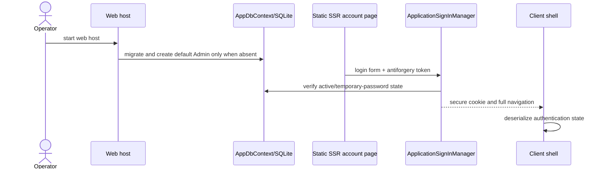

# Plan: SQLite Authentication Foundation

## Summary

Add the P1 persistence and account-security foundation to the existing .NET 10 hosted Blazor Web App. It extends the current validated-options, minimal-endpoint, client-owned shell, and Docker-only execution patterns without changing archive authorization yet.

## Technical Approach

`DatabaseOptions` follows existing option validators such as `ArchiveRootOptions`. `AppDbContext` uses EF Core SQLite and Identity EF stores, with migrations applied only by `Program.cs` during web-host startup. Startup seeds the default `admin` Administrator only when absent with `MustChangePassword` set. It never rewrites an existing account's password, authenticator state, recovery codes, roles, forced-password-change state, or other persisted state. `ApplicationUser`, `ApplicationSignInManager`, and a focused `AccountLifecycleService` own account rules. Administrators may create ordinary accounts in P1; P2 later adds folder-level authorization.

Server-side account components live beneath `WebApp/WebApp/Components/Account/` for static-SSR login, logout, forced password change, and TOTP sign-in. The client continues to own interactive authenticated account-management components, `Routes.razor`, layout, navigation, serialized authentication state, and its shared HTTP client.

Unsafe APIs are protected by one route-group antiforgery filter. Static forms retain framework antiforgery protection; neither path disables antiforgery. Data Protection writes to the dedicated app-data volume. Offline command dispatch occurs before host construction and checks the schema rather than migrating.

## Component Breakdown

**Existing files to modify:**

- `WebApp/WebApp/WebApp.csproj` — package references for EF SQLite, EF Design, Identity EF, and QR rendering.
- `WebApp/WebApp/Program.cs` — database, Identity, authorization, Data Protection, migration, middleware, and CLI registration.
- `WebApp/WebApp/Components/App.razor` — static SSR account-route render-mode handling.
- `WebApp/WebApp.Client/Program.cs`, `Routes.razor`, `Layout/MainLayout.razor`, `Layout/Sidebar.razor` — client auth state, authenticated routing, user menu, Admin navigation, and antiforgery HTTP handler.
- `docker-compose.yml`, `docker-compose.test.yml`, `Makefile`, `Dockerfile`, `.env.example` — `appdata`, test database configuration, CLI/backup commands, and `dotnet-ef` tooling.
- `README.md`, `AGENTS.md` — supported feature and safe backup/rollback documentation.

**New files to create:**

- `WebApp/WebApp/Configuration/DatabaseOptions.cs`, `AuthOptions.cs` — validated persistence and session settings.
- `WebApp/WebApp/Data/AppDbContext.cs`, `Data/Migrations/*` — EF schema and migrations.
- `WebApp/WebApp/Identity/ApplicationUser.cs`, `ApplicationSignInManager.cs`, `AccountLifecycleService.cs`, `AdminCli.cs` — account lifecycle and offline operations.
- `WebApp/WebApp/Components/Account/*` and account/admin endpoint files — static account forms and Admin user actions.
- `WebApp/WebApp/Security/AntiforgeryEndpointFilter.cs`, `DataProtectionConfiguration.cs`, `Services/DatabaseBackupService.cs` — CSRF, persisted keys, and verified backup.
- `WebApp/WebApp.Client/Services/AntiforgeryDelegatingHandler.cs` and account/admin DTOs — browser-safe client behavior.
- Focused xUnit tests under `WebApp.Tests/Configuration`, `Data`, `Identity`, `Endpoints`, `Security`, and `Client`.

## Dependencies

- Docker Compose and a writable `appdata` named volume mounted at `/appdata`.
- EF Core 10.0.11 SQLite/Design and Identity EntityFrameworkCore packages; Net.Codecrete.QrCodeGenerator 2.0.0 for server-rendered TOTP QR codes. These versions were installed through `make dotnet` during the umbrella-spec attempt.

## External / Vendor Documentation Evidence

- [Blazor authentication and authorization](https://learn.microsoft.com/aspnet/core/blazor/security/?view=aspnetcore-10.0#server-side-blazor-authentication): Identity requests are server-handled and static SSR account components are appropriate in an Interactive WebAssembly app; serialize auth state on the server and deserialize it in the client.
- [Minimal API antiforgery](https://learn.microsoft.com/aspnet/core/security/anti-request-forgery?view=aspnetcore-10.0#antiforgery-with-minimal-apis): configure antiforgery middleware and validate unsafe endpoints.
- [SQLite provider limitations](https://learn.microsoft.com/ef/core/providers/sqlite/limitations): use application-side concurrency values and carefully review migration rebuilds.
- [Persisting Data Protection keys in Docker](https://learn.microsoft.com/aspnet/core/security/data-protection/configuration/overview?view=aspnetcore-10.0#persisting-keys-when-hosting-in-a-docker-container): keys must be stored on persistent storage.

## Flow

## Risks and Validation Focus

- Migration and seed concurrency: test safe default-Administrator initialization, WAL/busy behavior, and explicit migration-lock recovery.
- Cookie-CSRF protection: test API and each static form independently, including stale and other-user tokens.
- No-admin lockout: test all last-active-Admin guard paths and offline recovery.
- Ordinary account lifecycle: prove that an Administrator can create an ordinary account which must change its temporary password before first sign-in.
