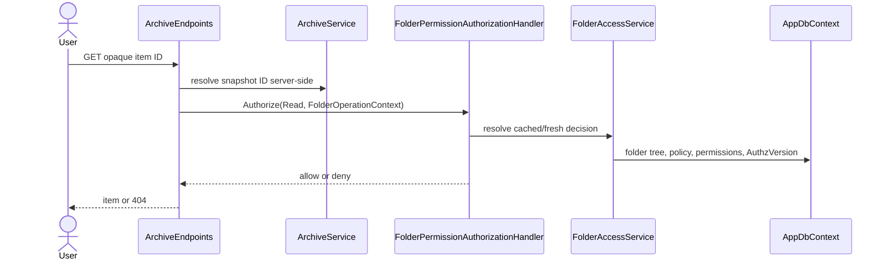

# Plan: Folder Access Control

## Summary

Extend P1's `AppDbContext` and Identity foundation with a server-only folder tree and one resource-based authorization decision path. Existing endpoint classes retain opaque snapshot resolution, then map the resolved item to its folder before responding or performing work.

## Technical Approach

`FolderRepository` owns EF access to folders and permissions. `FolderPermissionResolver` is pure and table-tested; `FolderPermissionAuthorizationHandler` invokes it through ASP.NET Core resource-based authorization. `FolderAccessService` owns cache freshness and readable-set queries keyed by `AuthzVersion`. Endpoint filters keep `VideoEndpoints`, `ArchiveEndpoints`, `CutEndpoints`, and `CompositionEndpoints` free from repeated authorization code.

`ArchiveService`, `VideoLibraryService`, `VideoCutService`, and `VideoCompositionService` retain snapshot IDs but expose only server-side item/folder mapping. Job workers call fresh authorization both at enqueue and execution. `PermissionWriteService` owns delegation and concurrency checks. The client adds Admin pages/DTOs only; UI state is never relied upon for enforcement.

## Component Breakdown

**Existing files to modify:**

- `WebApp/WebApp/Data/AppDbContext.cs`, migrations, and P1 Identity services — folder, policy, permission, audit relationships and version bumps.
- `WebApp/WebApp/Program.cs` — authorization handler, folder services, and P2 enforcement marker registration.
- `WebApp/WebApp/Endpoints/{Video,Cut,Composition,Storage,Archive,Dashboard}Endpoints.cs` — resource filters and correct 401/404/403 behavior.
- `WebApp/WebApp/Services/{ArchiveService,VideoLibraryService,VideoCutService,VideoCompositionService}.cs` and relevant workers — folder mapping, filtered output, fresh job checks.
- `WebApp/WebApp.Client/Routes.razor`, `Layout/MainLayout.razor`, `Layout/Sidebar.razor` — Admin navigation.

**New files to create:**

- `WebApp/WebApp/Data/Entities/{Folder,FolderPermission,AccessPolicy,AuditEvent}.cs` and focused configurations/repositories.
- `WebApp/WebApp/Authorization/{FolderOperations,FolderOperationContext,FolderPermissionResolver,FolderPermissionAuthorizationHandler,FolderAccessService,PermissionWriteService,DelegationRules,AuthzVersionStore,IFolderAccessEnforcement}.cs`.
- `WebApp/WebApp/Endpoints/{AdminAccessEndpoints,AdminUserEndpoints}.cs`.
- `WebApp/WebApp.Client/Pages/Admin/UserAccess.razor` and admin components/DTOs.
- xUnit authorization, endpoint, and path-leak tests.

## External Documentation Evidence

- [Resource-based authorization](https://learn.microsoft.com/aspnet/core/security/authorization/resource-based?view=aspnetcore-10.0) supports a typed handler and imperative `AuthorizeAsync` for resolved resources.
- [Operational requirements](https://learn.microsoft.com/aspnet/core/security/authorization/resource-based?view=aspnetcore-10.0#operational-requirements) supports one `OperationAuthorizationRequirement` handler for CRUD-like operations.

## Flow

## Risks and Validation Focus

- Exhaustively table-test resolver inheritance, Private gates, owners, denies, and locks.
- Cover every existing media derivative and range-stream endpoint to prevent a bypass.
- Test cache invalidation after every authorization-changing transaction.
