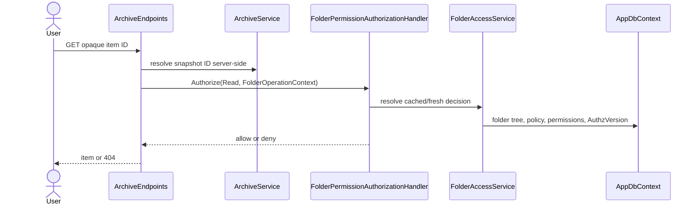

# Plan: Folder Access Control

## Summary

Extend P1's `AppDbContext` and Identity foundation (per-user `AuthzVersion`, existing `AuditEvent`, sole `Admin` role, userName-addressed Admin API) with a server-only folder tree and one resource-based authorization decision path. Existing endpoint classes retain opaque snapshot resolution, then map the resolved item to its folder before responding or performing work.

## Technical Approach

`FolderRepository` owns EF access to folders and permissions. `FolderPermissionResolver` is pure and table-tested; `FolderPermissionAuthorizationHandler` invokes it through ASP.NET Core resource-based authorization. `FolderAccessService` (behind `IFolderAccessService`) owns cache freshness and readable-set queries keyed by the pair (global policy version on `ACCESS_POLICY`, user `AuthzVersion`); `CheckAsync` is the fresh, uncached path used for non-Read operations and job execution. Endpoint filters keep `VideoEndpoints`, `ArchiveEndpoints`, `CutEndpoints`, and `CompositionEndpoints` free from repeated authorization code.

`ArchiveService`, `VideoLibraryService`, `VideoCutService`, and `VideoCompositionService` retain snapshot IDs but expose only server-side item/folder mapping. Job workers call fresh authorization both at enqueue and execution. `PermissionWriteService` owns delegation and concurrency checks. The client adds Admin pages/DTOs only; UI state is never relied upon for enforcement.

## Component Breakdown

**Existing files to modify:**

- `WebApp/WebApp/Data/AppDbContext.cs`, a new migration after `AddAuditEvents`, and P1 `Identity/AccountLifecycleService.cs` — folder, policy, permission relationships, global version bumps, and folder-owner reassignment on user delete.
- `WebApp/WebApp/Identity/AuditEvent.cs` and `Security/AntiforgeryEndpointFilter.cs` — new permission/ownership actions and CSRF-rejection auditing (extend the existing entity; no new one).
- `WebApp/WebApp/Endpoints/AccountEndpoints.cs` — add `/{userName}/access` routes to the existing Admin group (same authorization and antiforgery filter).
- `WebApp/WebApp/Program.cs` — authorization handler, folder services, and P2 enforcement marker registration.
- `WebApp/WebApp/Endpoints/{Video,Cut,Composition,Storage,Archive,Dashboard}Endpoints.cs` — resource filters and correct 401/404/403 behavior.
- `WebApp/WebApp/Services/{ArchiveService,VideoLibraryService,VideoCutService,VideoCompositionService}.cs` and relevant workers — folder mapping, filtered output, fresh job checks.
- `WebApp/WebApp.Client/Pages/Family.razor` — hosts the access editor in the Family Members tab (`_accessUser` state swaps list and editor; no route).
- `WebApp/WebApp.Client/Components/Account/MembersTable.razor` — add the `bi-house-lock-fill` "Manage folders access" action (tooltip via `bootstrapInterop.js`) and an `OnManageAccess` callback.
- `WebApp/WebApp.Client/Services/AccountApiClient.cs` — folder-access read/save calls with antiforgery handled by the existing delegating handler.

**New files to create:**

- `WebApp/WebApp/Data/Entities/{Folder,FolderPermission,AccessPolicy}.cs` and focused configurations/repositories.
- `WebApp/WebApp/Authorization/{IFolderAccessService,FolderOperations,FolderOperationContext,FolderPermissionResolver,FolderPermissionAuthorizationHandler,FolderAccessService,PermissionWriteService,DelegationRules,AuthzVersionStore}.cs`.
- `WebApp/WebApp/Endpoints/AdminAccessEndpoints.cs` (mapped onto the existing Admin group; no separate `AdminUserEndpoints`).
- `WebApp.Tests/Support/` member-capable test host helper that seeds real users and signs in as a member (P1's `TestHostSecurity` signs in a fake `test-admin` that is not a database row and bypasses every deny; build on `IdentityTestHost`/`AccountFactory`).
- `WebApp/WebApp.Client/Components/Account/FolderAccessEditor.razor` (plus small row/cell components if needed) and access DTOs under `Models/`, addressed by `UserName`. Layout, cell semantics, and states follow Requirements "UI Design"; Bootstrap components first, scoped CSS only for sticky first column / indentation if utilities cannot express it. No `Routes.razor`, `MainLayout.razor`, or `Sidebar.razor` changes.
- xUnit authorization, endpoint, and path-leak tests.

## External Documentation Evidence

- [Resource-based authorization](https://learn.microsoft.com/aspnet/core/security/authorization/resource-based?view=aspnetcore-10.0) supports a typed handler and imperative `AuthorizeAsync` for resolved resources.
- [Operational requirements](https://learn.microsoft.com/aspnet/core/security/authorization/resource-based?view=aspnetcore-10.0#operational-requirements) supports one `OperationAuthorizationRequirement` handler for CRUD-like operations.

## UI Flow

`Family.razor` (Family Members tab) → `MembersTable` house-lock button → `_accessUser` set → `FolderAccessEditor` loads `GET /api/account/users/{userName}/access` (server-filtered folder tree, effective permissions, provenance, stamps) → user edits checkbox/deny cells locally → Save → `PUT /api/account/users/{userName}/access` with changed cells + stamps → success returns to the list with a status alert; conflict/rejection stays in the editor. All decisions are re-made server-side; the UI only reflects them. JS-interop tooltip calls follow the repo's failure-boundary rule inside `FeatureErrorBoundary`.

## Flow

## Risks and Validation Focus

- Large trees: render collapsed by default and lazy-expand to keep the table responsive.
- Mapping a checkbox-plus-deny UI onto the tri-state flags must be lossless: Allow/Deny/unset round-trips exactly and never writes unchanged cells.

- Exhaustively table-test resolver inheritance, Private gates, owners, denies, and locks.
- Cover every existing media derivative and range-stream endpoint to prevent a bypass.
- Test cache invalidation after every authorization-changing transaction, for both the global and per-user versions.
- Existing members lose Create/Write/Delete on upgrade; verify and document.
- Delete of a folder-owning user reassigns ownership before the Restrict FK can fire.
