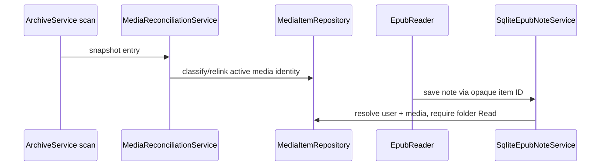

# Plan: Per-User Media Data Migration

## Summary

Extend P1's EF Core model and P2's `IFolderAccessService` with media identity and SQLite-backed implementations of the existing per-user services.

## Technical Approach

`MediaItemRepository`, `MediaIdentityClassifier`, `MediaFingerprint`, and `MediaReconciliationService` own provider-specific persistence and identity decisions. `SqliteEpubNoteService`, `SqliteEpubHighlightService`, `SqliteEpubProgressService`, `SqliteComicProgressService`, `SqliteArchiveFavoritesService`, `SqliteReaderThemeService`, and `SqliteCustomStorageViewService` are registered scoped (they need the scoped `AppDbContext`), resolve user identity from the server principal, and validate folder Read via `IFolderAccessService.CanReadAsync` using the item's `FolderId` mapped to a `FolderLocation` through `GetTreeAsync()`. Interfaces stay except where a method took unstable size/timestamp metadata (progress), which now takes the opaque item ID.

`LegacyDataImporter` is a single idempotent Admin operation exposed on the existing Admin route group (Admin policy plus `AntiforgeryEndpointFilter`), gated on a verified `DatabaseBackupService` backup and audited through `AuditEvent`. It is the G2 boundary: legacy registrations are removed only after a recorded verified import and a verified backup. Components continue using browser-local `theme.js` and sort state unchanged.

## Component Breakdown

**Existing files to modify:**

- `Data/AppDbContext.cs` and a new migration after `AddFolderAccessControl` — media/per-user entities, indexes, and relationships.
- `Services/{EpubNote,EpubHighlight,EpubProgress,ComicProgress,ArchiveFavorites,CustomStorageView}Service.cs` and `Program.cs` — replace legacy implementations/DI after import.
- `Endpoints/ArchiveEndpoints.cs`, `DashboardEndpoints.cs`, and reader components — current-user scoped requests without changing opaque browser media IDs; per-user routes keep the P2 `RequireFolderAccess(read)` rule (401/404) and add row ownership.
- `Endpoints/AccountEndpoints.cs` or a new Admin endpoint file — the importer route.

**New files to create:**

- `Data/Entities/{MediaItem,BookNote,BookHighlight,ReadingProgress,ComicProgress,Favorite,ReaderTheme,CustomStorageView}.cs` and `Data/MediaItemRepository.cs`.
- `Services/{MediaIdentityClassifier,MediaFingerprint,MediaReconciliationService,LegacyDataImporter,SqliteEpubNoteService,SqliteEpubHighlightService,SqliteEpubProgressService,SqliteComicProgressService,SqliteArchiveFavoritesService,SqliteReaderThemeService,SqliteCustomStorageViewService}.cs`.
- Tests for identity, reconciliation, importer, and every SQLite-backed service. Endpoint/service tests use the real-Identity `AccountFactory`/`IdentityTestHost` to sign in as seeded members; `TestHostSecurity` signs in a fake admin that is not a database row and must not be used for isolation tests.

## External Documentation Evidence

- [EF Core SQLite limitations](https://learn.microsoft.com/ef/core/providers/sqlite/limitations) informs reviewed migrations and real-file tests for SQLite-specific partial indexes.

## Implementation Notes

- Reader themes are shared: `ReaderTheme.CreatedByUserId` records the creator (set to null when the creator is deleted), `SqliteReaderThemeService` lists all themes for everyone, edits and deletes only the creator's own, and `ReaderThemePreference` keeps each user's active settings and selection. A follow-up migration (`SharePreviouslyPersonalReaderThemes`) renames the owner column and relaxes its foreign key; existing personal themes simply become visible to everyone.

- Reconciliation runs lazily when an item is first used by a per-user service (find or create the Active row, classify a same-path change) and on demand through the Admin `POST /api/admin/media/reconcile` scan (fingerprint relink, ambiguous duplicates to review, vanished files to Missing, reappearing Missing files reclassified). The Admin review queue (reattach / keep archived) is not part of this spec; `NeedsReview` and `Superseded` rows keep their data hidden until a later spec adds it.
- The importer's backup gate is the same verified backup `make db-backup` produces (`Backup:Path`, default `/backups`); no verified backup means no import. The legacy services are removed from DI in the same change; their files are only ever opened for reading by the importer.
- Notes keep the original Kindle-style fields as columns (`BookTitle`, `BookAuthor`, `ChapterIndex`, offsets) next to the arbitrary multiline `Content`; a note shares its key with its highlight.

## Flow

## Risks and Validation Focus

- Test replacement and uncertain identity transitions against the partial unique index.
- Test two-user isolation and access loss/restoration.
- Test access loss/restoration keeps rows hidden, not deleted.
- Preserve legacy source files byte-for-byte and block retirement before backup/import verification.
