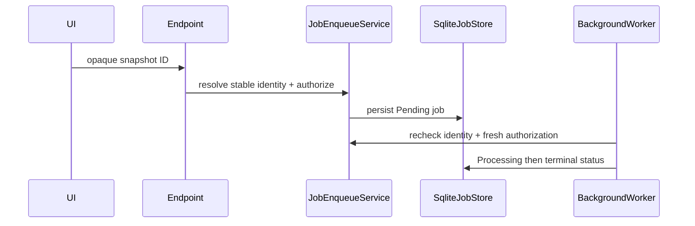

# Plan: Durable Jobs and Naming Counters

## Summary

Replace in-memory job state and directory-scan naming with focused SQLite stores while preserving existing queues, workers, polling endpoints, and FFmpeg pipelines.

## Technical Approach

`SqliteJobStore` implements the three existing status-store interfaces using P1's `AppDbContext`. `JobEnqueueService` is the only browser-ID-to-stable-identity boundary; workers invoke its execution recheck before disk work. `NamingCounterService` owns transactional allocation and initial filesystem seeding, then backs `CutNamingService`, `CompositionNamingService`, `ImageCropNamingService`, and `VideoConversionNamingService`.

## Component Breakdown

**Existing files to modify:**

- `Data/AppDbContext.cs` and migrations — `JOB` and `NamingCounters` schema.
- `Program.cs` — DI replacement and startup interruption handling.
- `Services/{CompositionJobStatusStore,ArchiveMutationJobStatusStore,VideoConversionServices,CutNamingService,CompositionNamingService,ImageCropNamingService}.cs` — delegate to durable stores/counters.
- Queue workers and related endpoints — enqueue/execution identity checks without changing client payloads.

**New files to create:**

- `Data/Entities/{Job,NamingCounter}.cs`.
- `Services/{SqliteJobStore,JobEnqueueService,NamingCounterService,JobExecutionRecheckService}.cs`.
- Durable-store, enqueue/recheck, restart, and parallel-allocation tests.

## External Documentation Evidence

- [EF Core SQLite limitations](https://learn.microsoft.com/ef/core/providers/sqlite/limitations) guides provider-specific transactions and concurrency validation.

## Flow

## Risks and Validation Focus

- A restart must produce a durable terminal status, never an accidental replay.
- Concurrent counter allocation must be tested with 100 parallel callers.
