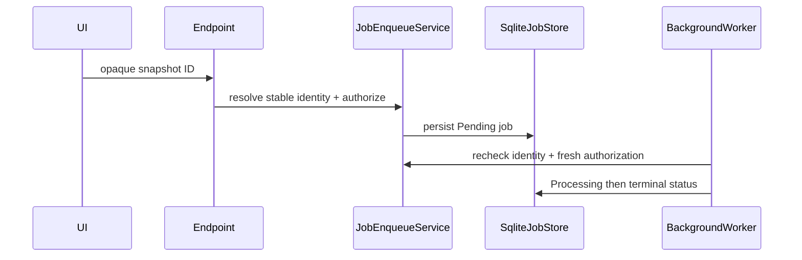

# Plan: Durable Jobs and Naming Counters

## Summary

Replace in-memory job state and directory-scan naming with focused SQLite stores while preserving existing queues, workers, polling endpoints, and FFmpeg pipelines.

## Technical Approach

`SqliteJobStore` is a singleton that implements the three existing (synchronous) status-store interfaces, opening a short-lived `IServiceScopeFactory` scope per call for the scoped `AppDbContext`; progress updates are throttled. `JobEnqueueService` is the only browser-ID-to-stable-identity boundary (it uses `MediaReconciliationService.EnsureAsync` and `FolderLocator`/`FolderCatalog`) and sets `JOB.UserId` from the server principal. Workers already authorize through `IFolderJobAuthorizer` (P2); `JobExecutionRecheckService` adds the Active/captured-identity check in front of it and rejects a durable job whose user is gone (the authorizer's `null` actor = internal path must not be reachable for it). `JobOwnerRegistry` is removed; job-list endpoints filter by `JOB.UserId` (Admins see all). `NamingCounterService` owns transactional allocation keyed by `(kind, output folder, prefix, extension)` and initial filesystem seeding, then backs `CutNamingService`, `CompositionNamingService`, `ImageCropNamingService` (variable output directory), and `VideoConversionNamingService`. Interruption handling runs in `StartupInitializer` after migrations.

Retry and "Started by" (FR9/FR10): `ArchiveEndpoints.QueueConversionAsync` is extracted from the create-conversion handler and shared with `DashboardEndpoints.RetryAsync`, which rebuilds the request from the stored payload (category key + `MediaItemId` + selection) and resolves the physical path server-side via the `MediaItem`/`Folder` rows and `FolderLocator`. `VideoConversionJobDto` gains an optional `StartedBy` display name, filled by `GET /api/dashboard/jobs` from a join on `Job.User`. `DashboardConversionJobsTab.razor` shows the name and a Retry button on Failed/Stopped cards.

Jobs page for every type (FR11): `JobActivityService` (scoped, `AppDbContext`) reads composition, archive-mutation and cut `Job` rows visible to the caller and maps them to the browser-safe `JobSummaryDto` (title from the status record or payload, display name from `Job.User`); `GET /api/dashboard/jobs/activity` exposes it. `SqliteJobStore` writes a small `CutJobStatus` JSON (label, state, diagnostic) for cut rows so they can be titled, and `ICutJobRecorder.MarkFailed` takes a generic diagnostic. `JobRow.razor` renders one fixed-height list line with its details panel and `JobListRules` (WebApp.Client/Models) holds the tested row/ordering/filter/paging logic. `JobCommonInfo.razor` renders the shared detail rows for every card; `Job.StartedUtc` (migration `AddJobStartedUtc`) feeds Started/Total time for non-conversion jobs. `DashboardConversionJobsTab.razor` merges conversions with these rows, adds the type filter, and polls while any listed job is active.

## Component Breakdown

**Existing files to modify:**

- `Data/AppDbContext.cs` and a new migration after `RemoveLegacyImportRuns` — `JOB` and `NamingCounters` schema.
- `Program.cs` and `Data/StartupInitializer.cs` — DI replacement and startup interruption handling.
- `Services/{CompositionJobStatusStore,ArchiveMutationJobStatusStore,VideoConversionServices,CutNamingService,CompositionNamingService,ImageCropNamingService}.cs` — delegate to durable stores/counters.
- `Authorization/FolderJobAuthorizer.cs` — remove `JobOwnerRegistry`; keep `IFolderJobAuthorizer` as the authorization step.
- Queue workers and endpoints (`ArchiveEndpoints`, `DashboardEndpoints`, `VideoEndpoints`) — enqueue/execution identity checks and owner-filtered job lists without changing client payloads.

**New files to create:**

- `Data/Entities/{Job,NamingCounter}.cs`.
- `Services/{SqliteJobStore,JobEnqueueService,NamingCounterService,JobExecutionRecheckService}.cs`.
- Durable-store, enqueue/recheck, restart, and parallel-allocation tests.

## External Documentation Evidence

- [EF Core SQLite limitations](https://learn.microsoft.com/ef/core/providers/sqlite/limitations) guides provider-specific transactions and concurrency validation.

## Flow

## Risks and Validation Focus

- A restart must produce a durable terminal status, never an accidental replay.
- Concurrent counter allocation must be tested with 100 parallel callers.
- Deleted-account jobs must fail rather than run as "internal".
- Archive-mutation and conversion progress must not flood SQLite; status endpoints must stay responsive while a worker writes.
- Tests that persist `JOB.UserId` need real users (`AccountFactory`), not the `TestHostSecurity` fake admin.
