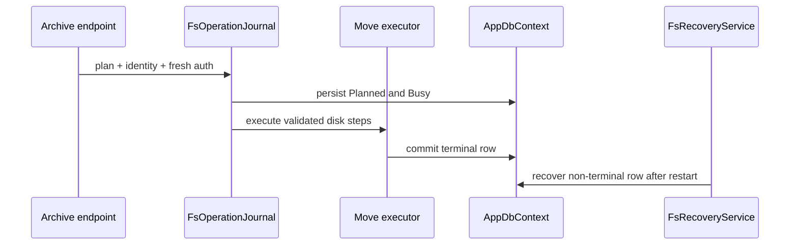

# Plan: Journaled Filesystem Recovery

## Summary

Replace direct disk mutation in the archive executor/upload path with a durable journal and conservative recovery services, preserving opaque browser IDs and P2 authorization checks.

## Technical Approach

`FsOperationJournal` owns plan/terminal rows and folder Busy state. `FsIdentity` obtains best-effort file identity/fingerprint; `FsVolumeProbe` selects `SameVolumeMoveExecutor` or `CrossVolumeMoveExecutor`. `FsRecoveryService` contains operation-specific recovery tables and refuses uncertain evidence. `FolderReconciliationService` and P3 media reconciliation produce review candidates; Admin actions use one audited resolution service.

## Component Breakdown

**Existing files to modify:**

- `Data/AppDbContext.cs` and migrations — `FS_OPERATION` and folder/status support.
- `Services/ArchiveMutationExecutor.cs`, `ArchiveUploadService.cs`, `ArchiveMutationBackgroundWorker.cs` — journaled create/move/delete/replace execution.
- `Services/ArchiveService.cs` and archive endpoints — Busy/review filtering and Admin review routing.
- `Program.cs` — journal, recovery, reconciliation hosted services.

**New files to create:**

- `Data/Entities/FsOperation.cs`.
- `Services/{FsOperationJournal,FsIdentity,FsVolumeProbe,SameVolumeMoveExecutor,CrossVolumeMoveExecutor,FsRecoveryService,FolderReconciliationService}.cs`.
- `Endpoints/AdminReviewEndpoints.cs` and `WebApp.Client/Pages/Admin/ReviewQueue.razor` with browser-safe DTOs.
- Journal/recovery/crash/reconciliation/cross-volume tests.

## External Documentation Evidence

- [EF Core SQLite limitations](https://learn.microsoft.com/ef/core/providers/sqlite/limitations) informs short, explicit transactions around SQLite state; filesystem identity and atomic no-clobber behavior are isolated behind testable interfaces.

## Flow

## Risks and Validation Focus

- Every crash point uses identity evidence; strangers are never touched.
- Cross-volume publish must precede source trash.
- P5 cannot be disabled while non-terminal journal rows exist.
